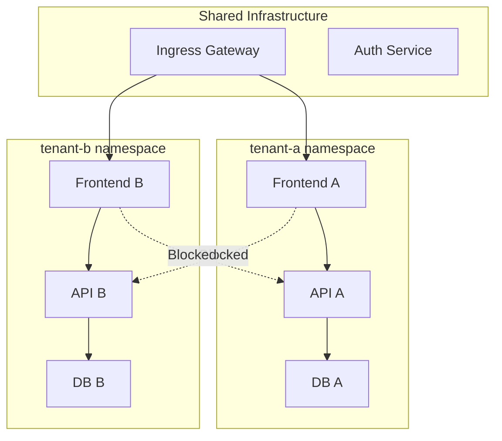

# How to Configure Authorization for Multi-Tenant Clusters in Istio

Author: [nawazdhandala](https://github.com/nawazdhandala)

Tags: Istio, Multi-Tenancy, Authorization, Security, Kubernetes, Service Mesh

Description: How to set up Istio authorization policies for multi-tenant Kubernetes clusters to enforce strict isolation between tenants.

---

Running multiple tenants in a single Kubernetes cluster is cost-effective, but it creates a serious security challenge. Tenant A should never be able to access Tenant B's services, data, or APIs. Kubernetes namespaces provide a basic boundary, but without network-level enforcement, any pod can still talk to any other pod. Istio authorization policies let you build proper tenant isolation with cryptographic identity verification.

## Multi-Tenancy Models

There are two common patterns for multi-tenancy in Kubernetes:

**Namespace-per-tenant** - Each tenant gets one or more namespaces. This is the most common approach and the easiest to secure with Istio.

**Shared namespace with labels** - Multiple tenants share a namespace, distinguished by labels. This is harder to secure and not recommended for strong isolation.

This guide focuses on the namespace-per-tenant model, which works naturally with Istio's namespace-based authorization.

## Architecture Overview



## Step 1: Enable Strict mTLS

Tenant isolation requires verified identities. Enable strict mTLS mesh-wide:

```yaml
apiVersion: security.istio.io/v1
kind: PeerAuthentication
metadata:
  name: default
  namespace: istio-system
spec:
  mtls:
    mode: STRICT
```

This ensures every request carries a verified SPIFFE identity that includes the namespace. Without mTLS, namespace-based authorization rules are meaningless because there is no reliable way to determine the source namespace.

## Step 2: Isolate Each Tenant Namespace

Apply a baseline isolation policy to each tenant namespace:

```yaml
apiVersion: security.istio.io/v1
kind: AuthorizationPolicy
metadata:
  name: tenant-isolation
  namespace: tenant-a
spec:
  action: ALLOW
  rules:
  - from:
    - source:
        namespaces:
        - "tenant-a"
  - from:
    - source:
        namespaces:
        - "istio-system"
```

Do the same for tenant-b:

```yaml
apiVersion: security.istio.io/v1
kind: AuthorizationPolicy
metadata:
  name: tenant-isolation
  namespace: tenant-b
spec:
  action: ALLOW
  rules:
  - from:
    - source:
        namespaces:
        - "tenant-b"
  - from:
    - source:
        namespaces:
        - "istio-system"
```

Each namespace only accepts traffic from itself and from the Istio control plane. Cross-tenant traffic is denied.

## Step 3: Allow Shared Infrastructure Access

The ingress gateway needs to reach each tenant's frontend. Add gateway access to each tenant's policy:

```yaml
apiVersion: security.istio.io/v1
kind: AuthorizationPolicy
metadata:
  name: tenant-a-with-gateway
  namespace: tenant-a
spec:
  action: ALLOW
  rules:
  - from:
    - source:
        namespaces:
        - "tenant-a"
  - from:
    - source:
        namespaces:
        - "istio-system"
  - from:
    - source:
        principals:
        - "cluster.local/ns/istio-system/sa/istio-ingressgateway-service-account"
    to:
    - operation:
        ports:
        - "8080"
```

This is more restrictive than allowing the entire `istio-system` namespace. It specifically allows the ingress gateway service account on port 8080 only.

## Step 4: Shared Services with Tenant Context

If you have shared services (like an authentication service or a logging backend), tenants need to access them while being isolated from each other.

Create a shared namespace and allow all tenants:

```yaml
apiVersion: security.istio.io/v1
kind: AuthorizationPolicy
metadata:
  name: shared-services-access
  namespace: shared
spec:
  action: ALLOW
  rules:
  - from:
    - source:
        namespaces:
        - "tenant-a"
        - "tenant-b"
        - "tenant-c"
        - "istio-system"
```

For the shared auth service, you might want to pass the tenant context through headers:

```yaml
apiVersion: security.istio.io/v1
kind: AuthorizationPolicy
metadata:
  name: auth-service-policy
  namespace: shared
spec:
  selector:
    matchLabels:
      app: auth-service
  action: ALLOW
  rules:
  - from:
    - source:
        namespaces:
        - "tenant-a"
    when:
    - key: request.headers[x-tenant-id]
      values:
      - "tenant-a"
  - from:
    - source:
        namespaces:
        - "tenant-b"
    when:
    - key: request.headers[x-tenant-id]
      values:
      - "tenant-b"
```

This ensures that tenant-a can only call the auth service with their own tenant ID, preventing tenant impersonation.

## Step 5: Automating Tenant Onboarding

When you add a new tenant, you need to create the isolation policy. Automate this with a script or an operator:

```bash
#!/bin/bash
TENANT=$1

kubectl create namespace $TENANT
kubectl label namespace $TENANT istio-injection=enabled

kubectl apply -f - <<EOF
apiVersion: security.istio.io/v1
kind: AuthorizationPolicy
metadata:
  name: tenant-isolation
  namespace: $TENANT
spec:
  action: ALLOW
  rules:
  - from:
    - source:
        namespaces:
        - "$TENANT"
  - from:
    - source:
        principals:
        - "cluster.local/ns/istio-system/sa/istio-ingressgateway-service-account"
EOF

echo "Tenant $TENANT namespace created with isolation policy"
```

## Step 6: Tenant-Specific Ingress Routing

Use Istio `VirtualService` to route traffic to the correct tenant based on the hostname or path:

```yaml
apiVersion: networking.istio.io/v1
kind: VirtualService
metadata:
  name: tenant-routing
  namespace: istio-system
spec:
  hosts:
  - "tenant-a.example.com"
  - "tenant-b.example.com"
  gateways:
  - main-gateway
  http:
  - match:
    - headers:
        ":authority":
          exact: "tenant-a.example.com"
    route:
    - destination:
        host: frontend.tenant-a.svc.cluster.local
        port:
          number: 8080
  - match:
    - headers:
        ":authority":
          exact: "tenant-b.example.com"
    route:
    - destination:
        host: frontend.tenant-b.svc.cluster.local
        port:
          number: 8080
```

## Step 7: Cross-Tenant API Access (When Needed)

Sometimes tenants need controlled access to each other's APIs. Maybe tenant-a provides a public API that tenant-b consumes. Handle this with specific policies:

```yaml
apiVersion: security.istio.io/v1
kind: AuthorizationPolicy
metadata:
  name: tenant-a-public-api
  namespace: tenant-a
spec:
  selector:
    matchLabels:
      app: public-api
  action: ALLOW
  rules:
  # Internal tenant access
  - from:
    - source:
        namespaces:
        - "tenant-a"
  # Controlled external tenant access
  - from:
    - source:
        principals:
        - "cluster.local/ns/tenant-b/sa/api-consumer"
    to:
    - operation:
        methods: ["GET"]
        paths: ["/public/v1/*"]
```

This allows tenant-b's api-consumer service to read from tenant-a's public API, but only GET requests on the public path. Tenant-b cannot access any internal endpoints.

## Verifying Tenant Isolation

Test that cross-tenant traffic is blocked:

```bash
# From tenant-a, try to reach tenant-b (should fail)
kubectl exec -n tenant-a deploy/api -- curl -s -w "%{http_code}" http://api.tenant-b:8080/

# From tenant-a, try to reach same-tenant service (should succeed)
kubectl exec -n tenant-a deploy/frontend -- curl -s -w "%{http_code}" http://api.tenant-a:8080/
```

Run a comprehensive isolation test:

```bash
for src_ns in tenant-a tenant-b tenant-c; do
  for dst_ns in tenant-a tenant-b tenant-c; do
    if [ "$src_ns" != "$dst_ns" ]; then
      result=$(kubectl exec -n $src_ns deploy/test-client -- curl -s -o /dev/null -w "%{http_code}" http://api.$dst_ns:8080/ 2>/dev/null)
      echo "$src_ns -> $dst_ns: $result (expected 403)"
    fi
  done
done
```

## Audit and Compliance

For multi-tenant environments, you often need audit trails. Enable Envoy access logging to capture authorization decisions:

```yaml
apiVersion: telemetry.istio.io/v1
kind: Telemetry
metadata:
  name: access-logging
  namespace: istio-system
spec:
  accessLogging:
  - providers:
    - name: envoy
```

Monitor for any cross-tenant traffic attempts:

```text
sum(rate(istio_requests_total{source_workload_namespace!~"istio-system|shared",response_code="403"}[5m])) by (source_workload_namespace, destination_workload_namespace)
```

This gives you visibility into denied cross-namespace requests, which could indicate either misconfiguration or attempted unauthorized access.

Multi-tenant authorization in Istio is fundamentally about namespace isolation combined with explicit exceptions for shared infrastructure. The pattern is consistent: deny by default, allow within the tenant namespace, and add targeted exceptions for cross-tenant access when business requirements demand it.
