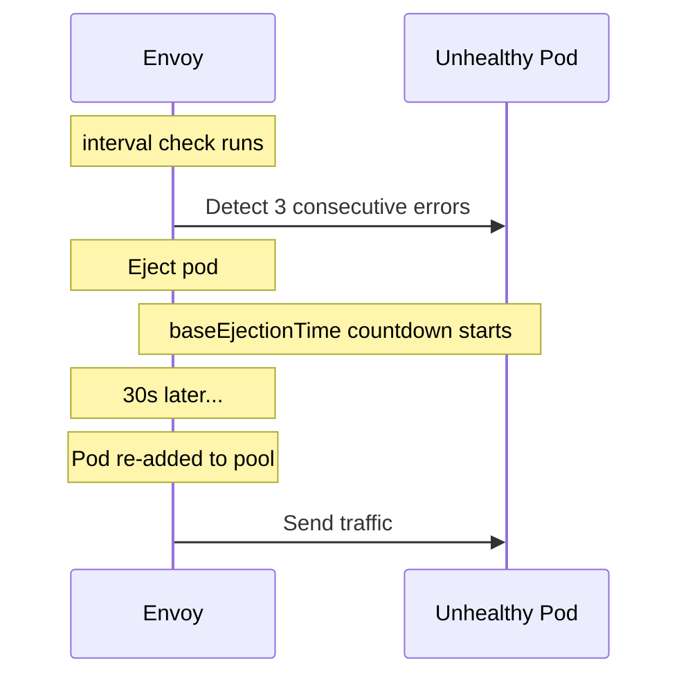

# How to Configure Base Ejection Time for Outlier Detection

Author: [nawazdhandala](https://github.com/nawazdhandala)

Tags: Istio, Service Mesh, Outlier Detection, Circuit Breaking, Kubernetes

Description: Detailed guide to configuring and understanding baseEjectionTime in Istio outlier detection, including progressive backoff and recovery patterns.

---

The `baseEjectionTime` field in Istio's outlier detection controls how long an unhealthy pod stays out of the load balancing pool after being ejected. It sounds simple, but the progressive backoff behavior and its interaction with other settings make it worth understanding in detail.

## What baseEjectionTime Actually Does

When a pod gets ejected because it exceeded the error threshold, it stays out for:

```
ejection_duration = baseEjectionTime * number_of_times_ejected
```

The first ejection uses the base time. The second ejection doubles it. The third triples it. And so on.

```yaml
apiVersion: networking.istio.io/v1beta1
kind: DestinationRule
metadata:
  name: api-service
  namespace: default
spec:
  host: api-service
  trafficPolicy:
    outlierDetection:
      consecutive5xxErrors: 3
      interval: 10s
      baseEjectionTime: 30s
      maxEjectionPercent: 50
```

With `baseEjectionTime: 30s`:

| Ejection Count | Duration | What It Means |
|---------------|----------|---------------|
| 1st | 30s | Brief issue, short timeout |
| 2nd | 60s | Problem persisted, longer timeout |
| 3rd | 90s | Serious issue, even longer |
| 4th | 120s | Something is really wrong |
| 5th | 150s | Pod probably needs a restart |

This progressive behavior is built into Envoy and cannot be customized. You can only control the base value.

## Picking the Right Base Time

### 10 seconds - Very Short

```yaml
outlierDetection:
  baseEjectionTime: 10s
```

Use this when:
- Failures are almost always transient (network blips, brief GC pauses)
- You want to minimize capacity loss
- You have monitoring that catches persistent failures through other means

The risk: pods get re-added quickly and might immediately fail again, creating a "flapping" pattern that is noisy and wastes resources.

### 30 seconds - Default/Moderate

```yaml
outlierDetection:
  baseEjectionTime: 30s
```

The most common choice. Thirty seconds is long enough for most transient issues to clear (connection pool exhaustion, temporary resource pressure) but short enough that capacity is not reduced for too long.

Good for general-purpose services where you do not have strong reasons to go shorter or longer.

### 60 seconds - Conservative

```yaml
outlierDetection:
  baseEjectionTime: 60s
```

Use this when:
- Recovery from failures typically takes time (database reconnections, cache warming)
- False positives would be disruptive (user-facing services)
- You have enough pods to absorb the reduced capacity

### 180 seconds (3 minutes) - Aggressive

```yaml
outlierDetection:
  baseEjectionTime: 180s
```

Use this when:
- Failures are typically persistent and need manual intervention or Kubernetes restart
- The pod is likely broken until its container restarts
- You would rather run at reduced capacity than risk sending traffic to a broken pod

## How baseEjectionTime Interacts with interval

The `interval` field controls how often Envoy checks for outliers. The ejection countdown starts after the check runs, not after the last error.



If your interval is 10 seconds and your baseEjectionTime is 30 seconds, the total time a pod stays out is approximately 30 seconds from the ejection decision. The interval only affects how quickly the ejection is detected, not how long it lasts.

## Matching baseEjectionTime to Kubernetes Health Checks

Your baseEjectionTime should work alongside Kubernetes liveness probes. If a pod is truly broken, you want Kubernetes to restart it before Istio tries sending traffic to it again.

Typical Kubernetes liveness probe timing:

```yaml
livenessProbe:
  httpGet:
    path: /healthz
    port: 8080
  initialDelaySeconds: 15
  periodSeconds: 10
  failureThreshold: 3
  # Time to detect failure: 10s * 3 = 30s
  # Plus restart time: ~15-30s
  # Total: 45-60s before pod is healthy again
```

With this setup, the pod needs about 45-60 seconds to get restarted by Kubernetes. Setting `baseEjectionTime: 60s` means the pod stays out long enough for Kubernetes to restart it.

If `baseEjectionTime` is shorter than the Kubernetes restart cycle, the pod gets re-added while it is still broken, serves a few bad requests, and gets ejected again. This works fine due to progressive backoff, but it is noisier than necessary.

## Configuring for Different Failure Patterns

### Transient Failures (Network Issues, Brief Overload)

```yaml
apiVersion: networking.istio.io/v1beta1
kind: DestinationRule
metadata:
  name: cache-service
  namespace: default
spec:
  host: cache-service
  trafficPolicy:
    outlierDetection:
      consecutive5xxErrors: 5
      interval: 5s
      baseEjectionTime: 15s
      maxEjectionPercent: 40
```

Short ejection time with a higher error threshold. The pod needs to fail 5 times in a row before a brief 15-second ejection. Most transient issues resolve in that window.

### Application Crashes

```yaml
apiVersion: networking.istio.io/v1beta1
kind: DestinationRule
metadata:
  name: worker-service
  namespace: default
spec:
  host: worker-service
  trafficPolicy:
    outlierDetection:
      consecutive5xxErrors: 2
      interval: 10s
      baseEjectionTime: 60s
      maxEjectionPercent: 50
```

Longer ejection time because a crashed application needs to be restarted by Kubernetes. Two errors is enough to detect a crash. 60 seconds gives Kubernetes time to restart the pod.

### Memory Leaks / Gradual Degradation

```yaml
apiVersion: networking.istio.io/v1beta1
kind: DestinationRule
metadata:
  name: analytics-service
  namespace: default
spec:
  host: analytics-service
  trafficPolicy:
    outlierDetection:
      consecutive5xxErrors: 3
      interval: 15s
      baseEjectionTime: 120s
      maxEjectionPercent: 30
```

Long ejection time because memory leaks take time to recover from (typically requires a full restart). Lower `maxEjectionPercent` because multiple pods might be affected simultaneously.

## Monitoring baseEjectionTime Effectiveness

Track whether your ejection times are appropriate:

```bash
# Check how often pods are being re-ejected (flapping)
kubectl exec deploy/my-service -c istio-proxy -- \
  curl -s localhost:15000/stats | grep "ejections"

# Key indicators:
# High ejections_total with low ejections_active = pods are flapping
#   (ejected, re-added, ejected again)
#   Solution: increase baseEjectionTime
#
# Low ejections_total = ejections are rare and effective
#   Settings are working well
#
# ejections_active consistently > 0 = persistent unhealthy instances
#   Check the pods, they might need investigation
```

You can also monitor the ratio of detected to enforced ejections:

```bash
kubectl exec deploy/my-service -c istio-proxy -- \
  curl -s localhost:15000/stats | grep -E "ejections_detected|ejections_enforced"
```

If `ejections_detected` is much higher than `ejections_enforced`, pods are being detected as unhealthy but not ejected because `maxEjectionPercent` is reached. Either add more replicas or investigate why so many pods are unhealthy.

## Complete Example with Progressive Recovery

Here is a setup that demonstrates thoughtful baseEjectionTime configuration:

```yaml
apiVersion: networking.istio.io/v1beta1
kind: DestinationRule
metadata:
  name: order-service
  namespace: production
spec:
  host: order-service.production.svc.cluster.local
  trafficPolicy:
    connectionPool:
      tcp:
        maxConnections: 200
      http:
        http1MaxPendingRequests: 100
        http2MaxRequests: 400
    outlierDetection:
      consecutive5xxErrors: 3
      consecutiveGatewayErrors: 2
      interval: 10s
      baseEjectionTime: 45s
      maxEjectionPercent: 40
      minHealthPercent: 30
```

With `baseEjectionTime: 45s`:
- First ejection: 45 seconds out (handles transient issues)
- Second ejection: 90 seconds out (aligns with Kubernetes restart cycle)
- Third ejection: 135 seconds out (serious issue, gives more recovery time)
- Fourth ejection: 180 seconds out (3 minutes, manual investigation likely needed)

The 45-second base is a deliberate choice: long enough that most transient failures resolve, and short enough that the progressive backoff reaches Kubernetes restart timescales by the second ejection.

Getting baseEjectionTime right is about understanding your failure modes. Transient network issues? Go short. Application crashes? Go medium. Resource exhaustion or memory leaks? Go long. And always watch the metrics to see if your choice is actually working.
