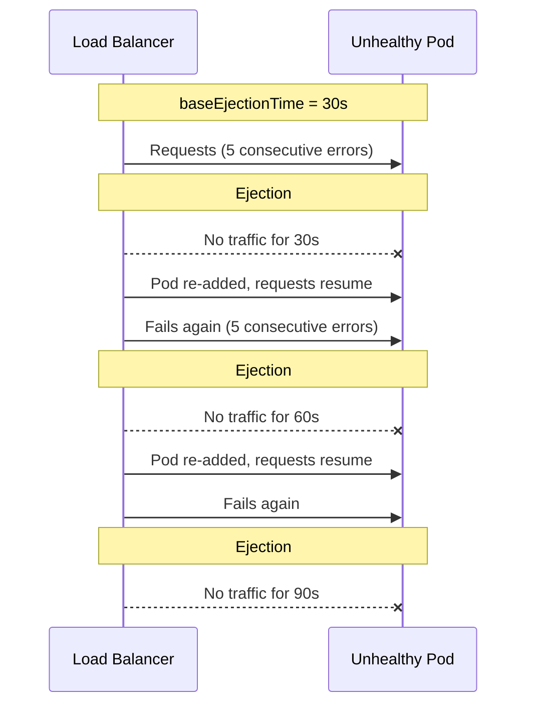

# How to Configure Circuit Breaking Ejection Time in Istio

Author: [nawazdhandala](https://github.com/nawazdhandala)

Tags: Istio, Service Mesh, Circuit Breaking, Outlier Detection, Kubernetes

Description: How to configure and tune ejection time settings in Istio outlier detection so unhealthy pods stay out of the pool long enough to recover.

---

When Istio's outlier detection ejects a pod from the load balancing pool, it does not stay out forever. After a configured ejection time, the pod gets added back and starts receiving traffic again. If it is still broken, it gets ejected again for a longer period. Getting the ejection time right is about giving failing pods enough time to recover without removing capacity for too long.

## How Ejection Time Works

The ejection time in Istio uses progressive backoff. The first ejection lasts for the `baseEjectionTime`. Each subsequent ejection multiplies the base by the number of times that instance has been ejected.

```
First ejection:  baseEjectionTime * 1 = 30s
Second ejection: baseEjectionTime * 2 = 60s
Third ejection:  baseEjectionTime * 3 = 90s
Fourth ejection: baseEjectionTime * 4 = 120s
```

This progressive approach makes sense. If a pod fails once and recovers, it was probably a transient issue. If it keeps failing every time it comes back, something is seriously wrong and it should stay out longer.



## Basic Ejection Time Configuration

```yaml
apiVersion: networking.istio.io/v1beta1
kind: DestinationRule
metadata:
  name: payment-service
  namespace: default
spec:
  host: payment-service
  trafficPolicy:
    outlierDetection:
      consecutive5xxErrors: 3
      interval: 10s
      baseEjectionTime: 30s
      maxEjectionPercent: 50
```

The `baseEjectionTime: 30s` means the first ejection lasts 30 seconds. The pod comes back after 30 seconds and either resumes serving traffic normally or gets ejected again for 60 seconds.

## Choosing the Right Base Ejection Time

The right value depends on what kind of failures your services experience and how long they typically need to recover.

### Short Ejection Time (10-15s)

Good for transient issues that resolve quickly:

```yaml
apiVersion: networking.istio.io/v1beta1
kind: DestinationRule
metadata:
  name: cache-service
  namespace: default
spec:
  host: cache-service
  trafficPolicy:
    outlierDetection:
      consecutive5xxErrors: 3
      interval: 5s
      baseEjectionTime: 10s
      maxEjectionPercent: 40
```

Use short ejection times for:
- Services that recover quickly from overload
- Services behind autoscalers that scale up fast
- Non-critical services where you want to maximize availability

The downside: if the problem persists, the pod bounces in and out of the pool rapidly (10s out, back in, fails, 20s out, back in, fails...). This creates noise in your monitoring.

### Medium Ejection Time (30-60s)

The sweet spot for most services:

```yaml
apiVersion: networking.istio.io/v1beta1
kind: DestinationRule
metadata:
  name: order-service
  namespace: default
spec:
  host: order-service
  trafficPolicy:
    outlierDetection:
      consecutive5xxErrors: 3
      interval: 10s
      baseEjectionTime: 30s
      maxEjectionPercent: 50
```

Thirty seconds is enough for most transient issues to clear. It also aligns with typical Kubernetes liveness probe intervals, so a truly broken pod will likely get restarted by Kubernetes during the ejection period.

### Long Ejection Time (120s+)

For services where recovery takes time:

```yaml
apiVersion: networking.istio.io/v1beta1
kind: DestinationRule
metadata:
  name: database-proxy
  namespace: default
spec:
  host: database-proxy
  trafficPolicy:
    outlierDetection:
      consecutive5xxErrors: 5
      interval: 15s
      baseEjectionTime: 120s
      maxEjectionPercent: 30
```

Use long ejection times for:
- Database connections that need time to re-establish
- Services that perform warm-up (loading caches, initializing connections)
- Services where errors tend to persist for minutes, not seconds

## Progressive Backoff in Practice

The progressive backoff means you do not need to make the base ejection time too long. Even with a modest 30-second base, repeated ejections escalate quickly:

| Ejection # | Duration | Total time ejected |
|-----------|----------|-------------------|
| 1 | 30s | 30s |
| 2 | 60s | 90s |
| 3 | 90s | 180s (3 min) |
| 4 | 120s | 300s (5 min) |
| 5 | 150s | 450s (7.5 min) |

By the fifth ejection, the pod has been out for 7.5 minutes total. At that point, Kubernetes should have restarted it through liveness probes, or an engineer should be investigating.

## Ejection Time and Pod Count

The ejection time interacts with your pod count and `maxEjectionPercent`. If you have 4 pods with `maxEjectionPercent: 50`, at most 2 pods can be ejected at once. This means you are running at half capacity during the ejection period.

Make sure your remaining capacity can handle the load:

```yaml
# 6 pods, max 33% ejection = at most 2 ejected, 4 remaining
apiVersion: networking.istio.io/v1beta1
kind: DestinationRule
metadata:
  name: api-service
  namespace: production
spec:
  host: api-service
  trafficPolicy:
    outlierDetection:
      consecutive5xxErrors: 3
      interval: 10s
      baseEjectionTime: 45s
      maxEjectionPercent: 33
```

With 6 pods and 33% max ejection, you lose at most 2 pods. If your service normally runs at 50% capacity (a common target), you can handle the reduced pool.

## Monitoring Ejection Behavior

Track ejections to understand your service's health patterns:

```bash
# Current ejections
kubectl exec deploy/api-service -c istio-proxy -- \
  curl -s localhost:15000/stats | grep "ejections_active"

# Total ejection events
kubectl exec deploy/api-service -c istio-proxy -- \
  curl -s localhost:15000/stats | grep "ejections_total"

# Check individual host status
kubectl exec deploy/api-service -c istio-proxy -- \
  curl -s localhost:15000/clusters | grep -E "health_flags|outlier"
```

The `clusters` endpoint shows the health status of each upstream instance. Look for hosts with `health_flags` that include `/failed_outlier_check` - those are currently ejected.

## Ejection Time vs Kubernetes Liveness Probes

There is an important relationship between ejection time and Kubernetes liveness probes. If a pod is genuinely broken:

1. Istio ejects it from the load balancing pool (immediate traffic relief)
2. Kubernetes eventually detects the failure through liveness probes and restarts the pod
3. The restarted pod passes readiness checks and starts serving traffic again

For this to work smoothly, your ejection time should be long enough that Kubernetes has time to restart the pod before it gets re-added to the pool:

```yaml
# Kubernetes liveness probe
livenessProbe:
  httpGet:
    path: /health
    port: 8080
  initialDelaySeconds: 10
  periodSeconds: 10
  failureThreshold: 3
  # Total time to detect and restart: ~40s
```

```yaml
# Istio ejection time should exceed Kubernetes restart time
outlierDetection:
  baseEjectionTime: 60s
```

With a 60-second ejection time, Kubernetes has plenty of time to detect the failure, kill the pod, and start a new one before Istio tries sending traffic to it again.

## Complete Production Example

```yaml
apiVersion: networking.istio.io/v1beta1
kind: DestinationRule
metadata:
  name: checkout-service
  namespace: production
spec:
  host: checkout-service.production.svc.cluster.local
  trafficPolicy:
    connectionPool:
      tcp:
        maxConnections: 150
      http:
        http1MaxPendingRequests: 75
        http2MaxRequests: 300
    outlierDetection:
      consecutive5xxErrors: 3
      consecutiveGatewayErrors: 2
      interval: 10s
      baseEjectionTime: 45s
      maxEjectionPercent: 40
      minHealthPercent: 30
```

This is a balanced configuration for a critical checkout service. The 45-second base ejection time gives pods time to recover from transient issues while the progressive backoff handles persistent failures. The `minHealthPercent: 30` disables outlier detection entirely if too few pods are healthy, preventing a death spiral.

Ejection time is one of those settings where the default (30s) works for most cases, but understanding how it interacts with progressive backoff, pod count, and Kubernetes health checks helps you tune it for your specific situation.
