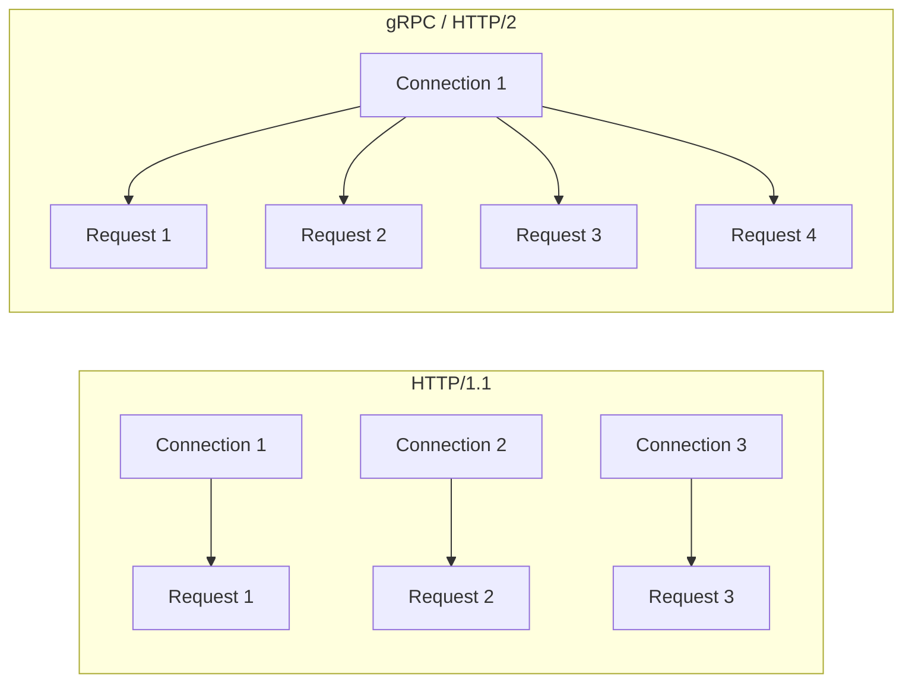

# How to Configure Circuit Breaking for gRPC Services in Istio

Author: [nawazdhandala](https://github.com/nawazdhandala)

Tags: Istio, Service Mesh, Circuit Breaking, GRPC, Kubernetes

Description: How to configure circuit breaking for gRPC services in Istio, including HTTP/2 specific settings and handling gRPC streaming connections.

---

gRPC services have different characteristics than REST APIs, and those differences affect how you configure circuit breaking. gRPC uses HTTP/2 under the hood, which means multiple requests are multiplexed over a single connection. The connection pool settings that matter for HTTP/1.1 services are not the same ones that matter for gRPC. This guide covers the specifics.

## gRPC vs HTTP/1.1: Why It Matters for Circuit Breaking

With HTTP/1.1, each TCP connection handles one request at a time. If you want 100 concurrent requests, you need 100 connections. The `maxConnections` and `http1MaxPendingRequests` settings directly control concurrency.

With gRPC (HTTP/2), a single TCP connection can handle hundreds of concurrent requests through multiplexing. So `maxConnections` becomes less important - what matters is `http2MaxRequests`, which limits the total number of concurrent requests across all connections.



## Basic gRPC Circuit Breaking Configuration

```yaml
apiVersion: networking.istio.io/v1beta1
kind: DestinationRule
metadata:
  name: grpc-service
  namespace: default
spec:
  host: grpc-service
  trafficPolicy:
    connectionPool:
      tcp:
        maxConnections: 10
      http:
        http2MaxRequests: 500
        maxRequestsPerConnection: 1000
    outlierDetection:
      consecutive5xxErrors: 3
      interval: 10s
      baseEjectionTime: 30s
      maxEjectionPercent: 50
```

The key setting here is `http2MaxRequests: 500`. This caps the total number of concurrent gRPC calls to 500. When the 501st call comes in, it gets a gRPC UNAVAILABLE error (which maps to HTTP 503).

The `maxConnections: 10` setting is less critical for gRPC since HTTP/2 multiplexes well, but it still limits the number of TCP connections Envoy opens. With 10 connections and 500 max requests, each connection handles up to 50 concurrent streams.

## Handling gRPC Error Codes

gRPC has its own status codes that map to HTTP status codes. For outlier detection, Istio treats gRPC errors as follows:

| gRPC Status | HTTP Status | Counted by consecutive5xxErrors? |
|------------|-------------|--------------------------------|
| OK (0) | 200 | No |
| UNAVAILABLE (14) | 503 | Yes |
| INTERNAL (13) | 500 | Yes |
| DEADLINE_EXCEEDED (4) | 504 | Yes (with consecutiveGatewayErrors) |
| RESOURCE_EXHAUSTED (8) | 429 | No |
| NOT_FOUND (5) | 404 | No |

For gRPC services, `consecutiveGatewayErrors` is often more appropriate than `consecutive5xxErrors` because UNAVAILABLE and DEADLINE_EXCEEDED are the most common transient errors:

```yaml
apiVersion: networking.istio.io/v1beta1
kind: DestinationRule
metadata:
  name: grpc-service
  namespace: default
spec:
  host: grpc-service
  trafficPolicy:
    outlierDetection:
      consecutiveGatewayErrors: 3
      interval: 10s
      baseEjectionTime: 30s
      maxEjectionPercent: 50
```

## Configuring for Unary gRPC Calls

Unary (request-response) gRPC calls are the simplest case. They behave like regular HTTP requests, just over HTTP/2:

```yaml
apiVersion: networking.istio.io/v1beta1
kind: DestinationRule
metadata:
  name: user-service-grpc
  namespace: default
spec:
  host: user-service
  trafficPolicy:
    connectionPool:
      tcp:
        maxConnections: 5
      http:
        http2MaxRequests: 200
        maxRequestsPerConnection: 500
    outlierDetection:
      consecutive5xxErrors: 3
      consecutiveGatewayErrors: 2
      interval: 10s
      baseEjectionTime: 30s
      maxEjectionPercent: 40
```

With 5 TCP connections and 200 max requests, each connection handles up to 40 concurrent RPCs. The `maxRequestsPerConnection: 500` recycles connections after 500 total RPCs, ensuring load gets redistributed.

## Configuring for Streaming gRPC

gRPC streaming (server-streaming, client-streaming, or bidirectional) complicates things because streams are long-lived. A single streaming RPC occupies one HTTP/2 stream for its entire duration, which could be seconds, minutes, or even hours.

For services with streaming RPCs, you need higher concurrency limits:

```yaml
apiVersion: networking.istio.io/v1beta1
kind: DestinationRule
metadata:
  name: event-stream-service
  namespace: default
spec:
  host: event-stream-service
  trafficPolicy:
    connectionPool:
      tcp:
        maxConnections: 20
      http:
        http2MaxRequests: 2000
        maxRequestsPerConnection: 0
    outlierDetection:
      consecutive5xxErrors: 5
      interval: 15s
      baseEjectionTime: 60s
      maxEjectionPercent: 30
```

Notice `maxRequestsPerConnection: 0` (unlimited). For streaming services, you do not want to forcibly close connections because that would terminate active streams. Set it to 0 and let streams complete naturally.

The `http2MaxRequests: 2000` is higher than usual because long-lived streams tie up request slots for their entire duration. If you have 500 clients each maintaining a streaming connection, you need at least 500 request slots just for the streams.

## Mixed Unary and Streaming Services

Many gRPC services have both unary and streaming methods. You cannot configure different circuit breaking settings per method in a DestinationRule. The settings apply to the entire service.

The practical approach is to configure for the streaming case (higher limits, no connection recycling) and rely on outlier detection for protection:

```yaml
apiVersion: networking.istio.io/v1beta1
kind: DestinationRule
metadata:
  name: chat-service
  namespace: default
spec:
  host: chat-service
  trafficPolicy:
    connectionPool:
      tcp:
        maxConnections: 20
      http:
        http2MaxRequests: 1000
        maxRequestsPerConnection: 0
    outlierDetection:
      consecutive5xxErrors: 5
      interval: 10s
      baseEjectionTime: 45s
      maxEjectionPercent: 40
```

## Timeout Considerations for gRPC

gRPC has its own deadline mechanism. When combining with Istio timeouts, be aware that both can trigger:

```yaml
apiVersion: networking.istio.io/v1beta1
kind: VirtualService
metadata:
  name: grpc-service
  namespace: default
spec:
  hosts:
    - grpc-service
  http:
    - route:
        - destination:
            host: grpc-service
            port:
              number: 50051
      timeout: 0s  # Disable Istio timeout for streaming
      retries:
        attempts: 2
        perTryTimeout: 5s
        retryOn: "connect-failure,refused-stream"
```

Setting `timeout: 0s` disables the route timeout, which is essential for streaming RPCs. The retries with `perTryTimeout: 5s` only apply to the initial connection, not to the stream itself.

## Monitoring gRPC Circuit Breaking

gRPC metrics show up slightly differently in Envoy stats:

```bash
# Check gRPC-specific stats
kubectl exec deploy/grpc-service -c istio-proxy -- \
  curl -s localhost:15000/stats | grep "grpc"

# Check HTTP/2 connection stats
kubectl exec deploy/grpc-service -c istio-proxy -- \
  curl -s localhost:15000/stats | grep "http2"

# Check circuit breaker overflow for gRPC
kubectl exec deploy/grpc-service -c istio-proxy -- \
  curl -s localhost:15000/stats | grep "overflow"
```

For Prometheus, the key gRPC metrics are:

```text
# gRPC request rate by status
sum(rate(istio_requests_total{destination_service="grpc-service.default.svc.cluster.local",grpc_response_status!="0"}[5m])) by (grpc_response_status)

# HTTP/2 active streams (concurrent gRPC calls)
envoy_cluster_upstream_rq_active{cluster_name="outbound|50051||grpc-service.default.svc.cluster.local"}
```

## Load Testing gRPC Circuit Breaking

Use ghz (a gRPC benchmarking tool) to test:

```bash
# Install ghz
kubectl run ghz --image=ghz-image --restart=Never -- \
  ghz --insecure \
  --proto /protos/service.proto \
  --call mypackage.MyService/MyMethod \
  -d '{"key": "value"}' \
  -c 100 \
  -n 10000 \
  grpc-service:50051
```

Or use fortio with gRPC support:

```bash
kubectl exec deploy/fortio -- fortio load \
  -grpc \
  -c 50 \
  -qps 0 \
  -n 1000 \
  grpc-service:50051
```

Watch the overflow metrics during the test to verify circuit breaking activates at the right thresholds.

## Production Checklist for gRPC Circuit Breaking

Before deploying, verify these points:

1. `http2MaxRequests` is set based on expected peak concurrent RPCs (not QPS)
2. `maxRequestsPerConnection` is 0 for services with streaming RPCs
3. `maxConnections` is reasonable for your pod count (2-5 connections per pod is typical)
4. Outlier detection uses `consecutiveGatewayErrors` for better gRPC error tracking
5. VirtualService timeout is disabled (0s) for streaming endpoints
6. Monitoring is set up for `upstream_rq_active` and overflow metrics

gRPC circuit breaking is not fundamentally different from HTTP/1.1 circuit breaking, but the HTTP/2 multiplexing and streaming aspects mean you need to think about connection management differently. Focus on `http2MaxRequests` as your primary concurrency control and be careful with connection recycling settings when streams are involved.
