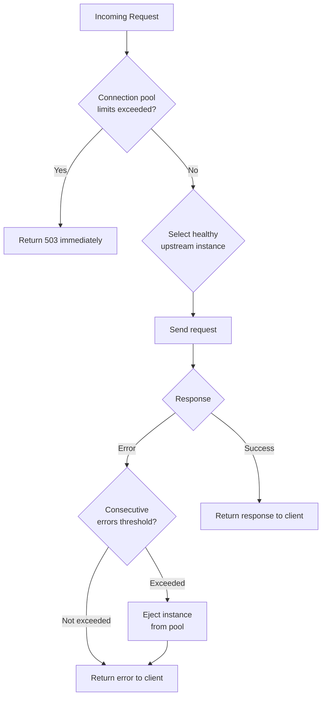

# How to Configure Circuit Breaking in Istio

Author: [nawazdhandala](https://github.com/nawazdhandala)

Tags: Istio, Service Mesh, Circuit Breaking, Kubernetes, Reliability

Description: Complete guide to configuring circuit breaking in Istio using DestinationRule with connection pools and outlier detection for resilient microservices.

---

Circuit breaking is one of the most important resilience patterns in microservices. When a service starts failing, circuit breaking stops sending requests to it, giving it time to recover instead of piling on more load. Istio implements circuit breaking through DestinationRule resources, and it works at two levels: connection pool limits and outlier detection.

## How Circuit Breaking Works in Istio

Istio's circuit breaking has two complementary mechanisms:

**Connection pool settings** limit the volume of traffic to a service. When limits are exceeded, additional requests are immediately failed with a 503 instead of being queued up. Think of this as a "fast fail" mechanism.

**Outlier detection** tracks the health of individual service instances (pods). When an instance starts returning errors, it gets temporarily ejected from the load balancing pool. This is the traditional "circuit breaker" pattern.



## Basic Circuit Breaking Configuration

Here is a basic DestinationRule that sets up circuit breaking:

```yaml
apiVersion: networking.istio.io/v1beta1
kind: DestinationRule
metadata:
  name: my-service
  namespace: default
spec:
  host: my-service
  trafficPolicy:
    connectionPool:
      tcp:
        maxConnections: 100
      http:
        http1MaxPendingRequests: 50
        http2MaxRequests: 100
        maxRequestsPerConnection: 10
    outlierDetection:
      consecutive5xxErrors: 5
      interval: 10s
      baseEjectionTime: 30s
      maxEjectionPercent: 50
```

Breaking this down:

- `maxConnections: 100` - Maximum 100 TCP connections to the service
- `http1MaxPendingRequests: 50` - Maximum 50 requests waiting for a connection
- `http2MaxRequests: 100` - Maximum 100 active HTTP/2 requests
- `maxRequestsPerConnection: 10` - Close connection after 10 requests (forces reconnection)
- `consecutive5xxErrors: 5` - Eject instance after 5 consecutive 5xx errors
- `interval: 10s` - Check for errors every 10 seconds
- `baseEjectionTime: 30s` - Keep ejected instances out for 30 seconds
- `maxEjectionPercent: 50` - Never eject more than 50% of instances

## Connection Pool Settings Explained

### TCP Connection Limits

```yaml
connectionPool:
  tcp:
    maxConnections: 100
    connectTimeout: 5s
```

`maxConnections` controls the total number of TCP connections the Envoy proxy will open to the upstream service. Once this limit is hit, new requests get a 503.

`connectTimeout` is how long to wait for the TCP handshake. Default is usually fine, but increase it if your services are in different regions.

### HTTP Connection Limits

```yaml
connectionPool:
  http:
    http1MaxPendingRequests: 100
    http2MaxRequests: 1000
    maxRequestsPerConnection: 0
    maxRetries: 3
```

`http1MaxPendingRequests` limits requests queued while waiting for a connection. This is crucial for preventing request buildup when the service is slow.

`http2MaxRequests` limits concurrent requests over HTTP/2 (and gRPC, since gRPC uses HTTP/2). Since HTTP/2 multiplexes requests over a single connection, this acts as the total request concurrency limit.

`maxRequestsPerConnection` set to 0 means unlimited requests per connection. Set it to a positive number to periodically close connections and reconnect, which helps with load balancing across new pods.

## Outlier Detection Settings Explained

```yaml
outlierDetection:
  consecutive5xxErrors: 5
  interval: 10s
  baseEjectionTime: 30s
  maxEjectionPercent: 50
  minHealthPercent: 30
```

`consecutive5xxErrors` is the number of consecutive 5xx errors before an instance gets ejected. The key word is "consecutive" - a single success resets the counter.

`interval` is how often the outlier detection algorithm runs.

`baseEjectionTime` is how long an ejected instance stays out of the pool. Subsequent ejections increase this time: second ejection = 2x base, third = 3x base, and so on.

`maxEjectionPercent` prevents too many instances from being ejected at once. If you have 4 pods and set this to 50%, at most 2 pods can be ejected.

`minHealthPercent` defines the minimum percentage of healthy hosts required for outlier detection to function. If healthy hosts drop below this threshold, outlier detection is disabled and traffic is sent to all hosts.

## Applying Circuit Breaking to a Service

Here is a complete example for a production service:

```yaml
apiVersion: networking.istio.io/v1beta1
kind: DestinationRule
metadata:
  name: catalog-service
  namespace: production
spec:
  host: catalog-service.production.svc.cluster.local
  trafficPolicy:
    connectionPool:
      tcp:
        maxConnections: 200
        connectTimeout: 5s
      http:
        http1MaxPendingRequests: 100
        http2MaxRequests: 200
        maxRequestsPerConnection: 50
    outlierDetection:
      consecutive5xxErrors: 3
      interval: 15s
      baseEjectionTime: 30s
      maxEjectionPercent: 40
```

Apply it:

```bash
kubectl apply -f catalog-destination-rule.yaml

# Verify it was applied
kubectl get destinationrule catalog-service -n production -o yaml
```

## Verifying Circuit Breaking Is Active

Check that the circuit breaking configuration reached the Envoy proxy:

```bash
# Check the cluster configuration in Envoy
kubectl exec deploy/catalog-service -n production -c istio-proxy -- \
  curl -s localhost:15000/config_dump?resource=dynamic_active_clusters | \
  python3 -m json.tool | grep -A 20 "circuit_breakers"
```

You should see the connection pool limits reflected in the `circuit_breakers` section of the cluster config.

To see if the circuit breaker is actually tripping:

```bash
# Check for overflow (circuit breaker trips)
kubectl exec deploy/catalog-service -n production -c istio-proxy -- \
  curl -s localhost:15000/stats | grep "upstream_rq_pending_overflow"

# Check for ejected hosts
kubectl exec deploy/catalog-service -n production -c istio-proxy -- \
  curl -s localhost:15000/stats | grep "ejections_active"
```

## Common Pitfalls

**Setting limits too low.** If `maxConnections` is 10 but your service normally handles 50 concurrent requests, the circuit breaker will trip constantly under normal load. Always look at your current traffic patterns before setting limits.

**Forgetting about HTTP/2.** If your services use HTTP/2 or gRPC, `http1MaxPendingRequests` is less relevant. Focus on `http2MaxRequests` instead.

**Not accounting for retries.** Retries count against connection pool limits. If you have 3 retries configured, your effective request rate to the upstream is up to 3x your incoming request rate.

**maxEjectionPercent too high.** Setting this to 100% means all instances can be ejected, leaving no backends to serve traffic. Keep it at 50% or lower in production.

```bash
# Quick health check of circuit breaking status
kubectl exec deploy/my-app -c istio-proxy -- \
  curl -s localhost:15000/clusters | grep -E "cx_active|rq_active|ejected"
```

Circuit breaking is not a set-and-forget configuration. Start with conservative limits, monitor the overflow and ejection metrics, and adjust based on real traffic patterns. The goal is to protect your services from cascading failures, not to throttle normal traffic.
