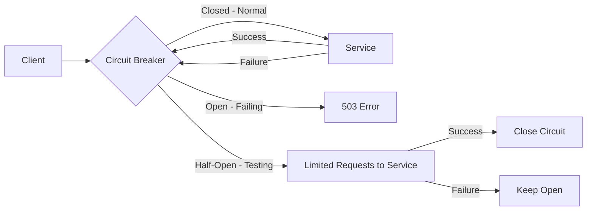

# How to Configure Circuit Breaking with DestinationRule

Author: [nawazdhandala](https://github.com/nawazdhandala)

Tags: Istio, Circuit Breaking, DestinationRule, Kubernetes, Resilience

Description: Set up circuit breaking in Istio using DestinationRule connection pool settings and outlier detection to prevent cascading failures.

---

Circuit breaking is a pattern that prevents cascading failures in distributed systems. When a service starts failing, instead of continuing to send requests to it (which makes things worse), the circuit breaker "opens" and immediately rejects new requests. After some time, it lets a few requests through to test if the service has recovered.

In Istio, circuit breaking is implemented through two DestinationRule features working together: connection pool limits and outlier detection. Connection pool limits define the thresholds that trigger the circuit breaker, and outlier detection handles the automatic ejection and recovery of unhealthy endpoints.

## The Circuit Breaking Concept

Think of it like an electrical circuit breaker in your house. When too much current flows through a wire, the breaker trips to prevent a fire. Similarly, when too many requests flow to a failing service, the circuit breaker trips to prevent cascading failures.



## Connection Pool Limits as Circuit Breakers

The connection pool settings in DestinationRule act as hard limits. When these limits are exceeded, Envoy immediately rejects requests:

```yaml
apiVersion: networking.istio.io/v1
kind: DestinationRule
metadata:
  name: my-service-cb
spec:
  host: my-service
  trafficPolicy:
    connectionPool:
      tcp:
        maxConnections: 100
      http:
        http1MaxPendingRequests: 50
        http2MaxRequests: 200
        maxRetries: 5
```

Here is what triggers the circuit breaker:
- More than 100 simultaneous TCP connections
- More than 50 requests waiting in the queue
- More than 200 concurrent HTTP/2 requests
- More than 5 concurrent retries

When any of these limits is hit, additional requests get an immediate 503 response. This is the "open circuit" state - fast failure instead of slow failure.

## Outlier Detection as Circuit Breaker

While connection pool limits prevent overload, outlier detection handles the detection and recovery part of circuit breaking:

```yaml
apiVersion: networking.istio.io/v1
kind: DestinationRule
metadata:
  name: my-service-outlier-cb
spec:
  host: my-service
  trafficPolicy:
    outlierDetection:
      consecutive5xxErrors: 5
      interval: 10s
      baseEjectionTime: 30s
      maxEjectionPercent: 50
```

When a specific pod returns 5 consecutive errors, it gets ejected (circuit opens for that pod). After 30 seconds, it gets added back (circuit half-opens). If it fails again, the ejection time doubles.

## The Complete Circuit Breaking Configuration

For proper circuit breaking, combine both:

```yaml
apiVersion: networking.istio.io/v1
kind: DestinationRule
metadata:
  name: payment-service-cb
spec:
  host: payment-service
  trafficPolicy:
    connectionPool:
      tcp:
        maxConnections: 100
        connectTimeout: 3s
      http:
        http1MaxPendingRequests: 25
        http2MaxRequests: 100
        maxRequestsPerConnection: 50
        maxRetries: 3
    outlierDetection:
      consecutive5xxErrors: 3
      consecutiveGatewayErrors: 2
      interval: 5s
      baseEjectionTime: 30s
      maxEjectionPercent: 40
```

This creates a two-layer defense:

1. **Layer 1 - Connection limits**: Prevents request pileup. If the service is slow and connections accumulate, new requests fail fast instead of waiting.

2. **Layer 2 - Outlier detection**: Removes individual failing pods. If Pod A is crashing but Pods B, C, and D are fine, only Pod A gets ejected.

## Testing Circuit Breaking

Deploy a service and apply tight circuit breaking rules:

```bash
kubectl apply -f - <<EOF
apiVersion: networking.istio.io/v1
kind: DestinationRule
metadata:
  name: httpbin-cb
spec:
  host: httpbin
  trafficPolicy:
    connectionPool:
      tcp:
        maxConnections: 1
      http:
        http1MaxPendingRequests: 1
        http2MaxRequests: 1
    outlierDetection:
      consecutive5xxErrors: 1
      interval: 5s
      baseEjectionTime: 15s
      maxEjectionPercent: 100
EOF
```

These are extremely tight limits (1 connection, 1 pending request) to make it easy to trigger the circuit breaker.

Now send concurrent traffic:

```bash
kubectl run fortio --image=fortio/fortio --rm -it -- \
  load -c 5 -qps 0 -n 100 http://httpbin:8000/get
```

With 5 concurrent connections but a limit of 1, you should see about 80% of requests getting 503 errors. The fortio output shows you the exact percentages.

## Monitoring Circuit Breaker State

Check Envoy stats to see circuit breaker activity:

```bash
kubectl exec <pod> -c istio-proxy -- curl -s localhost:15000/stats | grep overflow
```

Key counters:
- `upstream_cx_overflow` - TCP connection limit hit
- `upstream_rq_pending_overflow` - HTTP pending request limit hit
- `upstream_rq_retry_overflow` - Retry limit hit

For outlier detection:

```bash
kubectl exec <pod> -c istio-proxy -- curl -s localhost:15000/stats | grep outlier
```

- `outlier_detection.ejections_active` - Pods currently ejected
- `outlier_detection.ejections_total` - Total ejections

## Circuit Breaking Per Subset

Apply different circuit breaking policies to different versions of a service:

```yaml
apiVersion: networking.istio.io/v1
kind: DestinationRule
metadata:
  name: api-cb-subsets
spec:
  host: api-service
  trafficPolicy:
    connectionPool:
      tcp:
        maxConnections: 200
      http:
        http1MaxPendingRequests: 100
    outlierDetection:
      consecutive5xxErrors: 5
      interval: 10s
      baseEjectionTime: 30s
  subsets:
  - name: stable
    labels:
      version: v1
  - name: canary
    labels:
      version: v2
    trafficPolicy:
      connectionPool:
        tcp:
          maxConnections: 20
        http:
          http1MaxPendingRequests: 10
      outlierDetection:
        consecutive5xxErrors: 2
        interval: 5s
        baseEjectionTime: 60s
```

The canary subset has much tighter circuit breaking. If the new version misbehaves, it gets circuit-broken quickly without affecting the stable version.

## Circuit Breaking Design Patterns

### Pattern 1: Protect a Critical Dependency

For services like payment processors or authentication services:

```yaml
connectionPool:
  tcp:
    maxConnections: 50
  http:
    http1MaxPendingRequests: 10
    maxRetries: 2
outlierDetection:
  consecutive5xxErrors: 2
  baseEjectionTime: 60s
  maxEjectionPercent: 30
```

Tight limits, aggressive ejection, long cooldown. You would rather fail fast than risk overloading a payment service.

### Pattern 2: Tolerate Transient Failures

For services that occasionally hiccup but are generally reliable:

```yaml
connectionPool:
  tcp:
    maxConnections: 500
  http:
    http1MaxPendingRequests: 200
outlierDetection:
  consecutive5xxErrors: 10
  baseEjectionTime: 15s
  maxEjectionPercent: 50
```

Higher limits, more tolerant ejection threshold, shorter cooldown. You want to ride through temporary issues.

### Pattern 3: Bulkhead Isolation

Create separate circuit breakers for different consumers of the same service by using per-subset configuration or by having different client-side DestinationRules with different limits.

## Common Pitfalls

**Limits too tight**: Setting `maxConnections: 10` on a service that normally handles 50 concurrent requests means you are circuit breaking on normal traffic.

**maxEjectionPercent too high**: Setting it to 100% means all pods can be ejected, leaving zero capacity. Never do this in production.

**Not combining both features**: Connection pool limits without outlier detection just reject overflow requests but do not learn which pods are problematic. Outlier detection without pool limits lets requests pile up before pods get ejected. You need both.

## Cleanup

```bash
kubectl delete destinationrule payment-service-cb
```

Circuit breaking is essential for any microservices architecture. Use connection pool limits to prevent overload and outlier detection to remove unhealthy pods. Start with generous limits based on your service's actual capacity, and tighten them as you learn your traffic patterns.
