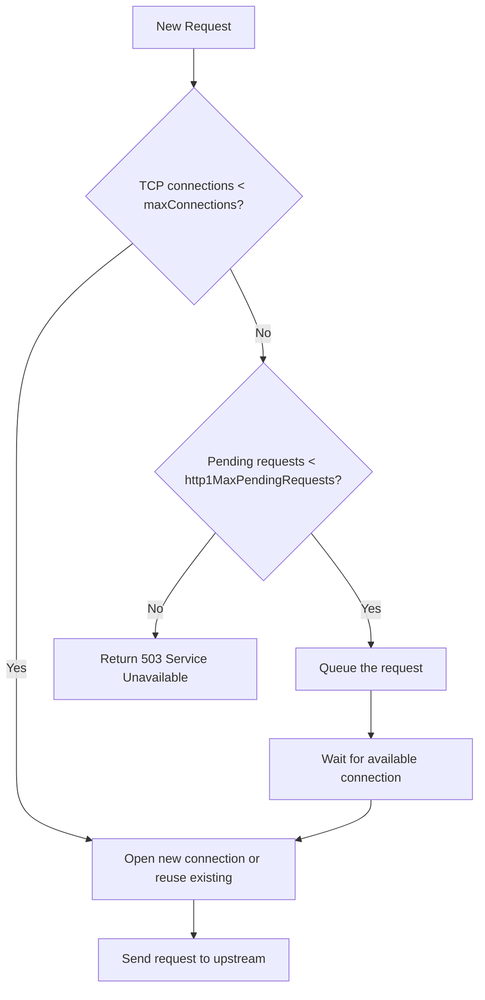

# How to Configure Connection Pool Settings in DestinationRule

Author: [nawazdhandala](https://github.com/nawazdhandala)

Tags: Istio, Connection Pool, DestinationRule, Kubernetes, Traffic Management

Description: Configure TCP and HTTP connection pool settings in Istio DestinationRule to control connection limits and prevent resource exhaustion.

---

Connection pool settings in a DestinationRule control how Envoy manages connections to your upstream services. Without limits, a sudden spike in traffic can open thousands of connections to a service, overwhelming it and potentially causing cascading failures. Connection pool settings let you cap these resources and define what happens when limits are hit.

There are two categories of connection pool settings: TCP and HTTP. TCP settings control the underlying transport connections. HTTP settings control how HTTP requests flow over those connections.

## TCP Connection Pool Settings

The TCP section controls raw TCP connection behavior:

```yaml
apiVersion: networking.istio.io/v1
kind: DestinationRule
metadata:
  name: my-service-pool
spec:
  host: my-service
  trafficPolicy:
    connectionPool:
      tcp:
        maxConnections: 100
        connectTimeout: 5s
        tcpKeepalive:
          time: 300s
          interval: 60s
          probes: 3
```

Here is what each field does:

- **maxConnections**: Maximum number of TCP connections to the service. Envoy will not open more than this many connections to all endpoints combined for this cluster. Requests that exceed this limit get queued (for HTTP) or rejected.

- **connectTimeout**: How long Envoy waits for a TCP connection to be established before giving up. Default is based on the OS, usually around 120 seconds, which is way too long for most services. Set this to something reasonable like 5 seconds.

- **tcpKeepalive**: Configures TCP keepalive probes to detect dead connections. `time` is the idle time before sending the first probe, `interval` is the time between probes, and `probes` is how many failed probes before closing the connection.

## HTTP Connection Pool Settings

HTTP settings control request-level behavior:

```yaml
apiVersion: networking.istio.io/v1
kind: DestinationRule
metadata:
  name: my-service-http-pool
spec:
  host: my-service
  trafficPolicy:
    connectionPool:
      http:
        http1MaxPendingRequests: 100
        http2MaxRequests: 1000
        maxRequestsPerConnection: 10
        maxRetries: 3
        h2UpgradePolicy: DEFAULT
```

Breaking these down:

- **http1MaxPendingRequests**: Maximum number of requests that can be queued while waiting for a connection. If the connection pool is full, new requests wait in this queue. When the queue is full too, requests get rejected with a 503.

- **http2MaxRequests**: Maximum concurrent requests to the service when using HTTP/2. Since HTTP/2 multiplexes requests over a single connection, this limits the total request concurrency regardless of connection count.

- **maxRequestsPerConnection**: How many requests to send over a single connection before closing it and opening a new one. This is useful for load balancing - if a connection is reused forever, all requests on that connection go to the same pod.

- **maxRetries**: Maximum number of concurrent outstanding retries across all requests to this service. This prevents retry storms.

- **h2UpgradePolicy**: Controls HTTP/2 upgrade behavior. `DEFAULT` follows the global setting, `DO_NOT_UPGRADE` keeps HTTP/1.1, and `UPGRADE` forces HTTP/2.

## A Complete Production Example

Here is a well-tuned connection pool configuration for a typical production API service:

```yaml
apiVersion: networking.istio.io/v1
kind: DestinationRule
metadata:
  name: api-service-production
spec:
  host: api-service
  trafficPolicy:
    connectionPool:
      tcp:
        maxConnections: 200
        connectTimeout: 3s
        tcpKeepalive:
          time: 300s
          interval: 60s
          probes: 3
      http:
        http1MaxPendingRequests: 50
        http2MaxRequests: 500
        maxRequestsPerConnection: 100
        maxRetries: 5
```

This configuration:
- Allows up to 200 TCP connections
- Fails fast on connection issues (3 second timeout)
- Keeps connections alive with TCP keepalive
- Queues up to 50 pending requests
- Limits concurrent HTTP/2 requests to 500
- Recycles connections after 100 requests
- Allows up to 5 concurrent retries

## Understanding the Request Flow

When a request arrives at Envoy, here is what happens with connection pool settings:



## How maxConnections Interacts with Replicas

An important nuance: `maxConnections` is the total number of connections from one Envoy proxy to all endpoints of the service combined. If your service has 10 pods and `maxConnections` is 100, Envoy may open up to 100 connections spread across those 10 pods.

This is per-Envoy behavior. If you have 20 client pods, each with its own sidecar, you could have up to 20 x 100 = 2000 total connections to your service endpoints.

## Testing Connection Pool Limits

You can test connection limits using a load generator like fortio:

```bash
kubectl run fortio --image=fortio/fortio -- load -c 200 -qps 0 -t 30s http://my-service:8080/
```

This sends traffic with 200 concurrent connections. If your `maxConnections` is set to 100, you should see some requests getting 503 errors after the queue fills up.

Check the Envoy stats to see overflow events:

```bash
istioctl proxy-config cluster <client-pod> --fqdn my-service.default.svc.cluster.local -o json
```

You can also look at Envoy's upstream connection metrics through the admin interface:

```bash
kubectl exec <pod-with-sidecar> -c istio-proxy -- curl -s localhost:15000/stats | grep my-service | grep overflow
```

The `upstream_cx_overflow` counter tells you how many connections were rejected because `maxConnections` was reached. The `upstream_rq_pending_overflow` counter shows how many requests overflowed the pending queue.

## Per-Subset Connection Pools

You can set different pool sizes for different subsets:

```yaml
apiVersion: networking.istio.io/v1
kind: DestinationRule
metadata:
  name: api-subsets-pool
spec:
  host: api-service
  trafficPolicy:
    connectionPool:
      tcp:
        maxConnections: 200
  subsets:
  - name: stable
    labels:
      version: v1
  - name: canary
    labels:
      version: v2
    trafficPolicy:
      connectionPool:
        tcp:
          maxConnections: 50
        http:
          http1MaxPendingRequests: 10
```

The canary subset gets much tighter limits, so a misbehaving canary version cannot consume all available connections.

## Common Mistakes

**Setting maxConnections too low**: If your service legitimately needs 500 concurrent connections and you set `maxConnections` to 50, you will get lots of 503 errors. Start with generous limits and tighten them based on actual traffic patterns.

**Forgetting the pending queue**: Even if `maxConnections` is reached, requests can still succeed if they wait in the pending queue. Set `http1MaxPendingRequests` to a reasonable value to handle short bursts.

**Not setting connectTimeout**: The default TCP connect timeout is very high. A service that is completely down will still cause Envoy to wait a long time per connection attempt. Always set a reasonable timeout.

## Cleanup

```bash
kubectl delete destinationrule api-service-production
```

Connection pool settings are one of the most practical things you can configure in a DestinationRule. They protect your services from being overwhelmed and give you predictable behavior under load. Start with conservative but not too tight limits, monitor the overflow counters, and adjust as needed.
