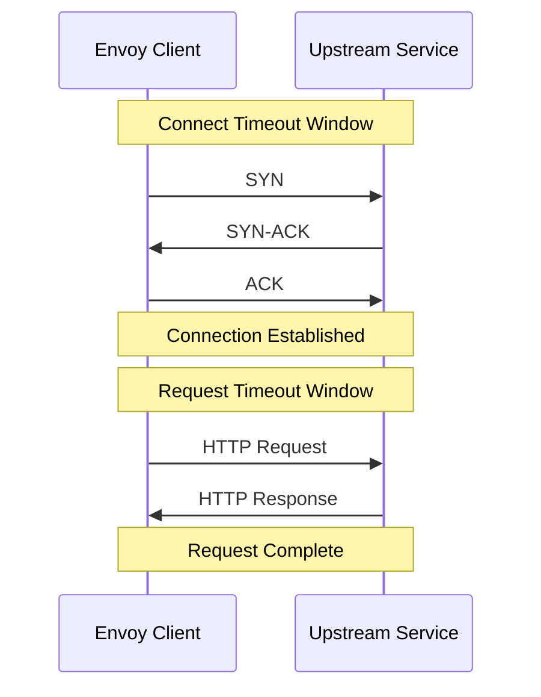

# How to Configure Connection Timeout in DestinationRule

Author: [nawazdhandala](https://github.com/nawazdhandala)

Tags: Istio, Connection Timeout, DestinationRule, Kubernetes, Traffic Management

Description: Configure TCP connection timeouts in Istio DestinationRule to fail fast when upstream services are unreachable or slow to connect.

---

Connection timeout is one of those settings that gets overlooked until something goes wrong. Without it, when an upstream service is down or a network path is broken, Envoy will wait the OS default timeout (typically 120 seconds) before giving up on the TCP handshake. That means your users are staring at a loading spinner for 2 minutes before getting an error.

Setting a connection timeout in your DestinationRule tells Envoy to give up faster, returning an error to the caller quickly so they can handle it, retry on a different endpoint, or show a meaningful error to the user.

## The Connect Timeout Setting

The connection timeout is set in the TCP section of the connection pool:

```yaml
apiVersion: networking.istio.io/v1
kind: DestinationRule
metadata:
  name: my-service-timeout
spec:
  host: my-service
  trafficPolicy:
    connectionPool:
      tcp:
        connectTimeout: 5s
```

This tells Envoy to wait at most 5 seconds for the TCP handshake to complete. If the connection is not established within 5 seconds, Envoy gives up and either tries another endpoint or returns a 503 to the caller.

## Connect Timeout vs Request Timeout

These are two different things that people often confuse:

**Connect timeout** (DestinationRule): How long to wait for the TCP connection to be established. This is the three-way handshake (SYN, SYN-ACK, ACK). Set in the DestinationRule's `connectionPool.tcp.connectTimeout`.

**Request timeout** (VirtualService): How long to wait for the complete HTTP response after the connection is established. Set in the VirtualService's `timeout` field.



You need both. A service might accept connections quickly (TCP handshake succeeds) but then take forever to process the request. Or it might be completely unreachable (TCP handshake never completes).

## Choosing the Right Timeout Value

The connect timeout should be short but not too short. Here are some guidelines:

**Same cluster, same region**: 1-3 seconds. TCP connections within a Kubernetes cluster should complete in milliseconds. If it takes more than a few seconds, something is seriously wrong.

```yaml
connectTimeout: 2s
```

**Cross-region within the same cloud**: 3-5 seconds. Network latency between regions can be 50-200ms, but the handshake should still complete quickly.

```yaml
connectTimeout: 5s
```

**External services**: 5-10 seconds. Internet-facing services might have higher latency, and the path might go through multiple hops.

```yaml
connectTimeout: 10s
```

**Never leave it at default**: The OS default is typically 120 seconds. That is almost never what you want. Always set an explicit connect timeout.

## Full Configuration with Timeouts

Here is a complete DestinationRule with connect timeout and related settings:

```yaml
apiVersion: networking.istio.io/v1
kind: DestinationRule
metadata:
  name: backend-service-timeouts
spec:
  host: backend-service
  trafficPolicy:
    connectionPool:
      tcp:
        maxConnections: 100
        connectTimeout: 3s
        tcpKeepalive:
          time: 300s
          interval: 60s
          probes: 3
      http:
        http1MaxPendingRequests: 50
        maxRequestsPerConnection: 100
    outlierDetection:
      consecutive5xxErrors: 5
      interval: 10s
      baseEjectionTime: 30s
```

The connect timeout works together with the other settings. If a connection attempt times out, that counts toward the connection error metrics. Combined with outlier detection, endpoints that consistently time out will get ejected from the pool.

## Pairing with VirtualService Timeout

For complete timeout coverage, set both the connect timeout (DestinationRule) and the request timeout (VirtualService):

```yaml
apiVersion: networking.istio.io/v1
kind: DestinationRule
metadata:
  name: api-dr
spec:
  host: api-service
  trafficPolicy:
    connectionPool:
      tcp:
        connectTimeout: 3s
---
apiVersion: networking.istio.io/v1
kind: VirtualService
metadata:
  name: api-vs
spec:
  hosts:
  - api-service
  http:
  - route:
    - destination:
        host: api-service
    timeout: 10s
```

With this configuration:
- TCP connection must be established within 3 seconds
- The complete HTTP response must arrive within 10 seconds
- Total maximum wait time is about 13 seconds (connect + request)

## Testing Connection Timeout

You can test connection timeout behavior by configuring a DestinationRule for a service that is not running:

```bash
kubectl apply -f - <<EOF
apiVersion: v1
kind: Service
metadata:
  name: fake-service
spec:
  selector:
    app: does-not-exist
  ports:
  - name: http
    port: 8080
---
apiVersion: networking.istio.io/v1
kind: DestinationRule
metadata:
  name: fake-service-timeout
spec:
  host: fake-service
  trafficPolicy:
    connectionPool:
      tcp:
        connectTimeout: 2s
EOF
```

Now try to connect:

```bash
kubectl run curl-test --image=curlimages/curl -it --rm -- \
  sh -c 'time curl -s http://fake-service:8080/'
```

The request should fail after approximately 2 seconds instead of the default 120 seconds.

## Connect Timeout Per Subset

Different subsets can have different connect timeouts:

```yaml
apiVersion: networking.istio.io/v1
kind: DestinationRule
metadata:
  name: api-subsets
spec:
  host: api-service
  trafficPolicy:
    connectionPool:
      tcp:
        connectTimeout: 3s
  subsets:
  - name: fast
    labels:
      tier: fast
  - name: slow
    labels:
      tier: slow
    trafficPolicy:
      connectionPool:
        tcp:
          connectTimeout: 10s
```

The "slow" subset gets a longer connect timeout because those endpoints might take longer to accept connections (maybe they are in a different region or on slower hardware).

## Connect Timeout and Retries

When a connection timeout occurs, Envoy can retry the request on a different endpoint. Configure retries in the VirtualService:

```yaml
apiVersion: networking.istio.io/v1
kind: VirtualService
metadata:
  name: api-vs
spec:
  hosts:
  - api-service
  http:
  - route:
    - destination:
        host: api-service
    retries:
      attempts: 3
      retryOn: connect-failure,reset
      perTryTimeout: 5s
```

The `connect-failure` retry condition tells Envoy to retry when a TCP connection fails (including timeouts). With `perTryTimeout: 5s`, each retry attempt gets its own 5-second window.

Combined with a `connectTimeout: 3s` in the DestinationRule, the first attempt fails after 3 seconds, and Envoy immediately tries another endpoint.

## Monitoring Connection Timeouts

Check Envoy stats for timeout counts:

```bash
kubectl exec <pod> -c istio-proxy -- curl -s localhost:15000/stats | grep connect_timeout
```

Look for `upstream_cx_connect_timeout` - this counter increments every time a connection attempt times out.

If this number is high, it means either your connect timeout is too aggressive or some endpoints are genuinely unreachable. Check the specific endpoints:

```bash
istioctl proxy-config endpoint <pod-name> --cluster "outbound|8080||api-service.default.svc.cluster.local"
```

Endpoints marked as UNHEALTHY might be the ones causing timeouts.

## Cleanup

```bash
kubectl delete destinationrule backend-service-timeouts
kubectl delete virtualservice api-vs
```

Connection timeout is a simple but critical setting. Always set it explicitly in your DestinationRules. The default OS timeout of 120 seconds is almost never appropriate for microservice communication. A few seconds is usually plenty for in-cluster services, and 5-10 seconds for external services. Combined with retries and outlier detection, you get fast failure recovery without making users wait.
