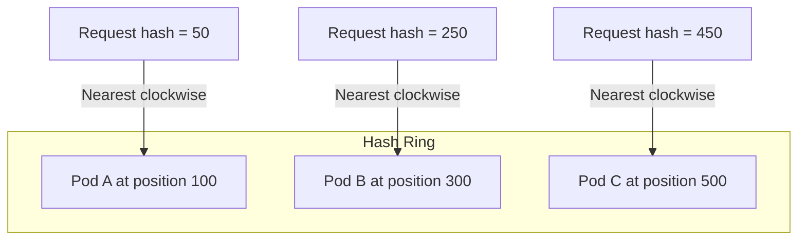

# How to Configure Consistent Hash Load Balancing in Istio

Author: [nawazdhandala](https://github.com/nawazdhandala)

Tags: Istio, Consistent Hashing, Load Balancing, DestinationRule, Session Affinity

Description: Configure consistent hash-based load balancing in Istio for session affinity and sticky routing using headers, cookies, or source IP.

---

Consistent hash load balancing in Istio ensures that requests with the same characteristics (like user ID, session cookie, or source IP) always land on the same backend pod. This is critical for services that store state in memory, maintain caches per user, or need session affinity for any reason.

Unlike simple algorithms where every request is independently routed, consistent hashing maps each request to a specific backend based on a hash key. As long as the hash key stays the same and the set of backends does not change, the request goes to the same pod every time.

## How Consistent Hashing Works

Consistent hashing works by placing all backend pods on a virtual ring (also called a hash ring). When a request arrives, Istio hashes the key (header value, cookie, IP, etc.) and maps it to a position on the ring. The request goes to the nearest backend in the clockwise direction.



The beauty of consistent hashing is that when a pod is added or removed, only a small portion of requests get remapped. If Pod B goes down, only requests that were mapped to Pod B need to move - everything else stays the same.

## Hash Key Options

Istio supports four types of hash keys:

### 1. HTTP Header

Route based on any HTTP header value:

```yaml
apiVersion: networking.istio.io/v1
kind: DestinationRule
metadata:
  name: my-service-hash-header
spec:
  host: my-service
  trafficPolicy:
    loadBalancer:
      consistentHash:
        httpHeaderName: x-user-id
```

Every request with the same `x-user-id` header value goes to the same pod. Different users go to different pods based on their hash position.

### 2. HTTP Cookie

Route based on a cookie, with optional automatic cookie generation:

```yaml
apiVersion: networking.istio.io/v1
kind: DestinationRule
metadata:
  name: my-service-hash-cookie
spec:
  host: my-service
  trafficPolicy:
    loadBalancer:
      consistentHash:
        httpCookie:
          name: session-affinity
          ttl: 3600s
```

The `ttl` field is important here. If a request comes in without the `session-affinity` cookie, Envoy will generate one and include it in the response as a Set-Cookie header. The client (browser) will then send it back on subsequent requests, ensuring affinity. The TTL of 3600s means the cookie lasts 1 hour.

### 3. Source IP

Route based on the client's IP address:

```yaml
apiVersion: networking.istio.io/v1
kind: DestinationRule
metadata:
  name: my-service-hash-ip
spec:
  host: my-service
  trafficPolicy:
    loadBalancer:
      consistentHash:
        useSourceIp: true
```

All requests from the same IP go to the same backend. This is the simplest form of session affinity but has limitations - if clients are behind a NAT or proxy, many different users might share the same source IP.

### 4. Query Parameter

Route based on a URL query parameter:

```yaml
apiVersion: networking.istio.io/v1
kind: DestinationRule
metadata:
  name: my-service-hash-param
spec:
  host: my-service
  trafficPolicy:
    loadBalancer:
      consistentHash:
        httpQueryParameterName: user_id
```

A request to `http://my-service/api?user_id=123` always goes to the same pod as long as `user_id=123`.

## Controlling the Hash Ring Size

The `minimumRingSize` parameter controls how many virtual nodes each backend gets on the hash ring. More virtual nodes means better distribution but more memory:

```yaml
apiVersion: networking.istio.io/v1
kind: DestinationRule
metadata:
  name: my-service-hash-tuned
spec:
  host: my-service
  trafficPolicy:
    loadBalancer:
      consistentHash:
        httpHeaderName: x-user-id
        minimumRingSize: 2048
```

The default is 1024. For services with many endpoints, you might want to increase this to get more even distribution. For small services (3-5 pods), the default is fine.

## Full Working Example

Here is a complete setup with a service, DestinationRule, and VirtualService:

```yaml
apiVersion: v1
kind: Service
metadata:
  name: user-sessions
spec:
  selector:
    app: user-sessions
  ports:
  - name: http
    port: 8080
    targetPort: 8080
---
apiVersion: apps/v1
kind: Deployment
metadata:
  name: user-sessions
spec:
  replicas: 5
  selector:
    matchLabels:
      app: user-sessions
  template:
    metadata:
      labels:
        app: user-sessions
    spec:
      containers:
      - name: app
        image: nginx:latest
        ports:
        - containerPort: 8080
---
apiVersion: networking.istio.io/v1
kind: DestinationRule
metadata:
  name: user-sessions-dr
spec:
  host: user-sessions
  trafficPolicy:
    loadBalancer:
      consistentHash:
        httpCookie:
          name: SERVERID
          ttl: 7200s
---
apiVersion: networking.istio.io/v1
kind: VirtualService
metadata:
  name: user-sessions-vs
spec:
  hosts:
  - user-sessions
  http:
  - route:
    - destination:
        host: user-sessions
```

The VirtualService here is simple because the routing logic does not need subsets. The DestinationRule handles the affinity through cookie-based hashing.

## Testing Session Affinity

Deploy a curl pod and verify that the same cookie always hits the same backend:

```bash
kubectl run curl-test --image=curlimages/curl -it --rm -- sh
```

First request (no cookie):

```bash
curl -v http://user-sessions:8080/
```

Look for the `Set-Cookie: SERVERID=...` header in the response. Then send subsequent requests with that cookie:

```bash
curl -b "SERVERID=abc123" http://user-sessions:8080/
curl -b "SERVERID=abc123" http://user-sessions:8080/
curl -b "SERVERID=abc123" http://user-sessions:8080/
```

All three should hit the same backend pod.

## What Happens When Pods Scale

When a new pod is added, only a fraction of the hash ring's keys get remapped to the new pod. Most sessions stay on their original pod. When a pod is removed (scaled down or crashed), only the sessions mapped to that pod need to move.

This is much better than simple modulo-based hashing, where adding or removing a backend changes the mapping for almost every session.

## Limitations

Consistent hashing is not perfect. If one hash key gets a disproportionate amount of traffic (a "hot key"), the pod it maps to will get overloaded while others are underutilized. This is called the hot-spot problem.

Also, consistent hashing does not consider the actual load on each pod. A pod could be struggling with slow requests, but if the hash maps new requests to it, they keep going there.

For most session-affinity use cases, these limitations are acceptable. But if you notice hot spots, consider using a more granular hash key (user ID rather than tenant ID, for example).

## Cleanup

```bash
kubectl delete destinationrule user-sessions-dr
kubectl delete virtualservice user-sessions-vs
kubectl delete deployment user-sessions
kubectl delete service user-sessions
```

Consistent hash load balancing is the right tool whenever you need session stickiness in Istio. Pick the hash key that makes sense for your application - headers for API services, cookies for web applications, and source IP as a last resort.
