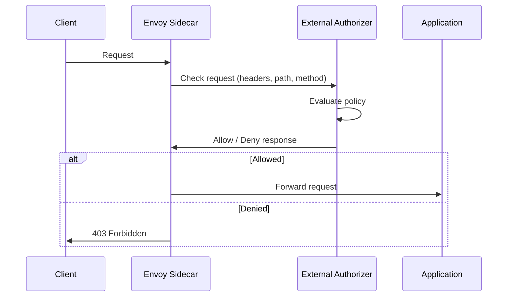

# How to Configure CUSTOM Authorization Action in Istio

Author: [nawazdhandala](https://github.com/nawazdhandala)

Tags: Istio, Authorization, CUSTOM Action, External Authorization, Security

Description: How to use the CUSTOM authorization action in Istio to delegate access control decisions to an external authorization service.

---

Istio's built-in ALLOW and DENY policies cover a lot of use cases, but sometimes you need authorization logic that goes beyond what static rules can express. Maybe you need to check a database for permissions, call an external policy engine like OPA, or apply rate limiting based on user identity. That's where the CUSTOM authorization action comes in.

The CUSTOM action lets you delegate authorization decisions to an external service. Istio's Envoy sidecar sends the request details to your external authorizer, waits for a response, and then either allows or denies the request based on what the authorizer says.

## How CUSTOM Authorization Works

When a request arrives at the Envoy sidecar and a CUSTOM policy matches, Envoy sends a check request to the configured external authorization provider. The provider inspects the request metadata (headers, path, method, source identity) and returns either an allow or deny decision.



## Setting Up the External Authorizer

First, you need to register your external authorization provider in Istio's mesh configuration. This is done through the MeshConfig:

```yaml
apiVersion: install.istio.io/v1alpha1
kind: IstioOperator
spec:
  meshConfig:
    extensionProviders:
      - name: "my-ext-authz-http"
        envoyExtAuthzHttp:
          service: "ext-authz.auth-system.svc.cluster.local"
          port: 8080
          headersToUpstreamOnAllow:
            - "authorization"
            - "x-user-id"
            - "x-user-role"
          headersToDownstreamOnDeny:
            - "x-ext-authz-error"
          includeRequestHeadersInCheck:
            - "authorization"
            - "cookie"
          pathPrefix: "/check"
      - name: "my-ext-authz-grpc"
        envoyExtAuthzGrpc:
          service: "ext-authz-grpc.auth-system.svc.cluster.local"
          port: 9091
```

You can register both HTTP and gRPC-based external authorizers. The HTTP variant is simpler to implement, while gRPC gives you a more structured API.

If you're using `istioctl` to manage your mesh, update the config with:

```bash
kubectl edit configmap istio -n istio-system
```

And add the `extensionProviders` section under `mesh`:

```yaml
data:
  mesh: |-
    extensionProviders:
    - name: "my-ext-authz-http"
      envoyExtAuthzHttp:
        service: "ext-authz.auth-system.svc.cluster.local"
        port: 8080
        includeRequestHeadersInCheck:
          - "authorization"
          - "cookie"
```

## Creating a CUSTOM AuthorizationPolicy

Once the provider is registered, create an AuthorizationPolicy with `action: CUSTOM`:

```yaml
apiVersion: security.istio.io/v1
kind: AuthorizationPolicy
metadata:
  name: ext-authz-policy
  namespace: my-app
spec:
  selector:
    matchLabels:
      app: my-service
  action: CUSTOM
  provider:
    name: my-ext-authz-http
  rules:
    - to:
        - operation:
            paths: ["/api/*"]
```

The `provider.name` must match the name you registered in the mesh config. The `rules` field determines which requests are sent to the external authorizer. Requests that don't match the rules bypass the external check entirely.

## Building an HTTP External Authorizer

Here's a simple external authorizer in Go that checks for an API key header:

```go
package main

import (
    "fmt"
    "net/http"
    "strings"
)

var validAPIKeys = map[string]string{
    "key-abc-123": "service-a",
    "key-def-456": "service-b",
}

func checkHandler(w http.ResponseWriter, r *http.Request) {
    apiKey := r.Header.Get("X-Api-Key")

    if service, ok := validAPIKeys[apiKey]; ok {
        // Allow the request - add custom headers for upstream
        w.Header().Set("x-user-id", service)
        w.WriteHeader(http.StatusOK)
        return
    }

    // Deny the request
    w.Header().Set("x-ext-authz-error", "invalid-api-key")
    w.WriteHeader(http.StatusForbidden)
    fmt.Fprintf(w, "Access denied: invalid API key")
}

func main() {
    http.HandleFunc("/check", checkHandler)
    http.ListenAndServe(":8080", nil)
}
```

Deploy this as a regular Kubernetes service:

```yaml
apiVersion: apps/v1
kind: Deployment
metadata:
  name: ext-authz
  namespace: auth-system
spec:
  replicas: 2
  selector:
    matchLabels:
      app: ext-authz
  template:
    metadata:
      labels:
        app: ext-authz
    spec:
      containers:
        - name: ext-authz
          image: my-registry/ext-authz:latest
          ports:
            - containerPort: 8080
---
apiVersion: v1
kind: Service
metadata:
  name: ext-authz
  namespace: auth-system
spec:
  selector:
    app: ext-authz
  ports:
    - port: 8080
      targetPort: 8080
```

## Using OPA as an External Authorizer

Open Policy Agent (OPA) is a popular choice for external authorization. You can run OPA with the Envoy external authorization plugin:

```yaml
apiVersion: apps/v1
kind: Deployment
metadata:
  name: opa-ext-authz
  namespace: auth-system
spec:
  replicas: 2
  selector:
    matchLabels:
      app: opa-ext-authz
  template:
    metadata:
      labels:
        app: opa-ext-authz
    spec:
      containers:
        - name: opa
          image: openpolicyagent/opa:latest-envoy
          args:
            - "run"
            - "--server"
            - "--addr=localhost:8181"
            - "--diagnostic-addr=0.0.0.0:8282"
            - "--set=plugins.envoy_ext_authz_grpc.addr=:9191"
            - "--set=plugins.envoy_ext_authz_grpc.path=envoy/authz/allow"
            - "--set=decision_logs.console=true"
            - "/policy/policy.rego"
          volumeMounts:
            - name: policy
              mountPath: /policy
      volumes:
        - name: policy
          configMap:
            name: opa-policy
```

Write an OPA policy in Rego:

```yaml
apiVersion: v1
kind: ConfigMap
metadata:
  name: opa-policy
  namespace: auth-system
data:
  policy.rego: |
    package envoy.authz

    import input.attributes.request.http as http_request

    default allow := false

    # Allow GET requests to public paths
    allow {
        http_request.method == "GET"
        startswith(http_request.path, "/public/")
    }

    # Allow requests with valid admin header
    allow {
        http_request.headers["x-user-role"] == "admin"
    }

    # Allow specific service accounts
    allow {
        input.attributes.source.principal == "spiffe://cluster.local/ns/my-app/sa/trusted-service"
    }
```

Register the OPA gRPC authorizer in your mesh config:

```yaml
extensionProviders:
  - name: "opa-ext-authz"
    envoyExtAuthzGrpc:
      service: "opa-ext-authz.auth-system.svc.cluster.local"
      port: 9191
```

## Scoping CUSTOM Policies

You don't want every request going to the external authorizer - it adds latency and load. Use the `rules` field to limit which requests trigger the external check:

```yaml
apiVersion: security.istio.io/v1
kind: AuthorizationPolicy
metadata:
  name: ext-authz-api-only
  namespace: my-app
spec:
  selector:
    matchLabels:
      app: my-service
  action: CUSTOM
  provider:
    name: my-ext-authz-http
  rules:
    - to:
        - operation:
            paths: ["/api/*"]
            notPaths: ["/api/health", "/api/ready"]
```

Health check endpoints bypass the external authorizer, while all other API paths are checked.

## CUSTOM Policy Evaluation Order

CUSTOM policies are evaluated first, before DENY and ALLOW. If the external authorizer denies a request, it doesn't matter what ALLOW policies exist - the request is blocked.

However, if the external authorizer allows a request, DENY and ALLOW policies still apply. The CUSTOM check is an additional gate, not a bypass.

## Handling Authorizer Failures

What happens if the external authorizer is down or slow? By default, Envoy denies the request if it can't reach the authorizer. You can configure failure behavior:

```yaml
extensionProviders:
  - name: "my-ext-authz-http"
    envoyExtAuthzHttp:
      service: "ext-authz.auth-system.svc.cluster.local"
      port: 8080
      statusOnError: "200"
```

Setting `statusOnError` to 200 means requests are allowed when the authorizer is unreachable. This is a fail-open strategy. Use it carefully - in most security-sensitive scenarios, fail-closed (the default) is better.

## Performance Considerations

External authorization adds a network hop to every matched request. To keep latency acceptable:

1. Run the authorizer in the same cluster, ideally in the same zone as your workloads
2. Use gRPC instead of HTTP for the external authorizer protocol - it's faster
3. Keep the authorizer's decision logic fast - avoid database calls on the hot path
4. Use multiple replicas and horizontal pod autoscaling for the authorizer
5. Scope your CUSTOM policies narrowly so only requests that truly need external authorization hit the authorizer

```bash
# Monitor external authorizer latency
kubectl exec deploy/my-service -c istio-proxy -n my-app -- \
  curl -s localhost:15000/stats | grep ext_authz
```

CUSTOM authorization gives you the flexibility to implement any authorization logic you can imagine while keeping the enforcement at the mesh level. It's the bridge between Istio's declarative policies and your application's custom business rules.
