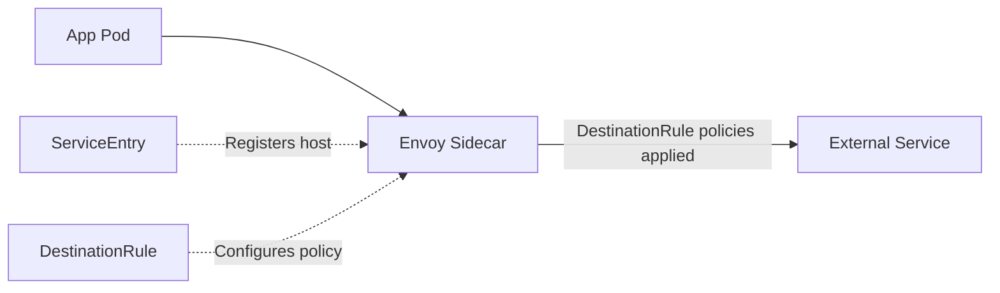

# How to Configure DestinationRule for External Services

Author: [nawazdhandala](https://github.com/nawazdhandala)

Tags: Istio, DestinationRule, External Services, ServiceEntry, Kubernetes

Description: Configure Istio DestinationRule for external services to manage TLS, connection pools, and traffic policies for outbound traffic.

---

When your mesh services need to talk to external APIs, databases, or third-party services, Istio can still manage that traffic. By combining a ServiceEntry (to register the external host with the mesh) and a DestinationRule (to configure traffic policies), you get the same connection management, TLS origination, and circuit breaking for external services that you get for internal ones.

This is particularly useful for controlling how your applications connect to services like Stripe, Twilio, AWS, or any external API. You can enforce TLS, limit connections, and set up outlier detection even though the service is outside your cluster.

## The ServiceEntry + DestinationRule Pattern

External services need two resources:

1. **ServiceEntry**: Tells Istio about the external service (hostname, ports, protocol)
2. **DestinationRule**: Configures traffic policies for connections to that service



## Basic External Service Configuration

Here is how to configure access to an external HTTPS API:

```yaml
apiVersion: networking.istio.io/v1
kind: ServiceEntry
metadata:
  name: stripe-api
spec:
  hosts:
  - api.stripe.com
  ports:
  - number: 443
    name: https
    protocol: HTTPS
  resolution: DNS
  location: MESH_EXTERNAL
---
apiVersion: networking.istio.io/v1
kind: DestinationRule
metadata:
  name: stripe-api-dr
spec:
  host: api.stripe.com
  trafficPolicy:
    tls:
      mode: SIMPLE
    connectionPool:
      tcp:
        maxConnections: 50
        connectTimeout: 5s
      http:
        http1MaxPendingRequests: 20
```

The ServiceEntry registers `api.stripe.com` with the mesh. The DestinationRule applies TLS (SIMPLE mode - client verifies server cert) and limits connections to 50 with a 5-second connect timeout.

## TLS Origination for External Services

A common pattern is TLS origination - your application sends plain HTTP to the sidecar, and the sidecar upgrades it to HTTPS before sending to the external service. This simplifies your application code because it does not need to handle TLS.

```yaml
apiVersion: networking.istio.io/v1
kind: ServiceEntry
metadata:
  name: external-api
spec:
  hosts:
  - api.example.com
  ports:
  - number: 80
    name: http-port
    protocol: HTTP
    targetPort: 443
  - number: 443
    name: https-port
    protocol: HTTPS
  resolution: DNS
  location: MESH_EXTERNAL
---
apiVersion: networking.istio.io/v1
kind: DestinationRule
metadata:
  name: external-api-tls
spec:
  host: api.example.com
  trafficPolicy:
    portLevelSettings:
    - port:
        number: 80
      tls:
        mode: SIMPLE
```

Now your application can call `http://api.example.com:80` and Envoy will:
1. Intercept the plain HTTP request
2. Upgrade the connection to TLS (port 443 on the target)
3. Forward the encrypted request to api.example.com

## Connection Pooling for External Services

External services often have rate limits. You can use connection pool settings to stay within those limits:

```yaml
apiVersion: networking.istio.io/v1
kind: DestinationRule
metadata:
  name: rate-limited-api
spec:
  host: api.rate-limited-service.com
  trafficPolicy:
    connectionPool:
      tcp:
        maxConnections: 10
        connectTimeout: 5s
      http:
        http1MaxPendingRequests: 5
        http2MaxRequests: 20
        maxRequestsPerConnection: 5
```

By limiting to 10 connections and 20 concurrent requests, you reduce the chance of hitting rate limits. If your application tries to send more, the excess requests get queued or rejected at the proxy level rather than being sent to the external service (which might respond with 429 errors or block your IP).

## Circuit Breaking for External Services

External services can fail for reasons outside your control. Circuit breaking prevents your application from piling up requests to a failing external service:

```yaml
apiVersion: networking.istio.io/v1
kind: DestinationRule
metadata:
  name: payment-provider
spec:
  host: payments.provider.com
  trafficPolicy:
    connectionPool:
      tcp:
        maxConnections: 30
        connectTimeout: 5s
      http:
        http1MaxPendingRequests: 10
    outlierDetection:
      consecutive5xxErrors: 3
      consecutiveGatewayErrors: 2
      interval: 10s
      baseEjectionTime: 60s
      maxEjectionPercent: 100
```

Note that `maxEjectionPercent: 100` is acceptable here because there is only one external host. If it is down, ejecting it and fast-failing is better than sending requests into a black hole.

## External Database Configuration

For external databases (like a managed PostgreSQL or MySQL), you can manage connection limits:

```yaml
apiVersion: networking.istio.io/v1
kind: ServiceEntry
metadata:
  name: external-postgres
spec:
  hosts:
  - my-db.us-east-1.rds.amazonaws.com
  ports:
  - number: 5432
    name: tcp-postgres
    protocol: TCP
  resolution: DNS
  location: MESH_EXTERNAL
---
apiVersion: networking.istio.io/v1
kind: DestinationRule
metadata:
  name: external-postgres-dr
spec:
  host: my-db.us-east-1.rds.amazonaws.com
  trafficPolicy:
    connectionPool:
      tcp:
        maxConnections: 100
        connectTimeout: 10s
        tcpKeepalive:
          time: 300s
          interval: 60s
          probes: 3
```

This limits database connections to 100 per Envoy proxy, sets a 10-second connect timeout, and enables TCP keepalive to prevent idle connections from being dropped by intermediate firewalls.

## mTLS with External Services

Some external services require client certificate authentication:

```yaml
apiVersion: networking.istio.io/v1
kind: DestinationRule
metadata:
  name: partner-api-mtls
spec:
  host: api.partner.com
  trafficPolicy:
    tls:
      mode: MUTUAL
      clientCertificate: /etc/certs/client.pem
      privateKey: /etc/certs/client-key.pem
      caCertificates: /etc/certs/partner-ca.pem
```

You need to mount the certificate files into the sidecar container using pod annotations or volume mounts.

## Multiple External Endpoints

For services with multiple IP addresses (CDNs, large APIs), DNS resolution handles endpoint discovery:

```yaml
apiVersion: networking.istio.io/v1
kind: ServiceEntry
metadata:
  name: cdn-service
spec:
  hosts:
  - cdn.example.com
  ports:
  - number: 443
    name: https
    protocol: HTTPS
  resolution: DNS
  location: MESH_EXTERNAL
---
apiVersion: networking.istio.io/v1
kind: DestinationRule
metadata:
  name: cdn-dr
spec:
  host: cdn.example.com
  trafficPolicy:
    loadBalancer:
      simple: ROUND_ROBIN
    tls:
      mode: SIMPLE
```

When `cdn.example.com` resolves to multiple IPs, Envoy load balances across them using the configured algorithm.

## Verifying External Service Configuration

Check that the ServiceEntry and DestinationRule are properly applied:

```bash
istioctl proxy-config cluster <pod-name> --fqdn api.stripe.com -o json
```

You should see a cluster entry for the external service with your configured policies.

Check endpoints:

```bash
istioctl proxy-config endpoint <pod-name> --cluster "outbound|443||api.stripe.com"
```

This shows the resolved IP addresses for the external service.

Test connectivity:

```bash
kubectl exec <pod-name> -c app -- curl -v https://api.stripe.com/
```

## Cleanup

```bash
kubectl delete destinationrule stripe-api-dr
kubectl delete serviceentry stripe-api
```

Configuring DestinationRules for external services gives you the same traffic management capabilities that you have for internal services. Connection pooling prevents overwhelming external APIs, TLS origination simplifies application code, and circuit breaking protects your application when external dependencies fail. Always pair your ServiceEntries with DestinationRules to get the most out of Istio's external traffic management.
