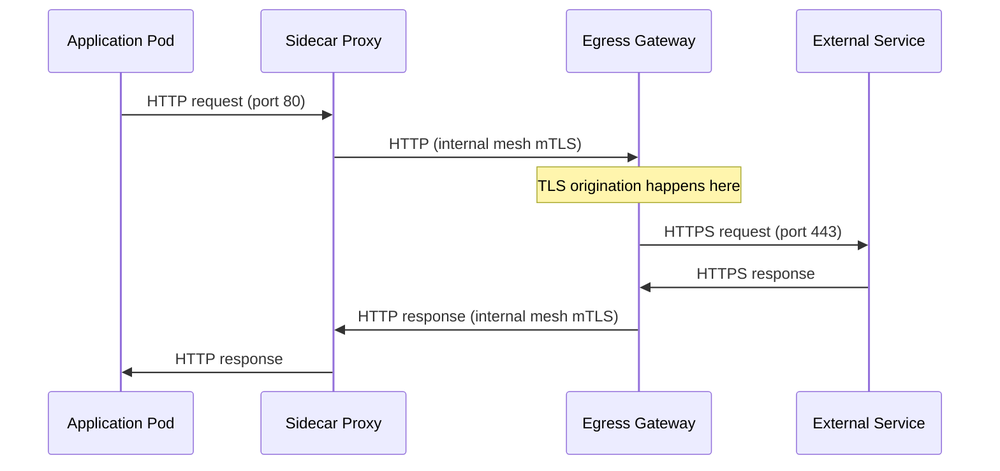

# How to Configure Egress Gateway with TLS Origination

Author: [nawazdhandala](https://github.com/nawazdhandala)

Tags: Istio, Egress Gateway, TLS Origination, Service Mesh, Security

Description: How to combine an Istio Egress Gateway with TLS origination so internal HTTP traffic is encrypted before it exits the mesh to external services.

---

Combining an egress gateway with TLS origination gives you the best of both worlds: centralized egress traffic control and automatic encryption of outbound connections. Your application sends plain HTTP, the sidecar routes it to the egress gateway, and the egress gateway upgrades the connection to HTTPS before reaching the external service.

This pattern is common in enterprise environments where you need auditable egress points and want to simplify application code by removing TLS handling from the app layer.

## The Traffic Flow

Here is what happens when a pod makes an HTTP request to an external service with this configuration:



The connection between the sidecar and the egress gateway uses Istio's internal mTLS. The egress gateway then originates a new TLS connection to the external service. This means traffic is encrypted at every hop.

## Step 1: Register the External Service

Create a ServiceEntry with both HTTP and HTTPS ports. The HTTP port is for internal mesh routing, and the HTTPS port is for the actual external connection:

```yaml
apiVersion: networking.istio.io/v1
kind: ServiceEntry
metadata:
  name: external-api
  namespace: default
spec:
  hosts:
  - "api.external.com"
  ports:
  - number: 80
    name: http
    protocol: HTTP
  - number: 443
    name: tls
    protocol: TLS
  resolution: DNS
  location: MESH_EXTERNAL
```

## Step 2: Create the Egress Gateway

Define a Gateway resource that the egress gateway will use to accept HTTP traffic:

```yaml
apiVersion: networking.istio.io/v1
kind: Gateway
metadata:
  name: egress-gateway
  namespace: istio-system
spec:
  selector:
    istio: egressgateway
  servers:
  - port:
      number: 80
      name: http
      protocol: HTTP
    hosts:
    - "api.external.com"
```

Note that this Gateway listens on HTTP (port 80), not HTTPS. The egress gateway receives plain HTTP from sidecars and then originates TLS outbound.

## Step 3: Create the VirtualService

The VirtualService needs two routing rules. The first routes traffic from mesh sidecars to the egress gateway. The second routes traffic from the egress gateway to the external service, redirecting it to port 443:

```yaml
apiVersion: networking.istio.io/v1
kind: VirtualService
metadata:
  name: external-api-via-egress
  namespace: default
spec:
  hosts:
  - "api.external.com"
  gateways:
  - istio-system/egress-gateway
  - mesh
  http:
  - match:
    - gateways:
      - mesh
      port: 80
    route:
    - destination:
        host: istio-egressgateway.istio-system.svc.cluster.local
        port:
          number: 80
  - match:
    - gateways:
      - istio-system/egress-gateway
      port: 80
    route:
    - destination:
        host: api.external.com
        port:
          number: 443
```

The second rule redirects traffic arriving at the egress gateway on port 80 to the external service on port 443. The DestinationRule (next step) tells the egress gateway to use TLS for this connection.

## Step 4: Create the DestinationRule for TLS Origination

This is where TLS origination actually gets configured:

```yaml
apiVersion: networking.istio.io/v1
kind: DestinationRule
metadata:
  name: external-api-tls
  namespace: default
spec:
  host: api.external.com
  trafficPolicy:
    portLevelSettings:
    - port:
        number: 443
      tls:
        mode: SIMPLE
        sni: api.external.com
```

The `mode: SIMPLE` means standard one-way TLS. The `sni` field is needed so the external server knows which certificate to present.

## Step 5: Secure the Internal Hop

To ensure the connection between sidecars and the egress gateway uses Istio's mutual TLS, add a DestinationRule for the egress gateway itself:

```yaml
apiVersion: networking.istio.io/v1
kind: DestinationRule
metadata:
  name: egress-gateway-mtls
  namespace: default
spec:
  host: istio-egressgateway.istio-system.svc.cluster.local
  trafficPolicy:
    portLevelSettings:
    - port:
        number: 80
      tls:
        mode: ISTIO_MUTUAL
```

This is important for security. Without it, the HTTP traffic between the sidecar and egress gateway might not be encrypted (depending on your mesh-wide mTLS settings).

## Testing the Configuration

From a pod inside the mesh, send a plain HTTP request:

```bash
kubectl exec deploy/sleep -- curl -s http://api.external.com/status
```

Your app sends HTTP on port 80. The sidecar routes it to the egress gateway. The egress gateway originates TLS and connects to the external service on port 443.

Verify it is working by checking the egress gateway logs:

```bash
kubectl logs -n istio-system deploy/istio-egressgateway --tail=10
```

You should see log entries showing outbound connections to `api.external.com:443`.

## Mutual TLS Origination at the Egress Gateway

Some external services require client certificates (mutual TLS). You can configure this at the egress gateway:

```yaml
apiVersion: networking.istio.io/v1
kind: DestinationRule
metadata:
  name: external-api-mtls
spec:
  host: api.external.com
  trafficPolicy:
    portLevelSettings:
    - port:
        number: 443
      tls:
        mode: MUTUAL
        clientCertificate: /etc/certs/client.pem
        privateKey: /etc/certs/client-key.pem
        caCertificates: /etc/certs/ca.pem
        sni: api.external.com
```

Mount the certificates into the egress gateway pod using secrets:

```yaml
apiVersion: install.istio.io/v1alpha1
kind: IstioOperator
spec:
  components:
    egressGateways:
    - name: istio-egressgateway
      enabled: true
      k8s:
        overlays:
        - kind: Deployment
          name: istio-egressgateway
          patches:
          - path: spec.template.spec.containers[0].volumeMounts[-]
            value:
              name: client-certs
              mountPath: /etc/certs
              readOnly: true
          - path: spec.template.spec.volumes[-]
            value:
              name: client-certs
              secret:
                secretName: egress-client-certs
```

Create the secret:

```bash
kubectl create secret generic egress-client-certs \
  --from-file=client.pem=client-cert.pem \
  --from-file=client-key.pem=client-key.pem \
  --from-file=ca.pem=ca-cert.pem \
  -n istio-system
```

## Multiple External Services

You can route multiple external services through the same egress gateway with TLS origination. Each service needs its own set of resources:

```yaml
apiVersion: networking.istio.io/v1
kind: ServiceEntry
metadata:
  name: stripe-and-sendgrid
spec:
  hosts:
  - "api.stripe.com"
  - "api.sendgrid.com"
  ports:
  - number: 80
    name: http
    protocol: HTTP
  - number: 443
    name: tls
    protocol: TLS
  resolution: DNS
  location: MESH_EXTERNAL
```

Then create separate DestinationRules for each host's TLS settings, since they might use different certificates or TLS versions.

## Verifying TLS is Actually Being Used

To confirm the egress gateway is originating TLS and not sending plain HTTP:

```bash
# Check the egress gateway's cluster configuration
istioctl proxy-config clusters deploy/istio-egressgateway -n istio-system | grep api.external.com

# Check the endpoint details
istioctl proxy-config endpoints deploy/istio-egressgateway -n istio-system \
  --cluster "outbound|443||api.external.com"

# Check TLS context
istioctl proxy-config clusters deploy/istio-egressgateway -n istio-system \
  --fqdn api.external.com -o json | grep -A10 transportSocket
```

The output should show TLS settings applied to the outbound cluster.

## Common Problems

**Application sends HTTPS directly.** If your app already sends HTTPS, the sidecar sees it as opaque TLS and passes it through. It won't go through the HTTP routing rules. You need to change the app to send HTTP for TLS origination to work.

**502 errors from the egress gateway.** Usually means the egress gateway cannot reach the external service. Check DNS resolution and network connectivity from the egress gateway pod.

**Certificate validation failures.** If the external service uses a private CA, you need to provide the CA certificate in the DestinationRule's `caCertificates` field.

**Missing DestinationRule for the egress gateway.** Without the ISTIO_MUTUAL DestinationRule for the egress gateway service, traffic might not route correctly between the sidecar and the egress gateway.

## Summary

Combining an egress gateway with TLS origination provides centralized egress control with automatic encryption. The key components are: a ServiceEntry with HTTP and HTTPS ports, a Gateway on the egress gateway listening on HTTP, a VirtualService with dual routing rules, and DestinationRules for both the egress gateway (ISTIO_MUTUAL) and the external service (SIMPLE or MUTUAL TLS). This setup keeps your application code simple while ensuring all outbound traffic is encrypted and auditable.
