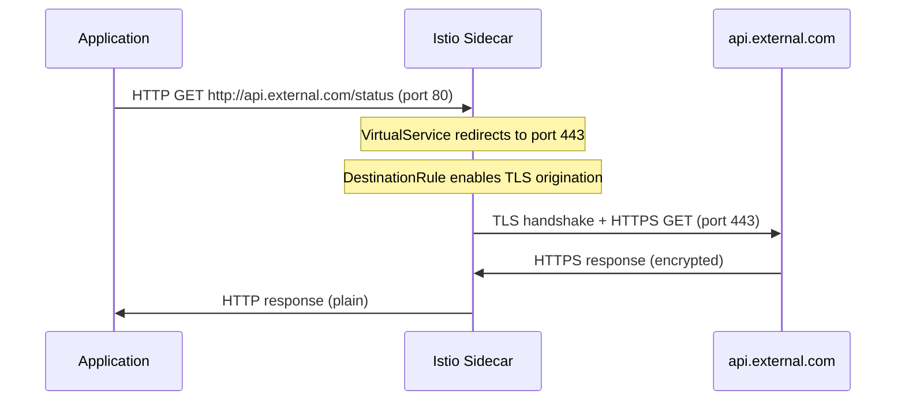

# How to Configure Egress TLS Origination in Istio

Author: [nawazdhandala](https://github.com/nawazdhandala)

Tags: Istio, Egress, TLS Origination, ServiceEntry, Security

Description: How to configure TLS origination for egress traffic in Istio so your applications can send plain HTTP while the sidecar proxy handles TLS encryption.

---

TLS origination is when the Istio sidecar proxy upgrades an outbound HTTP connection to HTTPS before it leaves the mesh. Your application code sends plain HTTP to an external service, and the sidecar transparently wraps it in TLS. This is useful when you want your application to be simpler (no TLS libraries or certificate management) while still encrypting traffic on the wire.

This guide shows how to set up egress TLS origination for external services using ServiceEntry, VirtualService, and DestinationRule.

## Why Use TLS Origination

There are a few practical reasons to use TLS origination at the sidecar:

- **Simpler application code.** Your app sends HTTP to port 80. The sidecar handles the TLS handshake, certificate validation, and encryption. This means fewer dependencies in your application.
- **Centralized certificate management.** Instead of each application managing its own CA bundles and TLS settings, the mesh handles it.
- **Better observability.** When the application sends plain HTTP, the sidecar can inspect the request (headers, path, method) and generate detailed metrics and traces. With end-to-end TLS from the application, the sidecar only sees opaque TCP bytes.
- **Consistent security policy.** You can enforce minimum TLS versions and cipher suites at the mesh level.

## Basic TLS Origination Setup

Say your application needs to call `https://api.external.com`. Instead of configuring TLS in the application, you configure the sidecar to originate TLS.

### Step 1: Create a ServiceEntry

Register the external service with both HTTP and HTTPS ports:

```yaml
apiVersion: networking.istio.io/v1
kind: ServiceEntry
metadata:
  name: external-api
  namespace: default
spec:
  hosts:
  - "api.external.com"
  ports:
  - number: 80
    name: http
    protocol: HTTP
  - number: 443
    name: https
    protocol: TLS
  resolution: DNS
  location: MESH_EXTERNAL
```

The HTTP port (80) is what your application connects to. The HTTPS port (443) is what the sidecar will use for the actual connection to the external service.

### Step 2: Create a VirtualService

Redirect HTTP traffic to the HTTPS port:

```yaml
apiVersion: networking.istio.io/v1
kind: VirtualService
metadata:
  name: external-api-tls
  namespace: default
spec:
  hosts:
  - "api.external.com"
  http:
  - match:
    - port: 80
    route:
    - destination:
        host: api.external.com
        port:
          number: 443
```

### Step 3: Create a DestinationRule

Tell the sidecar to originate TLS when connecting to port 443:

```yaml
apiVersion: networking.istio.io/v1
kind: DestinationRule
metadata:
  name: external-api-tls
  namespace: default
spec:
  host: api.external.com
  trafficPolicy:
    portLevelSettings:
    - port:
        number: 443
      tls:
        mode: SIMPLE
        sni: api.external.com
```

The `mode: SIMPLE` means standard TLS (not mutual TLS). The `sni` field sets the Server Name Indication, which the external server uses to present the right certificate.

### Step 4: Test It

From your application pod, send plain HTTP:

```bash
kubectl exec deploy/sleep -- curl -s http://api.external.com/status
```

The request goes to the sidecar as HTTP on port 80, the sidecar routes it to port 443 with TLS, and the external service responds. Your application never deals with TLS.

## How the Traffic Flow Works



## TLS Origination with Custom CA Certificates

If the external service uses a certificate signed by a private CA (common for internal services behind a corporate CA), you need to provide the CA certificate:

```yaml
apiVersion: networking.istio.io/v1
kind: DestinationRule
metadata:
  name: private-api-tls
spec:
  host: api.private.corp
  trafficPolicy:
    portLevelSettings:
    - port:
        number: 443
      tls:
        mode: SIMPLE
        caCertificates: /etc/certs/custom-ca.pem
        sni: api.private.corp
```

Mount the CA certificate into the sidecar using a volume:

```yaml
apiVersion: apps/v1
kind: Deployment
metadata:
  name: my-app
spec:
  template:
    metadata:
      annotations:
        sidecar.istio.io/userVolume: '[{"name":"custom-ca","secret":{"secretName":"custom-ca-cert"}}]'
        sidecar.istio.io/userVolumeMount: '[{"name":"custom-ca","mountPath":"/etc/certs","readOnly":true}]'
    spec:
      containers:
      - name: my-app
        image: my-app:latest
```

Create the secret with the CA certificate:

```bash
kubectl create secret generic custom-ca-cert --from-file=custom-ca.pem=ca.crt
```

## Mutual TLS Origination

Some external services require client certificates (mTLS). Configure the DestinationRule with client credentials:

```yaml
apiVersion: networking.istio.io/v1
kind: DestinationRule
metadata:
  name: mtls-external
spec:
  host: api.partner.com
  trafficPolicy:
    portLevelSettings:
    - port:
        number: 443
      tls:
        mode: MUTUAL
        clientCertificate: /etc/certs/client.pem
        privateKey: /etc/certs/client-key.pem
        caCertificates: /etc/certs/ca.pem
        sni: api.partner.com
```

Mount the client certificate, key, and CA certificate into the sidecar proxy the same way as described above.

## Multiple External Services

You can set up TLS origination for multiple services. Each one gets its own set of resources:

```yaml
apiVersion: networking.istio.io/v1
kind: ServiceEntry
metadata:
  name: external-services
spec:
  hosts:
  - "api.stripe.com"
  - "api.sendgrid.com"
  - "hooks.slack.com"
  ports:
  - number: 80
    name: http
    protocol: HTTP
  - number: 443
    name: https
    protocol: TLS
  resolution: DNS
  location: MESH_EXTERNAL
---
apiVersion: networking.istio.io/v1
kind: VirtualService
metadata:
  name: tls-origination
spec:
  hosts:
  - "api.stripe.com"
  - "api.sendgrid.com"
  - "hooks.slack.com"
  http:
  - match:
    - port: 80
    route:
    - destination:
        host: api.stripe.com
        port:
          number: 443
      weight: 100
---
apiVersion: networking.istio.io/v1
kind: DestinationRule
metadata:
  name: tls-origination
spec:
  host: "api.stripe.com"
  trafficPolicy:
    portLevelSettings:
    - port:
        number: 443
      tls:
        mode: SIMPLE
```

Note: Each host in the VirtualService needs its own routing rule. The example above only routes `api.stripe.com`. You would need separate VirtualService entries for each host, or separate VirtualService resources.

## Verifying TLS Origination

Check that the sidecar is originating TLS:

```bash
# Check the cluster configuration
istioctl proxy-config clusters deploy/sleep | grep api.external.com

# Check the endpoint
istioctl proxy-config endpoints deploy/sleep --cluster "outbound|443||api.external.com"

# Check the route
istioctl proxy-config routes deploy/sleep --name "80" -o json
```

Check the sidecar logs for the outbound TLS connection:

```bash
kubectl logs deploy/sleep -c istio-proxy | grep api.external.com
```

## Common Issues

**Application still sends HTTPS.** If your application code is hardcoded to use HTTPS, the sidecar sees it as opaque TLS traffic and passes it through without TLS origination. You need to change the application to send HTTP for TLS origination to work.

**SNI mismatch.** If the `sni` field in the DestinationRule does not match the hostname the external server expects, the TLS handshake will fail.

**Certificate validation failures.** The sidecar validates the external server's certificate against the system CA bundle. If the server uses a certificate from an untrusted CA, add the CA certificate using `caCertificates`.

**Port conflict.** Make sure your ServiceEntry's HTTP port (80) does not conflict with other ServiceEntries or Kubernetes services on the same port for the same host.

## Summary

TLS origination in Istio lets your applications send plain HTTP while the sidecar proxy handles TLS encryption to external services. The setup requires three resources: a ServiceEntry with both HTTP and HTTPS ports, a VirtualService to redirect HTTP to HTTPS, and a DestinationRule to enable TLS. This gives you simpler application code, better observability (since the sidecar can inspect HTTP traffic), and centralized TLS management across your mesh.
