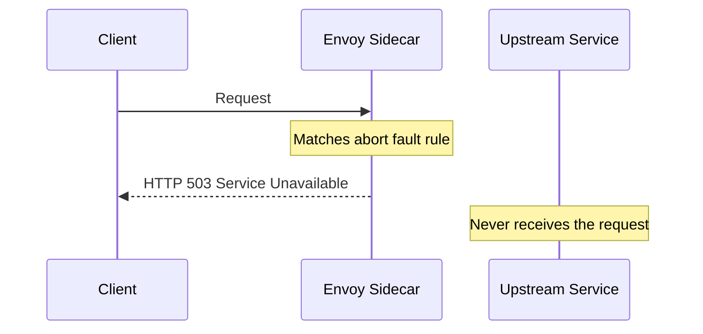

# How to Configure Fault Injection with HTTP Aborts in Istio

Author: [nawazdhandala](https://github.com/nawazdhandala)

Tags: Istio, Fault Injection, HTTP Abort, Resilience, VirtualService

Description: How to configure HTTP abort fault injection in Istio to simulate service failures and test your application error handling logic.

---

Delay injection tests how your services handle slow responses. Abort injection tests how they handle failures. When an upstream service returns a 500 error, a 503, or a 429 rate limit response, does your application handle it gracefully? Or does it crash, show a blank page, or cascade the failure to other services?

Istio's HTTP abort fault injection lets you simulate these failures by having the sidecar proxy return error responses without even forwarding the request to the upstream service. This post shows you how to set it up.

## How Abort Injection Works

When you configure an abort fault in a VirtualService, the sidecar proxy intercepts matching requests and immediately returns the specified HTTP status code. The request never reaches the upstream service.



This is different from delay injection, where the request eventually reaches the service. With abort injection, the upstream is completely bypassed for the affected requests.

## Basic Abort Injection

Here's a VirtualService that returns a 503 error on all requests:

```yaml
apiVersion: networking.istio.io/v1beta1
kind: VirtualService
metadata:
  name: payment-service
  namespace: production
spec:
  hosts:
    - payment-service
  http:
    - fault:
        abort:
          httpStatus: 503
          percentage:
            value: 100.0
      route:
        - destination:
            host: payment-service
```

Apply and test:

```bash
kubectl apply -f payment-abort.yaml

kubectl exec deploy/test-client -n production -- curl -v http://payment-service:8080/charge
```

You'll get back a 503 immediately, with a response body of `fault filter abort`.

## Percentage-Based Abort Injection

For more realistic testing, inject failures on only a percentage of requests:

```yaml
apiVersion: networking.istio.io/v1beta1
kind: VirtualService
metadata:
  name: payment-service
  namespace: production
spec:
  hosts:
    - payment-service
  http:
    - fault:
        abort:
          httpStatus: 500
          percentage:
            value: 25.0
      route:
        - destination:
            host: payment-service
```

25% of requests get a 500 error. The remaining 75% proceed normally. This simulates an intermittent failure, which is often harder for applications to handle than a complete outage.

Test it with multiple requests:

```bash
for i in $(seq 1 20); do
  kubectl exec deploy/test-client -n production -- curl -s -o /dev/null -w "%{http_code}\n" http://payment-service:8080/charge
done
```

You should see a mix of 200s and 500s, roughly in a 75/25 ratio.

## Simulating Different Error Types

Different HTTP status codes simulate different failure scenarios. Use the one that matches what you want to test:

### Service Unavailable (503)

Simulates an overloaded or down service:

```yaml
fault:
  abort:
    httpStatus: 503
    percentage:
      value: 50.0
```

### Internal Server Error (500)

Simulates application-level errors:

```yaml
fault:
  abort:
    httpStatus: 500
    percentage:
      value: 10.0
```

### Rate Limiting (429)

Simulates rate limiting from an upstream:

```yaml
fault:
  abort:
    httpStatus: 429
    percentage:
      value: 30.0
```

### Bad Gateway (502)

Simulates a proxy or load balancer error:

```yaml
fault:
  abort:
    httpStatus: 502
    percentage:
      value: 15.0
```

### Not Found (404)

Simulates a missing resource:

```yaml
fault:
  abort:
    httpStatus: 404
    percentage:
      value: 5.0
```

## Targeting Aborts to Specific Routes

Inject aborts only on specific paths:

```yaml
apiVersion: networking.istio.io/v1beta1
kind: VirtualService
metadata:
  name: payment-service
  namespace: production
spec:
  hosts:
    - payment-service
  http:
    - match:
        - uri:
            prefix: /api/refund
      fault:
        abort:
          httpStatus: 503
          percentage:
            value: 50.0
      route:
        - destination:
            host: payment-service
    - route:
        - destination:
            host: payment-service
```

Only the refund endpoint gets failure injection. The charge endpoint and everything else works normally.

## Targeting Aborts by Header

Use headers to control which requests get aborted. This is the safest approach for testing in shared environments:

```yaml
apiVersion: networking.istio.io/v1beta1
kind: VirtualService
metadata:
  name: payment-service
  namespace: production
spec:
  hosts:
    - payment-service
  http:
    - match:
        - headers:
            x-test-abort:
              exact: "true"
      fault:
        abort:
          httpStatus: 503
          percentage:
            value: 100.0
      route:
        - destination:
            host: payment-service
    - route:
        - destination:
            host: payment-service
```

Only requests with the `x-test-abort: true` header trigger the abort:

```bash
# This gets a 503
curl -H "x-test-abort: true" http://payment-service:8080/charge

# This works normally
curl http://payment-service:8080/charge
```

## Combining Abort and Delay Injection

You can inject both delays and aborts in the same VirtualService to test compound failure scenarios:

```yaml
apiVersion: networking.istio.io/v1beta1
kind: VirtualService
metadata:
  name: payment-service
  namespace: production
spec:
  hosts:
    - payment-service
  http:
    - fault:
        delay:
          fixedDelay: 3s
          percentage:
            value: 20.0
        abort:
          httpStatus: 503
          percentage:
            value: 10.0
      route:
        - destination:
            host: payment-service
```

With this configuration, for each request:

- 10% of requests get an immediate 503 abort
- 20% of the remaining requests get a 3-second delay
- The rest proceed normally

This creates a realistic degradation scenario where some requests are slow and some fail entirely.

## Monitoring Abort Impact

Watch the error rates in your monitoring when running abort tests:

```bash
# Check proxy access logs for error codes
kubectl logs deploy/test-client -c istio-proxy -n production | grep "payment-service" | grep -c " 503 "

# Watch Istio metrics
kubectl exec -n istio-system deploy/prometheus -- curl -s 'localhost:9090/api/v1/query?query=sum(rate(istio_requests_total{destination_service="payment-service.production.svc.cluster.local",response_code="503"}[1m]))' | jq '.data.result'
```

If your application has proper error handling, you should see:

- The calling service catching 503 errors and either retrying or returning a degraded response
- No cascading failures to other services
- Error rates in monitoring matching your configured percentage

If you see cascading failures or unexpected behavior, you've found a resilience gap to fix.

## What the Response Looks Like

When Istio injects an abort, the response includes specific headers and a body that indicate it came from fault injection:

```
HTTP/1.1 503 Service Unavailable
content-length: 18
content-type: text/plain

fault filter abort
```

The `fault filter abort` body is Envoy's default response for injected faults. Your application's error handling should not depend on the exact body content, since real 503 errors from the upstream would have different content.

## Cleaning Up Abort Injection

Remove the fault injection when testing is complete:

```bash
# Option 1: Delete the VirtualService
kubectl delete virtualservice payment-service -n production

# Option 2: Apply a clean version
kubectl apply -f - <<EOF
apiVersion: networking.istio.io/v1beta1
kind: VirtualService
metadata:
  name: payment-service
  namespace: production
spec:
  hosts:
    - payment-service
  http:
    - route:
        - destination:
            host: payment-service
EOF
```

## Practical Advice

Some lessons from real abort injection testing:

1. Start with header-based targeting and 100% abort rate to verify your test setup
2. Graduate to percentage-based injection without header matching for more realistic testing
3. Test each error code separately to understand how your application handles different failure modes
4. Pay special attention to 429 (rate limit) handling - many applications don't handle this well
5. Check that your alerting fires when abort injection is active - if it doesn't, your alerts need work
6. Run abort tests regularly, not just once - new code can introduce regressions in error handling

Abort injection is the quickest way to validate that your application handles failures properly. It takes minutes to set up and can reveal critical resilience gaps before they become production incidents.
