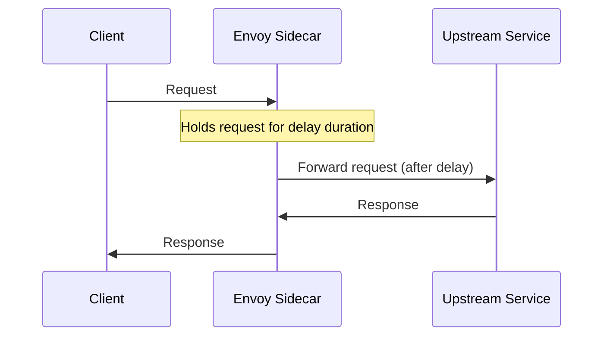

# How to Configure Fault Injection with HTTP Delays in Istio

Author: [nawazdhandala](https://github.com/nawazdhandala)

Tags: Istio, Fault Injection, Resilience Testing, VirtualService, Traffic Management

Description: Step-by-step guide to configuring HTTP delay fault injection in Istio to test how your services handle slow upstream dependencies.

---

Your application might work perfectly when every service responds in milliseconds. But what happens when a database takes 5 seconds to respond? Or when an API gateway starts adding 2 seconds of latency? If you haven't tested for these scenarios, you're going to find out in production - and that's never a good time.

Istio's fault injection feature lets you deliberately inject delays into service-to-service communication. You can simulate slow responses without modifying any application code, and you can target specific routes, users, or percentages of traffic.

## How Delay Injection Works

When you configure a delay fault in Istio, the sidecar proxy holds the request for the specified duration before forwarding it to the upstream service. The upstream service still processes the request normally - the delay is purely on the proxy side.



This is important to understand: the delay adds to whatever the upstream service's actual response time is. If you inject a 3-second delay and the service takes 500ms to respond, the client sees 3.5 seconds total.

## Basic Delay Injection

Here's a simple VirtualService that adds a 5-second delay to all requests:

```yaml
apiVersion: networking.istio.io/v1beta1
kind: VirtualService
metadata:
  name: product-api
  namespace: production
spec:
  hosts:
    - product-api
  http:
    - fault:
        delay:
          fixedDelay: 5s
          percentage:
            value: 100.0
      route:
        - destination:
            host: product-api
```

Apply it:

```bash
kubectl apply -f product-api-delay.yaml
```

Now every request to the product-api service experiences a 5-second delay. Test it:

```bash
time kubectl exec deploy/test-client -n production -- curl -s http://product-api:8080/products
```

You should see the response take at least 5 seconds.

## Partial Delay Injection

Injecting delays on 100% of traffic is useful for controlled testing, but for more realistic scenarios, you want to affect only a percentage:

```yaml
apiVersion: networking.istio.io/v1beta1
kind: VirtualService
metadata:
  name: product-api
  namespace: production
spec:
  hosts:
    - product-api
  http:
    - fault:
        delay:
          fixedDelay: 3s
          percentage:
            value: 10.0
      route:
        - destination:
            host: product-api
```

This adds a 3-second delay to 10% of requests. The other 90% pass through normally. This simulates a partially degraded upstream - the kind of failure that's hardest to detect and handle.

## Delay Injection on Specific Routes

You can target delays to specific routes using match conditions:

```yaml
apiVersion: networking.istio.io/v1beta1
kind: VirtualService
metadata:
  name: product-api
  namespace: production
spec:
  hosts:
    - product-api
  http:
    - match:
        - uri:
            prefix: /api/search
      fault:
        delay:
          fixedDelay: 2s
          percentage:
            value: 50.0
      route:
        - destination:
            host: product-api
    - route:
        - destination:
            host: product-api
```

Only requests to `/api/search` get the delay. Requests to other paths are unaffected. This lets you simulate a specific operation being slow without disrupting the entire service.

## Delay Injection for Specific Headers

Target delays based on request headers. This is useful for testing specific users or request types:

```yaml
apiVersion: networking.istio.io/v1beta1
kind: VirtualService
metadata:
  name: product-api
  namespace: production
spec:
  hosts:
    - product-api
  http:
    - match:
        - headers:
            x-test-delay:
              exact: "true"
      fault:
        delay:
          fixedDelay: 5s
          percentage:
            value: 100.0
      route:
        - destination:
            host: product-api
    - route:
        - destination:
            host: product-api
```

Only requests with `x-test-delay: true` get the delay. Normal traffic is unaffected. This is a safe way to test delays in a shared environment:

```bash
# This request gets delayed
curl -H "x-test-delay: true" http://product-api:8080/products

# This request is normal
curl http://product-api:8080/products
```

## Different Delay Durations for Different Scenarios

You might want to test different levels of degradation. Use multiple match rules:

```yaml
apiVersion: networking.istio.io/v1beta1
kind: VirtualService
metadata:
  name: product-api
  namespace: production
spec:
  hosts:
    - product-api
  http:
    - match:
        - headers:
            x-delay-level:
              exact: "high"
      fault:
        delay:
          fixedDelay: 10s
          percentage:
            value: 100.0
      route:
        - destination:
            host: product-api
    - match:
        - headers:
            x-delay-level:
              exact: "medium"
      fault:
        delay:
          fixedDelay: 3s
          percentage:
            value: 100.0
      route:
        - destination:
            host: product-api
    - match:
        - headers:
            x-delay-level:
              exact: "low"
      fault:
        delay:
          fixedDelay: 500ms
          percentage:
            value: 100.0
      route:
        - destination:
            host: product-api
    - route:
        - destination:
            host: product-api
```

## Observing Delay Impact

When you inject delays, you should see the effects in your monitoring:

```bash
# Watch response times in proxy access logs
kubectl logs deploy/test-client -c istio-proxy -n production -f

# Check latency histograms in Prometheus
# istio_request_duration_milliseconds_bucket
```

The access logs show the duration field, which includes the injected delay:

```text
"duration": "5023"  # 5 seconds of injected delay + 23ms actual processing
```

If your application has its own timeout set lower than the injected delay, you'll see timeout errors. That's actually what you want to test - does your application handle timeouts gracefully?

## Combining Delays with Timeouts

A powerful testing pattern is combining fault injection delays with Istio timeouts to verify that timeout configuration works correctly:

```yaml
apiVersion: networking.istio.io/v1beta1
kind: VirtualService
metadata:
  name: product-api
  namespace: production
spec:
  hosts:
    - product-api
  http:
    - fault:
        delay:
          fixedDelay: 10s
          percentage:
            value: 100.0
      timeout: 3s
      route:
        - destination:
            host: product-api
```

With this configuration, every request gets a 10-second delay injected, but the timeout is set to 3 seconds. The request should time out after 3 seconds with a 504 Gateway Timeout. If it doesn't, something is wrong with your timeout configuration.

## Cleaning Up

When you're done testing, remove the fault injection by either deleting the VirtualService or updating it to remove the fault block:

```yaml
apiVersion: networking.istio.io/v1beta1
kind: VirtualService
metadata:
  name: product-api
  namespace: production
spec:
  hosts:
    - product-api
  http:
    - route:
        - destination:
            host: product-api
```

```bash
kubectl apply -f product-api-clean.yaml
```

Or delete the VirtualService entirely to go back to default routing:

```bash
kubectl delete virtualservice product-api -n production
```

## Tips for Production Delay Testing

1. Always start with header-based targeting so you can control which requests get delayed
2. Use low percentages (1-5%) if testing against live traffic
3. Have your monitoring dashboard open to watch the impact in real time
4. Set up alerts for elevated error rates before running tests
5. Keep the test window short - inject delays, observe, then clean up
6. Document what you learned from each test

Delay injection is one of the simplest forms of fault injection, but it reveals a lot about your system's resilience. Services that don't handle slow dependencies well tend to cascade failures across the entire system. Better to find that out on your terms than during an incident.
