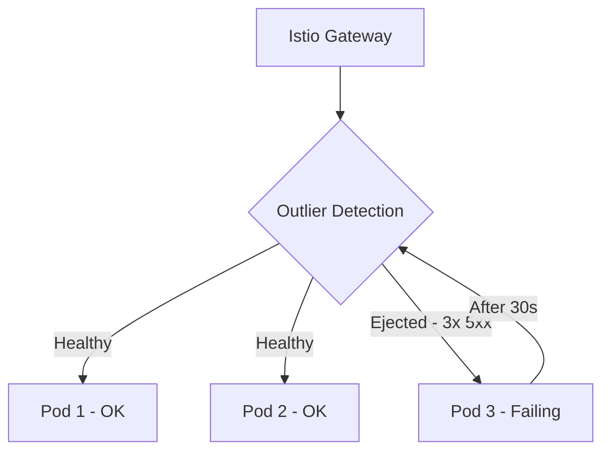

# How to Configure Health Checks on Istio Gateway

Author: [nawazdhandala](https://github.com/nawazdhandala)

Tags: Istio, Health Check, Gateway, Kubernetes, Monitoring

Description: How to configure health checks on an Istio Ingress Gateway for load balancer integration and backend service health monitoring.

---

Health checks on the Istio Gateway operate at two levels. First, the gateway itself needs to report its health to upstream load balancers so unhealthy gateway pods get removed from rotation. Second, the gateway needs to know if backend services are healthy so it does not send traffic to failing pods. Getting both levels right is key for a reliable setup.

## Gateway Pod Health Checks

The Istio ingress gateway pod has a built-in health check endpoint on port 15021:

```bash
# Check the health status
curl http://<GATEWAY_POD_IP>:15021/healthz/ready
```

This endpoint returns 200 when the Envoy proxy in the gateway pod is ready to accept traffic. The default Kubernetes deployment for the ingress gateway already has this configured:

```yaml
readinessProbe:
  httpGet:
    path: /healthz/ready
    port: 15021
  initialDelaySeconds: 1
  periodSeconds: 2
  failureThreshold: 30
livenessProbe:
  httpGet:
    path: /healthz/ready
    port: 15021
  initialDelaySeconds: 1
  periodSeconds: 2
  failureThreshold: 30
```

You can verify the probe configuration:

```bash
kubectl get deploy istio-ingressgateway -n istio-system -o jsonpath='{.spec.template.spec.containers[0].readinessProbe}' | python3 -m json.tool
```

## Load Balancer Health Checks

Cloud load balancers need to know which gateway pods are healthy. The Istio ingress gateway Service exposes port 15021 for this purpose:

```bash
kubectl get svc istio-ingressgateway -n istio-system -o jsonpath='{.spec.ports}' | python3 -m json.tool
```

You should see a port entry like:

```json
{
  "name": "status-port",
  "port": 15021,
  "targetPort": 15021,
  "protocol": "TCP"
}
```

### AWS Load Balancer Health Check

For AWS Network Load Balancer, configure the health check path:

```yaml
apiVersion: v1
kind: Service
metadata:
  name: istio-ingressgateway
  namespace: istio-system
  annotations:
    service.beta.kubernetes.io/aws-load-balancer-healthcheck-path: /healthz/ready
    service.beta.kubernetes.io/aws-load-balancer-healthcheck-port: "15021"
    service.beta.kubernetes.io/aws-load-balancer-healthcheck-protocol: http
```

### GCP Load Balancer Health Check

For GCP, the health check is usually configured automatically. If you need to customize it:

```yaml
apiVersion: v1
kind: Service
metadata:
  name: istio-ingressgateway
  namespace: istio-system
  annotations:
    cloud.google.com/backend-config: '{"default": "istio-hc-config"}'
```

## Backend Health Checking with DestinationRules

To configure how the gateway checks backend service health, use DestinationRules with outlier detection:

```yaml
apiVersion: networking.istio.io/v1
kind: DestinationRule
metadata:
  name: backend-health
spec:
  host: my-service
  trafficPolicy:
    outlierDetection:
      consecutive5xxErrors: 3
      interval: 10s
      baseEjectionTime: 30s
      maxEjectionPercent: 50
```

This configuration:
- Ejects a backend pod after 3 consecutive 5xx errors
- Checks every 10 seconds
- Ejects the pod for at least 30 seconds
- Never ejects more than 50% of pods (to maintain some capacity)



## Active Health Checking with EnvoyFilter

Envoy supports active health checking where the proxy periodically sends requests to check backend health. This is not natively exposed in Istio's API, so you use an EnvoyFilter:

```yaml
apiVersion: networking.istio.io/v1alpha3
kind: EnvoyFilter
metadata:
  name: active-health-check
  namespace: istio-system
spec:
  workloadSelector:
    labels:
      istio: ingressgateway
  configPatches:
  - applyTo: CLUSTER
    match:
      context: GATEWAY
      cluster:
        service: my-service.default.svc.cluster.local
    patch:
      operation: MERGE
      value:
        health_checks:
        - timeout: 5s
          interval: 10s
          unhealthy_threshold: 3
          healthy_threshold: 2
          http_health_check:
            path: /health
            host: my-service.default.svc.cluster.local
```

This sends a GET request to `/health` on each backend pod every 10 seconds. After 3 consecutive failures, the pod is marked unhealthy. After 2 consecutive successes, it is marked healthy again.

## Configuring Health Check Endpoints in Your Services

Your backend services should expose a health check endpoint. A common pattern:

```yaml
apiVersion: apps/v1
kind: Deployment
metadata:
  name: my-service
spec:
  template:
    spec:
      containers:
      - name: app
        ports:
        - containerPort: 8080
        readinessProbe:
          httpGet:
            path: /health
            port: 8080
          initialDelaySeconds: 5
          periodSeconds: 10
        livenessProbe:
          httpGet:
            path: /health
            port: 8080
          initialDelaySeconds: 15
          periodSeconds: 20
```

The Kubernetes readiness probe controls whether the pod gets added to the Service endpoints. If the pod is not ready, Istio will not route traffic to it.

## Health Check via VirtualService

You can expose a health check endpoint on the gateway itself for external monitoring tools:

```yaml
apiVersion: networking.istio.io/v1
kind: VirtualService
metadata:
  name: gateway-health
spec:
  hosts:
  - "health.example.com"
  gateways:
  - my-gateway
  http:
  - match:
    - uri:
        exact: /health
    directResponse:
      status: 200
      body:
        string: "OK"
```

Wait, `directResponse` is available in Istio 1.18+. For older versions, route to a dedicated health check service:

```yaml
apiVersion: networking.istio.io/v1
kind: VirtualService
metadata:
  name: gateway-health
spec:
  hosts:
  - "health.example.com"
  gateways:
  - my-gateway
  http:
  - match:
    - uri:
        exact: /health
    route:
    - destination:
        host: health-check-service
        port:
          number: 8080
```

## Monitoring Gateway Health

Set up monitoring for the gateway health:

```bash
# Check gateway pod health
kubectl get pods -n istio-system -l istio=ingressgateway

# Check gateway readiness
kubectl exec -n istio-system deploy/istio-ingressgateway -- curl -s localhost:15021/healthz/ready

# Check backend endpoint health
kubectl get endpoints my-service

# View outlier detection stats
istioctl proxy-config endpoint deploy/istio-ingressgateway -n istio-system | grep my-service
```

The endpoint output shows health status flags:

- `HEALTHY` - Pod is receiving traffic
- `UNHEALTHY` - Pod failed health checks
- `DRAINING` - Pod is being removed gracefully

## Circuit Breaking

Combine health checks with circuit breaking for comprehensive resilience:

```yaml
apiVersion: networking.istio.io/v1
kind: DestinationRule
metadata:
  name: circuit-breaker
spec:
  host: my-service
  trafficPolicy:
    connectionPool:
      tcp:
        maxConnections: 100
      http:
        h2UpgradePolicy: DEFAULT
        http1MaxPendingRequests: 100
        http2MaxRequests: 1000
    outlierDetection:
      consecutive5xxErrors: 5
      interval: 30s
      baseEjectionTime: 60s
      maxEjectionPercent: 30
```

The connection pool limits prevent overwhelming a failing service, while outlier detection removes failing pods from the load balancing pool.

## Troubleshooting Health Check Issues

**Load balancer marks all targets unhealthy**

Check that port 15021 is reachable from the load balancer:

```bash
kubectl port-forward -n istio-system svc/istio-ingressgateway 15021:15021
curl http://localhost:15021/healthz/ready
```

**Backend pods keep getting ejected**

Check the outlier detection settings. If they are too aggressive, healthy pods might get ejected during normal traffic spikes:

```bash
istioctl proxy-config endpoint deploy/istio-ingressgateway -n istio-system --cluster "outbound|8080||my-service.default.svc.cluster.local"
```

**Health check endpoint not responding through the gateway**

Make sure the health check endpoint is included in the VirtualService routing rules. If only `/api/*` is routed and the health check is at `/health`, it will not work.

Health checks at the Istio Gateway level are essential for production reliability. The combination of Kubernetes readiness probes, Istio's outlier detection, and load balancer health checks creates multiple layers of protection that keep unhealthy components out of the traffic path automatically.
