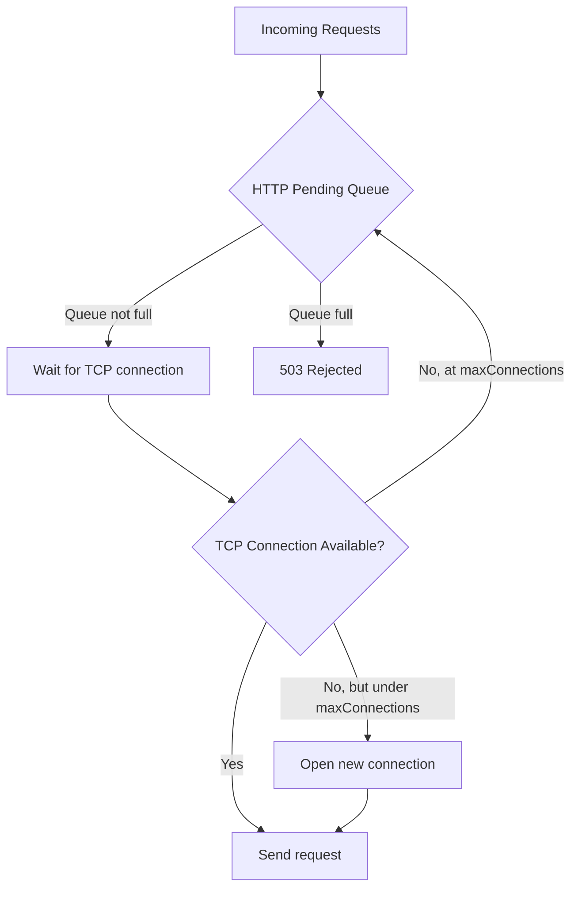

# How to Configure HTTP Connection Pool Settings in Istio

Author: [nawazdhandala](https://github.com/nawazdhandala)

Tags: Istio, HTTP, Connection Pool, DestinationRule, Traffic Management

Description: Configure HTTP connection pool settings in Istio DestinationRule to control request queuing, concurrency limits, and connection reuse.

---

While TCP connection pool settings control the underlying transport, HTTP connection pool settings control how requests flow over those connections. These settings determine how many requests can be queued, how many concurrent requests are allowed, and how connections are reused. Getting these right is critical for preventing your services from being overwhelmed during traffic spikes.

## HTTP vs TCP Connection Pools

Think of it in layers. TCP connections are the pipes. HTTP requests flow through those pipes. With HTTP/1.1, each pipe carries one request at a time. With HTTP/2, each pipe can carry many requests simultaneously.

TCP settings answer: "How many pipes?"
HTTP settings answer: "How much water can flow through the pipes?"



## All HTTP Connection Pool Fields

Here is the full set of HTTP connection pool options:

```yaml
apiVersion: networking.istio.io/v1
kind: DestinationRule
metadata:
  name: my-service-http
spec:
  host: my-service
  trafficPolicy:
    connectionPool:
      http:
        http1MaxPendingRequests: 100
        http2MaxRequests: 1000
        maxRequestsPerConnection: 50
        maxRetries: 3
        h2UpgradePolicy: DEFAULT
        idleTimeout: 3600s
```

Let me walk through each one.

## http1MaxPendingRequests

This is the maximum number of HTTP/1.1 requests that can wait in a queue when all connections are busy. If there are no available connections and this queue is full, new requests immediately get a 503 response.

```yaml
connectionPool:
  http:
    http1MaxPendingRequests: 100
```

The default is 2^32 (essentially unlimited), which means without setting this, requests will queue indefinitely. That sounds safe but can actually be worse - a huge queue means requests wait so long that they time out at the client anyway, and your service is wasting resources on requests nobody is waiting for anymore.

A good practice is to set this based on how much queueing latency is acceptable. If your p99 latency target is 500ms and each request takes about 50ms, a queue of 10 per connection is reasonable.

## http2MaxRequests

For HTTP/2 connections, this limits the total number of concurrent requests (across all connections to the service):

```yaml
connectionPool:
  http:
    http2MaxRequests: 500
```

HTTP/2 multiplexes many requests over a single connection, so this is not about connections but about total request concurrency. If you have 500 concurrent requests in flight and a 501st comes in, it either queues (if `http1MaxPendingRequests` allows) or gets rejected.

The default is 2^32 (unlimited). Set it based on what your service can actually handle concurrently.

## maxRequestsPerConnection

This controls how many requests are sent over a single TCP connection before it is closed:

```yaml
connectionPool:
  http:
    maxRequestsPerConnection: 100
```

Why would you want to close connections? Two reasons:

1. **Load balancing**: With long-lived connections, all requests on that connection go to the same pod. By cycling connections, you give the load balancer a chance to pick a different pod.

2. **Memory leaks**: Some services slowly leak memory per connection. Cycling connections prevents any single connection from accumulating too much state.

Setting this to 0 (the default) means unlimited - connections are reused forever.

## maxRetries

This limits the total number of concurrent outstanding retries to all endpoints of a service:

```yaml
connectionPool:
  http:
    maxRetries: 10
```

This is not the number of retry attempts per request (that is configured in VirtualService). This is the maximum number of in-flight retry requests at any given moment across all original requests. It prevents retry storms where a failing service gets even more traffic from retries.

The default is 2^32 (unlimited), which means retries can pile up without limit. For a service with 100 client pods each retrying 3 times, you could get 300 concurrent retry requests hitting a service that is already struggling.

## h2UpgradePolicy

Controls whether HTTP/1.1 connections should be upgraded to HTTP/2:

```yaml
connectionPool:
  http:
    h2UpgradePolicy: DEFAULT
```

Options:
- `DEFAULT` - Follow the global mesh setting
- `DO_NOT_UPGRADE` - Keep HTTP/1.1
- `UPGRADE` - Upgrade to HTTP/2

Use `DO_NOT_UPGRADE` if your service does not support HTTP/2 or if you have seen issues with HTTP/2 multiplexing.

## idleTimeout

How long an idle connection stays open:

```yaml
connectionPool:
  http:
    idleTimeout: 300s
```

After a connection has been idle for this duration, Envoy closes it. This frees up resources on both the client and server side. Setting this too low means connections churn more. Setting it too high means idle connections waste resources.

## A Complete Production Configuration

Here is what a well-tuned HTTP connection pool looks like for a typical API service handling moderate traffic:

```yaml
apiVersion: networking.istio.io/v1
kind: DestinationRule
metadata:
  name: api-production
spec:
  host: api-service
  trafficPolicy:
    connectionPool:
      tcp:
        maxConnections: 200
        connectTimeout: 3s
      http:
        http1MaxPendingRequests: 50
        http2MaxRequests: 500
        maxRequestsPerConnection: 100
        maxRetries: 10
```

And here is the reasoning behind each number:

- **200 TCP connections**: The service has 10 pods, each can handle about 50 concurrent connections, so 200 gives headroom without overwhelming any single pod.
- **50 pending requests**: With 200 connections and 50ms average response time, 50 pending requests means about 250ms of queue time, which is acceptable.
- **500 HTTP/2 requests**: The total concurrent request capacity across all pods.
- **100 requests per connection**: Cycle connections often enough to get good load distribution.
- **10 retries**: Allow retries but cap them to prevent amplification.

## Testing HTTP Pool Limits

Use fortio to test what happens when limits are exceeded:

```bash
kubectl run fortio --image=fortio/fortio --rm -it -- \
  load -c 100 -qps 0 -t 30s http://api-service:8080/
```

With `http1MaxPendingRequests: 50` and `maxConnections: 200`, sending 100 concurrent connections should work fine. But crank it up:

```bash
kubectl run fortio --image=fortio/fortio --rm -it -- \
  load -c 500 -qps 0 -t 30s http://api-service:8080/
```

At 500 concurrent connections, you should start seeing 503 errors once the connection pool and pending queue are exhausted.

## Monitoring HTTP Pool Metrics

Check Envoy stats for HTTP pool overflow:

```bash
kubectl exec <pod> -c istio-proxy -- curl -s localhost:15000/stats | grep pending
```

Look for:
- `upstream_rq_pending_total` - Total requests that entered the pending queue
- `upstream_rq_pending_overflow` - Requests rejected because the pending queue was full
- `upstream_rq_pending_active` - Currently pending requests
- `upstream_rq_retry_overflow` - Retries rejected because maxRetries was reached

## Cleanup

```bash
kubectl delete destinationrule api-production
```

HTTP connection pool settings give you granular control over request flow to your services. The key is finding the balance between protecting your service from overload and not being so restrictive that normal traffic gets rejected. Monitor the overflow counters after deploying, and adjust your limits based on actual traffic patterns.
