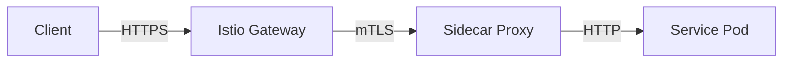
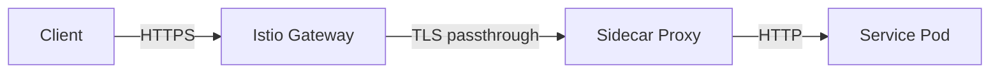

# How to Configure Ingress Sidecar TLS Termination in Istio

Author: [nawazdhandala](https://github.com/nawazdhandala)

Tags: Istio, TLS Termination, Sidecar, Ingress, Kubernetes, Security

Description: Configure TLS termination at the Istio sidecar proxy level instead of the ingress gateway for fine-grained encryption control per service.

---

Most Istio setups terminate TLS at the ingress gateway. Traffic arrives encrypted, the gateway decrypts it, and then it flows through the mesh as plaintext (or encrypted with Istio's mutual TLS between sidecars). But there are situations where you want TLS termination to happen at the sidecar proxy right next to your application pod, not at the gateway.

This is useful when you need different certificates for different services, when you want to maintain the original TLS connection as deep into the mesh as possible, or when you are migrating from a non-mesh setup where services already have their own TLS certificates.

## Why Terminate TLS at the Sidecar?

There are several reasons you might want this:

1. **Service-specific certificates:** Each service presents its own certificate to callers
2. **Compliance requirements:** Some regulations require end-to-end TLS from the gateway to the service
3. **Migration path:** Your services already have TLS and you want to keep it while adding them to the mesh
4. **Non-HTTP protocols:** Some protocols expect TLS on the connection to the service itself

## Architecture Comparison

**Standard approach (gateway termination):**



**Sidecar TLS termination:**



In the sidecar approach, the gateway passes the encrypted traffic through, and the sidecar handles TLS termination using the service's own certificate.

## Setting Up Sidecar TLS Termination

### Step 1: Create the Service Certificate Secret

Create a Kubernetes secret with the service's TLS certificate:

```bash
kubectl create secret tls api-service-tls \
  --cert=api-service-cert.pem \
  --key=api-service-key.pem \
  -n default
```

### Step 2: Configure the Gateway for Passthrough

Set the gateway to passthrough mode so it forwards the TLS connection to the sidecar:

```yaml
apiVersion: networking.istio.io/v1
kind: Gateway
metadata:
  name: passthrough-gateway
spec:
  selector:
    istio: ingressgateway
  servers:
    - port:
        number: 443
        name: tls
        protocol: TLS
      tls:
        mode: PASSTHROUGH
      hosts:
        - "api.myapp.com"
```

### Step 3: Create a VirtualService to Route to the Service

```yaml
apiVersion: networking.istio.io/v1
kind: VirtualService
metadata:
  name: api-service-passthrough
spec:
  hosts:
    - "api.myapp.com"
  gateways:
    - passthrough-gateway
  tls:
    - match:
        - port: 443
          sniHosts:
            - "api.myapp.com"
      route:
        - destination:
            host: api-service
            port:
              number: 8443
```

### Step 4: Configure the Sidecar to Terminate TLS

Now you need to tell the sidecar proxy to terminate TLS. You do this with a Sidecar resource and an EnvoyFilter, or by configuring the service to handle TLS directly.

The simpler approach is to have your application handle TLS:

```yaml
apiVersion: apps/v1
kind: Deployment
metadata:
  name: api-service
spec:
  replicas: 3
  selector:
    matchLabels:
      app: api-service
  template:
    metadata:
      labels:
        app: api-service
    spec:
      containers:
        - name: api-service
          image: myregistry/api-service:1.0.0
          ports:
            - containerPort: 8443
          env:
            - name: TLS_CERT_PATH
              value: /etc/tls/tls.crt
            - name: TLS_KEY_PATH
              value: /etc/tls/tls.key
          volumeMounts:
            - name: tls-certs
              mountPath: /etc/tls
              readOnly: true
      volumes:
        - name: tls-certs
          secret:
            secretName: api-service-tls
```

### Step 5: Configure the Service Port

Name the port correctly so Istio knows it is TLS:

```yaml
apiVersion: v1
kind: Service
metadata:
  name: api-service
spec:
  selector:
    app: api-service
  ports:
    - port: 8443
      targetPort: 8443
      name: tls-api
```

The `tls-` prefix tells Istio that this port carries TLS traffic and should not be intercepted for protocol detection.

## Alternative: Using DestinationRule for Originating TLS

If your backend does not handle TLS itself but you want the sidecar to initiate TLS to it (the opposite direction), you can use a DestinationRule:

```yaml
apiVersion: networking.istio.io/v1
kind: DestinationRule
metadata:
  name: external-db
spec:
  host: external-database.example.com
  trafficPolicy:
    tls:
      mode: SIMPLE
      caCertificates: /etc/certs/ca.pem
```

This configures the calling sidecar to use TLS when connecting to the destination, even if the original request within the mesh was plaintext.

## Per-Port TLS Configuration

You can configure different TLS settings for different ports on the same service using a DestinationRule:

```yaml
apiVersion: networking.istio.io/v1
kind: DestinationRule
metadata:
  name: api-service
spec:
  host: api-service
  trafficPolicy:
    portLevelSettings:
      - port:
          number: 8443
        tls:
          mode: SIMPLE
      - port:
          number: 8080
        tls:
          mode: ISTIO_MUTUAL
```

Port 8443 uses standard TLS, while port 8080 uses Istio's automatic mutual TLS.

## Combining with Istio mTLS

Istio's automatic mTLS works alongside your custom TLS configuration. By default, Istio enables mTLS between sidecars. If you want to disable Istio's mTLS for specific services that handle their own TLS:

```yaml
apiVersion: security.istio.io/v1
kind: PeerAuthentication
metadata:
  name: api-service-auth
  namespace: default
spec:
  selector:
    matchLabels:
      app: api-service
  mtls:
    mode: DISABLE
  portLevelMtls:
    8443:
      mode: DISABLE
```

This tells Istio not to add its own mTLS on port 8443, which would double-encrypt the traffic.

## Using EnvoyFilter for Advanced TLS at the Sidecar

For more advanced scenarios where you need the sidecar itself (not the application) to terminate TLS, you can use an EnvoyFilter:

```yaml
apiVersion: networking.istio.io/v1alpha3
kind: EnvoyFilter
metadata:
  name: api-service-tls-termination
  namespace: default
spec:
  workloadSelector:
    labels:
      app: api-service
  configPatches:
    - applyTo: FILTER_CHAIN
      match:
        context: SIDECAR_INBOUND
        listener:
          portNumber: 8443
      patch:
        operation: MERGE
        value:
          transportSocket:
            name: envoy.transport_sockets.tls
            typedConfig:
              "@type": type.googleapis.com/envoy.extensions.transport_sockets.tls.v3.DownstreamTlsContext
              commonTlsContext:
                tlsCertificateSdsSecretConfigs:
                  - name: api-service-tls
                    sdsConfig:
                      apiConfigSource:
                        apiType: GRPC
                        grpcServices:
                          - envoyGrpc:
                              clusterName: sds-grpc
```

This is a more complex setup and should only be used when the simpler approaches do not meet your needs.

## Verifying TLS at the Sidecar

Check that the connection from the gateway reaches the sidecar encrypted:

```bash
# From a test pod
kubectl exec -it test-pod -- curl -v --resolve api.myapp.com:8443:$SERVICE_IP https://api.myapp.com:8443/health
```

Inspect the sidecar's listener configuration:

```bash
istioctl proxy-config listener <api-service-pod> --port 8443 -o json
```

Check that the sidecar sees the TLS configuration:

```bash
istioctl proxy-config secret <api-service-pod>
```

## Troubleshooting

**Connection refused at the sidecar:**

The sidecar might be intercepting the connection before it reaches your app. Check the sidecar's iptables rules:

```bash
kubectl exec -it <api-service-pod> -c istio-proxy -- pilot-agent request GET server_info
```

**Double TLS encryption:**

If both Istio mTLS and your custom TLS are active, connections will fail. Disable Istio mTLS for the specific port using PeerAuthentication.

**Certificate not found:**

Make sure the secret is in the same namespace as the pod (for application-level TLS) or in `istio-system` (for gateway-level TLS).

Sidecar TLS termination gives you fine-grained control over where encryption happens in your service mesh. It adds complexity compared to gateway-only termination, but for services with specific certificate requirements or compliance needs, it is the right approach.
