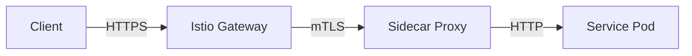
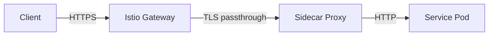

# How to Configure Ingress Sidecar TLS Termination in Istio

Author: [nawazdhandala](https://github.com/nawazdhandala)

Tags: Istio, TLS Termination, Sidecar, Ingresses, Kubernetes, Security

Description: Configure TLS termination at the Istio sidecar proxy level instead of the ingress gateway for fine-grained encryption control per service.

---

Most Istio setups terminate TLS at the ingress gateway. Traffic arrives encrypted, the gateway decrypts it, and then it flows through the mesh as plaintext (or encrypted with Istio's mutual TLS between sidecars). But there are situations where you want TLS termination to happen at the sidecar proxy right next to your application pod, not at the gateway.

This is useful when you need different certificates for different services, when you want to maintain the original TLS connection as deep into the mesh as possible, or when you are migrating from a non-mesh setup where services already have their own TLS certificates.

## Why Terminate TLS at the Sidecar?

There are several reasons you might want this:

1. **Service-specific certificates:** Each service presents its own certificate to callers
2. **Compliance requirements:** Some regulations require end-to-end TLS from the gateway to the service
3. **Migration path:** Your services already have TLS and you want to keep it while adding them to the mesh
4. **Non-HTTP protocols:** Some protocols expect TLS on the connection to the service itself

## Architecture Comparison

**Standard approach (gateway termination):**


```mermaid
graph LR
    A[Client] -->|HTTPS| B[Istio Gateway]
    B -->|mTLS| C[Sidecar Proxy]
    C -->|HTTP| D[Service Pod]
```

**Sidecar TLS termination:**


```mermaid
graph LR
    A[Client] -->|HTTPS| B[Istio Gateway]
    B -->|TLS passthrough| C[Sidecar Proxy]
    C -->|HTTP| D[Service Pod]
```

In the sidecar approach, the gateway passes the encrypted traffic through, and the sidecar handles TLS termination using the service's own certificate.

## Setting Up Sidecar TLS Termination

Istio's sidecar ingress TLS termination is an experimental feature. Enable it when installing Istio:

```bash
istioctl install --set profile=default --set values.pilot.env.ENABLE_TLS_ON_SIDECAR_INGRESS=true
```

### Step 1: Create the Service Certificate Secret

Create a Kubernetes secret with the service's TLS certificate:

```bash
kubectl create secret tls api-service-tls \
  --cert=api-service-cert.pem \
  --key=api-service-key.pem \
  -n default
```

### Step 2: Configure the Gateway for Passthrough

Set the gateway to passthrough mode so it forwards the TLS connection to the sidecar:

```yaml
apiVersion: networking.istio.io/v1
kind: Gateway
metadata:
  name: passthrough-gateway
spec:
  selector:
    istio: ingressgateway
  servers:
    - port:
        number: 443
        name: tls
        protocol: TLS
      tls:
        mode: PASSTHROUGH
      hosts:
        - "api.myapp.com"
```

### Step 3: Create a VirtualService to Route to the Service

```yaml
apiVersion: networking.istio.io/v1
kind: VirtualService
metadata:
  name: api-service-passthrough
spec:
  hosts:
    - "api.myapp.com"
  gateways:
    - passthrough-gateway
  tls:
    - match:
        - port: 443
          sniHosts:
            - "api.myapp.com"
      route:
        - destination:
            host: api-service
            port:
              number: 8443
```

### Step 4: Configure the Sidecar to Terminate TLS

Now you need to tell the sidecar proxy to terminate TLS. First, mount the TLS secret into the `istio-proxy` sidecar. Istio does not currently support `credentialName` in sidecar ingress TLS configuration, so the certificate and key must be available as files:

```yaml
apiVersion: apps/v1
kind: Deployment
metadata:
  name: api-service
spec:
  replicas: 3
  selector:
    matchLabels:
      app: api-service
  template:
    metadata:
      labels:
        app: api-service
      annotations:
        sidecar.istio.io/userVolume: '{"tls-secret":{"secret":{"secretName":"api-service-tls","optional":true}}}'
        sidecar.istio.io/userVolumeMount: '{"tls-secret":{"mountPath":"/etc/istio/tls-certs/","readOnly":true}}'
    spec:
      containers:
        - name: api-service
          image: myregistry/api-service:1.0.0
          ports:
            - containerPort: 8080
```

Then configure the sidecar ingress listener to accept TLS on the service's target port and forward decrypted traffic to the application:

```yaml
apiVersion: networking.istio.io/v1
kind: Sidecar
metadata:
  name: api-service-ingress-tls
  namespace: default
spec:
  workloadSelector:
    labels:
      app: api-service
  ingress:
    - port:
        number: 8443
        protocol: HTTPS
        name: external
      defaultEndpoint: 127.0.0.1:8080
      tls:
        mode: SIMPLE
        privateKey: /etc/istio/tls-certs/tls.key
        serverCertificate: /etc/istio/tls-certs/tls.crt
```

### Step 5: Configure the Service Port

Name the port correctly so Istio knows it is HTTPS/TLS and sends the traffic to the sidecar ingress listener:

```yaml
apiVersion: v1
kind: Service
metadata:
  name: api-service
spec:
  selector:
    app: api-service
  ports:
    - port: 8443
      targetPort: 8443
      name: https-api
```

The `https-` or `tls-` prefix tells Istio that this port carries TLS traffic. On sidecars, Istio treats `https` and `tls` ports as encrypted data unless you explicitly configure sidecar ingress TLS termination as shown above.

## Alternative: Using DestinationRule for Originating TLS

If your backend does not handle TLS itself but you want the sidecar to initiate TLS to it (the opposite direction), you can use a DestinationRule:

```yaml
apiVersion: networking.istio.io/v1
kind: DestinationRule
metadata:
  name: external-db
spec:
  host: external-database.example.com
  trafficPolicy:
    tls:
      mode: SIMPLE
      caCertificates: /etc/certs/ca.pem
```

This configures the calling sidecar to use TLS when connecting to the destination, even if the original request within the mesh was plaintext.

## Per-Port TLS Configuration

You can configure different TLS settings for different ports on the same service using a DestinationRule:

```yaml
apiVersion: networking.istio.io/v1
kind: DestinationRule
metadata:
  name: api-service
spec:
  host: api-service
  trafficPolicy:
    portLevelSettings:
      - port:
          number: 8443
        tls:
          mode: SIMPLE
      - port:
          number: 8080
        tls:
          mode: ISTIO_MUTUAL
```

Port 8443 uses standard TLS, while port 8080 uses Istio's automatic mutual TLS.

## Combining with Istio mTLS

Istio's automatic mTLS works alongside your custom TLS configuration. By default, Istio sidecars automatically use mTLS when calling other workloads, while destination workloads accept both plaintext and mTLS in `PERMISSIVE` mode unless you configure stricter PeerAuthentication policies. If you require `STRICT` mTLS elsewhere and want this externally exposed port to terminate TLS at the sidecar, disable Istio mTLS for that specific workload port:

```yaml
apiVersion: security.istio.io/v1
kind: PeerAuthentication
metadata:
  name: api-service-auth
  namespace: default
spec:
  selector:
    matchLabels:
      app: api-service
  mtls:
    mode: STRICT
  portLevelMtls:
    8443:
      mode: DISABLE
```

This tells Istio not to require Istio mTLS on port 8443, where the sidecar is expecting the external TLS handshake instead.

## Using EnvoyFilter for Advanced TLS at the Sidecar

For most sidecar ingress TLS termination scenarios, prefer the `Sidecar` ingress TLS configuration above. If you need custom Envoy behavior beyond what the `Sidecar` API supports, you can use an EnvoyFilter, but the exact patch depends on the listener generated for your Istio version and workload:

```yaml
apiVersion: networking.istio.io/v1alpha3
kind: EnvoyFilter
metadata:
  name: api-service-tls-termination
  namespace: default
spec:
  workloadSelector:
    labels:
      app: api-service
  configPatches:
    - applyTo: FILTER_CHAIN
      match:
        context: SIDECAR_INBOUND
        listener:
          portNumber: 8443
      patch:
        operation: MERGE
        value:
          transportSocket:
            name: envoy.transport_sockets.tls
            typedConfig:
              "@type": type.googleapis.com/envoy.extensions.transport_sockets.tls.v3.DownstreamTlsContext
              commonTlsContext:
                tlsCertificates:
                  - certificateChain:
                      filename: /etc/istio/tls-certs/tls.crt
                    privateKey:
                      filename: /etc/istio/tls-certs/tls.key
```

This is a more complex setup and should only be used when the supported `Sidecar` TLS settings do not meet your needs. The certificate files still need to be mounted into the `istio-proxy` container.

## Verifying TLS at the Sidecar

Check that the connection from the gateway reaches the sidecar encrypted:

```bash
# From a test pod

kubectl exec -it test-pod -- curl -v --resolve api.myapp.com:8443:$SERVICE_IP https://api.myapp.com:8443/health
```

Inspect the sidecar's listener configuration:

```bash
istioctl proxy-config listener <api-service-pod> --port 8443 -o json
```

Check that the sidecar sees the TLS configuration:

```bash
istioctl proxy-config secret <api-service-pod>
```

## Troubleshooting

**Connection refused at the sidecar:**

The sidecar might be intercepting the connection before it reaches your app. Check the sidecar's iptables rules:

```bash
kubectl exec -it <api-service-pod> -c istio-proxy -- pilot-agent request GET server_info
```

**Double TLS encryption:**

If both Istio mTLS and your custom TLS are active, connections will fail. Disable Istio mTLS for the specific port using PeerAuthentication.

**Certificate not found:**

Make sure the secret is in the same namespace as the pod and mounted into the `istio-proxy` sidecar using `sidecar.istio.io/userVolume` and `sidecar.istio.io/userVolumeMount`. Gateway TLS secrets belong in the gateway workload's namespace, which is often `istio-system` for the default ingress gateway.

Sidecar TLS termination gives you fine-grained control over where encryption happens in your service mesh. It adds complexity compared to gateway-only termination, but for services with specific certificate requirements or compliance needs, it is the right approach.
