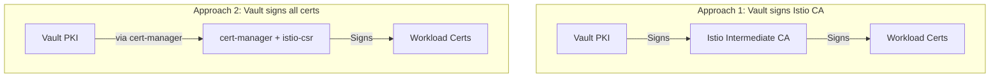

# How to Configure Istio CA with HashiCorp Vault

Author: [nawazdhandala](https://github.com/nawazdhandala)

Tags: Istio, HashiCorp Vault, Certificates, Security, PKI, Kubernetes

Description: How to integrate HashiCorp Vault as the certificate authority for Istio, using Vault's PKI secrets engine to issue workload certificates.

---

HashiCorp Vault is a popular choice for managing secrets and PKI infrastructure. If your organization already uses Vault, it makes sense to have Vault act as the certificate authority for Istio rather than running a separate CA. This integration gives you centralized certificate management, audit logging, and the ability to use Vault's policy engine to control certificate issuance.

## Architecture Overview

There are two approaches to integrating Vault with Istio:

1. **Vault as the root/intermediate CA** - Vault signs the intermediate CA certificate that Istio uses. Istio still handles the day-to-day certificate signing for workloads.

2. **Vault as the workload CA (via cert-manager)** - Every workload certificate is issued by Vault through cert-manager's istio-csr component. This gives Vault full control over every certificate.

This guide covers both approaches.



## Approach 1: Vault-Signed Intermediate CA

This is the simpler approach. Vault acts as the root CA and signs the intermediate certificate that Istio uses.

### Step 1: Set Up Vault PKI Secrets Engine

Enable the PKI secrets engine in Vault:

```bash
# Enable PKI engine for root CA
vault secrets enable -path=pki pki

# Set max TTL to 10 years
vault secrets tune -max-lease-ttl=87600h pki

# Generate root CA
vault write pki/root/generate/internal \
  common_name="MyOrg Root CA" \
  ttl=87600h \
  key_bits=4096

# Configure URLs
vault write pki/config/urls \
  issuing_certificates="https://vault.example.com:8200/v1/pki/ca" \
  crl_distribution_points="https://vault.example.com:8200/v1/pki/crl"
```

### Step 2: Create an Intermediate CA in Vault

```bash
# Enable a second PKI engine for intermediate CA
vault secrets enable -path=pki_intermediate pki

vault secrets tune -max-lease-ttl=43800h pki_intermediate

# Generate intermediate CSR
vault write -format=json pki_intermediate/intermediate/generate/internal \
  common_name="Istio Intermediate CA" \
  key_bits=4096 | jq -r '.data.csr' > istio-intermediate.csr

# Sign with root CA
vault write -format=json pki/root/sign-intermediate \
  csr=@istio-intermediate.csr \
  format=pem_bundle \
  ttl=43800h | jq -r '.data.certificate' > ca-cert.pem

# Set the signed certificate
vault write pki_intermediate/intermediate/set-signed \
  certificate=@ca-cert.pem
```

### Step 3: Export Certificates for Istio

```bash
# Get the root certificate
vault read -format=json pki/cert/ca | jq -r '.data.certificate' > root-cert.pem

# Get the intermediate CA certificate
vault read -format=json pki_intermediate/cert/ca | jq -r '.data.certificate' > ca-cert.pem

# Export the intermediate CA private key
# Note: You need to generate the key as "exported" type for this
vault write -format=json pki_intermediate/intermediate/generate/exported \
  common_name="Istio Intermediate CA" \
  key_bits=4096 | jq -r '.data.private_key' > ca-key.pem

# Build cert chain
cat ca-cert.pem root-cert.pem > cert-chain.pem
```

### Step 4: Install in Istio

```bash
kubectl create secret generic cacerts -n istio-system \
  --from-file=ca-cert.pem \
  --from-file=ca-key.pem \
  --from-file=root-cert.pem \
  --from-file=cert-chain.pem

kubectl rollout restart deployment istiod -n istio-system
```

This approach is the most straightforward. Vault provides the trust hierarchy, and Istio handles the high-volume workload certificate signing.

## Approach 2: Vault Signs All Workload Certificates

This approach uses cert-manager with its Vault issuer and istio-csr to have Vault sign every workload certificate. It gives Vault complete control and audit visibility over every certificate.

### Step 1: Configure Vault PKI Role for Workload Certs

```bash
# Create a role for signing Istio workload certificates
vault write pki_intermediate/roles/istio-workload \
  allowed_domains="svc,svc.cluster.local,istio-ca-cert-manager-istio-csr.cert-manager.svc" \
  allow_subdomains=true \
  allow_any_name=true \
  allow_bare_domains=true \
  max_ttl=72h \
  require_cn=false \
  allowed_uri_sans="spiffe://*"
```

### Step 2: Set Up Vault Auth for cert-manager

cert-manager needs to authenticate with Vault. Use Kubernetes auth:

```bash
# Enable Kubernetes auth in Vault
vault auth enable kubernetes

# Configure it with the cluster's CA and API server
vault write auth/kubernetes/config \
  kubernetes_host="https://kubernetes.default.svc:443"

# Create a policy for cert-manager
vault policy write cert-manager - <<EOF
path "pki_intermediate/sign/istio-workload" {
  capabilities = ["create", "update"]
}
path "pki_intermediate/cert/ca" {
  capabilities = ["read"]
}
path "pki/cert/ca" {
  capabilities = ["read"]
}
EOF

# Create a Kubernetes auth role
vault write auth/kubernetes/role/cert-manager \
  bound_service_account_names=cert-manager-istio-csr \
  bound_service_account_namespaces=cert-manager \
  policies=cert-manager \
  ttl=1h
```

### Step 3: Install cert-manager

```bash
kubectl apply -f https://github.com/cert-manager/cert-manager/releases/download/v1.14.0/cert-manager.yaml
kubectl wait --for=condition=Available deployment --all -n cert-manager --timeout=120s
```

### Step 4: Create Vault Issuer

```yaml
apiVersion: cert-manager.io/v1
kind: ClusterIssuer
metadata:
  name: vault-istio-issuer
spec:
  vault:
    server: https://vault.example.com:8200
    path: pki_intermediate/sign/istio-workload
    auth:
      kubernetes:
        role: cert-manager
        mountPath: /v1/auth/kubernetes
        serviceAccountRef:
          name: cert-manager-istio-csr
```

### Step 5: Install istio-csr

```bash
helm install istio-csr jetstack/cert-manager-istio-csr \
  --namespace cert-manager \
  --set "app.certmanager.issuerRef.name=vault-istio-issuer" \
  --set "app.certmanager.issuerRef.kind=ClusterIssuer" \
  --set "app.certmanager.issuerRef.group=cert-manager.io" \
  --set "app.server.clusterID=cluster.local" \
  --set "app.tls.rootCAFile=/var/run/secrets/istio-csr/ca.pem"
```

### Step 6: Install Istio Without Built-in CA

```yaml
apiVersion: install.istio.io/v1alpha1
kind: IstioOperator
spec:
  values:
    global:
      caAddress: cert-manager-istio-csr.cert-manager.svc:443
  components:
    pilot:
      k8s:
        env:
        - name: ENABLE_CA_SERVER
          value: "false"
```

## Verifying the Vault Integration

Check that certificates are being issued by Vault:

```bash
# Check cert-manager certificate requests
kubectl get certificaterequests -n cert-manager

# Check a workload certificate
istioctl proxy-config secret <pod-name> -n default -o json | \
  jq -r '.dynamicActiveSecrets[] | select(.name=="default") | .secret.tlsCertificate.certificateChain.inlineBytes' | \
  base64 -d | openssl x509 -text -noout | grep "Issuer"
```

The issuer should match your Vault intermediate CA.

Check Vault's audit log for certificate signing events:

```bash
vault audit list
# Review the audit log for pki_intermediate/sign operations
```

## Monitoring the Integration

Things to monitor:

```bash
# cert-manager logs
kubectl logs -n cert-manager deploy/cert-manager

# istio-csr logs
kubectl logs -n cert-manager deploy/cert-manager-istio-csr

# Vault audit log for PKI operations
vault audit enable file file_path=/var/log/vault-audit.log
```

Set up alerts for:
- cert-manager CertificateRequest failures
- Vault PKI role TTL approaching maximum
- Vault authentication failures from cert-manager
- Certificate issuance latency (Vault being slow affects pod startup)

## Troubleshooting

**Pods stuck in init state** - Check if istio-csr can reach Vault and authenticate:

```bash
kubectl logs -n cert-manager deploy/cert-manager-istio-csr
```

**Certificate chain validation failures** - Make sure the root CA in Vault matches what is configured in the trust bundle.

**Vault token expiry** - If using token auth instead of Kubernetes auth, the token might expire. Kubernetes auth is recommended because it handles renewal automatically.

Integrating Vault with Istio gives you enterprise-grade certificate management with centralized audit logging, policy enforcement, and key management. The extra complexity is worth it if you need the level of control and visibility that Vault provides.
