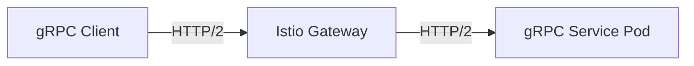

# How to Configure Istio Gateway for gRPC Services

Author: [nawazdhandala](https://github.com/nawazdhandala)

Tags: Istio, GRPC, Gateway, Kubernetes, HTTP/2

Description: How to properly configure an Istio Gateway to handle gRPC traffic including TLS setup, port naming, and routing configuration.

---

gRPC runs on top of HTTP/2, and Istio has solid support for it. But there are some specific configuration details you need to get right, or your gRPC connections will fail with cryptic errors. The biggest gotchas are port naming, protocol configuration, and TLS requirements for certain gRPC clients.

## gRPC and HTTP/2 Basics

gRPC uses HTTP/2 as its transport protocol. HTTP/2 supports multiplexing (multiple requests over a single connection), bidirectional streaming, and binary framing. This means the Istio Gateway needs to handle HTTP/2 connections properly.



One important thing: most gRPC clients expect TLS when connecting over the internet, because browsers and many gRPC libraries negotiate HTTP/2 through ALPN (Application-Layer Protocol Negotiation) during the TLS handshake.

## Port Naming for gRPC

Istio uses port names to determine the protocol. For gRPC services, name your ports starting with `grpc`:

```yaml
apiVersion: v1
kind: Service
metadata:
  name: grpc-service
spec:
  ports:
  - name: grpc
    port: 50051
    targetPort: 50051
  selector:
    app: grpc-service
```

Valid port names for gRPC:
- `grpc` - Standard gRPC
- `grpc-web` - gRPC-Web protocol
- `grpc-myservice` - gRPC with a custom suffix

If the port is not named correctly, Istio treats the traffic as TCP and you lose gRPC-specific features like retries and load balancing per request.

## gRPC Gateway with TLS (Recommended)

The most reliable setup uses TLS at the gateway, which lets HTTP/2 negotiation happen naturally via ALPN:

```yaml
apiVersion: networking.istio.io/v1
kind: Gateway
metadata:
  name: grpc-gateway
spec:
  selector:
    istio: ingressgateway
  servers:
  - port:
      number: 443
      name: https
      protocol: HTTPS
    hosts:
    - "grpc.example.com"
    tls:
      mode: SIMPLE
      credentialName: grpc-tls-credential
```

Create the TLS secret:

```bash
kubectl create secret tls grpc-tls-credential \
  --cert=grpc.example.com.crt \
  --key=grpc.example.com.key \
  -n istio-system
```

And the VirtualService:

```yaml
apiVersion: networking.istio.io/v1
kind: VirtualService
metadata:
  name: grpc-vs
spec:
  hosts:
  - "grpc.example.com"
  gateways:
  - grpc-gateway
  http:
  - route:
    - destination:
        host: grpc-service
        port:
          number: 50051
```

Even though it is gRPC, the routing rules go under `http` because gRPC is HTTP/2, and Istio handles both HTTP/1.1 and HTTP/2 under the `http` routing section.

## gRPC Without TLS (h2c)

For internal services or development, you can use plaintext HTTP/2 (h2c). This requires the protocol to be set to `HTTP2`:

```yaml
apiVersion: networking.istio.io/v1
kind: Gateway
metadata:
  name: grpc-h2c-gateway
spec:
  selector:
    istio: ingressgateway
  servers:
  - port:
      number: 80
      name: http2
      protocol: HTTP2
    hosts:
    - "grpc.example.com"
```

The `protocol: HTTP2` tells the gateway to expect HTTP/2 connections without TLS. Not all gRPC clients support h2c, so test your specific client.

## Routing to Multiple gRPC Services

Route to different gRPC services based on the gRPC service path. gRPC paths follow the pattern `/<package>.<service>/<method>`:

```yaml
apiVersion: networking.istio.io/v1
kind: VirtualService
metadata:
  name: grpc-routing
spec:
  hosts:
  - "grpc.example.com"
  gateways:
  - grpc-gateway
  http:
  - match:
    - uri:
        prefix: /mypackage.UserService
    route:
    - destination:
        host: user-grpc-service
        port:
          number: 50051
  - match:
    - uri:
        prefix: /mypackage.OrderService
    route:
    - destination:
        host: order-grpc-service
        port:
          number: 50051
  - match:
    - uri:
        prefix: /grpc.health.v1.Health
    route:
    - destination:
        host: user-grpc-service
        port:
          number: 50051
```

This routes different gRPC service calls to different backend services, all through the same gateway and hostname.

## gRPC Timeouts and Retries

Configure timeouts and retries for gRPC traffic:

```yaml
apiVersion: networking.istio.io/v1
kind: VirtualService
metadata:
  name: grpc-resilience
spec:
  hosts:
  - "grpc.example.com"
  gateways:
  - grpc-gateway
  http:
  - route:
    - destination:
        host: grpc-service
        port:
          number: 50051
    timeout: 60s
    retries:
      attempts: 3
      perTryTimeout: 20s
      retryOn: unavailable,resource-exhausted,internal
```

For gRPC, `retryOn` uses gRPC status codes instead of HTTP status codes. Common ones:
- `unavailable` - Service unavailable (gRPC code 14)
- `resource-exhausted` - Rate limiting (gRPC code 8)
- `internal` - Internal error (gRPC code 13)
- `cancelled` - Request cancelled (gRPC code 1)
- `deadline-exceeded` - Timeout (gRPC code 4)

## gRPC Streaming

Istio supports all four gRPC communication patterns:

1. Unary (single request, single response)
2. Server streaming (single request, stream of responses)
3. Client streaming (stream of requests, single response)
4. Bidirectional streaming (stream of requests and responses)

No special configuration is needed for streaming. The standard gateway and VirtualService configuration handles all patterns. Just make sure your timeouts account for long-running streams:

```yaml
apiVersion: networking.istio.io/v1
kind: VirtualService
metadata:
  name: grpc-streaming
spec:
  hosts:
  - "grpc.example.com"
  gateways:
  - grpc-gateway
  http:
  - route:
    - destination:
        host: streaming-service
        port:
          number: 50051
    timeout: 0s
```

Setting `timeout: 0s` disables the timeout entirely, which is useful for long-lived streaming connections.

## Testing gRPC Through the Gateway

Use grpcurl to test:

```bash
export GATEWAY_IP=$(kubectl -n istio-system get service istio-ingressgateway \
  -o jsonpath='{.status.loadBalancer.ingress[0].ip}')

# With TLS
grpcurl -d '{"name": "World"}' \
  -authority grpc.example.com \
  $GATEWAY_IP:443 \
  mypackage.Greeter/SayHello

# Without TLS (h2c)
grpcurl -plaintext -d '{"name": "World"}' \
  -authority grpc.example.com \
  $GATEWAY_IP:80 \
  mypackage.Greeter/SayHello
```

## gRPC-Web Support

For browser clients that cannot use native gRPC (because browsers do not support HTTP/2 trailers), you can use gRPC-Web. Envoy has a built-in gRPC-Web filter, and Istio enables it by default:

```yaml
apiVersion: networking.istio.io/v1
kind: VirtualService
metadata:
  name: grpc-web-vs
spec:
  hosts:
  - "grpc.example.com"
  gateways:
  - grpc-gateway
  http:
  - match:
    - headers:
        content-type:
          prefix: application/grpc-web
    corsPolicy:
      allowOrigins:
      - exact: "https://myapp.example.com"
      allowMethods:
      - POST
      allowHeaders:
      - content-type
      - x-grpc-web
      - x-user-agent
      maxAge: "24h"
    route:
    - destination:
        host: grpc-service
        port:
          number: 50051
```

The CORS policy is important for gRPC-Web since requests come from a browser.

## Troubleshooting gRPC Gateway Issues

**RST_STREAM errors**

Often caused by protocol mismatch. Make sure the port is named `grpc` on the backend Service and the Gateway protocol is correct.

**UNAVAILABLE errors**

Check if the backend service is healthy:

```bash
kubectl get endpoints grpc-service
grpcurl -plaintext <pod-ip>:50051 grpc.health.v1.Health/Check
```

**Deadline exceeded**

Increase the timeout in the VirtualService or check for network issues between the gateway and the backend.

**HTTP/2 negotiation failing**

If the client does not support h2c, you must use TLS. Most production gRPC clients expect TLS anyway.

```bash
# Check what protocol the gateway is using
istioctl proxy-config listener deploy/istio-ingressgateway -n istio-system --port 443 -o json
```

Getting gRPC working through an Istio Gateway mainly comes down to correct port naming, proper TLS configuration, and understanding that gRPC routing happens under the `http` section in VirtualService because gRPC is HTTP/2. Once those basics are in place, gRPC works great with Istio and you get all the service mesh benefits like observability, retries, and traffic management.
