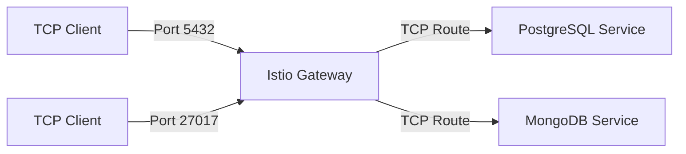

# How to Configure Istio Gateway for TCP Traffic

Author: [nawazdhandala](https://github.com/nawazdhandala)

Tags: Istio, TCP, Gateway, Kubernetes, Networking

Description: How to configure an Istio Gateway to handle raw TCP traffic for databases, message queues, and other non-HTTP services.

---

Not everything runs on HTTP. Databases, message queues, custom protocols, and plenty of other services use raw TCP connections. Istio can handle TCP traffic at the gateway level, routing it to the right backend services based on port numbers. The configuration is different from HTTP traffic since there is no path or header information to route on, but it is straightforward once you see the pattern.

## TCP vs HTTP at the Gateway

When you configure a gateway for HTTP traffic, Istio can inspect HTTP headers, paths, and methods for routing decisions. With TCP traffic, the gateway only sees raw bytes flowing over a connection. Routing decisions are limited to:

- Port number
- SNI hostname (if TLS is used)
- Source IP (with some limitations)



## Basic TCP Gateway Configuration

Here is a gateway that accepts TCP connections for a PostgreSQL database on port 5432:

```yaml
apiVersion: networking.istio.io/v1
kind: Gateway
metadata:
  name: tcp-gateway
spec:
  selector:
    istio: ingressgateway
  servers:
  - port:
      number: 5432
      name: tcp-postgres
      protocol: TCP
    hosts:
    - "*"
```

The `protocol: TCP` tells Istio to treat this as raw TCP traffic. The host is set to `*` because TCP connections do not have a Host header like HTTP does.

## Making the Port Available

The default Istio ingress gateway only exposes ports 80, 443, and 15021. To use a custom port like 5432, you need to add it to the ingress gateway Service:

```bash
kubectl edit svc istio-ingressgateway -n istio-system
```

Add the port entry:

```yaml
spec:
  ports:
  - name: tcp-postgres
    port: 5432
    targetPort: 5432
    protocol: TCP
```

Alternatively, if you installed Istio with IstioOperator, add the port in your installation configuration:

```yaml
apiVersion: install.istio.io/v1alpha1
kind: IstioOperator
spec:
  components:
    ingressGateways:
    - name: istio-ingressgateway
      enabled: true
      k8s:
        service:
          ports:
          - name: http2
            port: 80
            targetPort: 8080
          - name: https
            port: 443
            targetPort: 8443
          - name: tcp-postgres
            port: 5432
            targetPort: 5432
```

## Routing TCP Traffic with VirtualService

The VirtualService for TCP traffic uses the `tcp` section instead of `http`:

```yaml
apiVersion: networking.istio.io/v1
kind: VirtualService
metadata:
  name: postgres-vs
spec:
  hosts:
  - "*"
  gateways:
  - tcp-gateway
  tcp:
  - match:
    - port: 5432
    route:
    - destination:
        host: postgres-service
        port:
          number: 5432
```

The match is based on port number since there is no HTTP path or host to match on.

## Multiple TCP Services on Different Ports

To expose multiple TCP services, add more server entries to the Gateway and more routes to the VirtualService:

```yaml
apiVersion: networking.istio.io/v1
kind: Gateway
metadata:
  name: multi-tcp-gateway
spec:
  selector:
    istio: ingressgateway
  servers:
  - port:
      number: 5432
      name: tcp-postgres
      protocol: TCP
    hosts:
    - "*"
  - port:
      number: 27017
      name: tcp-mongo
      protocol: TCP
    hosts:
    - "*"
  - port:
      number: 6379
      name: tcp-redis
      protocol: TCP
    hosts:
    - "*"
---
apiVersion: networking.istio.io/v1
kind: VirtualService
metadata:
  name: tcp-services-vs
spec:
  hosts:
  - "*"
  gateways:
  - multi-tcp-gateway
  tcp:
  - match:
    - port: 5432
    route:
    - destination:
        host: postgres-service
        port:
          number: 5432
  - match:
    - port: 27017
    route:
    - destination:
        host: mongo-service
        port:
          number: 27017
  - match:
    - port: 6379
    route:
    - destination:
        host: redis-service
        port:
          number: 6379
```

Remember to also add all these ports to the ingress gateway Service.

## TCP with TLS

You can add TLS to TCP connections. This is useful for encrypting database connections:

```yaml
apiVersion: networking.istio.io/v1
kind: Gateway
metadata:
  name: tcp-tls-gateway
spec:
  selector:
    istio: ingressgateway
  servers:
  - port:
      number: 5432
      name: tcp-postgres-tls
      protocol: TLS
    hosts:
    - "db.example.com"
    tls:
      mode: SIMPLE
      credentialName: db-tls-credential
```

With `protocol: TLS`, the gateway terminates TLS and forwards the decrypted TCP stream to the backend. The VirtualService then uses `tls` routing:

```yaml
apiVersion: networking.istio.io/v1
kind: VirtualService
metadata:
  name: postgres-tls-vs
spec:
  hosts:
  - "db.example.com"
  gateways:
  - tcp-tls-gateway
  tls:
  - match:
    - port: 5432
      sniHosts:
      - "db.example.com"
    route:
    - destination:
        host: postgres-service
        port:
          number: 5432
```

## TCP Passthrough

For TLS passthrough with TCP services (where the backend handles TLS):

```yaml
apiVersion: networking.istio.io/v1
kind: Gateway
metadata:
  name: tcp-passthrough-gateway
spec:
  selector:
    istio: ingressgateway
  servers:
  - port:
      number: 5432
      name: tcp-postgres-passthrough
      protocol: TLS
    hosts:
    - "db.example.com"
    tls:
      mode: PASSTHROUGH
```

## TCP Traffic Shifting

You can do weighted routing for TCP traffic, similar to canary deployments:

```yaml
apiVersion: networking.istio.io/v1
kind: VirtualService
metadata:
  name: postgres-canary-vs
spec:
  hosts:
  - "*"
  gateways:
  - tcp-gateway
  tcp:
  - match:
    - port: 5432
    route:
    - destination:
        host: postgres-v1
        port:
          number: 5432
      weight: 90
    - destination:
        host: postgres-v2
        port:
          number: 5432
      weight: 10
```

This sends 90% of new TCP connections to postgres-v1 and 10% to postgres-v2. Note that this is connection-level, not request-level, since TCP does not have the concept of individual requests.

## Testing TCP Gateway

Test the TCP gateway using the appropriate client for your service:

```bash
export GATEWAY_IP=$(kubectl -n istio-system get service istio-ingressgateway \
  -o jsonpath='{.status.loadBalancer.ingress[0].ip}')

# Test PostgreSQL
psql -h $GATEWAY_IP -p 5432 -U myuser -d mydb

# Test MongoDB
mongosh "mongodb://$GATEWAY_IP:27017/mydb"

# Test Redis
redis-cli -h $GATEWAY_IP -p 6379
```

## TCP Metrics

Istio still collects metrics for TCP traffic, though they are different from HTTP metrics:

- `istio_tcp_connections_opened_total` - Total TCP connections opened
- `istio_tcp_connections_closed_total` - Total TCP connections closed
- `istio_tcp_sent_bytes_total` - Total bytes sent
- `istio_tcp_received_bytes_total` - Total bytes received

You can view these in Prometheus or Grafana if you have them set up.

## Troubleshooting TCP Gateway Issues

**Connection refused**

The port is probably not exposed on the ingress gateway Service. Check:

```bash
kubectl get svc istio-ingressgateway -n istio-system -o jsonpath='{.spec.ports[*].name}'
```

**Connection timeout**

Check if the backend service is healthy:

```bash
kubectl get endpoints postgres-service
```

**Traffic not reaching the backend**

Verify the proxy configuration:

```bash
istioctl proxy-config listener deploy/istio-ingressgateway -n istio-system --port 5432
istioctl proxy-config cluster deploy/istio-ingressgateway -n istio-system
```

TCP traffic through Istio Gateway is straightforward but requires the extra step of exposing custom ports on the ingress gateway service. Once configured, you get the same traffic management capabilities (routing, shifting, TLS) that you get with HTTP, just without the HTTP-specific features like path routing and header manipulation.
