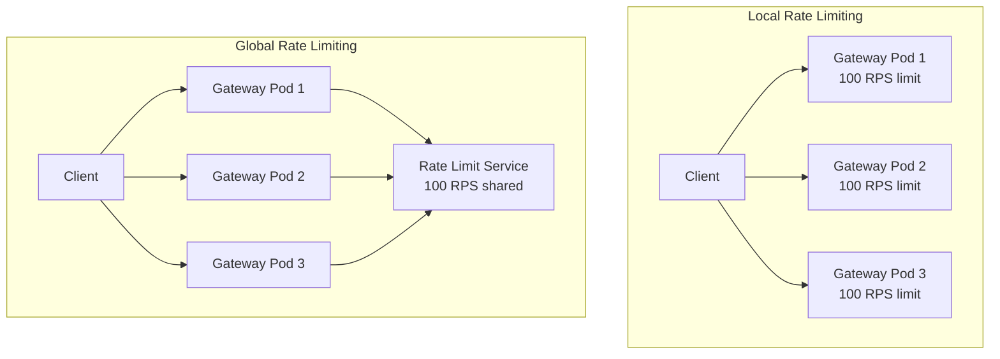

# How to Configure Istio Gateway Rate Limiting

Author: [nawazdhandala](https://github.com/nawazdhandala)

Tags: Istio, Rate Limiting, Gateway, Security, Kubernetes

Description: How to set up rate limiting on an Istio Gateway using local and global rate limiting to protect your services from traffic spikes.

---

Rate limiting at the Istio Gateway protects your backend services from being overwhelmed by too many requests. Whether you are dealing with misbehaving clients, DDoS attempts, or just want to enforce fair usage, rate limiting at the gateway is your first line of defense. Istio supports two approaches: local rate limiting (per gateway pod) and global rate limiting (across all gateway pods using an external rate limit service).

## Local vs Global Rate Limiting

**Local rate limiting** applies per gateway pod. If you have 3 gateway pods and set a limit of 100 requests per second, each pod allows 100 RPS independently, for a total of 300 RPS across the cluster.

**Global rate limiting** uses a centralized rate limit service. All gateway pods check against the same rate limit counters, so a limit of 100 RPS means 100 RPS total regardless of how many gateway pods you have.



## Local Rate Limiting with EnvoyFilter

Local rate limiting does not require any external service. It is configured directly on the Envoy proxy using an EnvoyFilter:

```yaml
apiVersion: networking.istio.io/v1alpha3
kind: EnvoyFilter
metadata:
  name: gateway-ratelimit
  namespace: istio-system
spec:
  workloadSelector:
    labels:
      istio: ingressgateway
  configPatches:
  - applyTo: HTTP_FILTER
    match:
      context: GATEWAY
      listener:
        filterChain:
          filter:
            name: envoy.filters.network.http_connection_manager
            subFilter:
              name: envoy.filters.http.router
    patch:
      operation: INSERT_BEFORE
      value:
        name: envoy.filters.http.local_ratelimit
        typed_config:
          "@type": type.googleapis.com/udpa.type.v1.TypedStruct
          type_url: type.googleapis.com/envoy.extensions.filters.http.local_ratelimit.v3.LocalRateLimit
          value:
            stat_prefix: http_local_rate_limiter
            token_bucket:
              max_tokens: 100
              tokens_per_fill: 100
              fill_interval: 60s
            filter_enabled:
              runtime_key: local_rate_limit_enabled
              default_value:
                numerator: 100
                denominator: HUNDRED
            filter_enforced:
              runtime_key: local_rate_limit_enforced
              default_value:
                numerator: 100
                denominator: HUNDRED
            response_headers_to_add:
            - append_action: OVERWRITE_IF_EXISTS_OR_ADD
              header:
                key: x-local-rate-limit
                value: "true"
```

This configuration:
- Allows 100 requests per 60-second window per gateway pod
- Adds a `x-local-rate-limit` response header when rate limiting is active
- Returns a 429 (Too Many Requests) when the limit is exceeded

## Per-Route Local Rate Limiting

To apply different rate limits to different routes, use the route-level configuration:

```yaml
apiVersion: networking.istio.io/v1alpha3
kind: EnvoyFilter
metadata:
  name: route-ratelimit
  namespace: istio-system
spec:
  workloadSelector:
    labels:
      istio: ingressgateway
  configPatches:
  - applyTo: HTTP_ROUTE
    match:
      context: GATEWAY
      routeConfiguration:
        vhost:
          name: "api.example.com:80"
          route:
            name: "api-route"
    patch:
      operation: MERGE
      value:
        typed_per_filter_config:
          envoy.filters.http.local_ratelimit:
            "@type": type.googleapis.com/udpa.type.v1.TypedStruct
            type_url: type.googleapis.com/envoy.extensions.filters.http.local_ratelimit.v3.LocalRateLimit
            value:
              stat_prefix: api_route_rate_limiter
              token_bucket:
                max_tokens: 50
                tokens_per_fill: 50
                fill_interval: 60s
              filter_enabled:
                runtime_key: local_rate_limit_enabled
                default_value:
                  numerator: 100
                  denominator: HUNDRED
              filter_enforced:
                runtime_key: local_rate_limit_enforced
                default_value:
                  numerator: 100
                  denominator: HUNDRED
```

## Global Rate Limiting Setup

Global rate limiting uses Envoy's external rate limit service. You need to deploy a rate limit service and configure the gateway to call it.

### Step 1: Deploy the Rate Limit Service

Deploy the reference rate limit service from Envoy:

```yaml
apiVersion: v1
kind: ConfigMap
metadata:
  name: ratelimit-config
  namespace: istio-system
data:
  config.yaml: |
    domain: production-gateway
    descriptors:
    - key: PATH
      rate_limit:
        unit: minute
        requests_per_unit: 100
    - key: PATH
      value: /api/expensive
      rate_limit:
        unit: minute
        requests_per_unit: 10
    - key: remote_address
      rate_limit:
        unit: minute
        requests_per_unit: 200
---
apiVersion: apps/v1
kind: Deployment
metadata:
  name: ratelimit
  namespace: istio-system
spec:
  replicas: 1
  selector:
    matchLabels:
      app: ratelimit
  template:
    metadata:
      labels:
        app: ratelimit
    spec:
      containers:
      - name: ratelimit
        image: envoyproxy/ratelimit:master
        ports:
        - containerPort: 8080
          name: http
        - containerPort: 8081
          name: grpc
        env:
        - name: USE_STATSD
          value: "false"
        - name: LOG_LEVEL
          value: debug
        - name: REDIS_SOCKET_TYPE
          value: tcp
        - name: REDIS_URL
          value: redis.istio-system.svc.cluster.local:6379
        - name: RUNTIME_ROOT
          value: /data
        - name: RUNTIME_SUBDIRECTORY
          value: ratelimit
        volumeMounts:
        - name: config
          mountPath: /data/ratelimit/config
      volumes:
      - name: config
        configMap:
          name: ratelimit-config
---
apiVersion: v1
kind: Service
metadata:
  name: ratelimit
  namespace: istio-system
spec:
  ports:
  - name: http
    port: 8080
  - name: grpc
    port: 8081
  selector:
    app: ratelimit
```

### Step 2: Deploy Redis

The rate limit service needs Redis for shared state:

```yaml
apiVersion: apps/v1
kind: Deployment
metadata:
  name: redis
  namespace: istio-system
spec:
  replicas: 1
  selector:
    matchLabels:
      app: redis
  template:
    metadata:
      labels:
        app: redis
    spec:
      containers:
      - name: redis
        image: redis:7-alpine
        ports:
        - containerPort: 6379
---
apiVersion: v1
kind: Service
metadata:
  name: redis
  namespace: istio-system
spec:
  ports:
  - port: 6379
  selector:
    app: redis
```

### Step 3: Configure the Gateway to Use the Rate Limit Service

```yaml
apiVersion: networking.istio.io/v1alpha3
kind: EnvoyFilter
metadata:
  name: global-ratelimit
  namespace: istio-system
spec:
  workloadSelector:
    labels:
      istio: ingressgateway
  configPatches:
  - applyTo: HTTP_FILTER
    match:
      context: GATEWAY
      listener:
        filterChain:
          filter:
            name: envoy.filters.network.http_connection_manager
            subFilter:
              name: envoy.filters.http.router
    patch:
      operation: INSERT_BEFORE
      value:
        name: envoy.filters.http.ratelimit
        typed_config:
          "@type": type.googleapis.com/envoy.extensions.filters.http.ratelimit.v3.RateLimit
          domain: production-gateway
          failure_mode_deny: false
          timeout: 0.25s
          rate_limit_service:
            grpc_service:
              envoy_grpc:
                cluster_name: rate_limit_cluster
            transport_api_version: V3
  - applyTo: CLUSTER
    match:
      cluster:
        service: ratelimit.istio-system.svc.cluster.local
    patch:
      operation: ADD
      value:
        name: rate_limit_cluster
        type: STRICT_DNS
        connect_timeout: 0.25s
        lb_policy: ROUND_ROBIN
        load_assignment:
          cluster_name: rate_limit_cluster
          endpoints:
          - lb_endpoints:
            - endpoint:
                address:
                  socket_address:
                    address: ratelimit.istio-system.svc.cluster.local
                    port_value: 8081
        typed_extension_protocol_options:
          envoy.extensions.upstreams.http.v3.HttpProtocolOptions:
            "@type": type.googleapis.com/envoy.extensions.upstreams.http.v3.HttpProtocolOptions
            explicit_http_config:
              http2_protocol_options: {}
```

### Step 4: Define Rate Limit Actions

Tell the gateway what information to send to the rate limit service for each request:

```yaml
apiVersion: networking.istio.io/v1alpha3
kind: EnvoyFilter
metadata:
  name: ratelimit-actions
  namespace: istio-system
spec:
  workloadSelector:
    labels:
      istio: ingressgateway
  configPatches:
  - applyTo: VIRTUAL_HOST
    match:
      context: GATEWAY
      routeConfiguration:
        vhost:
          name: "api.example.com:80"
    patch:
      operation: MERGE
      value:
        rate_limits:
        - actions:
          - request_headers:
              header_name: ":path"
              descriptor_key: PATH
        - actions:
          - remote_address: {}
```

This sends the request path and client IP to the rate limit service, which matches them against the rules defined in the ConfigMap.

## Rate Limiting by Custom Headers

You can rate limit by API key or other custom headers:

```yaml
# In the ratelimit ConfigMap
data:
  config.yaml: |
    domain: production-gateway
    descriptors:
    - key: api-key
      rate_limit:
        unit: minute
        requests_per_unit: 1000
    - key: api-key
      value: free-tier
      rate_limit:
        unit: minute
        requests_per_unit: 60
```

And the action configuration:

```yaml
rate_limits:
- actions:
  - request_headers:
      header_name: x-api-key
      descriptor_key: api-key
```

## Testing Rate Limiting

Send a burst of requests and check for 429 responses:

```bash
export GATEWAY_IP=$(kubectl -n istio-system get service istio-ingressgateway \
  -o jsonpath='{.status.loadBalancer.ingress[0].ip}')

# Send 200 requests quickly
for i in $(seq 1 200); do
  curl -s -o /dev/null -w "%{http_code}\n" \
    -H "Host: api.example.com" \
    "http://$GATEWAY_IP/api/endpoint"
done | sort | uniq -c
```

You should see mostly 200 responses until the limit is hit, then 429 responses.

## Monitoring Rate Limits

Check rate limit metrics in the Envoy stats:

```bash
kubectl exec -n istio-system deploy/istio-ingressgateway -- \
  curl -s localhost:15000/stats | grep ratelimit
```

Look for counters like:
- `http_local_rate_limiter.http_local_rate_limit.enabled`
- `http_local_rate_limiter.http_local_rate_limit.ok`
- `http_local_rate_limiter.http_local_rate_limit.rate_limited`

## Troubleshooting Rate Limiting

**Rate limits not being enforced**

Check the EnvoyFilter is applied to the correct workload:

```bash
istioctl proxy-config listener deploy/istio-ingressgateway -n istio-system -o json | grep ratelimit
```

**Global rate limit service not responding**

Check the rate limit service logs:

```bash
kubectl logs -n istio-system deploy/ratelimit
```

Make sure Redis is accessible from the rate limit service.

**Too many false positives**

If legitimate traffic is getting rate limited, increase the limits or use more granular descriptors (like rate limiting per client IP instead of globally).

Rate limiting at the Istio Gateway is your first defense against traffic abuse. Start with local rate limiting for simplicity, and move to global rate limiting when you need precise limits across multiple gateway pods. Either way, having rate limits in place before you need them is much better than scrambling to add them during an incident.
