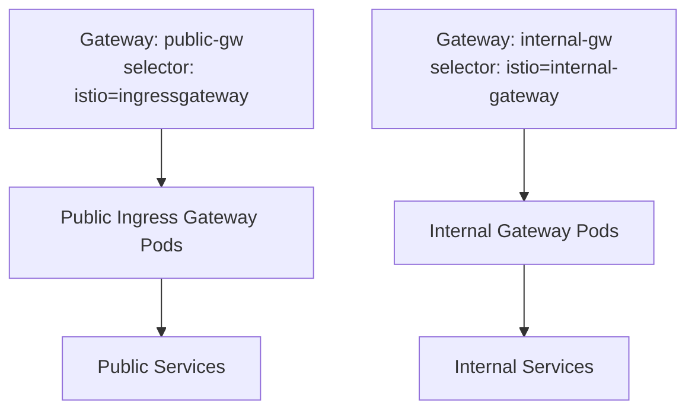

# How to Configure Istio Gateway Selector Labels

Author: [nawazdhandala](https://github.com/nawazdhandala)

Tags: Istio, Gateway, Selector Labels, Kubernetes, Configuration

Description: Understanding how Istio Gateway selector labels work and how to configure them to target specific ingress gateway deployments.

---

The `selector` field in an Istio Gateway resource is how you tell Istio which gateway deployment should handle the traffic defined in that Gateway configuration. Getting the selector wrong means your Gateway configuration goes nowhere, and traffic does not get routed. It is a simple concept but a common source of confusion, especially when you have multiple gateway deployments.

## How the Selector Works

The Gateway selector uses Kubernetes label matching. When you create a Gateway resource, Istio looks for pods that have labels matching the selector and pushes the Envoy configuration to those pods.

```yaml
apiVersion: networking.istio.io/v1
kind: Gateway
metadata:
  name: my-gateway
spec:
  selector:
    istio: ingressgateway
  servers:
  - port:
      number: 80
      name: http
      protocol: HTTP
    hosts:
    - "app.example.com"
```

The `selector.istio: ingressgateway` matches pods with the label `istio=ingressgateway`. This is the default label on the Istio ingress gateway installed with the standard profile.

## Finding the Default Gateway Labels

Check what labels the default ingress gateway pods have:

```bash
kubectl get pods -n istio-system -l istio=ingressgateway --show-labels
```

Typical output:

```
NAME                                    READY   STATUS    LABELS
istio-ingressgateway-5c4d9b7c8-xyz12   1/1     Running   app=istio-ingressgateway,istio=ingressgateway,...
```

The key labels are:
- `istio: ingressgateway` - The one most commonly used in Gateway selectors
- `app: istio-ingressgateway` - The app label for the deployment

## Using Multiple Labels in Selector

You can use multiple labels for more specific targeting:

```yaml
apiVersion: networking.istio.io/v1
kind: Gateway
metadata:
  name: specific-gateway
spec:
  selector:
    istio: ingressgateway
    app: istio-ingressgateway
  servers:
  - port:
      number: 80
      name: http
      protocol: HTTP
    hosts:
    - "app.example.com"
```

All labels in the selector must match. The more labels you include, the more specific the match. In most cases, `istio: ingressgateway` alone is enough for the default installation.

## Custom Gateway Deployments

When you deploy additional gateway instances, give them custom labels to target them specifically:

```yaml
apiVersion: install.istio.io/v1alpha1
kind: IstioOperator
spec:
  components:
    ingressGateways:
    - name: istio-ingressgateway
      enabled: true
    - name: internal-gateway
      enabled: true
      label:
        istio: internal-gateway
        app: internal-gateway
      k8s:
        service:
          type: ClusterIP
```

Now you can target the internal gateway specifically:

```yaml
apiVersion: networking.istio.io/v1
kind: Gateway
metadata:
  name: internal-gw
spec:
  selector:
    istio: internal-gateway
  servers:
  - port:
      number: 80
      name: http
      protocol: HTTP
    hosts:
    - "*.internal.example.com"
```

And the public gateway separately:

```yaml
apiVersion: networking.istio.io/v1
kind: Gateway
metadata:
  name: public-gw
spec:
  selector:
    istio: ingressgateway
  servers:
  - port:
      number: 443
      name: https
      protocol: HTTPS
    hosts:
    - "*.example.com"
    tls:
      mode: SIMPLE
      credentialName: wildcard-tls
```



## Selector for Egress Gateways

Egress gateways have their own labels. The default egress gateway uses `istio: egressgateway`:

```yaml
apiVersion: networking.istio.io/v1
kind: Gateway
metadata:
  name: egress-gw
spec:
  selector:
    istio: egressgateway
  servers:
  - port:
      number: 443
      name: tls
      protocol: TLS
    hosts:
    - "api.external.com"
    tls:
      mode: PASSTHROUGH
```

## Environment-Specific Selectors

A useful pattern is creating gateways with environment-specific labels:

```yaml
# Production gateway deployment with custom labels
apiVersion: install.istio.io/v1alpha1
kind: IstioOperator
spec:
  components:
    ingressGateways:
    - name: prod-gateway
      enabled: true
      label:
        istio: ingressgateway
        environment: production
    - name: staging-gateway
      enabled: true
      label:
        istio: ingressgateway
        environment: staging
```

Then target them in Gateway resources:

```yaml
apiVersion: networking.istio.io/v1
kind: Gateway
metadata:
  name: prod-gateway-config
spec:
  selector:
    istio: ingressgateway
    environment: production
  servers:
  - port:
      number: 443
      name: https
      protocol: HTTPS
    hosts:
    - "app.example.com"
    tls:
      mode: SIMPLE
      credentialName: prod-tls
---
apiVersion: networking.istio.io/v1
kind: Gateway
metadata:
  name: staging-gateway-config
spec:
  selector:
    istio: ingressgateway
    environment: staging
  servers:
  - port:
      number: 443
      name: https
      protocol: HTTPS
    hosts:
    - "staging.example.com"
    tls:
      mode: SIMPLE
      credentialName: staging-tls
```

## Verifying Selector Matching

Check if your Gateway selector matches the right pods:

```bash
# Get the selector from your Gateway
kubectl get gateway my-gateway -o jsonpath='{.spec.selector}'

# Find pods matching those labels
kubectl get pods -n istio-system -l istio=ingressgateway

# Verify the proxy config was pushed to the right pods
istioctl proxy-config listener deploy/istio-ingressgateway -n istio-system
```

If no pods match the selector, the Gateway configuration is applied but has no effect. Istio does not give an error - it just silently waits for matching pods to appear.

## Common Selector Mistakes

**Wrong label value.** The most common mistake is a typo in the selector label:

```yaml
# Wrong - this label value does not match any pod
selector:
  istio: ingress-gateway  # Should be "ingressgateway" (no hyphen)
```

**Selecting too broadly.** If your selector matches multiple gateway deployments unintentionally, the same configuration gets pushed to all of them:

```yaml
# This matches ALL ingress gateways if they all have istio=ingressgateway
selector:
  istio: ingressgateway
```

If you have multiple gateway deployments, add more specific labels to differentiate them.

**Namespace confusion.** The Gateway selector matches pods across all namespaces. If you have gateway pods in multiple namespaces with the same labels, the configuration applies to all of them. Add namespace-specific labels to avoid this.

## Using istioctl to Debug Selectors

Check what configuration is applied to a specific gateway pod:

```bash
# List all listeners (shows ports the gateway is accepting traffic on)
istioctl proxy-config listener deploy/istio-ingressgateway -n istio-system

# Check routes
istioctl proxy-config routes deploy/istio-ingressgateway -n istio-system

# Full configuration dump
istioctl proxy-config all deploy/istio-ingressgateway -n istio-system
```

If a Gateway resource selector matches the pod but the listener is not showing up, check for configuration errors:

```bash
istioctl analyze
```

## Gateway API Alternative

It is worth noting that the newer Kubernetes Gateway API (which Istio also supports) does not use label selectors. Instead, it references gateway deployments directly by name and namespace. If you are starting a new project, consider using the Gateway API instead of Istio's native Gateway resource.

The Gateway selector is a small piece of configuration, but it is the link between your Gateway resource and the actual Envoy proxy that handles the traffic. Understanding how it works and knowing how to debug it saves a lot of troubleshooting time, especially as you scale to multiple gateway deployments in a cluster.
