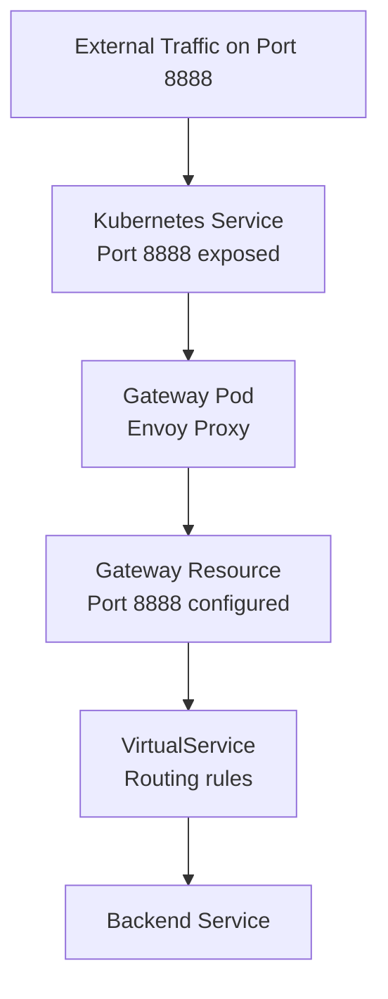

# How to Configure Istio Gateway with Custom Ports

Author: [nawazdhandala](https://github.com/nawazdhandala)

Tags: Istio, Gateway, Custom Ports, Kubernetes, Networking

Description: How to expose services on non-standard ports through an Istio Gateway including the required Service and Gateway configuration.

---

The default Istio ingress gateway comes with ports 80 and 443 ready to go. But real-world applications often need custom ports - maybe you are running a game server on port 7777, a database on port 5432, or an application that uses a non-standard HTTP port. Getting custom ports working on an Istio Gateway requires changes in two places: the Gateway resource and the underlying Kubernetes Service.

## The Two-Layer Port Configuration

This is where people often get stuck. Configuring a custom port on the Gateway resource alone is not enough. The Kubernetes Service for the ingress gateway also needs to expose that port. Think of it as two layers:



## Adding a Custom Port to the Ingress Gateway Service

First, add the port to the istio-ingressgateway Kubernetes Service:

```bash
kubectl patch svc istio-ingressgateway -n istio-system --type='json' -p='[
  {
    "op": "add",
    "path": "/spec/ports/-",
    "value": {
      "name": "custom-http",
      "port": 8888,
      "targetPort": 8888,
      "protocol": "TCP"
    }
  }
]'
```

Verify the port was added:

```bash
kubectl get svc istio-ingressgateway -n istio-system -o jsonpath='{.spec.ports[*].name}'
```

## Using IstioOperator for Persistent Port Configuration

The kubectl patch approach works but is not persistent across Istio upgrades. A better approach is using IstioOperator:

```yaml
apiVersion: install.istio.io/v1alpha1
kind: IstioOperator
spec:
  components:
    ingressGateways:
    - name: istio-ingressgateway
      enabled: true
      k8s:
        service:
          ports:
          - name: http2
            port: 80
            targetPort: 8080
          - name: https
            port: 443
            targetPort: 8443
          - name: status-port
            port: 15021
            targetPort: 15021
          - name: custom-http
            port: 8888
            targetPort: 8888
          - name: custom-tcp
            port: 9999
            targetPort: 9999
```

Apply with:

```bash
istioctl install -f custom-ports.yaml
```

## Configuring the Gateway Resource

Now create a Gateway that listens on the custom port:

```yaml
apiVersion: networking.istio.io/v1
kind: Gateway
metadata:
  name: custom-port-gateway
spec:
  selector:
    istio: ingressgateway
  servers:
  - port:
      number: 8888
      name: custom-http
      protocol: HTTP
    hosts:
    - "app.example.com"
```

And the corresponding VirtualService:

```yaml
apiVersion: networking.istio.io/v1
kind: VirtualService
metadata:
  name: custom-port-vs
spec:
  hosts:
  - "app.example.com"
  gateways:
  - custom-port-gateway
  http:
  - route:
    - destination:
        host: app-service
        port:
          number: 8080
```

## Custom HTTPS Port

For HTTPS on a non-standard port:

```yaml
apiVersion: networking.istio.io/v1
kind: Gateway
metadata:
  name: custom-https-gateway
spec:
  selector:
    istio: ingressgateway
  servers:
  - port:
      number: 8443
      name: custom-https
      protocol: HTTPS
    hosts:
    - "secure-app.example.com"
    tls:
      mode: SIMPLE
      credentialName: secure-app-tls-credential
```

Make sure the Service has port 8443 exposed as well.

## Multiple Custom Ports

You can configure many custom ports on a single gateway:

```yaml
apiVersion: networking.istio.io/v1
kind: Gateway
metadata:
  name: multi-port-gateway
spec:
  selector:
    istio: ingressgateway
  servers:
  - port:
      number: 80
      name: http
      protocol: HTTP
    hosts:
    - "*.example.com"
  - port:
      number: 443
      name: https
      protocol: HTTPS
    hosts:
    - "*.example.com"
    tls:
      mode: SIMPLE
      credentialName: wildcard-tls
  - port:
      number: 8080
      name: http-alt
      protocol: HTTP
    hosts:
    - "*.example.com"
  - port:
      number: 9090
      name: http-metrics
      protocol: HTTP
    hosts:
    - "metrics.example.com"
  - port:
      number: 5432
      name: tcp-postgres
      protocol: TCP
    hosts:
    - "*"
```

## Port Naming Conventions

Port names in the Gateway resource matter. Istio uses them to determine how to handle traffic:

| Name prefix | Protocol | Behavior |
|---|---|---|
| `http` | HTTP | Full HTTP routing, metrics, tracing |
| `http2` | HTTP/2 | HTTP/2 protocol handling |
| `https` | HTTPS | TLS termination + HTTP routing |
| `grpc` | gRPC | gRPC-specific handling |
| `tcp` | TCP | Raw TCP forwarding |
| `tls` | TLS | TLS routing without HTTP parsing |

Using the right name prefix ensures Istio applies the correct protocol handling. A port named `tcp-custom` will be treated as TCP even on port 80.

## Port Conflicts

Be careful not to conflict with ports already used by the Envoy proxy internally:

- Port 15000 - Envoy admin interface
- Port 15001 - Envoy outbound
- Port 15006 - Envoy inbound
- Port 15021 - Health check
- Port 15090 - Prometheus telemetry

Avoid using these ports for your custom services.

## Testing Custom Ports

Test that your custom port is accessible:

```bash
export GATEWAY_IP=$(kubectl -n istio-system get service istio-ingressgateway \
  -o jsonpath='{.status.loadBalancer.ingress[0].ip}')

# Test custom HTTP port
curl -v -H "Host: app.example.com" "http://$GATEWAY_IP:8888/"

# Verify the port is listening
istioctl proxy-config listener deploy/istio-ingressgateway -n istio-system --port 8888
```

## Cloud Provider Considerations

On cloud providers, the load balancer for the ingress gateway Service needs to support the custom ports:

**AWS NLB/ALB:** Additional ports are usually picked up automatically when you update the Service.

**GCP:** The load balancer may need a firewall rule for the custom port.

**Azure:** The load balancer rules update automatically, but check your Network Security Group allows the port.

## NodePort Considerations

If using NodePort instead of LoadBalancer, Kubernetes assigns a random high port (30000-32767) for each service port. You can specify the nodePort explicitly:

```yaml
spec:
  type: NodePort
  ports:
  - name: custom-http
    port: 8888
    targetPort: 8888
    nodePort: 30888
```

## Troubleshooting Custom Ports

**Connection refused on custom port**

Check the Service has the port:

```bash
kubectl get svc istio-ingressgateway -n istio-system -o yaml | grep -A 4 custom
```

**Port open but no response**

Check the Gateway resource has a server entry for that port:

```bash
kubectl get gateway custom-port-gateway -o yaml
```

**Load balancer not forwarding the port**

On some cloud providers, you may need to re-create the Service or manually update the load balancer configuration after adding ports.

```bash
# Force Service recreation (caution: this changes the external IP)
kubectl delete svc istio-ingressgateway -n istio-system
# Istio will recreate it, or reapply your IstioOperator config
```

Custom ports on Istio Gateway are a two-step process that trips up a lot of people. Remember: configure the port on both the Kubernetes Service and the Gateway resource, and your custom ports will work just as well as the default 80 and 443.
