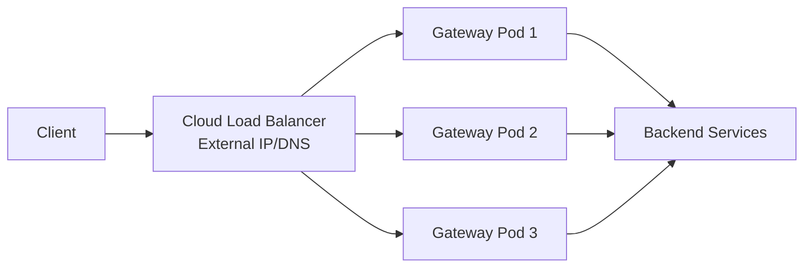

# How to Configure Istio Gateway with External Load Balancer

Author: [nawazdhandala](https://github.com/nawazdhandala)

Tags: Istio, Load Balancer, Gateway, Kubernetes, Cloud

Description: How to configure Istio Ingress Gateway with cloud provider load balancers including AWS, GCP, and Azure-specific settings.

---

When you deploy Istio's ingress gateway on a cloud provider, Kubernetes automatically creates a cloud load balancer for the `istio-ingressgateway` Service. The load balancer distributes traffic across your gateway pods and gives you a stable external IP or hostname. But the default settings are rarely optimal for production. Each cloud provider has different options for health checks, proxy protocol, SSL termination, and IP preservation.

## Understanding the Architecture



The load balancer sits outside Kubernetes and forwards traffic to the NodePorts or pod IPs of the gateway Service. The load balancer type (NLB, ALB, TCP, etc.) affects performance, features, and cost.

## Default Load Balancer

By default, the `istio-ingressgateway` Service is type `LoadBalancer`:

```bash
kubectl get svc istio-ingressgateway -n istio-system
```

The default creates a Layer 4 (TCP/UDP) load balancer on most cloud providers.

## AWS Configuration

### Network Load Balancer (NLB)

NLB is the recommended choice for Istio on AWS. It operates at Layer 4, preserves client IP, and has lower latency:

```yaml
apiVersion: install.istio.io/v1alpha1
kind: IstioOperator
spec:
  components:
    ingressGateways:
    - name: istio-ingressgateway
      enabled: true
      k8s:
        serviceAnnotations:
          service.beta.kubernetes.io/aws-load-balancer-type: "nlb"
          service.beta.kubernetes.io/aws-load-balancer-scheme: "internet-facing"
          service.beta.kubernetes.io/aws-load-balancer-cross-zone-load-balancing-enabled: "true"
          service.beta.kubernetes.io/aws-load-balancer-healthcheck-path: "/healthz/ready"
          service.beta.kubernetes.io/aws-load-balancer-healthcheck-port: "15021"
```

### AWS Load Balancer Controller with NLB

If you use the AWS Load Balancer Controller:

```yaml
apiVersion: v1
kind: Service
metadata:
  name: istio-ingressgateway
  namespace: istio-system
  annotations:
    service.beta.kubernetes.io/aws-load-balancer-type: "external"
    service.beta.kubernetes.io/aws-load-balancer-nlb-target-type: "ip"
    service.beta.kubernetes.io/aws-load-balancer-scheme: "internet-facing"
    service.beta.kubernetes.io/aws-load-balancer-attributes: load_balancing.cross_zone.enabled=true
    service.beta.kubernetes.io/aws-load-balancer-healthcheck-path: /healthz/ready
    service.beta.kubernetes.io/aws-load-balancer-healthcheck-port: "15021"
    service.beta.kubernetes.io/aws-load-balancer-healthcheck-protocol: http
```

Using `nlb-target-type: ip` routes traffic directly to pod IPs instead of through NodePorts, reducing an extra hop.

### Preserving Client IP on AWS

With an NLB using instance targets, the client IP is preserved by default. With IP targets, enable proxy protocol if needed:

```yaml
annotations:
  service.beta.kubernetes.io/aws-load-balancer-proxy-protocol: "*"
```

Then configure the gateway to understand proxy protocol via EnvoyFilter:

```yaml
apiVersion: networking.istio.io/v1alpha3
kind: EnvoyFilter
metadata:
  name: proxy-protocol
  namespace: istio-system
spec:
  workloadSelector:
    labels:
      istio: ingressgateway
  configPatches:
  - applyTo: LISTENER
    match:
      context: GATEWAY
    patch:
      operation: MERGE
      value:
        listener_filters:
        - name: envoy.filters.listener.proxy_protocol
          typed_config:
            "@type": type.googleapis.com/envoy.extensions.filters.listener.proxy_protocol.v3.ProxyProtocol
```

## GCP Configuration

### Internal Load Balancer

For services that should only be accessible within the VPC:

```yaml
apiVersion: install.istio.io/v1alpha1
kind: IstioOperator
spec:
  components:
    ingressGateways:
    - name: istio-ingressgateway
      enabled: true
      k8s:
        serviceAnnotations:
          networking.gke.io/load-balancer-type: "Internal"
```

### External with Static IP

Reserve a static IP first, then use it:

```bash
gcloud compute addresses create istio-ip --region=us-central1
```

```yaml
apiVersion: install.istio.io/v1alpha1
kind: IstioOperator
spec:
  components:
    ingressGateways:
    - name: istio-ingressgateway
      enabled: true
      k8s:
        serviceAnnotations:
          networking.gke.io/load-balancer-type: "External"
        service:
          loadBalancerIP: "YOUR_STATIC_IP"
```

## Azure Configuration

### Standard Load Balancer

```yaml
apiVersion: install.istio.io/v1alpha1
kind: IstioOperator
spec:
  components:
    ingressGateways:
    - name: istio-ingressgateway
      enabled: true
      k8s:
        serviceAnnotations:
          service.beta.kubernetes.io/azure-load-balancer-resource-group: "my-resource-group"
```

### Internal Load Balancer on Azure

```yaml
serviceAnnotations:
  service.beta.kubernetes.io/azure-load-balancer-internal: "true"
  service.beta.kubernetes.io/azure-load-balancer-internal-subnet: "my-subnet"
```

## Static IP Addresses

To keep a stable IP address across gateway restarts and upgrades:

```yaml
apiVersion: install.istio.io/v1alpha1
kind: IstioOperator
spec:
  components:
    ingressGateways:
    - name: istio-ingressgateway
      enabled: true
      k8s:
        service:
          loadBalancerIP: "203.0.113.10"
```

The static IP must be pre-allocated with your cloud provider. Without it, you get a new IP every time the Service is recreated.

## Internal vs External Load Balancers

For services that should only be accessible within your network:

```yaml
apiVersion: install.istio.io/v1alpha1
kind: IstioOperator
spec:
  components:
    ingressGateways:
    - name: internal-gateway
      enabled: true
      label:
        istio: internal-gateway
      k8s:
        serviceAnnotations:
          # AWS
          service.beta.kubernetes.io/aws-load-balancer-scheme: "internal"
          # GCP
          # networking.gke.io/load-balancer-type: "Internal"
          # Azure
          # service.beta.kubernetes.io/azure-load-balancer-internal: "true"
```

## Configuring Idle Timeout

Cloud load balancers have idle connection timeouts that can close long-lived connections:

### AWS

```yaml
annotations:
  service.beta.kubernetes.io/aws-load-balancer-connection-idle-timeout: "3600"
```

This sets the idle timeout to 1 hour, which is important for WebSocket and gRPC streaming connections.

## Verifying the Load Balancer

After deployment, check the load balancer is provisioned:

```bash
# Get the external IP/hostname
kubectl get svc istio-ingressgateway -n istio-system

# Wait for provisioning (can take a few minutes)
kubectl get svc istio-ingressgateway -n istio-system -w
```

Test connectivity:

```bash
export GATEWAY_URL=$(kubectl -n istio-system get service istio-ingressgateway \
  -o jsonpath='{.status.loadBalancer.ingress[0].ip}')

# If hostname instead of IP (AWS)
export GATEWAY_URL=$(kubectl -n istio-system get service istio-ingressgateway \
  -o jsonpath='{.status.loadBalancer.ingress[0].hostname}')

curl -v http://$GATEWAY_URL/
```

## Troubleshooting Load Balancer Issues

**EXTERNAL-IP stuck on "pending"**

```bash
kubectl describe svc istio-ingressgateway -n istio-system
```

Look for events indicating why the load balancer could not be created. Common causes: insufficient IAM permissions, subnet issues, or quota limits.

**Health checks failing**

Verify port 15021 is accessible:

```bash
kubectl port-forward -n istio-system svc/istio-ingressgateway 15021:15021 &
curl http://localhost:15021/healthz/ready
```

**Intermittent connectivity**

Check if the load balancer is cross-zone enabled. Without cross-zone load balancing, traffic only goes to gateway pods in the same availability zone as the load balancer node.

Getting the load balancer configuration right for your cloud provider is a one-time setup that pays off long-term. The annotations are provider-specific and not always obvious, but once configured correctly, the load balancer handles traffic distribution, health checking, and failover automatically.
