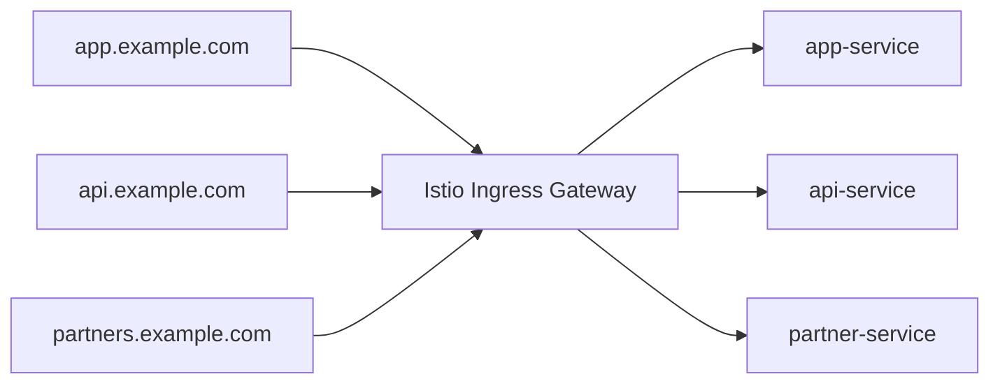

# How to Configure Istio Ingress for Multiple Domains

Author: [nawazdhandala](https://github.com/nawazdhandala)

Tags: Istio, Kubernetes, Ingress Gateway, Multi-Domain, Service Mesh

Description: Step-by-step guide to configuring Istio Ingress Gateway to handle traffic for multiple domains with separate routing rules and TLS certificates.

---

Running multiple domains through a single Istio Ingress Gateway is something most production setups need eventually. Maybe you have a public API on `api.example.com`, a web app on `app.example.com`, and a partner portal on `partners.example.com`. Instead of spinning up separate load balancers for each, you can route all of them through one Istio ingress gateway.

This guide walks through the full setup, including TLS configuration, Gateway resources, and VirtualService routing for each domain.

## Prerequisites

You need a working Kubernetes cluster with Istio installed. Make sure the ingress gateway pod is running:

```bash
kubectl get pods -n istio-system -l istio=ingressgateway
```

You should see the `istio-ingressgateway` pod in a Running state. Also grab the external IP of the gateway:

```bash
kubectl get svc istio-ingressgateway -n istio-system
```

Point your DNS records for each domain to this external IP address.

## Understanding the Architecture

When traffic hits the Istio ingress gateway, it goes through two layers of configuration:

1. **Gateway** - defines which ports and hosts the gateway should listen on
2. **VirtualService** - defines how to route traffic for each host to backend services



## Step 1: Create TLS Certificates

For production, you will want TLS on each domain. Create Kubernetes secrets for each certificate:

```bash
kubectl create secret tls app-example-tls \
  --cert=app.example.com.crt \
  --key=app.example.com.key \
  -n istio-system

kubectl create secret tls api-example-tls \
  --cert=api.example.com.crt \
  --key=api.example.com.key \
  -n istio-system

kubectl create secret tls partners-example-tls \
  --cert=partners.example.com.crt \
  --key=partners.example.com.key \
  -n istio-system
```

Note that the secrets must be in the same namespace as the ingress gateway (usually `istio-system`).

## Step 2: Configure the Gateway Resource

You can define multiple `servers` entries in a single Gateway resource, one per domain:

```yaml
apiVersion: networking.istio.io/v1
kind: Gateway
metadata:
  name: multi-domain-gateway
  namespace: istio-system
spec:
  selector:
    istio: ingressgateway
  servers:
  - port:
      number: 443
      name: https-app
      protocol: HTTPS
    tls:
      mode: SIMPLE
      credentialName: app-example-tls
    hosts:
    - "app.example.com"
  - port:
      number: 443
      name: https-api
      protocol: HTTPS
    tls:
      mode: SIMPLE
      credentialName: api-example-tls
    hosts:
    - "api.example.com"
  - port:
      number: 443
      name: https-partners
      protocol: HTTPS
    tls:
      mode: SIMPLE
      credentialName: partners-example-tls
    hosts:
    - "partners.example.com"
  - port:
      number: 80
      name: http
      protocol: HTTP
    tls:
      httpsRedirect: true
    hosts:
    - "app.example.com"
    - "api.example.com"
    - "partners.example.com"
```

A few things to notice here. Each HTTPS server entry needs a unique `name` field. The `credentialName` points to the Kubernetes secret holding that domain's certificate. The last entry handles HTTP traffic and redirects everything to HTTPS.

## Step 3: Create VirtualService for Each Domain

Now create a VirtualService for each domain to route traffic to the correct backend:

```yaml
apiVersion: networking.istio.io/v1
kind: VirtualService
metadata:
  name: app-routes
  namespace: default
spec:
  hosts:
  - "app.example.com"
  gateways:
  - istio-system/multi-domain-gateway
  http:
  - match:
    - uri:
        prefix: /
    route:
    - destination:
        host: app-service
        port:
          number: 80
```

```yaml
apiVersion: networking.istio.io/v1
kind: VirtualService
metadata:
  name: api-routes
  namespace: default
spec:
  hosts:
  - "api.example.com"
  gateways:
  - istio-system/multi-domain-gateway
  http:
  - match:
    - uri:
        prefix: /v1
    route:
    - destination:
        host: api-v1-service
        port:
          number: 8080
  - match:
    - uri:
        prefix: /v2
    route:
    - destination:
        host: api-v2-service
        port:
          number: 8080
```

```yaml
apiVersion: networking.istio.io/v1
kind: VirtualService
metadata:
  name: partner-routes
  namespace: default
spec:
  hosts:
  - "partners.example.com"
  gateways:
  - istio-system/multi-domain-gateway
  http:
  - match:
    - uri:
        prefix: /
    route:
    - destination:
        host: partner-service
        port:
          number: 80
```

Notice that when the Gateway is in a different namespace than the VirtualService, you reference it as `namespace/gateway-name`.

## Step 4: Verify the Configuration

Check that your Gateway and VirtualServices are applied correctly:

```bash
kubectl get gateway -n istio-system
kubectl get virtualservice --all-namespaces
```

Test each domain with curl:

```bash
curl -v https://app.example.com/
curl -v https://api.example.com/v1/health
curl -v https://partners.example.com/
```

If something is not working, check the Istio proxy configuration on the ingress gateway:

```bash
istioctl proxy-config listeners deploy/istio-ingressgateway -n istio-system
istioctl proxy-config routes deploy/istio-ingressgateway -n istio-system
```

## Using cert-manager for Automatic Certificates

Manually managing TLS certificates gets old fast. If you are using cert-manager, you can automate this. Create a Certificate resource for each domain:

```yaml
apiVersion: cert-manager.io/v1
kind: Certificate
metadata:
  name: app-example-cert
  namespace: istio-system
spec:
  secretName: app-example-tls
  issuerRef:
    name: letsencrypt-prod
    kind: ClusterIssuer
  dnsNames:
  - app.example.com
```

cert-manager will create and renew the `app-example-tls` secret automatically. The Gateway resource picks it up through the `credentialName` field without any changes.

## Handling Wildcard Domains

If you control all subdomains under `example.com`, you can simplify the setup with a wildcard certificate:

```yaml
apiVersion: networking.istio.io/v1
kind: Gateway
metadata:
  name: wildcard-gateway
  namespace: istio-system
spec:
  selector:
    istio: ingressgateway
  servers:
  - port:
      number: 443
      name: https
      protocol: HTTPS
    tls:
      mode: SIMPLE
      credentialName: wildcard-example-tls
    hosts:
    - "*.example.com"
```

The VirtualServices still define routing per subdomain, but you only need one TLS certificate.

## Common Pitfalls

**Port name conflicts.** Each server entry in the Gateway must have a unique port name. If two entries share the same name, only one will work.

**Secret namespace.** TLS secrets referenced by `credentialName` must be in the same namespace as the istio-ingressgateway deployment. This trips up a lot of people.

**Gateway reference format.** When a VirtualService references a Gateway in another namespace, use `namespace/name` format. If you forget the namespace prefix, the VirtualService will look for the Gateway in its own namespace and find nothing.

**SNI routing.** Istio uses SNI (Server Name Indication) to determine which TLS certificate to present. If a client does not send SNI information, the connection will fail. Most modern HTTP clients send SNI by default, but older tools might not.

## Performance Considerations

Running multiple domains through a single ingress gateway works well for most workloads. The Envoy proxy inside the gateway handles SNI-based routing efficiently. However, if you are dealing with thousands of requests per second across many domains, keep an eye on the gateway pod's CPU and memory usage. You can scale the ingress gateway horizontally:

```bash
kubectl scale deploy istio-ingressgateway -n istio-system --replicas=3
```

Or configure an HPA for automatic scaling based on CPU usage.

## Summary

Configuring Istio Ingress for multiple domains comes down to defining multiple server entries in your Gateway resource and creating separate VirtualServices for each domain's routing rules. The key pieces are proper TLS certificate management, unique port names, and correct cross-namespace references. Once set up, adding new domains is as simple as adding another server entry and VirtualService.
