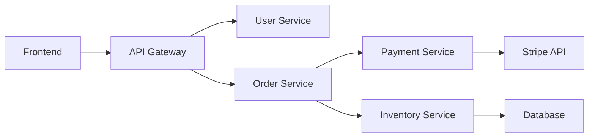

# How to Configure Istio Sidecar Resource to Limit Service Visibility

Author: [nawazdhandala](https://github.com/nawazdhandala)

Tags: Istio, Sidecar, Service Mesh, Kubernetes, Security, Performance

Description: Use the Istio Sidecar resource to limit which services each workload can see, reducing Envoy memory usage and improving security posture.

---

In a default Istio installation, every sidecar proxy receives configuration for every service in the mesh. If you have 500 services across 20 namespaces, every single Envoy proxy knows about all 500 services. That is wasteful. Your frontend pods do not need to know about your database services. Your batch processing jobs do not need to know about your API gateway endpoints.

The Istio Sidecar resource solves this by letting you control which services are visible to each workload. This has two benefits: it reduces the memory footprint of each Envoy proxy, and it limits what each workload can reach, which improves security.

## How Sidecar Visibility Works

By default, Istio pushes the full service registry to every proxy. The Sidecar resource acts as a filter. It tells istiod "only send this workload information about these specific services." Envoy only loads configuration for the services it needs.

The configuration has two main sections:
- **egress** - What services this workload can send traffic to
- **ingress** - How this workload receives traffic (less commonly configured)

## Basic Sidecar Configuration

Here is a Sidecar that limits a workload to only see services in its own namespace plus the istio-system namespace:

```yaml
apiVersion: networking.istio.io/v1
kind: Sidecar
metadata:
  name: default
  namespace: frontend
spec:
  egress:
    - hosts:
        - "./*"
        - "istio-system/*"
```

The host format is `namespace/host`:
- `./*` means all services in the current namespace (frontend)
- `istio-system/*` means all services in the istio-system namespace (needed for Istio functionality)

After applying this, workloads in the `frontend` namespace can only see services in `frontend` and `istio-system`. Services in other namespaces like `backend`, `database`, or `payments` are invisible.

## Per-Workload Sidecar Configuration

You can target specific workloads using `workloadSelector`:

```yaml
apiVersion: networking.istio.io/v1
kind: Sidecar
metadata:
  name: api-gateway-sidecar
  namespace: backend
spec:
  workloadSelector:
    labels:
      app: api-gateway
  egress:
    - hosts:
        - "./*"
        - "istio-system/*"
        - "frontend/*"
        - "*/api.stripe.com"
```

This Sidecar applies only to pods with the label `app: api-gateway` in the `backend` namespace. The api-gateway can see:
- All services in its own namespace (backend)
- All services in istio-system
- All services in the frontend namespace
- The external service api.stripe.com (from any namespace's ServiceEntry)

Other workloads in the `backend` namespace use either a different Sidecar configuration or the default (full visibility).

## Namespace-Wide Default Sidecar

Create a namespace-level default that applies to all workloads without a specific Sidecar:

```yaml
apiVersion: networking.istio.io/v1
kind: Sidecar
metadata:
  name: default
  namespace: frontend
spec:
  egress:
    - hosts:
        - "./*"
        - "istio-system/*"
        - "backend/api-service.backend.svc.cluster.local"
```

Without a `workloadSelector`, this Sidecar applies to all workloads in the `frontend` namespace. They can see frontend services, istio-system, and specifically the `api-service` in the backend namespace. Nothing else.

## Specific Service References

You can reference specific services instead of entire namespaces:

```yaml
apiVersion: networking.istio.io/v1
kind: Sidecar
metadata:
  name: order-service-sidecar
  namespace: backend
spec:
  workloadSelector:
    labels:
      app: order-service
  egress:
    - hosts:
        - "./payment-service.backend.svc.cluster.local"
        - "./inventory-service.backend.svc.cluster.local"
        - "istio-system/*"
        - "*/api.stripe.com"
```

The order-service can only reach payment-service, inventory-service, istio-system, and the external Stripe API. Even other services in the same backend namespace are invisible to it. This is the tightest level of control.

## Including External Services

External services registered via ServiceEntry can be included in Sidecar visibility:

```yaml
apiVersion: networking.istio.io/v1
kind: Sidecar
metadata:
  name: payment-sidecar
  namespace: payments
spec:
  workloadSelector:
    labels:
      app: payment-processor
  egress:
    - hosts:
        - "./*"
        - "istio-system/*"
        - "*/api.stripe.com"
        - "*/api.paypal.com"
```

The `*/api.stripe.com` syntax means "api.stripe.com from any namespace." This works as long as there is a ServiceEntry for api.stripe.com somewhere in the mesh.

## Practical Example: Microservices Architecture

Consider a typical microservices setup:



Here are the Sidecar configurations for each layer:

```yaml
# Frontend namespace - can only reach API Gateway
apiVersion: networking.istio.io/v1
kind: Sidecar
metadata:
  name: default
  namespace: frontend
spec:
  egress:
    - hosts:
        - "./*"
        - "istio-system/*"
        - "backend/api-gateway.backend.svc.cluster.local"
---
# API Gateway - can reach user and order services
apiVersion: networking.istio.io/v1
kind: Sidecar
metadata:
  name: api-gateway-sidecar
  namespace: backend
spec:
  workloadSelector:
    labels:
      app: api-gateway
  egress:
    - hosts:
        - "./user-service.backend.svc.cluster.local"
        - "./order-service.backend.svc.cluster.local"
        - "istio-system/*"
---
# Order Service - can reach payment and inventory
apiVersion: networking.istio.io/v1
kind: Sidecar
metadata:
  name: order-service-sidecar
  namespace: backend
spec:
  workloadSelector:
    labels:
      app: order-service
  egress:
    - hosts:
        - "./payment-service.backend.svc.cluster.local"
        - "./inventory-service.backend.svc.cluster.local"
        - "istio-system/*"
---
# Payment Service - can reach Stripe
apiVersion: networking.istio.io/v1
kind: Sidecar
metadata:
  name: payment-service-sidecar
  namespace: backend
spec:
  workloadSelector:
    labels:
      app: payment-service
  egress:
    - hosts:
        - "istio-system/*"
        - "*/api.stripe.com"
```

Each service sees only what it needs. A compromised frontend pod cannot directly reach the database. A compromised order service cannot call external APIs.

## Verifying Sidecar Configuration

Check what a specific proxy can see:

```bash
# List clusters (services) visible to a workload
istioctl proxy-config cluster deploy/order-service -n backend

# Count the number of clusters
istioctl proxy-config cluster deploy/order-service -n backend | wc -l
```

Compare the cluster count before and after applying a Sidecar. You should see a significant reduction.

```bash
# Check listeners
istioctl proxy-config listener deploy/order-service -n backend

# Check routes
istioctl proxy-config routes deploy/order-service -n backend
```

## Debugging Sidecar Issues

If a service cannot reach another service after adding a Sidecar:

```bash
# Check if the target is in the cluster list
istioctl proxy-config cluster deploy/order-service -n backend | grep payment

# If missing, the Sidecar egress list does not include it
kubectl get sidecar order-service-sidecar -n backend -o yaml
```

Common mistakes:
- Forgetting to include `istio-system/*` (breaks Istio functionality)
- Using the wrong namespace prefix
- Typo in the service hostname
- Missing ServiceEntry hosts in the egress list

## Gradual Rollout Strategy

Do not apply Sidecar resources to every namespace at once. Roll out gradually:

1. Start with one non-critical namespace
2. Apply a namespace-wide Sidecar with `./*` and `istio-system/*`
3. Monitor for connection errors
4. Identify which cross-namespace services are needed
5. Add them to the egress list
6. Move to the next namespace

```bash
# Monitor for connection failures after applying Sidecar
kubectl logs -l app=my-service -c istio-proxy | grep "NR\|UH\|BlackHole"
```

`NR` (no route) flags in the access log indicate that the workload is trying to reach a service that the Sidecar has hidden.

The Sidecar resource is one of the most impactful Istio configurations for both performance and security. It takes time to map out your service dependencies, but the result is a mesh where each workload has minimum necessary visibility - a real application of the principle of least privilege.
