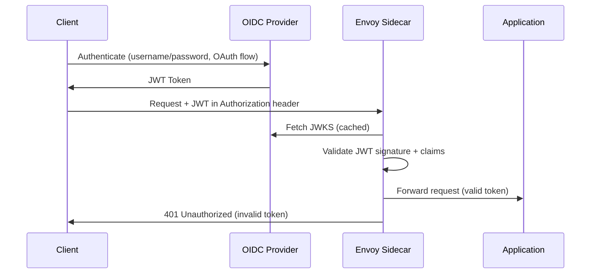

# How to Configure JWT Authentication with OIDC Providers in Istio

Author: [nawazdhandala](https://github.com/nawazdhandala)

Tags: Istio, JWT, OIDC, Authentication, Kubernetes, Security

Description: A practical guide to integrating Istio JWT authentication with popular OIDC providers like Auth0, Keycloak, and Google Identity Platform.

---

OpenID Connect (OIDC) providers handle the heavy lifting of user authentication and token issuance, while Istio's sidecar proxies handle token validation at the mesh level. This combination means your application code doesn't need to verify JWTs - the Envoy sidecar does it before the request ever reaches your container.

This post covers how to set up Istio's RequestAuthentication with several popular OIDC providers, including the gotchas you'll run into along the way.

## How OIDC and Istio Work Together

OIDC providers issue JWT tokens following the OpenID Connect specification. These tokens are signed with keys that the provider publishes at a well-known JWKS (JSON Web Key Set) endpoint. Istio's RequestAuthentication resource tells the Envoy sidecar where to find these keys so it can verify incoming tokens.

The flow looks like this:



## Configuring Auth0

Auth0 is one of the most common OIDC providers. Here's how to configure Istio to validate Auth0-issued tokens:

```yaml
apiVersion: security.istio.io/v1
kind: RequestAuthentication
metadata:
  name: auth0-jwt
  namespace: my-app
spec:
  selector:
    matchLabels:
      app: my-service
  jwtRules:
    - issuer: "https://your-tenant.auth0.com/"
      jwksUri: "https://your-tenant.auth0.com/.well-known/jwks.json"
      audiences:
        - "https://your-api-identifier"
```

A few things to note with Auth0:

- The issuer URL must include the trailing slash. Auth0 tokens have the issuer claim set to `https://your-tenant.auth0.com/` (with slash), and Istio does an exact string match.
- The audience should match the API identifier you set up in Auth0's dashboard, not the client ID.
- Auth0's JWKS endpoint is publicly accessible, so no special configuration is needed for Istio to fetch the keys.

## Configuring Keycloak

Keycloak is popular for self-hosted OIDC. The configuration is similar but the URLs follow a different pattern:

```yaml
apiVersion: security.istio.io/v1
kind: RequestAuthentication
metadata:
  name: keycloak-jwt
  namespace: my-app
spec:
  selector:
    matchLabels:
      app: my-service
  jwtRules:
    - issuer: "https://keycloak.example.com/realms/my-realm"
      jwksUri: "https://keycloak.example.com/realms/my-realm/protocol/openid-connect/certs"
      audiences:
        - "my-client-id"
```

With Keycloak, the issuer URL includes the realm path. If you're running Keycloak inside your cluster, you might hit a common problem: the issuer URL in the token uses an external hostname, but the sidecar can't reach that external hostname to fetch JWKS.

In that case, use the internal service URL for the JWKS while keeping the external issuer:

```yaml
apiVersion: security.istio.io/v1
kind: RequestAuthentication
metadata:
  name: keycloak-jwt
  namespace: my-app
spec:
  selector:
    matchLabels:
      app: my-service
  jwtRules:
    - issuer: "https://keycloak.example.com/realms/my-realm"
      jwksUri: "http://keycloak.keycloak-ns.svc.cluster.local:8080/realms/my-realm/protocol/openid-connect/certs"
```

## Configuring Google Identity Platform

For Google-issued tokens (GCP service accounts or Google Sign-In):

```yaml
apiVersion: security.istio.io/v1
kind: RequestAuthentication
metadata:
  name: google-jwt
  namespace: my-app
spec:
  selector:
    matchLabels:
      app: my-service
  jwtRules:
    - issuer: "https://accounts.google.com"
      jwksUri: "https://www.googleapis.com/oauth2/v3/certs"
      audiences:
        - "your-google-client-id.apps.googleusercontent.com"
```

Google rotates their signing keys regularly, but Istio caches the JWKS and refreshes it based on the Cache-Control headers returned by the JWKS endpoint.

## Configuring Azure AD (Microsoft Entra ID)

For Azure AD tokens:

```yaml
apiVersion: security.istio.io/v1
kind: RequestAuthentication
metadata:
  name: azure-ad-jwt
  namespace: my-app
spec:
  selector:
    matchLabels:
      app: my-service
  jwtRules:
    - issuer: "https://login.microsoftonline.com/your-tenant-id/v2.0"
      jwksUri: "https://login.microsoftonline.com/your-tenant-id/discovery/v2.0/keys"
      audiences:
        - "api://your-application-id"
```

Azure AD has a quirk: the issuer claim in v1 tokens is `https://sts.windows.net/your-tenant-id/` while v2 tokens use `https://login.microsoftonline.com/your-tenant-id/v2.0`. Make sure you match the version your application is configured to use.

## Supporting Multiple OIDC Providers

You can accept tokens from multiple providers in a single RequestAuthentication:

```yaml
apiVersion: security.istio.io/v1
kind: RequestAuthentication
metadata:
  name: multi-provider-jwt
  namespace: my-app
spec:
  selector:
    matchLabels:
      app: my-service
  jwtRules:
    - issuer: "https://your-tenant.auth0.com/"
      jwksUri: "https://your-tenant.auth0.com/.well-known/jwks.json"
      audiences:
        - "https://your-api"
    - issuer: "https://accounts.google.com"
      jwksUri: "https://www.googleapis.com/oauth2/v3/certs"
      audiences:
        - "your-google-client-id.apps.googleusercontent.com"
```

Istio will try each rule in order and accept the token if it matches any of the configured issuers.

## Forwarding Claims to Your Application

By default, Istio validates the token but doesn't forward the claims to your application. You can configure claim forwarding using `outputPayloadToHeader`:

```yaml
apiVersion: security.istio.io/v1
kind: RequestAuthentication
metadata:
  name: jwt-with-forwarding
  namespace: my-app
spec:
  selector:
    matchLabels:
      app: my-service
  jwtRules:
    - issuer: "https://your-tenant.auth0.com/"
      jwksUri: "https://your-tenant.auth0.com/.well-known/jwks.json"
      outputPayloadToHeader: "x-jwt-payload"
```

Your application will receive the decoded JWT payload as a base64-encoded JSON string in the `x-jwt-payload` header. You can decode it to extract user information without having to validate the token yourself.

## Enforcing Authentication with AuthorizationPolicy

Remember that RequestAuthentication only validates tokens that are present. To actually require authentication, pair it with an AuthorizationPolicy:

```yaml
apiVersion: security.istio.io/v1
kind: AuthorizationPolicy
metadata:
  name: require-valid-token
  namespace: my-app
spec:
  selector:
    matchLabels:
      app: my-service
  action: ALLOW
  rules:
    - from:
        - source:
            requestPrincipals: ["*"]
```

The `requestPrincipals: ["*"]` condition matches any request that has a valid JWT. Requests without tokens or with invalid tokens will be rejected with 403.

## Troubleshooting OIDC Integration

When things go wrong, here are the first things to check:

```bash
# Check if the JWKS endpoint is reachable from inside the mesh
kubectl exec -n my-app deploy/my-service -c istio-proxy -- curl -s https://your-tenant.auth0.com/.well-known/jwks.json | head -20

# Check Envoy logs for JWT validation errors
kubectl logs -n my-app deploy/my-service -c istio-proxy | grep -i jwt

# Decode your token to verify issuer and audience claims
# (paste your token at jwt.io or use)
echo $TOKEN | cut -d. -f2 | base64 -d 2>/dev/null | jq .
```

Common issues include:

1. **Issuer mismatch** - The `iss` claim in the token doesn't exactly match the `issuer` field in your RequestAuthentication. Even a trailing slash difference will cause failures.

2. **JWKS unreachable** - If your OIDC provider is behind a firewall or requires mTLS, the Envoy sidecar won't be able to fetch the signing keys. You'll see connection errors in the sidecar logs.

3. **Audience mismatch** - If you specify `audiences` in the policy but the token's `aud` claim doesn't match, validation fails.

4. **Clock skew** - JWT tokens have `exp` (expiration) and `nbf` (not before) claims. If there's significant clock skew between your OIDC provider and your cluster nodes, tokens might be rejected as expired or not-yet-valid.

## JWKS Caching Behavior

Istio caches JWKS responses to avoid hammering the OIDC provider on every request. The cache duration is based on the HTTP Cache-Control headers returned by the JWKS endpoint. Most providers set this to several hours.

If you rotate keys on your OIDC provider, there will be a window where the old cached keys are still used. Plan key rotations accordingly - keep the old key active for at least as long as the JWKS cache TTL.

Getting OIDC integration right with Istio is mostly about getting the URLs and claim values to match exactly. Once the initial setup is working, it's a reliable way to offload token validation from your application code entirely.
