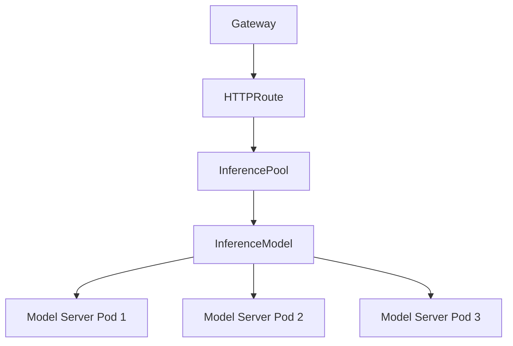

# How to Configure Kubernetes Gateway API Inference Extension with Istio

Author: [nawazdhandala](https://github.com/nawazdhandala)

Tags: Istio, Gateway API, Inference Extension, AI, Kubernetes, Machine Learning

Description: Configure the Kubernetes Gateway API Inference Extension with Istio to route and manage traffic to AI model serving backends intelligently.

---

The Kubernetes Gateway API Inference Extension is a relatively new addition to the Gateway API ecosystem. It provides purpose-built traffic routing for AI and machine learning inference workloads. If you are running model serving infrastructure on Kubernetes with Istio, this extension gives you routing capabilities specifically designed for ML inference patterns - things like model-aware routing, request queuing, and load-based traffic distribution across model replicas.

This is particularly relevant as more teams deploy LLMs, computer vision models, and other ML models on Kubernetes and need smarter routing than standard HTTP load balancing provides.

## What the Inference Extension Does

Standard HTTP routing treats every request the same. But inference workloads have unique characteristics:

- Requests can vary dramatically in processing time (a simple classification takes milliseconds, an LLM generation takes seconds)
- GPU utilization matters more than CPU for routing decisions
- Model versions need explicit routing (you might run the same model at different quantization levels)
- Batching efficiency depends on routing similar requests to the same backend

The Gateway API Inference Extension adds custom resource types that understand these patterns.

## Prerequisites

You need:

- Kubernetes 1.28+
- Istio 1.22+ with Gateway API support enabled
- Gateway API CRDs (standard + experimental)
- The Inference Extension CRDs

Install the Gateway API experimental CRDs (required for the extension):

```bash
kubectl apply -f https://github.com/kubernetes-sigs/gateway-api/releases/download/v1.2.0/experimental-install.yaml
```

Install the Inference Extension CRDs:

```bash
kubectl apply -f https://github.com/kubernetes-sigs/gateway-api-inference-extension/releases/latest/download/manifests.yaml
```

## Core Concepts

The Inference Extension introduces several new resource types:



- **InferencePool:** A group of model server pods that can serve inference requests
- **InferenceModel:** Defines a model and its routing behavior, referencing an InferencePool

## Setting Up an InferencePool

An InferencePool groups your model serving pods. Think of it like a Kubernetes Service, but with inference-specific configuration:

```yaml
apiVersion: inference.networking.x-k8s.io/v1alpha2
kind: InferencePool
metadata:
  name: llm-pool
  namespace: ml-serving
spec:
  targetPortNumber: 8000
  selector:
    matchLabels:
      app: vllm-server
  extensionRef:
    name: inference-gateway-ext
```

The `selector` matches pods running your model server (vLLM, Triton, TGI, etc.). The `targetPortNumber` is the port your model server listens on.

## Deploying Model Server Pods

Deploy your model serving backend. Here is an example using vLLM:

```yaml
apiVersion: apps/v1
kind: Deployment
metadata:
  name: vllm-server
  namespace: ml-serving
spec:
  replicas: 3
  selector:
    matchLabels:
      app: vllm-server
  template:
    metadata:
      labels:
        app: vllm-server
    spec:
      containers:
        - name: vllm
          image: vllm/vllm-openai:latest
          args:
            - "--model"
            - "meta-llama/Llama-3-8b"
            - "--port"
            - "8000"
          ports:
            - containerPort: 8000
          resources:
            limits:
              nvidia.com/gpu: 1
            requests:
              nvidia.com/gpu: 1
              cpu: 4
              memory: 16Gi
---
apiVersion: v1
kind: Service
metadata:
  name: vllm-server
  namespace: ml-serving
spec:
  selector:
    app: vllm-server
  ports:
    - port: 8000
      targetPort: 8000
      name: http
```

## Creating an InferenceModel

The InferenceModel resource defines a model and how it should be routed:

```yaml
apiVersion: inference.networking.x-k8s.io/v1alpha2
kind: InferenceModel
metadata:
  name: llama-3-8b
  namespace: ml-serving
spec:
  modelName: meta-llama/Llama-3-8b
  criticality: Critical
  poolRef:
    name: llm-pool
```

The `modelName` field is used for routing. When a request comes in with a model name that matches, it gets routed to the appropriate InferencePool.

You can define multiple models with different criticality levels:

```yaml
apiVersion: inference.networking.x-k8s.io/v1alpha2
kind: InferenceModel
metadata:
  name: llama-3-8b-standard
  namespace: ml-serving
spec:
  modelName: meta-llama/Llama-3-8b
  criticality: Standard
  poolRef:
    name: llm-pool
---
apiVersion: inference.networking.x-k8s.io/v1alpha2
kind: InferenceModel
metadata:
  name: embedding-model
  namespace: ml-serving
spec:
  modelName: sentence-transformers/all-MiniLM-L6-v2
  criticality: Critical
  poolRef:
    name: embedding-pool
```

The `criticality` field (`Critical`, `Standard`, or `Sheddable`) determines priority during high load. Critical requests are served first; Sheddable requests can be dropped.

## Connecting to the Gateway

Create a Gateway and HTTPRoute that routes to the InferencePool:

```yaml
apiVersion: gateway.networking.k8s.io/v1
kind: Gateway
metadata:
  name: inference-gateway
  namespace: ml-serving
spec:
  gatewayClassName: istio
  listeners:
    - name: http
      protocol: HTTP
      port: 80
      allowedRoutes:
        namespaces:
          from: Same
---
apiVersion: gateway.networking.k8s.io/v1
kind: HTTPRoute
metadata:
  name: inference-route
  namespace: ml-serving
spec:
  parentRefs:
    - name: inference-gateway
  rules:
    - matches:
        - path:
            type: PathPrefix
            value: /v1
      backendRefs:
        - group: inference.networking.x-k8s.io
          kind: InferencePool
          name: llm-pool
          port: 8000
```

The HTTPRoute points its `backendRefs` to the InferencePool instead of a regular Kubernetes Service. This is the key integration point.

## How Model-Aware Routing Works

When a client sends a request to the OpenAI-compatible API endpoint:

```bash
curl -X POST http://inference-gateway.ml-serving/v1/chat/completions \
  -H "Content-Type: application/json" \
  -d '{
    "model": "meta-llama/Llama-3-8b",
    "messages": [{"role": "user", "content": "Hello"}],
    "max_tokens": 100
  }'
```

The inference extension:

1. Parses the request body to extract the `model` field
2. Matches it against registered InferenceModel resources
3. Routes to the appropriate InferencePool
4. Selects the best backend pod based on current load and capacity

## Load-Aware Routing

The extension can route based on backend load metrics rather than simple round-robin:

```yaml
apiVersion: inference.networking.x-k8s.io/v1alpha2
kind: InferencePool
metadata:
  name: llm-pool
  namespace: ml-serving
spec:
  targetPortNumber: 8000
  selector:
    matchLabels:
      app: vllm-server
  extensionRef:
    name: inference-gateway-ext
```

The extension server queries each backend for its current queue depth, active request count, and GPU utilization, then routes new requests to the least loaded backend. This is much more effective than round-robin for inference workloads where request durations vary wildly.

## Deploying the Extension Server

The extension server runs as a sidecar or standalone deployment that processes routing decisions:

```yaml
apiVersion: apps/v1
kind: Deployment
metadata:
  name: inference-gateway-ext
  namespace: ml-serving
spec:
  replicas: 1
  selector:
    matchLabels:
      app: inference-gateway-ext
  template:
    metadata:
      labels:
        app: inference-gateway-ext
    spec:
      containers:
        - name: ext-server
          image: us-docker.pkg.dev/k8s-staging-gateway-api/gateway-api-inference-extension/epp:main
          ports:
            - containerPort: 9002
          args:
            - "--grpcPort=9002"
            - "--grpcHealthPort=9003"
---
apiVersion: v1
kind: Service
metadata:
  name: inference-gateway-ext
  namespace: ml-serving
spec:
  selector:
    app: inference-gateway-ext
  ports:
    - port: 9002
      targetPort: 9002
      name: grpc
```

## Monitoring Inference Traffic

Track inference-specific metrics:

```bash
# Requests per model
sum(rate(istio_requests_total{
  destination_service="vllm-server.ml-serving.svc.cluster.local"
}[5m])) by (destination_workload)
```

For model-level metrics, your model serving framework (vLLM, Triton) typically exports Prometheus metrics:

```text
# vLLM metrics
vllm:num_requests_running
vllm:num_requests_waiting
vllm:gpu_cache_usage_perc
```

## Practical Tips

- Start with a single InferencePool and model before adding complexity
- Use `criticality` levels to protect production traffic during peak load
- Monitor GPU utilization to understand when you need more replicas
- The extension is still in alpha, so expect API changes between releases
- Test routing behavior under load to verify the extension chooses backends correctly

The Gateway API Inference Extension bridges the gap between standard Kubernetes networking and the unique requirements of ML inference workloads. Combined with Istio's traffic management capabilities, it gives you a production-ready platform for serving AI models at scale with intelligent routing.
