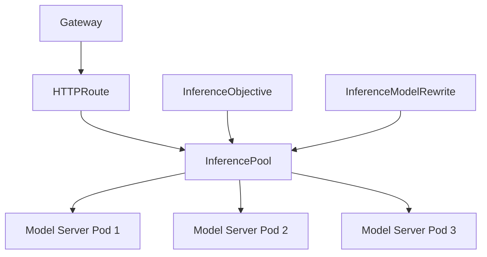

# How to Configure Kubernetes Gateway API Inference Extension with Istio

Author: [nawazdhandala](https://github.com/nawazdhandala)

Tags: Istio, Gateway API, Inference Extension, AI, Kubernetes, Machine Learning

Description: Configure the Kubernetes Gateway API Inference Extension with Istio to route and manage traffic to AI model serving backends intelligently.

---

The Kubernetes Gateway API Inference Extension is a relatively new addition to the Gateway API ecosystem. It provides purpose-built traffic routing for AI and machine learning inference workloads. If you are running model serving infrastructure on Kubernetes with Istio, this extension gives you routing capabilities specifically designed for ML inference patterns - things like model-aware rewrites, request queuing, and load-based traffic distribution across model replicas.

This is particularly relevant as more teams deploy LLMs, computer vision models, and other ML models on Kubernetes and need smarter routing than standard HTTP load balancing provides.

## What the Inference Extension Does

Standard HTTP routing treats every request the same. But inference workloads have unique characteristics:

- Requests can vary dramatically in processing time (a simple classification takes milliseconds, an LLM generation takes seconds)
- GPU utilization matters more than CPU for routing decisions
- Model versions need explicit routing (you might run the same model at different quantization levels)
- Batching efficiency depends on routing similar requests to the same backend

The Gateway API Inference Extension adds custom resource types that understand these patterns.

## Prerequisites

You need:

- Kubernetes 1.28+
- Istio 1.28+ with Gateway API Inference Extension support enabled
- Gateway API CRDs
- The Inference Extension CRDs

Install Istio with Gateway API Inference Extension support:

```bash
istioctl install --set profile=minimal \
  --set values.pilot.env.SUPPORT_GATEWAY_API_INFERENCE_EXTENSION=true \
  --set values.pilot.env.ENABLE_GATEWAY_API_INFERENCE_EXTENSION=true \
  -y
```

Install the Gateway API CRDs:

```bash
kubectl apply --server-side -f https://github.com/kubernetes-sigs/gateway-api/releases/download/v1.5.1/standard-install.yaml
```

Install the Inference Extension CRDs:

```bash
kubectl apply -f https://github.com/kubernetes-sigs/gateway-api-inference-extension/releases/latest/download/manifests.yaml
```

## Core Concepts

The Inference Extension introduces several new resource types:


```mermaid
graph TD
    A[Gateway] --> B[HTTPRoute]
    B --> C[InferencePool]
    C --> D[Model Server Pod 1]
    C --> E[Model Server Pod 2]
    C --> F[Model Server Pod 3]
    G[InferenceObjective] --> C
    H[InferenceModelRewrite] --> C
```

- **InferencePool:** A group of model server pods that can serve inference requests
- **InferenceObjective:** Defines request priority for traffic that uses an InferencePool
- **InferenceModelRewrite:** Defines model-name matching and optional rewrites within an InferencePool

## Setting Up an InferencePool

An InferencePool groups your model serving pods. Think of it like a Kubernetes Service, but with inference-specific configuration:

```yaml
apiVersion: inference.networking.k8s.io/v1
kind: InferencePool
metadata:
  name: llm-pool
  namespace: ml-serving
spec:
  targetPorts:
    - number: 8000
  selector:
    matchLabels:
      app: vllm-server
  endpointPickerRef:
    name: endpoint-picker
    port:
      number: 9002
```

The `selector` matches pods running your model server (vLLM, Triton, TGI, etc.). The `targetPorts` list contains the ports your model server listens on, and `endpointPickerRef` points to the Endpoint Picker service that makes routing decisions.

## Deploying Model Server Pods

Deploy your model serving backend. Here is an example using a vLLM-compatible simulator:

```yaml
apiVersion: apps/v1
kind: Deployment
metadata:
  name: vllm-server
  namespace: ml-serving
spec:
  replicas: 3
  selector:
    matchLabels:
      app: vllm-server
  template:
    metadata:
      labels:
        app: vllm-server
    spec:
      containers:
        - name: vllm-sim
          image: ghcr.io/llm-d/llm-d-inference-sim:v0.7.1
          args:
            - "--model"
            - "meta-llama/Llama-3.1-8B-Instruct"
            - "--port"
            - "8000"
          ports:
            - containerPort: 8000
              name: http-inference
          env:
            - name: POD_NAME
              valueFrom:
                fieldRef:
                  fieldPath: metadata.name
            - name: NAMESPACE
              valueFrom:
                fieldRef:
                  fieldPath: metadata.namespace
            - name: POD_IP
              valueFrom:
                fieldRef:
                  fieldPath: status.podIP
          resources:
            requests:
              cpu: 20m
---
apiVersion: v1
kind: Service
metadata:
  name: vllm-server
  namespace: ml-serving
spec:
  selector:
    app: vllm-server
  ports:
    - port: 8000
      targetPort: 8000
      name: http-inference
```

## Creating an InferenceObjective

The InferenceObjective resource defines a serving objective for requests that use an InferencePool:

```yaml
apiVersion: inference.networking.x-k8s.io/v1alpha2
kind: InferenceObjective
metadata:
  name: critical
  namespace: ml-serving
spec:
  priority: 10
  poolRef:
    group: inference.networking.k8s.io
    kind: InferencePool
    name: llm-pool
```

Clients select an objective by sending the `x-gateway-inference-objective` header with the InferenceObjective name. If no objective is selected, the Endpoint Picker treats the request as priority `0`.

You can define multiple objectives with different priorities:

```yaml
apiVersion: inference.networking.x-k8s.io/v1alpha2
kind: InferenceObjective
metadata:
  name: standard
  namespace: ml-serving
spec:
  priority: 0
  poolRef:
    group: inference.networking.k8s.io
    kind: InferencePool
    name: llm-pool
---
apiVersion: inference.networking.x-k8s.io/v1alpha2
kind: InferenceObjective
metadata:
  name: batch
  namespace: ml-serving
spec:
  priority: -10
  poolRef:
    group: inference.networking.k8s.io
    kind: InferencePool
    name: llm-pool
```

The `priority` field determines ordering during high load. Higher-priority requests are served before lower-priority requests when flow control queues traffic.

To match or rewrite model names in OpenAI-compatible request bodies, use `InferenceModelRewrite`:

```yaml
apiVersion: inference.networking.x-k8s.io/v1alpha2
kind: InferenceModelRewrite
metadata:
  name: llama-model-rewrite
  namespace: ml-serving
spec:
  poolRef:
    group: inference.networking.k8s.io
    kind: InferencePool
    name: llm-pool
  rules:
    - matches:
        - model:
            type: Exact
            value: llama-3
      targets:
        - modelRewrite: meta-llama/Llama-3.1-8B-Instruct
```

## Connecting to the Gateway

Create a Gateway and HTTPRoute that routes to the InferencePool:

```yaml
apiVersion: gateway.networking.k8s.io/v1
kind: Gateway
metadata:
  name: inference-gateway
  namespace: ml-serving
spec:
  gatewayClassName: istio
  listeners:
    - name: http
      protocol: HTTP
      port: 80
      allowedRoutes:
        namespaces:
          from: Same
---
apiVersion: gateway.networking.k8s.io/v1
kind: HTTPRoute
metadata:
  name: inference-route
  namespace: ml-serving
spec:
  parentRefs:
    - name: inference-gateway
  rules:
    - matches:
        - path:
            type: PathPrefix
            value: /v1
      backendRefs:
        - group: inference.networking.k8s.io
          kind: InferencePool
          name: llm-pool
```

The HTTPRoute points its `backendRefs` to the InferencePool instead of a regular Kubernetes Service. This is the key integration point.

## How Model-Aware Routing Works

When a client sends a request to the OpenAI-compatible API endpoint:

```bash
curl -X POST http://inference-gateway.ml-serving/v1/chat/completions \
  -H "Content-Type: application/json" \
  -H "x-gateway-inference-objective: critical" \
  -d '{
    "model": "llama-3",
    "messages": [{"role": "user", "content": "Hello"}],
    "max_tokens": 100
  }'
```

The inference extension:

1. Receives the request through the HTTPRoute that references the InferencePool
2. Applies any matching InferenceModelRewrite rules to the `model` field
3. Applies the priority from the `x-gateway-inference-objective` header if it is present
4. Selects the best backend pod based on current load and capacity

## Load-Aware Routing

The extension can route based on backend load metrics rather than simple round-robin:

```yaml
apiVersion: inference.networking.k8s.io/v1
kind: InferencePool
metadata:
  name: llm-pool
  namespace: ml-serving
spec:
  targetPorts:
    - number: 8000
  selector:
    matchLabels:
      app: vllm-server
  endpointPickerRef:
    name: endpoint-picker
    port:
      number: 9002
```

The Endpoint Picker tracks backend metrics such as queue depth, KV-cache utilization, prefix-cache locality, and active LoRA adapters, then routes new requests to the best backend for the configured scoring profile. This is much more effective than round-robin for inference workloads where request durations vary wildly.

## Deploying the Endpoint Picker

The Endpoint Picker runs as a standalone deployment that processes routing decisions:

```yaml
apiVersion: apps/v1
kind: Deployment
metadata:
  name: endpoint-picker
  namespace: ml-serving
spec:
  replicas: 1
  selector:
    matchLabels:
      app: endpoint-picker
  template:
    metadata:
      labels:
        app: endpoint-picker
    spec:
      containers:
        - name: epp
          image: us-central1-docker.pkg.dev/k8s-staging-images/gateway-api-inference-extension/epp:v20251119-2aaf2a6
          ports:
            - containerPort: 9002
            - containerPort: 9003
            - name: metrics
              containerPort: 9090
          args:
            - "--pool-name"
            - "llm-pool"
            - "--pool-namespace"
            - "ml-serving"
            - "--v"
            - "4"
            - "--zap-encoder"
            - "json"
            - "--config-file"
            - "/config/default-plugins.yaml"
          volumeMounts:
            - name: plugins-config-volume
              mountPath: "/config"
      volumes:
        - name: plugins-config-volume
          configMap:
            name: plugins-config
---
apiVersion: v1
kind: Service
metadata:
  name: endpoint-picker
  namespace: ml-serving
spec:
  selector:
    app: endpoint-picker
  ports:
    - port: 9002
      targetPort: 9002
      appProtocol: http2
      name: grpc
---
apiVersion: v1
kind: ConfigMap
metadata:
  name: plugins-config
  namespace: ml-serving
data:
  default-plugins.yaml: |
    apiVersion: inference.networking.x-k8s.io/v1alpha1
    kind: EndpointPickerConfig
    plugins:
    - type: queue-scorer
    - type: kv-cache-utilization-scorer
    - type: prefix-cache-scorer
    schedulingProfiles:
    - name: default
      plugins:
      - pluginRef: queue-scorer
        weight: 2
      - pluginRef: kv-cache-utilization-scorer
        weight: 2
      - pluginRef: prefix-cache-scorer
        weight: 3
---
apiVersion: networking.istio.io/v1
kind: DestinationRule
metadata:
  name: endpoint-picker-tls
  namespace: ml-serving
spec:
  host: endpoint-picker
  trafficPolicy:
    tls:
      mode: SIMPLE
      insecureSkipVerify: true
---
apiVersion: rbac.authorization.k8s.io/v1
kind: Role
metadata:
  name: inference-model-reader
  namespace: ml-serving
rules:
  - apiGroups: ["inference.networking.k8s.io"]
    resources: ["inferencepools"]
    verbs: ["get", "list", "watch"]
  - apiGroups: [""]
    resources: ["pods"]
    verbs: ["get", "list", "watch"]
---
apiVersion: rbac.authorization.k8s.io/v1
kind: RoleBinding
metadata:
  name: epp-to-inference-model-reader
  namespace: ml-serving
subjects:
  - kind: ServiceAccount
    name: default
    namespace: ml-serving
roleRef:
  kind: Role
  name: inference-model-reader
  apiGroup: rbac.authorization.k8s.io
```

## Monitoring Inference Traffic

Track inference-specific metrics:

```bash
# Requests per model

sum(rate(istio_requests_total{
  destination_service="vllm-server.ml-serving.svc.cluster.local"
}[5m])) by (destination_workload)
```

For model-level metrics, your model serving framework (vLLM, Triton) typically exports Prometheus metrics:

```text
# vLLM metrics
vllm:num_requests_running
vllm:num_requests_waiting
vllm:gpu_cache_usage_perc
```

## Practical Tips

- Start with a single InferencePool and Endpoint Picker before adding complexity
- Use InferenceObjective priorities to protect production traffic during peak load
- Monitor GPU utilization to understand when you need more replicas
- InferenceObjective and InferenceModelRewrite are still alpha, so expect API changes between releases
- Test routing behavior under load to verify the extension chooses backends correctly

The Gateway API Inference Extension bridges the gap between standard Kubernetes networking and the unique requirements of ML inference workloads. Combined with Istio's traffic management capabilities, it gives you a Kubernetes-native path for serving AI models at scale with intelligent routing.
