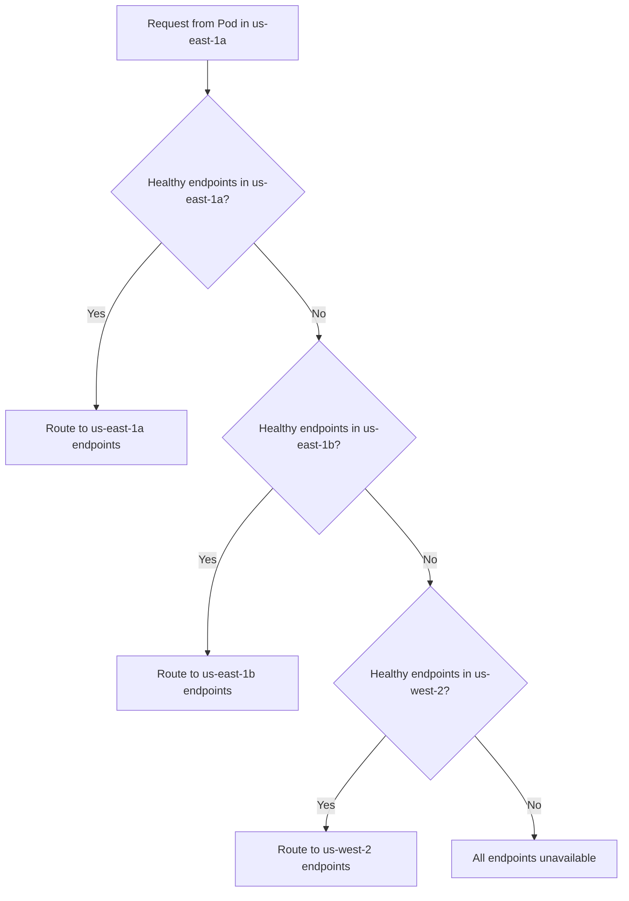

# How to Configure Locality-Based Load Balancing in Istio

Author: [nawazdhandala](https://github.com/nawazdhandala)

Tags: Istio, Locality Load Balancing, Service Mesh, Kubernetes, Multi-Region

Description: Configure Istio locality-based load balancing to route traffic to the nearest service instances, reducing latency and network costs.

---

When your Kubernetes cluster spans multiple zones or regions, you do not want a request from a pod in us-east-1a to hit a service instance running in eu-west-1b if there is a perfectly good instance right next door in us-east-1a. That extra network hop adds latency and costs money.

Istio's locality load balancing solves this by preferring service instances that are topologically close to the caller. Requests stay local when possible and only spill over to other zones or regions when local capacity is not enough.

## How Locality Works in Kubernetes and Istio

Every Kubernetes node has topology labels that identify its region and zone:

```bash
kubectl get nodes --show-labels | grep -E "topology.kubernetes.io"
```

You will see labels like:

```
topology.kubernetes.io/region=us-east-1
topology.kubernetes.io/zone=us-east-1a
```

Istio reads these labels automatically. When a sidecar proxy needs to route a request, it knows which region and zone the calling pod is in, and it knows which region and zone each destination pod is in. With locality load balancing enabled, Istio uses this information to prefer nearby endpoints.

## Locality Hierarchy

Istio uses a three-level locality hierarchy:

```
Region / Zone / Sub-zone
```

For example: `us-east-1/us-east-1a/rack1`

Traffic prefers endpoints in this order:
1. Same region, same zone, same sub-zone
2. Same region, same zone, different sub-zone
3. Same region, different zone
4. Different region (failover)

## Enabling Locality Load Balancing

Locality load balancing is controlled through DestinationRule resources. There are two modes: **failover** and **distribute**.

### Failover Mode

In failover mode, traffic goes to the local zone first. If there are not enough healthy endpoints locally, it fails over to the next closest locality.

```yaml
apiVersion: networking.istio.io/v1
kind: DestinationRule
metadata:
  name: inventory-service
spec:
  host: inventory-service
  trafficPolicy:
    connectionPool:
      http:
        h2UpgradePolicy: DEFAULT
    outlierDetection:
      consecutive5xxErrors: 5
      interval: 30s
      baseEjectionTime: 30s
    loadBalancer:
      localityLbSetting:
        enabled: true
        failover:
          - from: us-east-1
            to: us-west-2
          - from: us-west-2
            to: us-east-1
      simple: ROUND_ROBIN
```

The `failover` section defines which region to try next. If endpoints in us-east-1 are unhealthy, traffic goes to us-west-2.

**Important:** Outlier detection is required for locality load balancing to work. Without it, Istio cannot determine which endpoints are unhealthy, and the failover logic will not trigger.

### Distribute Mode

Distribute mode lets you specify exact percentages for how traffic should be split across localities:

```yaml
apiVersion: networking.istio.io/v1
kind: DestinationRule
metadata:
  name: inventory-service
spec:
  host: inventory-service
  trafficPolicy:
    outlierDetection:
      consecutive5xxErrors: 5
      interval: 30s
      baseEjectionTime: 30s
    loadBalancer:
      localityLbSetting:
        enabled: true
        distribute:
          - from: "us-east-1/us-east-1a/*"
            to:
              "us-east-1/us-east-1a/*": 80
              "us-east-1/us-east-1b/*": 20
          - from: "us-east-1/us-east-1b/*"
            to:
              "us-east-1/us-east-1b/*": 80
              "us-east-1/us-east-1a/*": 20
      simple: ROUND_ROBIN
```

This keeps 80% of traffic in the local zone and sends 20% to another zone. You might use this to ensure both zones get enough traffic to stay warm.

## A Complete Example

Suppose you have a `user-profile` service deployed across two regions and three zones:

```yaml
# us-east-1a deployment
apiVersion: apps/v1
kind: Deployment
metadata:
  name: user-profile-us-east-1a
spec:
  replicas: 3
  selector:
    matchLabels:
      app: user-profile
  template:
    metadata:
      labels:
        app: user-profile
    spec:
      nodeSelector:
        topology.kubernetes.io/zone: us-east-1a
      containers:
        - name: user-profile
          image: myregistry/user-profile:1.0.0
          ports:
            - containerPort: 8080
---
# us-east-1b deployment
apiVersion: apps/v1
kind: Deployment
metadata:
  name: user-profile-us-east-1b
spec:
  replicas: 3
  selector:
    matchLabels:
      app: user-profile
  template:
    metadata:
      labels:
        app: user-profile
    spec:
      nodeSelector:
        topology.kubernetes.io/zone: us-east-1b
      containers:
        - name: user-profile
          image: myregistry/user-profile:1.0.0
          ports:
            - containerPort: 8080
```

Now apply the DestinationRule with locality settings:

```yaml
apiVersion: networking.istio.io/v1
kind: DestinationRule
metadata:
  name: user-profile
spec:
  host: user-profile
  trafficPolicy:
    outlierDetection:
      consecutive5xxErrors: 3
      interval: 10s
      baseEjectionTime: 30s
      maxEjectionPercent: 50
    loadBalancer:
      localityLbSetting:
        enabled: true
        failover:
          - from: us-east-1
            to: us-west-2
      simple: ROUND_ROBIN
```

```bash
kubectl apply -f user-profile-destinationrule.yaml
```

## Verifying Locality Load Balancing

Check which endpoints Envoy knows about and their priorities:

```bash
istioctl proxy-config endpoint <pod-name> --cluster "outbound|80||user-profile.default.svc.cluster.local"
```

The output includes a `LOCALITY` column showing the region/zone for each endpoint and a `PRIORITY` column. Lower priority numbers are preferred:

```
ENDPOINT            STATUS   OUTLIER  CLUSTER   PRIORITY  LOCALITY
10.0.1.5:8080       HEALTHY  OK       ...       0         us-east-1/us-east-1a
10.0.1.6:8080       HEALTHY  OK       ...       0         us-east-1/us-east-1a
10.0.2.5:8080       HEALTHY  OK       ...       1         us-east-1/us-east-1b
10.0.3.5:8080       HEALTHY  OK       ...       2         us-west-2/us-west-2a
```

Priority 0 endpoints get traffic first. Only when they are unhealthy does traffic spill over to priority 1, and so on.

## Locality Load Balancing Flow



## Common Issues

**Locality load balancing not working at all.** The most common cause is missing outlier detection. It must be configured for locality-aware routing to activate.

**Uneven traffic distribution.** If one zone has 10 pods and another has 2, the zone with 2 pods can get overwhelmed when traffic spills over. Make sure replica counts are roughly proportional across zones.

**Sub-zone labels missing.** Sub-zones are not standard Kubernetes labels. If you need sub-zone routing, you have to add custom labels to your nodes and configure Istio to recognize them.

Locality load balancing is one of those Istio features that is easy to configure but makes a big difference in production. Lower latency, lower network costs, and automatic failover across zones and regions - all from a DestinationRule configuration.
