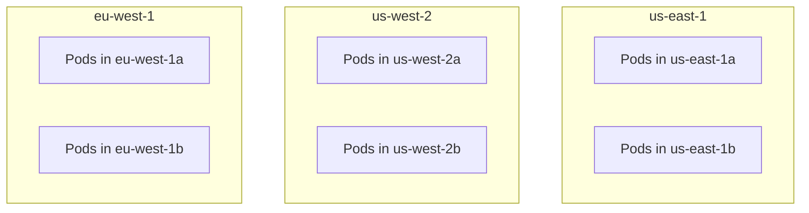

# How to Configure Locality Load Balancing for Multi-Region Deployments

Author: [nawazdhandala](https://github.com/nawazdhandala)

Tags: Istio, Multi-Region, Locality Load Balancing, Kubernetes, High Availability

Description: Set up Istio locality load balancing for multi-region Kubernetes deployments to keep traffic local and define failover paths between regions.

---

Running Kubernetes across multiple regions is the gold standard for high availability. If an entire AWS region goes down (and yes, it happens), your users in other regions keep working. But multi-region comes with a challenge: how do you route traffic efficiently so that requests stay local when possible and fail over gracefully when needed?

Istio's locality load balancing is designed for exactly this scenario. It keeps traffic in the local region to minimize latency, automatically detects when local endpoints are unhealthy, and redirects traffic to other regions based on the failover rules you define.

## Multi-Region Architecture Overview

A typical multi-region setup looks like this:



Each region has the same services deployed, and you want:
- Traffic in us-east-1 to stay in us-east-1
- Traffic in eu-west-1 to stay in eu-west-1
- If a region fails, traffic goes to the designated failover region

## Setting Up Multi-Region with Istio Multi-Cluster

For locality load balancing to work across regions, Istio needs to know about endpoints in all regions. There are two ways to achieve this:

### Option 1: Multi-Cluster Mesh

With Istio multi-cluster, each region runs its own Kubernetes cluster and Istio control plane. The control planes exchange endpoint information through east-west gateways.

```bash
# On cluster in us-east-1
istioctl install --set profile=default \
  --set values.global.meshID=my-mesh \
  --set values.global.multiCluster.clusterName=us-east-1 \
  --set values.global.network=network1

# Create east-west gateway
istioctl install -f eastwest-gateway.yaml --set values.global.meshID=my-mesh

# Create remote secret for cluster discovery
istioctl create-remote-secret --name=us-east-1 | kubectl apply -f - --context=us-west-2
```

### Option 2: Single Cluster Spanning Regions

Some managed Kubernetes services support clusters that span regions. In this case, you have one Istio control plane with nodes in multiple regions. Locality load balancing works out of the box.

For either approach, the DestinationRule configuration is the same.

## Configuring Multi-Region Locality Load Balancing

### Basic Multi-Region Failover

```yaml
apiVersion: networking.istio.io/v1
kind: DestinationRule
metadata:
  name: checkout-service
spec:
  host: checkout-service
  trafficPolicy:
    outlierDetection:
      consecutive5xxErrors: 3
      interval: 10s
      baseEjectionTime: 30s
      maxEjectionPercent: 100
    loadBalancer:
      localityLbSetting:
        enabled: true
        failover:
          - from: us-east-1
            to: us-west-2
          - from: us-west-2
            to: us-east-1
          - from: eu-west-1
            to: eu-central-1
          - from: eu-central-1
            to: eu-west-1
      simple: ROUND_ROBIN
```

This configuration creates two failover groups:
- US regions failover to each other
- EU regions failover to each other

This is a common pattern that keeps failover traffic on the same continent, minimizing latency impact.

### Cross-Continental Failover

If you only have one EU region, you might want it to failover to the US:

```yaml
failover:
  - from: us-east-1
    to: us-west-2
  - from: us-west-2
    to: us-east-1
  - from: eu-west-1
    to: us-east-1
```

## Multi-Region with Weighted Distribution

For services that are latency-sensitive, use distribute mode to keep most traffic local while sending a small percentage cross-region for warmth:

```yaml
apiVersion: networking.istio.io/v1
kind: DestinationRule
metadata:
  name: checkout-service
spec:
  host: checkout-service
  trafficPolicy:
    outlierDetection:
      consecutive5xxErrors: 3
      interval: 10s
      baseEjectionTime: 30s
      maxEjectionPercent: 100
    loadBalancer:
      localityLbSetting:
        enabled: true
        distribute:
          - from: "us-east-1/*"
            to:
              "us-east-1/*": 90
              "us-west-2/*": 10
          - from: "us-west-2/*"
            to:
              "us-west-2/*": 90
              "us-east-1/*": 10
          - from: "eu-west-1/*"
            to:
              "eu-west-1/*": 95
              "us-east-1/*": 5
      simple: ROUND_ROBIN
```

EU gets a higher local percentage (95%) because cross-Atlantic latency is higher than cross-US latency.

## Deploying Services Across Regions

Make sure each region has enough replicas to handle both its local traffic and potential failover traffic:

```yaml
apiVersion: apps/v1
kind: Deployment
metadata:
  name: checkout-service
  namespace: default
spec:
  replicas: 10
  selector:
    matchLabels:
      app: checkout-service
  template:
    metadata:
      labels:
        app: checkout-service
    spec:
      topologySpreadConstraints:
        - maxSkew: 1
          topologyKey: topology.kubernetes.io/zone
          whenUnsatisfiable: DoNotSchedule
          labelSelector:
            matchLabels:
              app: checkout-service
      containers:
        - name: checkout-service
          image: myregistry/checkout-service:1.0.0
          ports:
            - containerPort: 8080
          resources:
            requests:
              cpu: 500m
              memory: 256Mi
            limits:
              cpu: 1000m
              memory: 512Mi
```

Deploy this in each region's cluster with appropriate replica counts.

## Capacity Planning for Multi-Region

The critical question for multi-region failover is: can the failover region handle the extra load?

Use this approach:

```text
Failover region capacity needed =
  Local traffic + (Primary region traffic * expected failover percentage)
```

If us-east-1 handles 10,000 rps and us-west-2 handles 5,000 rps, then us-west-2 needs capacity for 15,000 rps during a failover event.

Set up HPA with room to scale:

```yaml
apiVersion: autoscaling/v2
kind: HorizontalPodAutoscaler
metadata:
  name: checkout-service
spec:
  scaleTargetRef:
    apiVersion: apps/v1
    kind: Deployment
    name: checkout-service
  minReplicas: 10
  maxReplicas: 50
  metrics:
    - type: Resource
      resource:
        name: cpu
        target:
          type: Utilization
          averageUtilization: 50
```

Note the `averageUtilization: 50` - this leaves headroom for traffic spikes during failover.

## Monitoring Multi-Region Traffic

Track traffic distribution across regions with Prometheus:

```text
# Requests by destination region (approximate using workload labels)
sum(rate(istio_requests_total{
  destination_service="checkout-service.default.svc.cluster.local"
}[5m])) by (source_workload, destination_workload)
```

Set up alerts for cross-region traffic, which indicates either intentional distribution or failover:

```yaml
apiVersion: monitoring.coreos.com/v1
kind: PrometheusRule
metadata:
  name: multi-region-alerts
spec:
  groups:
    - name: multi-region
      rules:
        - alert: RegionFailoverActive
          expr: |
            sum(rate(istio_requests_total{
              destination_service="checkout-service.default.svc.cluster.local",
              source_cluster!="",
              destination_cluster!=""
            }[5m])) > 0
          for: 5m
          labels:
            severity: warning
          annotations:
            summary: "Cross-region traffic detected for checkout-service"
```

## Handling Database Consistency Across Regions

Locality load balancing routes service traffic, but your services also depend on databases. Cross-region database access introduces its own latency and consistency challenges.

Common patterns:

1. **Read replicas per region:** Each region has a local read replica. Writes go to the primary in one region.

2. **Multi-region database:** Use CockroachDB, Spanner, or YugabyteDB for multi-region active-active.

3. **Region-pinned data:** Users are assigned to a region, and their data lives in that region's database.

Make sure your locality load balancing config aligns with your database topology. It does not help to route a request locally if it then makes a cross-region database call.

## Testing Multi-Region Failover

### Simulate Region Failure

Scale down all pods in one region:

```bash
kubectl --context=us-east-1 scale deployment checkout-service --replicas=0
```

Watch traffic shift to the failover region:

```bash
kubectl --context=us-west-2 logs -l app=checkout-service --tail=20 -f
```

### Simulate Partial Failure

Use Istio fault injection to make one region return errors:

```yaml
apiVersion: networking.istio.io/v1
kind: VirtualService
metadata:
  name: checkout-service-fault
spec:
  hosts:
    - checkout-service
  http:
    - fault:
        abort:
          httpStatus: 503
          percentage:
            value: 100
      route:
        - destination:
            host: checkout-service
```

Apply this in the us-east-1 cluster only. Traffic should failover to us-west-2.

## Recovery After Failover

When the failed region recovers, Istio automatically starts sending traffic back to it as endpoints pass outlier detection checks. The recovery is gradual - Envoy does not immediately send 100% of traffic back. It reintroduces the recovered endpoints slowly.

You can speed up recovery by reducing the `baseEjectionTime`:

```yaml
outlierDetection:
  baseEjectionTime: 15s
```

Or slow it down for a more cautious recovery:

```yaml
outlierDetection:
  baseEjectionTime: 120s
```

Multi-region locality load balancing with Istio gives you automatic, intelligent traffic routing that keeps requests fast and provides resilience against regional outages. The setup takes some effort, but the result is a deployment that handles region failures without anyone getting paged.
