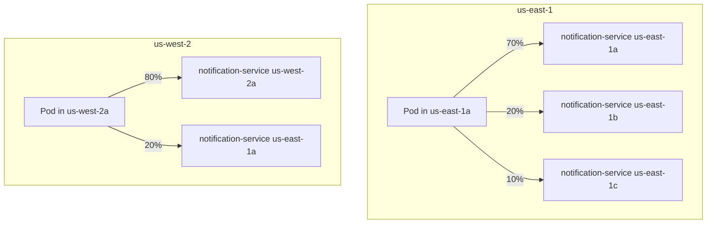

# How to Configure Locality-Weighted Load Balancing in Istio

Author: [nawazdhandala](https://github.com/nawazdhandala)

Tags: Istio, Locality Load Balancing, Traffic Distribution, Kubernetes, Service Mesh

Description: Configure weighted traffic distribution across zones and regions using Istio locality load balancing distribute settings for fine-grained control.

---

Sometimes you want more control than simple failover gives you. Maybe you want to keep 80% of traffic local and send 20% to another zone to keep it warm. Or maybe your zones have different capacities and you need to split traffic proportionally. Istio's locality-weighted distribution lets you define exact percentages for how traffic flows between localities.

This is different from failover mode, where traffic goes 100% to the local zone and only spills over when endpoints are unhealthy. With weighted distribution, you control the exact split all the time, regardless of health.

## Failover vs. Distribute

Quick comparison to make sure we are on the same page:

| Feature | Failover | Distribute |
|---------|----------|-----------|
| Traffic to local zone | 100% (when healthy) | Configurable percentage |
| Overflow behavior | Defined failover chain | Weighted across zones |
| Use case | Disaster recovery | Capacity planning, warming |
| Configuration | `failover` block | `distribute` block |

You cannot use both `failover` and `distribute` in the same DestinationRule. Pick one.

## Basic Weighted Distribution

Here is a DestinationRule that distributes traffic from each zone:

```yaml
apiVersion: networking.istio.io/v1
kind: DestinationRule
metadata:
  name: notification-service
spec:
  host: notification-service
  trafficPolicy:
    outlierDetection:
      consecutive5xxErrors: 5
      interval: 30s
      baseEjectionTime: 30s
    loadBalancer:
      localityLbSetting:
        enabled: true
        distribute:
          - from: "us-east-1/us-east-1a/*"
            to:
              "us-east-1/us-east-1a/*": 70
              "us-east-1/us-east-1b/*": 20
              "us-east-1/us-east-1c/*": 10
          - from: "us-east-1/us-east-1b/*"
            to:
              "us-east-1/us-east-1b/*": 70
              "us-east-1/us-east-1a/*": 20
              "us-east-1/us-east-1c/*": 10
          - from: "us-east-1/us-east-1c/*"
            to:
              "us-east-1/us-east-1c/*": 70
              "us-east-1/us-east-1a/*": 15
              "us-east-1/us-east-1b/*": 15
      simple: ROUND_ROBIN
```

For traffic originating from us-east-1a:
- 70% stays in us-east-1a
- 20% goes to us-east-1b
- 10% goes to us-east-1c

The percentages in the `to` section must add up to 100 for each `from` entry.

## Cross-Region Weighted Distribution

You can also distribute traffic across regions:

```yaml
apiVersion: networking.istio.io/v1
kind: DestinationRule
metadata:
  name: notification-service
spec:
  host: notification-service
  trafficPolicy:
    outlierDetection:
      consecutive5xxErrors: 5
      interval: 30s
      baseEjectionTime: 30s
    loadBalancer:
      localityLbSetting:
        enabled: true
        distribute:
          - from: "us-east-1/*"
            to:
              "us-east-1/*": 80
              "us-west-2/*": 20
          - from: "us-west-2/*"
            to:
              "us-west-2/*": 80
              "us-east-1/*": 20
      simple: ROUND_ROBIN
```

This is useful for keeping both regions warm. If us-west-2 normally gets very little traffic, it might autoscale down to minimal replicas. Then when us-east-1 fails over, us-west-2 cannot handle the sudden surge because it needs time to scale up. Sending 20% of traffic to it all the time prevents this cold-start problem.

## Matching Locality Patterns

The `from` and `to` fields use locality strings in the format `region/zone/sub-zone`. You can use wildcards:

- `"us-east-1/*"` matches any zone in us-east-1
- `"us-east-1/us-east-1a/*"` matches any sub-zone in us-east-1a
- `"*"` matches everything

Examples of valid patterns:

```yaml
distribute:
  # Region-level: all zones in us-east-1
  - from: "us-east-1/*"
    to:
      "us-east-1/*": 90
      "us-west-2/*": 10

  # Zone-level: specific zone
  - from: "us-east-1/us-east-1a/*"
    to:
      "us-east-1/us-east-1a/*": 80
      "us-east-1/us-east-1b/*": 20

  # Sub-zone level: specific rack
  - from: "us-east-1/us-east-1a/rack1"
    to:
      "us-east-1/us-east-1a/rack1": 60
      "us-east-1/us-east-1a/rack2": 40
```

## Practical Example: Capacity-Proportional Distribution

Say your zones have different node counts and therefore different service capacities:

- us-east-1a: 10 nodes, 30 pods
- us-east-1b: 5 nodes, 15 pods
- us-east-1c: 3 nodes, 9 pods

You want traffic distributed proportionally to capacity:

```yaml
apiVersion: networking.istio.io/v1
kind: DestinationRule
metadata:
  name: api-gateway
spec:
  host: api-gateway
  trafficPolicy:
    outlierDetection:
      consecutive5xxErrors: 3
      interval: 10s
      baseEjectionTime: 30s
    loadBalancer:
      localityLbSetting:
        enabled: true
        distribute:
          - from: "us-east-1/us-east-1a/*"
            to:
              "us-east-1/us-east-1a/*": 56
              "us-east-1/us-east-1b/*": 28
              "us-east-1/us-east-1c/*": 16
          - from: "us-east-1/us-east-1b/*"
            to:
              "us-east-1/us-east-1a/*": 56
              "us-east-1/us-east-1b/*": 28
              "us-east-1/us-east-1c/*": 16
          - from: "us-east-1/us-east-1c/*"
            to:
              "us-east-1/us-east-1a/*": 56
              "us-east-1/us-east-1b/*": 28
              "us-east-1/us-east-1c/*": 16
      simple: ROUND_ROBIN
```

The weights (56/28/16) roughly match the pod ratio (30/15/9). This ensures no zone gets overwhelmed while the others sit idle.

## Verifying the Distribution

After applying your DestinationRule, verify how Envoy sees the endpoints:

```bash
istioctl proxy-config endpoint <pod-name> \
  --cluster "outbound|80||notification-service.default.svc.cluster.local" -o json
```

Look at the `loadBalancingWeight` field for each endpoint group. The weights should reflect your configured distribution.

To see actual traffic distribution, query Prometheus:

```text
sum(rate(istio_requests_total{
  destination_service="notification-service.default.svc.cluster.local",
  reporter="source"
}[5m])) by (destination_workload, source_workload)
```

## Distribution Interaction with Outlier Detection

Here is something that catches people off guard: when outlier detection ejects endpoints in one locality, the traffic that was destined for those endpoints gets redistributed to the remaining healthy localities according to their relative weights.

For example, if you have:

```yaml
distribute:
  - from: "us-east-1/*"
    to:
      "us-east-1/*": 80
      "us-west-2/*": 20
```

And all endpoints in us-east-1 get ejected, 100% of traffic goes to us-west-2 until us-east-1 endpoints recover. The distribute configuration gracefully degrades to wherever healthy endpoints exist.

## Traffic Flow Visualization



## Combining with Connection Pool Settings

For production deployments, combine locality distribution with connection pool settings to prevent overloading any single locality:

```yaml
apiVersion: networking.istio.io/v1
kind: DestinationRule
metadata:
  name: notification-service
spec:
  host: notification-service
  trafficPolicy:
    connectionPool:
      tcp:
        maxConnections: 100
      http:
        h2UpgradePolicy: DEFAULT
        http1MaxPendingRequests: 100
        http2MaxRequests: 1000
    outlierDetection:
      consecutive5xxErrors: 3
      interval: 10s
      baseEjectionTime: 30s
    loadBalancer:
      localityLbSetting:
        enabled: true
        distribute:
          - from: "us-east-1/*"
            to:
              "us-east-1/*": 80
              "us-west-2/*": 20
      simple: ROUND_ROBIN
```

## When to Use Weighted Distribution

- **Uneven zone capacities:** Match traffic to available resources
- **Keeping standby regions warm:** Send a trickle of traffic to DR regions
- **Gradual region migration:** Slowly shift traffic percentages during a migration
- **Cost optimization:** Route more traffic to cheaper regions while keeping some local
- **Testing cross-region latency:** Measure the impact of cross-region calls

Weighted locality distribution gives you precision control over where your traffic goes. It takes more thought to configure than simple failover, but for complex multi-zone or multi-region deployments, the ability to set exact percentages is worth the extra effort.
