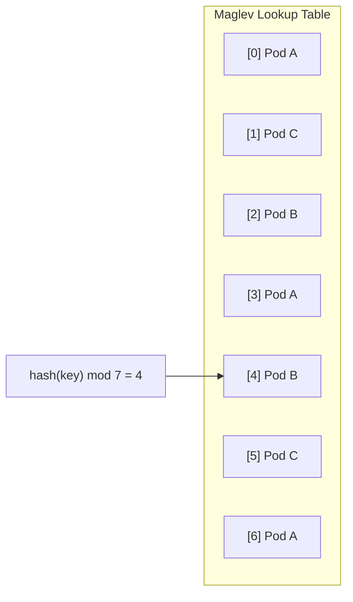

# How to Configure Maglev Load Balancing in Istio

Author: [nawazdhandala](https://github.com/nawazdhandala)

Tags: Istio, Maglev, Load Balancing, DestinationRule, Consistent Hashing

Description: Configure Maglev consistent hashing in Istio for faster lookups and more even distribution compared to ring hash load balancing.

---

Maglev is a consistent hashing algorithm originally developed at Google for their network load balancers. Istio and Envoy support it as an alternative to the default ring hash algorithm. Maglev provides faster lookups and more even distribution than ring hash, making it a good choice for high-throughput services that need session affinity.

## What Makes Maglev Different from Ring Hash

Both ring hash and maglev are consistent hashing algorithms, meaning they map requests to backends in a way that minimizes disruption when backends are added or removed. The difference is in how they do it.

Ring hash places backends at positions on a virtual ring and walks clockwise to find the nearest one. The evenness of distribution depends on the ring size, and lookups are O(log n) because you need a binary search on the sorted ring.

Maglev uses a lookup table instead of a ring. It builds a permutation table for each backend and fills a fixed-size table so that each backend gets roughly equal representation. Lookups are O(1) because you just index into the table. Distribution is more even by construction.



The request's hash value is used to index directly into the table. No ring walking, no binary search.

## Enabling Maglev in Istio

To use maglev instead of ring hash, you set the `hashFunction` in the consistent hash configuration. However, in Istio's API, the hash algorithm is controlled through Envoy's configuration. The way you select maglev is by setting the `localityLbSetting` or by using an EnvoyFilter for full control.

But the most practical approach in current Istio versions is to use the DestinationRule with consistent hash, which uses ring hash by default. To switch to maglev, you need an EnvoyFilter:

```yaml
apiVersion: networking.istio.io/v1alpha3
kind: EnvoyFilter
metadata:
  name: maglev-lb
spec:
  workloadSelector:
    labels:
      app: my-client
  configPatches:
  - applyTo: CLUSTER
    match:
      context: SIDECAR_OUTBOUND
      cluster:
        service: cache-service.default.svc.cluster.local
    patch:
      operation: MERGE
      value:
        lb_policy: MAGLEV
```

You still need a DestinationRule with consistent hash to define the hash key:

```yaml
apiVersion: networking.istio.io/v1
kind: DestinationRule
metadata:
  name: cache-service-dr
spec:
  host: cache-service
  trafficPolicy:
    loadBalancer:
      consistentHash:
        httpHeaderName: x-cache-key
```

The DestinationRule sets up the hash key extraction, and the EnvoyFilter overrides the lb_policy from RING_HASH to MAGLEV.

## Setting Up the Complete Example

First, deploy a service:

```yaml
apiVersion: v1
kind: Service
metadata:
  name: cache-service
spec:
  selector:
    app: cache-service
  ports:
  - name: http
    port: 8080
    targetPort: 8080
---
apiVersion: apps/v1
kind: Deployment
metadata:
  name: cache-service
spec:
  replicas: 8
  selector:
    matchLabels:
      app: cache-service
  template:
    metadata:
      labels:
        app: cache-service
    spec:
      containers:
      - name: app
        image: nginx:latest
        ports:
        - containerPort: 8080
```

Apply the deployment, DestinationRule, and EnvoyFilter:

```bash
kubectl apply -f cache-service.yaml
kubectl apply -f cache-service-dr.yaml
kubectl apply -f maglev-envoyfilter.yaml
```

## Verifying Maglev Is Active

Check the Envoy configuration:

```bash
istioctl proxy-config cluster <client-pod> --fqdn cache-service.default.svc.cluster.local -o json
```

You should see:

```json
{
  "lbPolicy": "MAGLEV"
}
```

If you still see `RING_HASH`, the EnvoyFilter might not be matching correctly. Double-check the cluster service name and workload selector.

## Maglev Table Size

Maglev uses a prime number for its table size. The default in Envoy is 65537. You can configure it through an EnvoyFilter:

```yaml
apiVersion: networking.istio.io/v1alpha3
kind: EnvoyFilter
metadata:
  name: maglev-lb-config
spec:
  workloadSelector:
    labels:
      app: my-client
  configPatches:
  - applyTo: CLUSTER
    match:
      context: SIDECAR_OUTBOUND
      cluster:
        service: cache-service.default.svc.cluster.local
    patch:
      operation: MERGE
      value:
        lb_policy: MAGLEV
        maglev_lb_config:
          table_size: 65537
```

The table size must be a prime number. Larger tables give more even distribution but use more memory. For most cases, 65537 is the right choice.

## When to Choose Maglev Over Ring Hash

**High endpoint count**: If you have hundreds of backends, maglev gives better distribution without needing to increase ring size.

**Low-latency requirements**: Maglev lookups are O(1) instead of O(log n). For extremely latency-sensitive services, this can matter.

**Predictable distribution**: Maglev guarantees that each backend gets close to 1/N of the table entries (where N is the number of backends). Ring hash distribution depends on how the hash function distributes ring positions.

## When Ring Hash Is Better

**Simplicity**: Ring hash is the default and does not require an EnvoyFilter. If you just need basic session affinity, ring hash is easier to set up.

**Fewer endpoints**: With fewer than 20-30 endpoints, ring hash and maglev perform similarly. The advantages of maglev only show up at scale.

**Weighted backends**: Ring hash can handle weighted backends more naturally by giving some backends more positions on the ring. Maglev's table-based approach makes weighting harder.

## Maglev's Disruption Properties

When a backend is added or removed, maglev remaps a minimal number of keys. The disruption is slightly better than ring hash:

| Operation | Ring Hash Disruption | Maglev Disruption |
|-----------|---------------------|-------------------|
| Add 1 backend to N | ~1/N keys move | ~1/N keys move |
| Remove 1 backend from N | ~1/N keys move | ~1/N keys move |

Both are minimal disruption, but maglev tends to have slightly more even redistribution in practice.

## Combining with Outlier Detection

Just like with ring hash, you should pair maglev with outlier detection:

```yaml
apiVersion: networking.istio.io/v1
kind: DestinationRule
metadata:
  name: cache-service-dr
spec:
  host: cache-service
  trafficPolicy:
    loadBalancer:
      consistentHash:
        httpHeaderName: x-cache-key
    outlierDetection:
      consecutive5xxErrors: 5
      interval: 10s
      baseEjectionTime: 30s
      maxEjectionPercent: 20
```

When a backend is ejected, the maglev table is recomputed without that backend. Keys that were mapped to the ejected backend get redistributed to the remaining backends.

## Monitoring Maglev Performance

You can check Envoy's load balancing statistics:

```bash
istioctl proxy-config cluster <pod-name> --fqdn cache-service.default.svc.cluster.local -o json
```

Also check the endpoint distribution:

```bash
istioctl proxy-config endpoint <pod-name> --cluster "outbound|8080||cache-service.default.svc.cluster.local"
```

This shows all the endpoints Envoy knows about for the cluster. If any are marked as unhealthy, they will not receive traffic.

## Cleanup

```bash
kubectl delete envoyfilter maglev-lb
kubectl delete destinationrule cache-service-dr
kubectl delete deployment cache-service
kubectl delete service cache-service
```

Maglev is a powerful consistent hashing algorithm, but it requires an EnvoyFilter to enable in Istio since it is not directly exposed in the DestinationRule API. Use it when you have many backends and need the best possible distribution and lookup performance. For simpler setups, ring hash (the default) works just fine.
