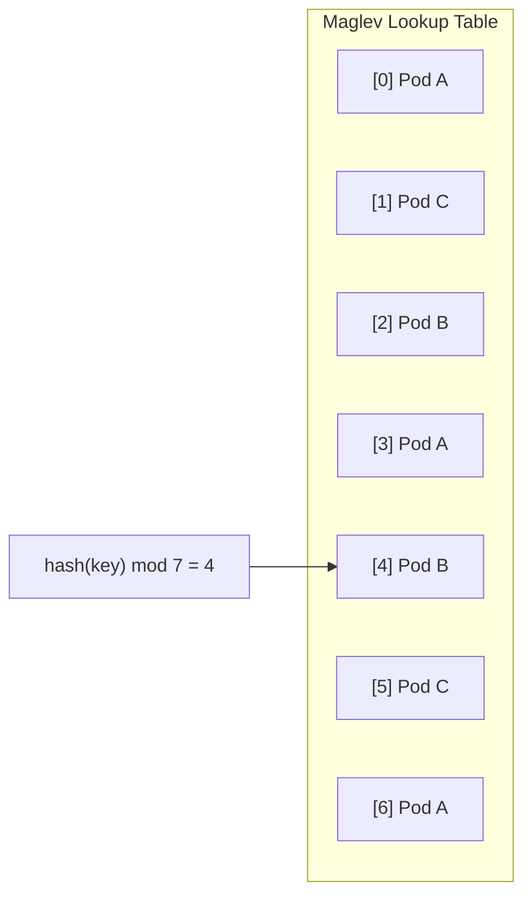

# How to Configure Maglev Load Balancing in Istio

Author: [nawazdhandala](https://github.com/nawazdhandala)

Tags: Istio, Maglev, Load Balancing, DestinationRule, Consistent Hashing

Description: Configure Maglev consistent hashing in Istio for faster lookups and more even distribution compared to ring hash load balancing.

---

Maglev is a consistent hashing algorithm originally developed at Google for their network load balancers. Istio and Envoy support it as an alternative to ring hash. Maglev provides faster lookups and more even distribution than a large ring hash table, making it a good choice for high-throughput services that need session affinity.

## What Makes Maglev Different from Ring Hash

Both ring hash and maglev are consistent hashing algorithms, meaning they map requests to backends in a way that minimizes disruption when backends are added or removed. The difference is in how they do it.

Ring hash places backends at positions on a virtual ring and walks clockwise to find the nearest one. The evenness of distribution depends on the ring size, and lookups are O(log n) because you need a binary search on the sorted ring.

Maglev uses a lookup table instead of a ring. It builds a permutation table for each backend and fills a fixed-size table so that each backend gets roughly equal representation. Lookups are O(1) because you just index into the table. Distribution is more even by construction.


```mermaid
graph LR
    subgraph "Maglev Lookup Table"
    T0["[0] Pod A"]
    T1["[1] Pod C"]
    T2["[2] Pod B"]
    T3["[3] Pod A"]
    T4["[4] Pod B"]
    T5["[5] Pod C"]
    T6["[6] Pod A"]
    end
    H["hash(key) mod 7 = 4"] --> T4
```

The request's hash value is used to index directly into the table. No ring walking, no binary search.

## Enabling Maglev in Istio

To use maglev instead of ring hash, configure it in the `consistentHash` settings of a DestinationRule.

The DestinationRule defines both the hash key and the Maglev load balancer:

```yaml
apiVersion: networking.istio.io/v1
kind: DestinationRule
metadata:
  name: cache-service-dr
spec:
  host: cache-service
  trafficPolicy:
    loadBalancer:
      consistentHash:
        httpHeaderName: x-cache-key
        maglev: {}
```

The `httpHeaderName` field sets up the hash key extraction, and the `maglev` field selects the Maglev consistent hash load balancer.

## Setting Up the Complete Example

First, deploy a service:

```yaml
apiVersion: v1
kind: Service
metadata:
  name: cache-service
spec:
  selector:
    app: cache-service
  ports:
  - name: http
    port: 8080
    targetPort: 80
---
apiVersion: apps/v1
kind: Deployment
metadata:
  name: cache-service
spec:
  replicas: 8
  selector:
    matchLabels:
      app: cache-service
  template:
    metadata:
      labels:
        app: cache-service
    spec:
      containers:
      - name: app
        image: nginx:latest
        ports:
        - containerPort: 80
```

Apply the deployment and DestinationRule:

```bash
kubectl apply -f cache-service.yaml
kubectl apply -f cache-service-dr.yaml
```

## Verifying Maglev Is Active

Check the Envoy configuration:

```bash
istioctl proxy-config cluster <client-pod> --fqdn cache-service.default.svc.cluster.local -o json
```

You should see:

```json
{
  "lbPolicy": "MAGLEV"
}
```

If you still see `RING_HASH`, double-check that the DestinationRule host matches the service and that the client proxy has received the updated configuration.

## Maglev Table Size

Maglev uses a prime number for its table size. The default in Istio and Envoy is 65537. You can configure it in the DestinationRule:

```yaml
apiVersion: networking.istio.io/v1
kind: DestinationRule
metadata:
  name: cache-service-dr
spec:
  host: cache-service
  trafficPolicy:
    loadBalancer:
      consistentHash:
        httpHeaderName: x-cache-key
        maglev:
          tableSize: 65537
```

The table size must be a prime number less than 5000011. Larger tables reduce disruption when backend hosts change, but use more memory. For most cases, 65537 is the right choice.

## When to Choose Maglev Over Ring Hash

**High endpoint count**: If you have hundreds of backends, maglev gives better distribution without needing to increase ring size.

**Low-latency requirements**: Maglev lookups are O(1) instead of O(log n). For extremely latency-sensitive services, this can matter.

**Predictable distribution**: Maglev guarantees that each backend gets close to 1/N of the table entries (where N is the number of backends). Ring hash distribution depends on how the hash function distributes ring positions.

## When Ring Hash Is Better

**Simplicity**: Ring hash is the default consistent hash policy. If you just need basic session affinity, ring hash is easier to set up.

**Fewer endpoints**: With fewer than 20-30 endpoints, ring hash and maglev perform similarly. The advantages of maglev only show up at scale.

**Extreme weights or endpoint counts**: Maglev supports endpoint weights, but each host needs representation in the table. If the number of hosts is larger than the table size, some hosts can be underrepresented or missing.

## Maglev's Disruption Properties

When a backend is added or removed, maglev remaps a limited number of keys. Envoy describes Maglev as aiming for minimal disruption, but ring hash can be more stable when upstream hosts change:

| Operation | Ring Hash Disruption | Maglev Disruption |
|-----------|---------------------|-------------------|
| Add 1 backend to N | ~1/N keys move | ~1/N keys move |
| Remove 1 backend from N | ~1/N keys move | Can be higher than ring hash |

Both reduce disruption compared to simple load balancing algorithms, but Maglev is usually chosen for lookup speed and distribution rather than for stronger stability during host changes.

## Combining with Outlier Detection

Just like with ring hash, you should pair maglev with outlier detection:

```yaml
apiVersion: networking.istio.io/v1
kind: DestinationRule
metadata:
  name: cache-service-dr
spec:
  host: cache-service
  trafficPolicy:
    loadBalancer:
      consistentHash:
        httpHeaderName: x-cache-key
        maglev: {}
    outlierDetection:
      consecutive5xxErrors: 5
      interval: 10s
      baseEjectionTime: 30s
      maxEjectionPercent: 20
```

When a backend is ejected, the maglev table is recomputed without that backend. Keys that were mapped to the ejected backend get redistributed to the remaining backends.

## Monitoring Maglev Performance

You can check Envoy's load balancing statistics:

```bash
istioctl proxy-config cluster <pod-name> --fqdn cache-service.default.svc.cluster.local -o json
```

Also check the endpoint distribution:

```bash
istioctl proxy-config endpoint <pod-name> --cluster "outbound|8080||cache-service.default.svc.cluster.local"
```

This shows all the endpoints Envoy knows about for the cluster. If any are marked as unhealthy, they will not receive traffic.

## Cleanup

```bash
kubectl delete destinationrule cache-service-dr
kubectl delete deployment cache-service
kubectl delete service cache-service
```

Maglev is a powerful consistent hashing algorithm, and Istio exposes it directly in the DestinationRule API. Use it when you have many backends and need strong distribution and lookup performance. For simpler setups, ring hash works just fine.
