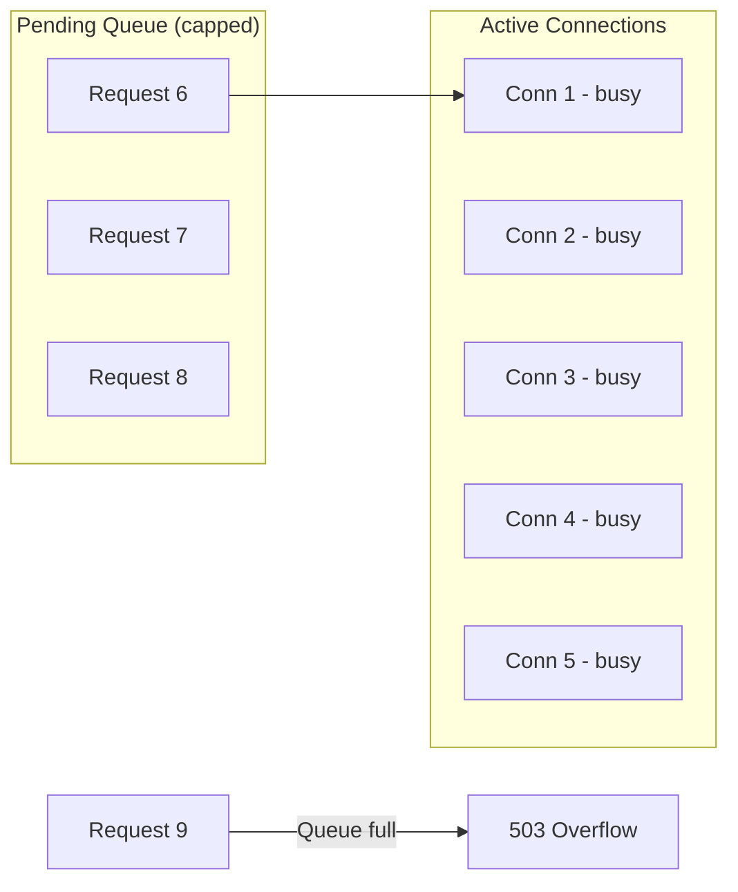

# How to Configure Maximum Pending Requests in Istio

Author: [nawazdhandala](https://github.com/nawazdhandala)

Tags: Istio, Service Mesh, Circuit Breaking, Kubernetes, Performance

Description: How to use http1MaxPendingRequests in Istio DestinationRule to control request queuing and prevent slow services from causing cascading failures.

---

When all connections to a service are busy, new requests have to wait. The question is: how long should they wait, and how many should be allowed to queue up? Istio's `http1MaxPendingRequests` setting answers this by capping the number of requests waiting for an available connection. Once the queue is full, additional requests get an immediate 503 instead of joining an ever-growing line.

## What Are Pending Requests?

With HTTP/1.1, each TCP connection handles one request at a time. If you have `maxConnections: 10` and all 10 connections are busy processing requests, the 11th request has to wait for one of those connections to free up. That waiting request is "pending."

Without a pending request limit, the queue can grow without bound. During a traffic spike, thousands of requests could pile up, consuming memory and adding latency. When the service finally processes them, many will have already timed out on the client side, wasting work.



## Configuring Maximum Pending Requests

The setting lives in the DestinationRule under `connectionPool.http`:

```yaml
apiVersion: networking.istio.io/v1beta1
kind: DestinationRule
metadata:
  name: catalog-service
  namespace: default
spec:
  host: catalog-service
  trafficPolicy:
    connectionPool:
      tcp:
        maxConnections: 50
      http:
        http1MaxPendingRequests: 25
```

This means:
- Up to 50 TCP connections can be active
- Up to 25 requests can wait for a connection
- Request number 76 (50 active + 25 pending + 1) gets a 503

## Choosing the Right Value

The right value for `http1MaxPendingRequests` depends on your traffic pattern and how long requests typically take.

**For fast services** (response times under 50ms), a higher pending queue is fine because requests move through quickly:

```yaml
apiVersion: networking.istio.io/v1beta1
kind: DestinationRule
metadata:
  name: cache-service
  namespace: default
spec:
  host: cache-service
  trafficPolicy:
    connectionPool:
      tcp:
        maxConnections: 100
      http:
        http1MaxPendingRequests: 100
```

**For slow services** (response times over 500ms), keep the pending queue small. Requests will wait a long time, and by the time they get processed, the caller may have already timed out:

```yaml
apiVersion: networking.istio.io/v1beta1
kind: DestinationRule
metadata:
  name: report-service
  namespace: default
spec:
  host: report-service
  trafficPolicy:
    connectionPool:
      tcp:
        maxConnections: 20
      http:
        http1MaxPendingRequests: 5
```

**For bursty traffic patterns**, set the pending queue high enough to absorb short bursts but low enough that sustained overload gets rejected quickly:

```yaml
apiVersion: networking.istio.io/v1beta1
kind: DestinationRule
metadata:
  name: event-processor
  namespace: default
spec:
  host: event-processor
  trafficPolicy:
    connectionPool:
      tcp:
        maxConnections: 30
      http:
        http1MaxPendingRequests: 50
```

## HTTP/2 Is Different

For HTTP/2 and gRPC services, `http1MaxPendingRequests` is not the main control. HTTP/2 multiplexes multiple requests over a single connection, so the concept of "pending" requests waiting for a connection is less relevant. Use `http2MaxRequests` instead:

```yaml
apiVersion: networking.istio.io/v1beta1
kind: DestinationRule
metadata:
  name: grpc-service
  namespace: default
spec:
  host: grpc-service
  trafficPolicy:
    connectionPool:
      http:
        http2MaxRequests: 200
```

`http2MaxRequests` limits the total number of concurrent requests, whether they are active or pending. It is the HTTP/2 equivalent of `maxConnections + http1MaxPendingRequests` combined.

## Monitoring Pending Request Overflows

When requests get rejected because the pending queue is full, Envoy records it:

```bash
# Check pending request overflows
kubectl exec deploy/catalog-service -c istio-proxy -- \
  curl -s localhost:15000/stats | grep "pending"

# Key metrics to watch:
# upstream_rq_pending_active - current pending requests
# upstream_rq_pending_total - total pending requests over time
# upstream_rq_pending_overflow - requests rejected because queue was full
```

If `upstream_rq_pending_overflow` is consistently high, either your service is too slow, you need more replicas, or your pending limit is too aggressive.

If `upstream_rq_pending_active` is consistently near the limit, you are close to overflow. Consider adding capacity before it starts rejecting requests.

## Practical Example: Protecting an API Service

Here is a realistic configuration for a user-facing API service that handles about 500 requests per second with average latency of 100ms:

```yaml
apiVersion: networking.istio.io/v1beta1
kind: DestinationRule
metadata:
  name: user-api
  namespace: production
spec:
  host: user-api.production.svc.cluster.local
  trafficPolicy:
    connectionPool:
      tcp:
        maxConnections: 200
        connectTimeout: 3s
      http:
        http1MaxPendingRequests: 100
        maxRequestsPerConnection: 50
    outlierDetection:
      consecutive5xxErrors: 5
      interval: 10s
      baseEjectionTime: 30s
      maxEjectionPercent: 30
```

At 500 RPS with 100ms latency, you need about 50 connections handling requests at any time. Setting `maxConnections` to 200 gives 4x headroom. The `http1MaxPendingRequests` of 100 allows brief spikes up to about 300 concurrent requests (200 active + 100 pending) before overflow kicks in.

## Testing Pending Request Limits

You can use a simple load test to verify your limits work:

```bash
# Install fortio (Istio's load testing tool)
kubectl apply -f https://raw.githubusercontent.com/istio/istio/release-1.20/samples/httpbin/sample-client/fortio/fortio-deploy.yaml

# Run a test with high concurrency
kubectl exec deploy/fortio -- fortio load \
  -c 100 \
  -qps 0 \
  -t 30s \
  -loglevel Warning \
  http://catalog-service:8080/api/items
```

In the output, look for the percentage of 503 responses. If your pending request limit is working, you should see 503s when concurrency exceeds your configured limits.

```bash
# Check overflow stats after the load test
kubectl exec deploy/catalog-service -c istio-proxy -- \
  curl -s localhost:15000/stats | grep -E "pending_overflow|pending_active"
```

## Relationship to Other Settings

Pending request limits do not work in isolation. Here is how they interact with other settings:

| Setting | Relationship to Pending Requests |
|---------|--------------------------------|
| maxConnections | Determines how many requests can be active (not pending) |
| timeout | Long timeouts mean connections stay busy longer, increasing pending |
| retries | Retries count against pending limits too |
| outlierDetection | Ejecting instances reduces capacity, increasing pending pressure |

Think of it as a pipeline. `maxConnections` is the pipe width, `http1MaxPendingRequests` is the buffer before the pipe, and `timeout` determines how fast requests flow through the pipe.

Getting the pending request limit right is about finding the balance between absorbing normal traffic bursts and failing fast when the service is truly overloaded. Start with a value roughly equal to `maxConnections`, monitor the overflow metrics, and adjust from there.
