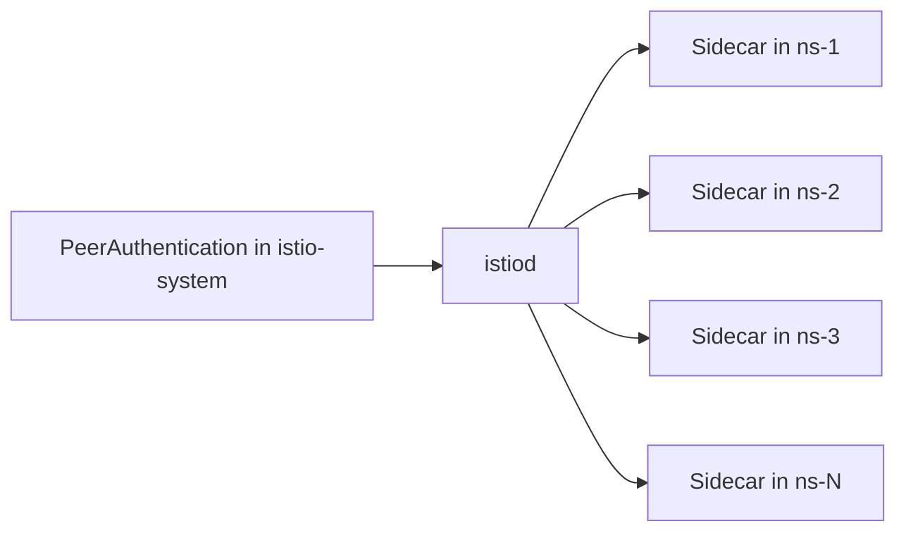

# How to Configure Mesh-Wide mTLS Policy in Istio

Author: [nawazdhandala](https://github.com/nawazdhandala)

Tags: Istio, mTLS, Mesh Policy, Security, Zero Trust

Description: How to configure a global mutual TLS policy that applies to every service in your Istio mesh for consistent encryption everywhere.

---

A mesh-wide mTLS policy sets the baseline security posture for your entire Istio service mesh. Every namespace, every service, every pod inherits this policy unless explicitly overridden. Getting this right is important because it determines the default behavior for all new services deployed to the cluster.

This guide covers how to set up and manage a mesh-wide mTLS policy, including how it interacts with namespace and workload-level overrides.

## The Root Namespace Concept

In Istio, the root namespace is where mesh-wide configuration resources live. By default, this is `istio-system`. A PeerAuthentication resource in the root namespace without a workload selector becomes the mesh-wide default.

Check what your root namespace is:

```bash
kubectl get configmap istio -n istio-system -o jsonpath='{.data.mesh}' | grep rootNamespace
```

If this is not set, it defaults to `istio-system`.

## Setting a Mesh-Wide Policy

### Permissive (Default Behavior)

This is what Istio uses out of the box. Traffic between sidecar-injected services uses mTLS automatically (via auto mTLS), but services also accept plain text connections:

```yaml
apiVersion: security.istio.io/v1
kind: PeerAuthentication
metadata:
  name: default
  namespace: istio-system
spec:
  mtls:
    mode: PERMISSIVE
```

### Strict (Recommended for Production)

All services in the mesh must use mTLS. Plain text connections are rejected:

```yaml
apiVersion: security.istio.io/v1
kind: PeerAuthentication
metadata:
  name: default
  namespace: istio-system
spec:
  mtls:
    mode: STRICT
```

### Disable

Turns off mTLS mesh-wide. You almost never want this:

```yaml
apiVersion: security.istio.io/v1
kind: PeerAuthentication
metadata:
  name: default
  namespace: istio-system
spec:
  mtls:
    mode: DISABLE
```

Apply your chosen policy:

```bash
kubectl apply -f mesh-wide-mtls.yaml
```

## What Happens When You Apply a Mesh-Wide Policy

The policy propagates to all sidecars in the mesh through istiod. Within a few seconds, every Envoy proxy updates its configuration. There is no restart needed.



If you switch from PERMISSIVE to STRICT, any service receiving plain text connections will immediately start rejecting them. This is why you should verify that all traffic is already using mTLS before making this switch.

## Naming Convention

The mesh-wide PeerAuthentication resource should be named `default`. While Istio does not strictly require this name, it is a convention that makes it clear this is the default policy. Having a non-default name can cause confusion when multiple policies exist.

```bash
# Check existing policies in the root namespace
kubectl get peerauthentication -n istio-system
```

If you see multiple PeerAuthentication resources in istio-system without selectors, you might have conflicting policies. Only one should exist as the mesh-wide default.

## Combining Mesh-Wide with Namespace Overrides

The mesh-wide policy is the baseline. Namespaces can override it:

```yaml
# Mesh-wide strict
apiVersion: security.istio.io/v1
kind: PeerAuthentication
metadata:
  name: default
  namespace: istio-system
spec:
  mtls:
    mode: STRICT
---
# Exception for legacy namespace
apiVersion: security.istio.io/v1
kind: PeerAuthentication
metadata:
  name: default
  namespace: legacy-apps
spec:
  mtls:
    mode: PERMISSIVE
```

In this setup, every namespace uses STRICT except legacy-apps, which uses PERMISSIVE.

A good mental model: think of the mesh-wide policy as the "unless otherwise specified" rule. If a namespace does not have its own PeerAuthentication, it gets the mesh-wide one.

## Mesh-Wide Policy with Port Exceptions

You can include port-level mTLS settings in the mesh-wide policy, but this only makes sense for ports that are universally used across the mesh:

```yaml
apiVersion: security.istio.io/v1
kind: PeerAuthentication
metadata:
  name: default
  namespace: istio-system
spec:
  mtls:
    mode: STRICT
  portLevelMtls:
    9090:
      mode: PERMISSIVE
```

This sets STRICT as the default but allows port 9090 (commonly used for Prometheus metrics) to accept plain text across the entire mesh. Be careful with this because it opens that port on every service.

## Verifying the Mesh-Wide Policy

Check that the policy is in place:

```bash
kubectl get peerauthentication default -n istio-system -o yaml
```

Verify it is being applied to pods:

```bash
# Pick a pod in any namespace
istioctl x describe pod <pod-name> -n <namespace>
```

The output should reference the mesh-wide policy if no namespace-level override exists.

Run a comprehensive check:

```bash
istioctl analyze --all-namespaces
```

This will flag any potential issues with your mTLS configuration, including conflicts between mesh-wide and namespace-level policies.

## Monitoring Mesh-Wide mTLS

Once you have a mesh-wide policy, track its effectiveness:

### Total mTLS Coverage

```
sum(rate(istio_requests_total{connection_security_policy="mutual_tls", reporter="destination"}[5m]))
/
sum(rate(istio_requests_total{reporter="destination"}[5m]))
* 100
```

This should be at or near 100% for a strict mesh.

### Non-mTLS Traffic Detection

```
sum(rate(istio_requests_total{connection_security_policy="none", reporter="destination"}[5m])) by (destination_service, source_workload)
```

Any results here in a strict mesh indicate a problem. Investigate each source workload to understand why it is not using mTLS.

### Failed Connection Attempts

```
sum(rate(istio_requests_total{response_code="503", response_flags="UF", reporter="destination"}[5m])) by (source_workload, destination_service)
```

A spike in these after enabling strict mode indicates clients that cannot establish mTLS connections.

## Updating the Mesh-Wide Policy

To change the mesh-wide policy, simply update the resource:

```bash
kubectl apply -f - <<EOF
apiVersion: security.istio.io/v1
kind: PeerAuthentication
metadata:
  name: default
  namespace: istio-system
spec:
  mtls:
    mode: STRICT
EOF
```

The change propagates within seconds. If you need to rollback:

```bash
kubectl apply -f - <<EOF
apiVersion: security.istio.io/v1
kind: PeerAuthentication
metadata:
  name: default
  namespace: istio-system
spec:
  mtls:
    mode: PERMISSIVE
EOF
```

## Best Practices

**Start permissive, end strict**: Begin with PERMISSIVE mesh-wide, get full sidecar coverage, verify all traffic is using mTLS naturally, then switch to STRICT.

**Use namespace overrides for exceptions**: Rather than keeping the mesh-wide policy permissive because one namespace needs it, go strict mesh-wide and add a permissive override for that specific namespace.

**Audit regularly**: Run `kubectl get peerauthentication --all-namespaces` periodically to review all mTLS policies. Look for permissive exceptions that are no longer needed.

**Document exceptions**: When you add a namespace-level override, document why it exists. Add an annotation to the resource:

```yaml
apiVersion: security.istio.io/v1
kind: PeerAuthentication
metadata:
  name: default
  namespace: legacy-apps
  annotations:
    reason: "Legacy payment processor does not support mTLS. Ticket: INFRA-1234"
spec:
  mtls:
    mode: PERMISSIVE
```

**Test before applying**: Use `istioctl analyze` before applying changes to catch potential issues:

```bash
istioctl analyze -f mesh-wide-mtls.yaml
```

A well-configured mesh-wide mTLS policy is the foundation of a zero-trust service mesh. It ensures that encryption is the default, not an afterthought, and that every new service deployed to the cluster is secure from the moment it starts receiving traffic.
