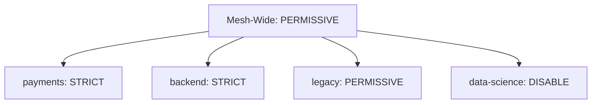

# How to Configure mTLS for Specific Namespaces in Istio

Author: [nawazdhandala](https://github.com/nawazdhandala)

Tags: Istio, MTLS, Namespace, Security, Multi-Tenancy

Description: How to apply different mutual TLS policies to different Kubernetes namespaces in Istio for multi-team and multi-tenant clusters.

---

In a multi-team Kubernetes cluster, different namespaces have different security requirements. The team running the payment processing system wants strict mTLS immediately. The platform team is still migrating legacy services and needs permissive mode. The data science team runs batch jobs that break with sidecar injection and they want mTLS disabled entirely.

Istio supports this through namespace-scoped PeerAuthentication policies. Each namespace can have its own mTLS configuration that overrides the mesh-wide default.

## How Namespace Policies Work

A PeerAuthentication resource without a `selector` field, placed in a specific namespace, becomes the default policy for that namespace. It overrides whatever mesh-wide policy exists in istio-system.

The hierarchy is:
1. Workload-specific policy (with selector) - highest priority
2. Namespace policy (without selector, in the workload's namespace)
3. Mesh-wide policy (without selector, in istio-system)

## Setting Up Different Policies per Namespace

Suppose you have four namespaces with different requirements:



### Mesh-Wide Default

```yaml
apiVersion: security.istio.io/v1
kind: PeerAuthentication
metadata:
  name: default
  namespace: istio-system
spec:
  mtls:
    mode: PERMISSIVE
```

### Payments Namespace - Strict

```yaml
apiVersion: security.istio.io/v1
kind: PeerAuthentication
metadata:
  name: default
  namespace: payments
spec:
  mtls:
    mode: STRICT
```

### Backend Namespace - Strict

```yaml
apiVersion: security.istio.io/v1
kind: PeerAuthentication
metadata:
  name: default
  namespace: backend
spec:
  mtls:
    mode: STRICT
```

### Legacy Namespace - Permissive

```yaml
apiVersion: security.istio.io/v1
kind: PeerAuthentication
metadata:
  name: default
  namespace: legacy
spec:
  mtls:
    mode: PERMISSIVE
```

### Data Science Namespace - Disabled

```yaml
apiVersion: security.istio.io/v1
kind: PeerAuthentication
metadata:
  name: default
  namespace: data-science
spec:
  mtls:
    mode: DISABLE
```

Apply them all:

```bash
kubectl apply -f mesh-wide-policy.yaml
kubectl apply -f payments-policy.yaml
kubectl apply -f backend-policy.yaml
kubectl apply -f legacy-policy.yaml
kubectl apply -f data-science-policy.yaml
```

## Cross-Namespace Communication

When services in different namespaces communicate, both the source and destination mTLS settings matter.

### Strict-to-Strict

A service in `payments` calling a service in `backend` - both namespaces are strict. This works seamlessly because both sidecars use mTLS. The source sidecar initiates mTLS, and the destination sidecar requires it.

### Strict-to-Permissive

A service in `payments` calling a service in `legacy` - source is strict, destination is permissive. This works because the source sidecar uses mTLS (via auto mTLS), and the destination accepts it (permissive accepts both).

### Permissive-to-Strict

A service in `legacy` calling a service in `payments` - source is permissive, destination is strict. This works IF the source has a sidecar, because auto mTLS on the source side will detect that the destination requires mTLS and use it.

If the source does NOT have a sidecar, the connection fails. The destination requires mTLS, but the source cannot provide it.

### Disabled-to-Strict

A service in `data-science` calling a service in `payments` - this is the problem case. If `data-science` has mTLS disabled and sidecars are not injected, the calls to the strict `payments` namespace will fail.

Solutions:
1. Inject sidecars into data-science pods that need to call strict services
2. Add a workload-specific permissive exception in payments for the specific service being called
3. Route through a gateway that handles the mTLS transition

## Setting Up a Multi-Namespace Configuration

Here is a complete example you can apply to set up per-namespace mTLS:

```yaml
# Save as namespace-mtls-policies.yaml
apiVersion: security.istio.io/v1
kind: PeerAuthentication
metadata:
  name: default
  namespace: istio-system
spec:
  mtls:
    mode: PERMISSIVE
---
apiVersion: security.istio.io/v1
kind: PeerAuthentication
metadata:
  name: default
  namespace: payments
spec:
  mtls:
    mode: STRICT
---
apiVersion: security.istio.io/v1
kind: PeerAuthentication
metadata:
  name: default
  namespace: backend
spec:
  mtls:
    mode: STRICT
---
apiVersion: security.istio.io/v1
kind: PeerAuthentication
metadata:
  name: default
  namespace: legacy
spec:
  mtls:
    mode: PERMISSIVE
```

```bash
kubectl apply -f namespace-mtls-policies.yaml
```

## Viewing All Policies

To see all PeerAuthentication policies across the cluster:

```bash
kubectl get peerauthentication --all-namespaces
```

Sample output:

```text
NAMESPACE      NAME      MODE          AGE
istio-system   default   PERMISSIVE    5d
payments       default   STRICT        2d
backend        default   STRICT        2d
legacy         default   PERMISSIVE    1d
```

For more detail on what is effective for a specific namespace:

```bash
istioctl x describe pod <any-pod-in-namespace> -n <namespace>
```

## Handling New Namespaces

When you create a new namespace, it inherits the mesh-wide policy by default. If your mesh-wide policy is PERMISSIVE, new namespaces start permissive. If it is STRICT, new namespaces start strict.

Think about what makes sense for your organization:

**Conservative approach**: Set mesh-wide to STRICT and create PERMISSIVE exceptions for namespaces that need them. New namespaces are secure by default.

**Progressive approach**: Set mesh-wide to PERMISSIVE and add STRICT policies to namespaces as they are ready. New namespaces are less secure but nothing breaks.

For most production environments, the conservative approach is better. It prevents accidentally deploying new services without mTLS.

## Automating with GitOps

If you use a GitOps tool like ArgoCD or Flux, you can manage namespace mTLS policies alongside namespace creation:

```yaml
# namespace-payments.yaml
apiVersion: v1
kind: Namespace
metadata:
  name: payments
  labels:
    istio-injection: enabled
---
apiVersion: security.istio.io/v1
kind: PeerAuthentication
metadata:
  name: default
  namespace: payments
spec:
  mtls:
    mode: STRICT
```

This ensures that every time the namespace is created or recreated, the mTLS policy comes with it.

## Monitoring Namespace mTLS Status

Track mTLS adoption by namespace using Prometheus:

```text
sum(rate(istio_requests_total{connection_security_policy="mutual_tls", reporter="destination"}[5m])) by (destination_workload_namespace)
/
sum(rate(istio_requests_total{reporter="destination"}[5m])) by (destination_workload_namespace)
```

This gives you the percentage of mTLS traffic per namespace. Namespaces with strict mode should show close to 100%. Namespaces with permissive mode will show the natural mTLS adoption rate (which should be high if most callers have sidecars).

## Troubleshooting Cross-Namespace Issues

If a cross-namespace call fails after applying namespace-specific policies:

```bash
# Check source pod's outbound TLS config
istioctl proxy-config cluster <source-pod> -n <source-namespace> \
  --fqdn <destination-service>.<destination-namespace>.svc.cluster.local -o json

# Check destination pod's inbound TLS config
istioctl proxy-config listener <dest-pod> -n <dest-namespace> \
  --port <service-port> -o json
```

The source should show mTLS outbound configuration if the destination requires it. If it does not, auto mTLS might not be detecting the destination's policy correctly. In that case, explicitly set a DestinationRule:

```yaml
apiVersion: networking.istio.io/v1
kind: DestinationRule
metadata:
  name: payments-mtls
  namespace: legacy
spec:
  host: payment-service.payments.svc.cluster.local
  trafficPolicy:
    tls:
      mode: ISTIO_MUTUAL
```

This forces the legacy namespace to use mTLS when calling the payment service, regardless of auto mTLS detection.

Namespace-level mTLS policies give you the organizational flexibility to adopt mTLS at each team's pace while maintaining a clear, auditable security posture across the cluster.
