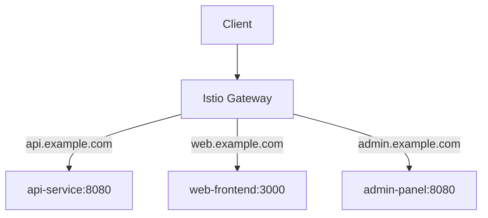

# How to Configure Multiple Hosts on a Single Istio Gateway

Author: [nawazdhandala](https://github.com/nawazdhandala)

Tags: Istio, Gateway, Multi-Host, Kubernetes, Networking

Description: How to configure a single Istio Gateway to handle traffic for multiple hostnames with different routing and TLS settings.

---

Running a separate Istio Gateway for each hostname is wasteful. In most cases, you want a single gateway that handles traffic for multiple hosts, each potentially with its own TLS certificate and routing rules. This is similar to virtual hosting in traditional web servers, and Istio handles it well.

## Basic Multi-Host Gateway

The simplest multi-host configuration lists multiple hosts in a single server entry:

```yaml
apiVersion: networking.istio.io/v1
kind: Gateway
metadata:
  name: multi-host-gateway
spec:
  selector:
    istio: ingressgateway
  servers:
  - port:
      number: 80
      name: http
      protocol: HTTP
    hosts:
    - "api.example.com"
    - "web.example.com"
    - "admin.example.com"
```

All three hosts share the same port and protocol configuration. This works well when all hosts use the same settings.

## Multi-Host with Separate TLS Certificates

When each host needs its own TLS certificate, define separate server entries:

```yaml
apiVersion: networking.istio.io/v1
kind: Gateway
metadata:
  name: multi-host-tls-gateway
spec:
  selector:
    istio: ingressgateway
  servers:
  - port:
      number: 443
      name: https-api
      protocol: HTTPS
    hosts:
    - "api.example.com"
    tls:
      mode: SIMPLE
      credentialName: api-tls-credential
  - port:
      number: 443
      name: https-web
      protocol: HTTPS
    hosts:
    - "web.example.com"
    tls:
      mode: SIMPLE
      credentialName: web-tls-credential
  - port:
      number: 443
      name: https-admin
      protocol: HTTPS
    hosts:
    - "admin.example.com"
    tls:
      mode: SIMPLE
      credentialName: admin-tls-credential
```

Each server entry on port 443 has a unique name and references a different TLS credential. Istio uses SNI to determine which certificate to present based on the hostname the client requests.

You need to create the corresponding secrets:

```bash
kubectl create secret tls api-tls-credential \
  --cert=api.example.com.crt --key=api.example.com.key -n istio-system

kubectl create secret tls web-tls-credential \
  --cert=web.example.com.crt --key=web.example.com.key -n istio-system

kubectl create secret tls admin-tls-credential \
  --cert=admin.example.com.crt --key=admin.example.com.key -n istio-system
```

## Routing for Multiple Hosts

Each host typically gets its own VirtualService:

```yaml
apiVersion: networking.istio.io/v1
kind: VirtualService
metadata:
  name: api-routes
spec:
  hosts:
  - "api.example.com"
  gateways:
  - multi-host-tls-gateway
  http:
  - route:
    - destination:
        host: api-service
        port:
          number: 8080
---
apiVersion: networking.istio.io/v1
kind: VirtualService
metadata:
  name: web-routes
spec:
  hosts:
  - "web.example.com"
  gateways:
  - multi-host-tls-gateway
  http:
  - route:
    - destination:
        host: web-frontend
        port:
          number: 3000
---
apiVersion: networking.istio.io/v1
kind: VirtualService
metadata:
  name: admin-routes
spec:
  hosts:
  - "admin.example.com"
  gateways:
  - multi-host-tls-gateway
  http:
  - route:
    - destination:
        host: admin-panel
        port:
          number: 8080
```



## Mixing HTTP and HTTPS Hosts

You can have some hosts on HTTP and others on HTTPS:

```yaml
apiVersion: networking.istio.io/v1
kind: Gateway
metadata:
  name: mixed-gateway
spec:
  selector:
    istio: ingressgateway
  servers:
  - port:
      number: 80
      name: http
      protocol: HTTP
    hosts:
    - "dev.example.com"
  - port:
      number: 443
      name: https
      protocol: HTTPS
    hosts:
    - "prod.example.com"
    tls:
      mode: SIMPLE
      credentialName: prod-tls-credential
  - port:
      number: 80
      name: http-redirect
      protocol: HTTP
    hosts:
    - "prod.example.com"
    tls:
      httpsRedirect: true
```

This setup serves `dev.example.com` over HTTP, `prod.example.com` over HTTPS, and redirects HTTP traffic for `prod.example.com` to HTTPS.

## Using Wildcard Hosts

If you have many subdomains, a wildcard can simplify things:

```yaml
apiVersion: networking.istio.io/v1
kind: Gateway
metadata:
  name: wildcard-gateway
spec:
  selector:
    istio: ingressgateway
  servers:
  - port:
      number: 443
      name: https
      protocol: HTTPS
    hosts:
    - "*.example.com"
    tls:
      mode: SIMPLE
      credentialName: wildcard-tls-credential
```

With a wildcard certificate and wildcard host, any subdomain of `example.com` is accepted. VirtualServices can then match specific subdomains:

```yaml
apiVersion: networking.istio.io/v1
kind: VirtualService
metadata:
  name: specific-subdomain
spec:
  hosts:
  - "shop.example.com"
  gateways:
  - wildcard-gateway
  http:
  - route:
    - destination:
        host: shop-service
        port:
          number: 8080
```

## Hosts Across Different Domains

You are not limited to subdomains of a single domain:

```yaml
apiVersion: networking.istio.io/v1
kind: Gateway
metadata:
  name: multi-domain-gateway
spec:
  selector:
    istio: ingressgateway
  servers:
  - port:
      number: 443
      name: https-example
      protocol: HTTPS
    hosts:
    - "app.example.com"
    tls:
      mode: SIMPLE
      credentialName: example-tls-credential
  - port:
      number: 443
      name: https-mysite
      protocol: HTTPS
    hosts:
    - "app.mysite.io"
    tls:
      mode: SIMPLE
      credentialName: mysite-tls-credential
```

Each domain has its own server entry with its own certificate. This is common when a single cluster hosts applications for different brands or customers.

## Shared Gateway Pattern

A good practice in larger organizations is creating a shared gateway that multiple teams use:

```yaml
apiVersion: networking.istio.io/v1
kind: Gateway
metadata:
  name: shared-gateway
  namespace: istio-system
spec:
  selector:
    istio: ingressgateway
  servers:
  - port:
      number: 443
      name: https
      protocol: HTTPS
    hosts:
    - "*.example.com"
    tls:
      mode: SIMPLE
      credentialName: wildcard-credential
```

Teams in different namespaces create VirtualServices that reference this shared gateway:

```yaml
# Team A's namespace
apiVersion: networking.istio.io/v1
kind: VirtualService
metadata:
  name: team-a-vs
  namespace: team-a
spec:
  hosts:
  - "team-a.example.com"
  gateways:
  - istio-system/shared-gateway
  http:
  - route:
    - destination:
        host: team-a-app
        port:
          number: 8080
```

## Verifying Multi-Host Configuration

Check which hosts are configured on the gateway:

```bash
kubectl get gateway multi-host-tls-gateway -o yaml

# Check routes in the proxy
istioctl proxy-config routes deploy/istio-ingressgateway -n istio-system

# Test each host
export GATEWAY_IP=$(kubectl -n istio-system get service istio-ingressgateway \
  -o jsonpath='{.status.loadBalancer.ingress[0].ip}')

curl -k --resolve "api.example.com:443:$GATEWAY_IP" https://api.example.com/
curl -k --resolve "web.example.com:443:$GATEWAY_IP" https://web.example.com/
```

## Performance Considerations

There is no significant performance penalty for hosting multiple domains on a single gateway. The SNI-based routing happens during the TLS handshake and adds negligible overhead. What matters more is the overall volume of traffic and the number of active connections.

If you are hosting hundreds of domains, keep an eye on:

- The number of TLS secrets - each one is watched by the SDS service
- Memory usage on the ingress gateway pod
- The total number of routes in the Envoy configuration

For most deployments with tens of hosts, a single gateway works great. When you get into hundreds or thousands of hosts, consider splitting across multiple gateway deployments.

Running multiple hosts on a single Istio Gateway is straightforward and is the recommended approach for most setups. It reduces resource usage, simplifies management, and works well with the shared gateway pattern that lets different teams own their VirtualServices independently.
