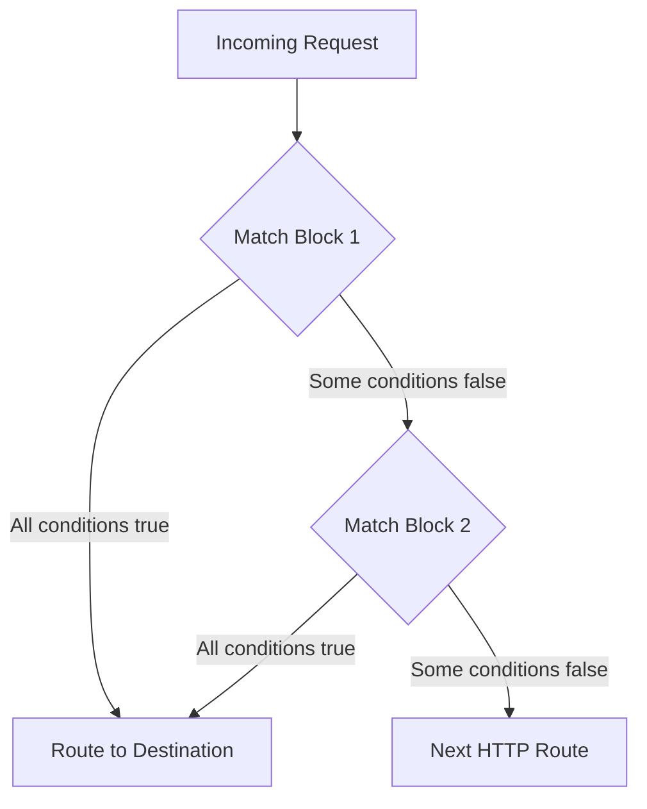

# How to Configure Multiple Match Conditions in VirtualService

Author: [nawazdhandala](https://github.com/nawazdhandala)

Tags: Istio, VirtualService, Match Conditions, Traffic Routing, Kubernetes

Description: A detailed guide on combining multiple match conditions in Istio VirtualService using AND and OR logic for precise traffic routing.

---

Real-world routing rules are rarely based on a single condition. You usually need to combine several conditions together - match on a header AND a path, or route based on a cookie OR a query parameter. Istio VirtualService gives you both AND and OR logic for match conditions, but the way you express them is a bit different from what you might expect.

## AND vs OR Logic

The key thing to understand is how match conditions are structured in Istio:

- **AND logic**: Multiple conditions within the same `match` block are ANDed together. All conditions must be true.
- **OR logic**: Multiple `match` blocks within the same HTTP route are ORed together. Any one match block being true is enough.

Here is the visual difference:



## AND Conditions - Same Match Block

When you put multiple conditions in the same match entry, all of them must be true:

```yaml
apiVersion: networking.istio.io/v1beta1
kind: VirtualService
metadata:
  name: my-app
  namespace: default
spec:
  hosts:
    - my-app
  http:
    - match:
        - uri:
            prefix: "/api"
          headers:
            x-user-type:
              exact: "premium"
          queryParams:
            format:
              exact: "json"
      route:
        - destination:
            host: premium-api
            port:
              number: 80
    - route:
        - destination:
            host: standard-api
            port:
              number: 80
```

For this route to trigger, the request must satisfy ALL three conditions:
1. URI starts with `/api`
2. Has the header `x-user-type: premium`
3. Has the query parameter `format=json`

A request to `/api/data?format=json` without the header would not match.

## OR Conditions - Multiple Match Blocks

When you need any one of several conditions to trigger a route, use separate match blocks in the same list:

```yaml
apiVersion: networking.istio.io/v1beta1
kind: VirtualService
metadata:
  name: my-app
  namespace: default
spec:
  hosts:
    - my-app
  http:
    - match:
        - headers:
            x-canary:
              exact: "true"
        - queryParams:
            canary:
              exact: "true"
        - sourceLabels:
            app: internal-tester
      route:
        - destination:
            host: my-app
            subset: canary
    - route:
        - destination:
            host: my-app
            subset: stable
```

This routes to the canary version if ANY of these is true:
- The `x-canary: true` header is present
- The `?canary=true` query parameter is present
- The request comes from a pod with the label `app: internal-tester`

## Combining AND and OR

You can mix both. Each match block uses AND internally, and the blocks themselves are ORed:

```yaml
apiVersion: networking.istio.io/v1beta1
kind: VirtualService
metadata:
  name: my-app
  namespace: default
spec:
  hosts:
    - my-app
  http:
    - match:
        - uri:
            prefix: "/api"
          headers:
            x-version:
              exact: "2"
        - uri:
            prefix: "/v2"
      route:
        - destination:
            host: my-app
            subset: v2
    - route:
        - destination:
            host: my-app
            subset: v1
```

The v2 route matches if:
- (URI starts with `/api` AND `x-version: 2` header is present) OR
- (URI starts with `/v2`)

## Method-Based Matching

You can match on HTTP method to route reads and writes differently:

```yaml
apiVersion: networking.istio.io/v1beta1
kind: VirtualService
metadata:
  name: my-app
  namespace: default
spec:
  hosts:
    - my-app
  http:
    - match:
        - method:
            exact: "GET"
          uri:
            prefix: "/api/products"
      route:
        - destination:
            host: product-read-service
            port:
              number: 80
    - match:
        - method:
            exact: "POST"
          uri:
            prefix: "/api/products"
        - method:
            exact: "PUT"
          uri:
            prefix: "/api/products"
        - method:
            exact: "DELETE"
          uri:
            prefix: "/api/products"
      route:
        - destination:
            host: product-write-service
            port:
              number: 80
    - route:
        - destination:
            host: my-app
            port:
              number: 80
```

GET requests to `/api/products` go to the read service. POST, PUT, and DELETE requests go to the write service. This is a pattern known as CQRS (Command Query Responsibility Segregation).

## Source Label Matching

You can also route based on which workload is making the request:

```yaml
apiVersion: networking.istio.io/v1beta1
kind: VirtualService
metadata:
  name: backend-service
  namespace: default
spec:
  hosts:
    - backend-service
  http:
    - match:
        - sourceLabels:
            app: admin-dashboard
      route:
        - destination:
            host: backend-service
            subset: admin
    - match:
        - sourceLabels:
            app: public-frontend
      route:
        - destination:
            host: backend-service
            subset: public
    - route:
        - destination:
            host: backend-service
            subset: default
```

Requests from the admin dashboard go to the admin subset, while requests from the public frontend go to the public subset. This is useful when different callers need different behavior from the same service.

## Port-Based Matching

Match on the incoming port:

```yaml
apiVersion: networking.istio.io/v1beta1
kind: VirtualService
metadata:
  name: my-app
  namespace: default
spec:
  hosts:
    - my-app
  http:
    - match:
        - port: 8080
      route:
        - destination:
            host: internal-service
            port:
              number: 80
    - match:
        - port: 80
      route:
        - destination:
            host: public-service
            port:
              number: 80
```

## Complex Real-World Example

Here is a more realistic example that combines several conditions for a microservice:

```yaml
apiVersion: networking.istio.io/v1beta1
kind: VirtualService
metadata:
  name: order-service
  namespace: default
spec:
  hosts:
    - order-service
  http:
    # Internal admin tools get v2 with extended features
    - match:
        - sourceLabels:
            app: admin-tool
          headers:
            x-admin-token:
              regex: "^[a-f0-9]{32}$"
      route:
        - destination:
            host: order-service
            subset: v2-admin
    # Mobile clients get the optimized endpoint
    - match:
        - headers:
            user-agent:
              regex: ".*(iPhone|Android).*"
          uri:
            prefix: "/api/orders"
      route:
        - destination:
            host: order-service
            subset: mobile
    # Beta testers (by header or cookie)
    - match:
        - headers:
            x-beta:
              exact: "true"
        - headers:
            cookie:
              regex: ".*beta=true.*"
      route:
        - destination:
            host: order-service
            subset: beta
    # Default route
    - route:
        - destination:
            host: order-service
            subset: stable
```

## Verifying Match Conditions

To verify your match conditions are working correctly:

```bash
# Check the VirtualService config
kubectl get vs order-service -o yaml

# Use istioctl to validate
istioctl analyze -n default

# Check the Envoy route config on a specific pod
istioctl proxy-config routes deploy/order-service -o json

# Test with curl
curl -H "x-beta: true" http://order-service.default.svc.cluster.local/api/orders
```

## Common Mistakes

A few mistakes I see frequently:

1. **Confusing AND and OR** - Remember, same match block is AND, separate match blocks is OR.
2. **Putting the default route first** - The first HTTP route without a match condition catches everything. Always put specific rules before the catch-all.
3. **Too many conditions in one block** - If you AND too many conditions together, the rule becomes very restrictive and might never match.
4. **Forgetting about case sensitivity** - Header names are case-insensitive, but header values and URI paths are case-sensitive by default.

Multiple match conditions give you fine-grained control over traffic routing. The AND/OR model is straightforward once you understand the structure, and it lets you build complex routing logic without writing any application code.
