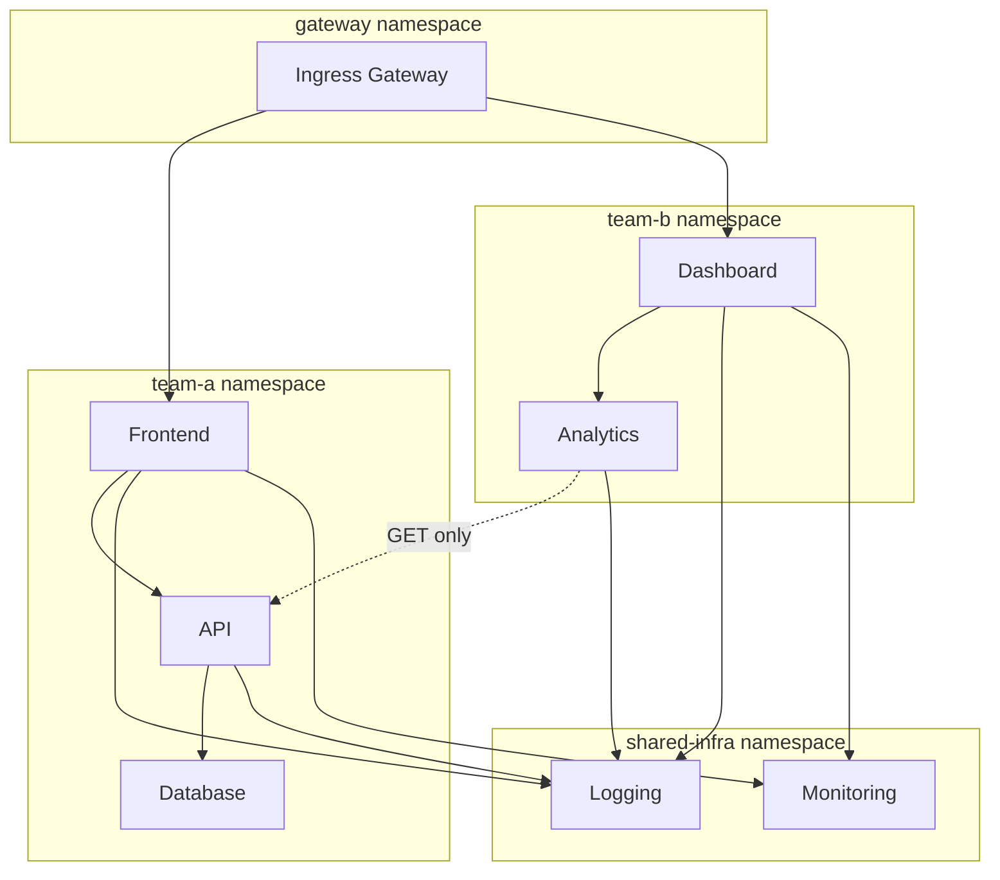

# How to Configure Namespace Isolation with Authorization Policies

Author: [nawazdhandala](https://github.com/nawazdhandala)

Tags: Istio, Namespace Isolation, Authorization, Security, Kubernetes

Description: How to use Istio authorization policies to isolate Kubernetes namespaces and control cross-namespace traffic in your service mesh.

---

In a shared Kubernetes cluster, namespaces are the primary way to organize and separate workloads. But by default, any pod in any namespace can talk to any other pod in any other namespace. Kubernetes NetworkPolicies can help, but Istio authorization policies give you a more expressive and identity-aware way to enforce namespace boundaries.

## Why Namespace Isolation Matters

Think about a cluster running multiple environments (dev, staging, production) or multiple teams' workloads. Without isolation:

- A buggy dev deployment could accidentally send traffic to production services
- A compromised pod in one team's namespace could access another team's database
- Test traffic could pollute production metrics and data

Namespace isolation ensures that services in one namespace cannot reach services in another namespace unless you explicitly allow it.

## Starting Point: Default Deny Per Namespace

The first step is to deny all cross-namespace traffic. You can do this by applying a restrictive ALLOW policy in each namespace:

```yaml
apiVersion: security.istio.io/v1
kind: AuthorizationPolicy
metadata:
  name: namespace-isolation
  namespace: team-a
spec:
  action: ALLOW
  rules:
  - from:
    - source:
        namespaces:
        - "team-a"
```

This policy applies to all workloads in the `team-a` namespace (no selector means it applies to everything). It only allows traffic from sources in the same namespace. All cross-namespace traffic is denied.

Apply the same pattern for each namespace:

```bash
for ns in team-a team-b team-c production staging; do
  kubectl apply -f - <<EOF
apiVersion: security.istio.io/v1
kind: AuthorizationPolicy
metadata:
  name: namespace-isolation
  namespace: $ns
spec:
  action: ALLOW
  rules:
  - from:
    - source:
        namespaces:
        - "$ns"
EOF
done
```

## Allowing Specific Cross-Namespace Communication

After locking down each namespace, you selectively open cross-namespace paths. For example, if the `gateway` namespace needs to reach services in `team-a`:

```yaml
apiVersion: security.istio.io/v1
kind: AuthorizationPolicy
metadata:
  name: allow-gateway-access
  namespace: team-a
spec:
  action: ALLOW
  rules:
  - from:
    - source:
        namespaces:
        - "team-a"
  - from:
    - source:
        namespaces:
        - "gateway"
```

This policy has two rules (ORed together): allow traffic from the same namespace, or allow traffic from the gateway namespace.

## Isolating with Service-Level Granularity

Sometimes you do not want an entire namespace to have access. You want specific services from other namespaces to reach specific services in your namespace:

```yaml
apiVersion: security.istio.io/v1
kind: AuthorizationPolicy
metadata:
  name: allow-specific-cross-ns
  namespace: team-a
spec:
  selector:
    matchLabels:
      app: user-api
  action: ALLOW
  rules:
  - from:
    - source:
        namespaces:
        - "team-a"
  - from:
    - source:
        principals:
        - "cluster.local/ns/team-b/sa/analytics-service"
    to:
    - operation:
        methods:
        - "GET"
        paths:
        - "/users/*/profile"
```

This allows all traffic from within `team-a`, plus read-only access to user profiles from the analytics service in `team-b`. The analytics service cannot access any other endpoint or use any other HTTP method.

## Environment Isolation: Dev, Staging, Production

A common pattern is isolating environments that share a cluster:

```yaml
# Production namespace - very strict
apiVersion: security.istio.io/v1
kind: AuthorizationPolicy
metadata:
  name: production-isolation
  namespace: production
spec:
  action: ALLOW
  rules:
  - from:
    - source:
        namespaces:
        - "production"
  - from:
    - source:
        namespaces:
        - "istio-system"
---
# Staging namespace - can talk to production read-only
apiVersion: security.istio.io/v1
kind: AuthorizationPolicy
metadata:
  name: staging-isolation
  namespace: staging
spec:
  action: ALLOW
  rules:
  - from:
    - source:
        namespaces:
        - "staging"
  - from:
    - source:
        namespaces:
        - "istio-system"
---
# Dev namespace - only internal
apiVersion: security.istio.io/v1
kind: AuthorizationPolicy
metadata:
  name: dev-isolation
  namespace: dev
spec:
  action: ALLOW
  rules:
  - from:
    - source:
        namespaces:
        - "dev"
  - from:
    - source:
        namespaces:
        - "istio-system"
```

Note that we allow traffic from `istio-system` in each case. This is needed for Istio's control plane to communicate with the sidecars.

## Shared Services Pattern

What if you have shared infrastructure services (like a logging collector or a metrics backend) that every namespace should be able to reach?

Create the shared services in their own namespace and write an open policy:

```yaml
apiVersion: security.istio.io/v1
kind: AuthorizationPolicy
metadata:
  name: shared-services-access
  namespace: shared-infra
spec:
  action: ALLOW
  rules:
  - from:
    - source:
        namespaces:
        - "team-a"
        - "team-b"
        - "team-c"
        - "production"
        - "staging"
    to:
    - operation:
        ports:
        - "9090"
        - "3100"
```

Or if you want to be even broader and allow any in-mesh workload:

```yaml
apiVersion: security.istio.io/v1
kind: AuthorizationPolicy
metadata:
  name: shared-services-open
  namespace: shared-infra
spec:
  action: ALLOW
  rules:
  - from:
    - source:
        principals:
        - "*"
```

The `principals: ["*"]` matches any authenticated (mTLS) identity from any namespace.

## Complete Multi-Team Setup

Here is a full example for a cluster with two teams and shared infrastructure:



Team A isolation:

```yaml
apiVersion: security.istio.io/v1
kind: AuthorizationPolicy
metadata:
  name: team-a-isolation
  namespace: team-a
spec:
  action: ALLOW
  rules:
  - from:
    - source:
        namespaces:
        - "team-a"
        - "gateway"
  - from:
    - source:
        principals:
        - "cluster.local/ns/team-b/sa/analytics"
    to:
    - operation:
        methods: ["GET"]
```

Team B isolation:

```yaml
apiVersion: security.istio.io/v1
kind: AuthorizationPolicy
metadata:
  name: team-b-isolation
  namespace: team-b
spec:
  action: ALLOW
  rules:
  - from:
    - source:
        namespaces:
        - "team-b"
        - "gateway"
```

## Verifying Namespace Isolation

Test cross-namespace connectivity after applying policies:

```bash
# From team-a pod, try to reach team-b service (should fail)
kubectl exec -n team-a deploy/frontend -- curl -s -o /dev/null -w "%{http_code}" http://dashboard.team-b:8080/

# From team-a pod, try to reach same-namespace service (should succeed)
kubectl exec -n team-a deploy/frontend -- curl -s -o /dev/null -w "%{http_code}" http://api.team-a:8080/

# From gateway, try to reach team-a (should succeed)
kubectl exec -n gateway deploy/ingressgateway -- curl -s -o /dev/null -w "%{http_code}" http://frontend.team-a:8080/
```

## Prerequisite: Strict mTLS

For namespace-based authorization to work reliably, you need mTLS enabled. The `namespaces` field in authorization policies relies on the verified identity from the mTLS certificate. If traffic comes in over plaintext, the source namespace is unknown.

```yaml
apiVersion: security.istio.io/v1
kind: PeerAuthentication
metadata:
  name: strict-mtls
  namespace: istio-system
spec:
  mtls:
    mode: STRICT
```

## Tips

**Do not forget about Istio system namespaces.** The `istio-system` namespace needs to be allowed in most cases for the control plane to function.

**Health checks work differently.** Kubernetes kubelet health probes are handled by Istio's probe rewriting, so they typically are not affected by authorization policies. But if you disabled this feature, you need to account for them.

**Use labels for dynamic namespace grouping.** If you have many namespaces that should share access, consider using a convention like labeling namespaces with `team: a` and matching on that in your policies.

Namespace isolation with Istio is a clean, declarative way to enforce boundaries between teams, environments, and applications in a shared cluster. Combined with mTLS, it gives you strong guarantees that traffic flows only through approved paths.
