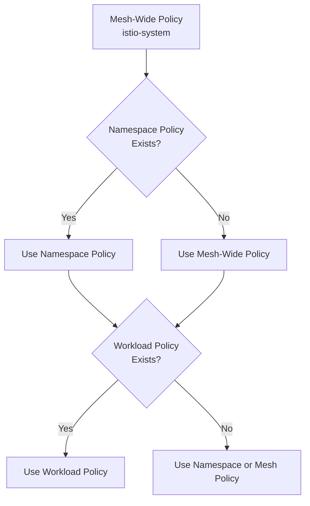

# How to Configure Namespace-Wide Peer Authentication in Istio

Author: [nawazdhandala](https://github.com/nawazdhandala)

Tags: Istio, MTLS, PeerAuthentication, Kubernetes, Namespace Security

Description: Step-by-step guide to configuring namespace-wide PeerAuthentication policies in Istio for per-namespace mTLS control.

---

Namespace-wide PeerAuthentication policies are one of the most useful tools in Istio's security model. They let you set a default mTLS mode for all workloads in a specific namespace, without touching the mesh-wide settings or configuring each workload individually. This is especially handy when different teams own different namespaces and have different security requirements.

## What Makes a Policy Namespace-Wide?

A PeerAuthentication policy is namespace-wide when:

1. It's created in a namespace other than the Istio root namespace (usually `istio-system`).
2. It does not have a `selector` field.

If the policy is in `istio-system` without a selector, it's mesh-wide. If it's in any other namespace without a selector, it's namespace-wide. Simple as that.

## Creating a Namespace-Wide Policy

Here's a namespace-wide policy that enforces strict mTLS for all workloads in the `backend` namespace:

```yaml
apiVersion: security.istio.io/v1
kind: PeerAuthentication
metadata:
  name: default
  namespace: backend
spec:
  mtls:
    mode: STRICT
```

Apply it:

```bash
kubectl apply -f namespace-policy.yaml
```

Every workload in the `backend` namespace now requires mTLS for incoming connections, regardless of the mesh-wide default.

## When to Use Namespace-Wide Policies

There are several scenarios where namespace-wide policies make sense.

**Different security zones.** Your production namespace might need STRICT mTLS while a development namespace stays PERMISSIVE so developers can use tools like curl without sidecars.

```yaml
# Production - locked down
apiVersion: security.istio.io/v1
kind: PeerAuthentication
metadata:
  name: default
  namespace: production
spec:
  mtls:
    mode: STRICT
---
# Development - more relaxed
apiVersion: security.istio.io/v1
kind: PeerAuthentication
metadata:
  name: default
  namespace: development
spec:
  mtls:
    mode: PERMISSIVE
```

**Gradual migration to strict mTLS.** If your mesh-wide policy is PERMISSIVE, you can switch namespaces to STRICT one at a time as you confirm all clients have sidecars.

**Team autonomy.** If each team owns a namespace, they can manage their own PeerAuthentication policies without affecting other teams.

## One Policy Per Namespace (Without Selector)

A critical rule: you should only have one PeerAuthentication policy without a selector per namespace. If you create two or more, the behavior is undefined - Istio might use any of them. Always check before creating a new one:

```bash
kubectl get peerauthentication -n backend
```

If a namespace-wide policy already exists, update it instead of creating a second one:

```bash
kubectl edit peerauthentication default -n backend
```

Or delete the old one and create a new one.

## How Namespace Policies Override Mesh Policies

The precedence order in Istio is:

1. Workload-specific policies (with selector) - highest priority
2. Namespace-wide policies (no selector, in a non-root namespace)
3. Mesh-wide policies (no selector, in the root namespace)

So if your mesh-wide policy is PERMISSIVE but your namespace policy is STRICT, workloads in that namespace will require STRICT mTLS. And if a workload in that namespace has its own policy with a selector, the workload-specific one wins.



## Setting Up Multiple Namespaces

Here's a real-world example where you have three namespaces with different security requirements:

```yaml
# Namespace: payments - must be strict
apiVersion: security.istio.io/v1
kind: PeerAuthentication
metadata:
  name: default
  namespace: payments
spec:
  mtls:
    mode: STRICT
---
# Namespace: catalog - in migration, stays permissive
apiVersion: security.istio.io/v1
kind: PeerAuthentication
metadata:
  name: default
  namespace: catalog
spec:
  mtls:
    mode: PERMISSIVE
---
# Namespace: monitoring - needs to disable mTLS for external scrapers
apiVersion: security.istio.io/v1
kind: PeerAuthentication
metadata:
  name: default
  namespace: monitoring
spec:
  mtls:
    mode: DISABLE
```

Save all three in a single file and apply:

```bash
kubectl apply -f namespace-policies.yaml
```

## Verifying Namespace Policies

Check which policies exist in a namespace:

```bash
kubectl get peerauthentication -n payments
```

Look at the details:

```bash
kubectl describe peerauthentication default -n payments
```

Use `istioctl` to see the effective policy for a specific pod:

```bash
istioctl x describe pod payment-api-abc123 -n payments
```

The output tells you which PeerAuthentication policy applies and the effective mTLS mode.

## Testing Cross-Namespace Communication

When namespaces have different mTLS modes, cross-namespace communication can get interesting. Here are the rules:

- **STRICT to STRICT**: Works fine. Both sides use mTLS.
- **STRICT to PERMISSIVE**: Works fine. The source uses mTLS (auto mTLS kicks in), and the destination accepts it.
- **PERMISSIVE to STRICT**: Works fine if the source has a sidecar (auto mTLS kicks in). Fails if the source doesn't have a sidecar.
- **DISABLE to STRICT**: Fails. The source sends plain text, and the destination rejects it.

Test cross-namespace connectivity:

```bash
# From a pod in the catalog namespace, call a service in payments
kubectl exec -n catalog deploy/catalog-api -c catalog-api -- \
  curl -s http://payment-api.payments.svc.cluster.local:8080/health
```

If the catalog pod has a sidecar, this works even though payments is STRICT - auto mTLS handles the upgrade.

## Combining Namespace and Workload Policies

You can have a namespace-wide policy alongside workload-specific policies in the same namespace. The workload-specific ones override the namespace policy for those specific workloads:

```yaml
# Namespace-wide: everything in backend is STRICT
apiVersion: security.istio.io/v1
kind: PeerAuthentication
metadata:
  name: default
  namespace: backend
spec:
  mtls:
    mode: STRICT
---
# Exception: the legacy-adapter needs PERMISSIVE
apiVersion: security.istio.io/v1
kind: PeerAuthentication
metadata:
  name: legacy-adapter-exception
  namespace: backend
spec:
  selector:
    matchLabels:
      app: legacy-adapter
  mtls:
    mode: PERMISSIVE
```

This pattern gives you a secure default for the namespace while allowing specific exceptions where needed.

## Common Pitfalls

**Forgetting to label pods correctly.** Workload-specific policies use label selectors. If your pod labels don't match, the policy is silently ignored and the namespace default applies.

**Not checking for existing policies.** Creating a second namespace-wide policy (without a selector) leads to unpredictable behavior. Always check first.

**Assuming namespace policies affect outbound traffic.** PeerAuthentication only controls incoming connections. The outbound side is handled by auto mTLS and DestinationRules.

**Missing sidecar injection.** A PeerAuthentication policy only works on pods with the Istio sidecar. If a pod in the namespace doesn't have a sidecar, the policy doesn't protect its incoming traffic at all.

## Clean Up

To remove a namespace-wide policy:

```bash
kubectl delete peerauthentication default -n backend
```

Once deleted, workloads in the namespace fall back to the mesh-wide default.

Namespace-wide PeerAuthentication is your best tool for managing mTLS at scale. It gives you the right granularity - finer than mesh-wide but coarser than per-workload - and it plays well with team-based namespace ownership.
