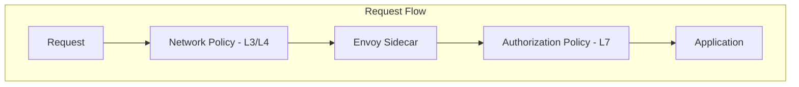

# How to Configure Network Policies with Istio

Author: [nawazdhandala](https://github.com/nawazdhandala)

Tags: Istio, Network Policies, Security, Kubernetes, Service Mesh

Description: How to use Kubernetes NetworkPolicies alongside Istio AuthorizationPolicies for defense-in-depth network security in your service mesh.

---

Istio and Kubernetes NetworkPolicies serve different purposes but complement each other well. Istio AuthorizationPolicies operate at Layer 7 (HTTP/gRPC level), while Kubernetes NetworkPolicies work at Layer 3/4 (IP and port level). Using both gives you defense in depth - if one layer is bypassed or misconfigured, the other still provides protection.

A common mistake is thinking Istio replaces NetworkPolicies. It does not. Istio's authorization happens in the Envoy sidecar, which means a compromised sidecar or a pod without a sidecar can bypass it. NetworkPolicies are enforced by the CNI plugin at the kernel level, making them harder to bypass.

## How NetworkPolicies and Istio Interact



Network Policy is checked first (by the CNI plugin). If the connection is allowed, it reaches the sidecar. Then Istio's Authorization Policy checks the request at the application protocol level. Both must allow the traffic for it to reach the application.

## Default Deny with NetworkPolicies

Start by denying all traffic in a namespace:

```yaml
apiVersion: networking.k8s.io/v1
kind: NetworkPolicy
metadata:
  name: default-deny-all
  namespace: production
spec:
  podSelector: {}
  policyTypes:
    - Ingress
    - Egress
```

This blocks all ingress and egress traffic for all pods in the `production` namespace. Now you need to add specific allow rules.

## Allowing Istio Control Plane Communication

After applying a default deny policy, sidecars cannot communicate with istiod. You need to allow this:

```yaml
apiVersion: networking.k8s.io/v1
kind: NetworkPolicy
metadata:
  name: allow-istiod
  namespace: production
spec:
  podSelector: {}
  policyTypes:
    - Egress
  egress:
    # Allow sidecars to connect to istiod for xDS and certificate signing
    - to:
        - namespaceSelector:
            matchLabels:
              kubernetes.io/metadata.name: istio-system
          podSelector:
            matchLabels:
              app: istiod
      ports:
        - port: 15010
          protocol: TCP
        - port: 15012
          protocol: TCP
        - port: 15014
          protocol: TCP
```

Also allow DNS resolution, which is essential for service discovery:

```yaml
apiVersion: networking.k8s.io/v1
kind: NetworkPolicy
metadata:
  name: allow-dns
  namespace: production
spec:
  podSelector: {}
  policyTypes:
    - Egress
  egress:
    - to:
        - namespaceSelector:
            matchLabels:
              kubernetes.io/metadata.name: kube-system
      ports:
        - port: 53
          protocol: UDP
        - port: 53
          protocol: TCP
```

## Allowing Service-to-Service Communication

Create NetworkPolicies that mirror your intended communication patterns:

```yaml
apiVersion: networking.k8s.io/v1
kind: NetworkPolicy
metadata:
  name: allow-frontend-to-api
  namespace: production
spec:
  podSelector:
    matchLabels:
      app: api-gateway
  policyTypes:
    - Ingress
  ingress:
    - from:
        - podSelector:
            matchLabels:
              app: frontend
      ports:
        - port: 8080
          protocol: TCP
---
apiVersion: networking.k8s.io/v1
kind: NetworkPolicy
metadata:
  name: allow-api-to-payment
  namespace: production
spec:
  podSelector:
    matchLabels:
      app: payment-service
  policyTypes:
    - Ingress
  ingress:
    - from:
        - podSelector:
            matchLabels:
              app: api-gateway
      ports:
        - port: 8080
          protocol: TCP
```

## Allowing Ingress Gateway Traffic

The ingress gateway needs to reach services in application namespaces:

```yaml
apiVersion: networking.k8s.io/v1
kind: NetworkPolicy
metadata:
  name: allow-ingress-gateway
  namespace: production
spec:
  podSelector:
    matchLabels:
      app: api-gateway
  policyTypes:
    - Ingress
  ingress:
    - from:
        - namespaceSelector:
            matchLabels:
              kubernetes.io/metadata.name: istio-system
          podSelector:
            matchLabels:
              app: istio-ingressgateway
      ports:
        - port: 8080
          protocol: TCP
```

## Handling Sidecar Ports

Istio sidecars use several ports for internal communication. When writing NetworkPolicies, account for these ports:

- **15001**: Envoy outbound listener
- **15006**: Envoy inbound listener
- **15010**: istiod xDS (plaintext - should be disabled in production)
- **15012**: istiod xDS (TLS)
- **15014**: istiod control port
- **15020**: Health check port
- **15021**: Health check
- **15090**: Prometheus metrics

Allow Prometheus to scrape sidecar metrics:

```yaml
apiVersion: networking.k8s.io/v1
kind: NetworkPolicy
metadata:
  name: allow-prometheus-scraping
  namespace: production
spec:
  podSelector: {}
  policyTypes:
    - Ingress
  ingress:
    - from:
        - namespaceSelector:
            matchLabels:
              kubernetes.io/metadata.name: monitoring
          podSelector:
            matchLabels:
              app: prometheus
      ports:
        - port: 15090
          protocol: TCP
```

## Combining NetworkPolicies with Istio AuthorizationPolicies

Use NetworkPolicies for broad network segmentation and Istio AuthorizationPolicies for fine-grained access control:

```yaml
# NetworkPolicy: Allow any pod in production to reach the API gateway on port 8080
apiVersion: networking.k8s.io/v1
kind: NetworkPolicy
metadata:
  name: api-gateway-network
  namespace: production
spec:
  podSelector:
    matchLabels:
      app: api-gateway
  policyTypes:
    - Ingress
  ingress:
    - from:
        - namespaceSelector:
            matchLabels:
              kubernetes.io/metadata.name: production
      ports:
        - port: 8080
---
# AuthorizationPolicy: Only allow the frontend service account to call GET /api/v1/*
apiVersion: security.istio.io/v1
kind: AuthorizationPolicy
metadata:
  name: api-gateway-authz
  namespace: production
spec:
  selector:
    matchLabels:
      app: api-gateway
  rules:
    - from:
        - source:
            principals: ["cluster.local/ns/production/sa/frontend"]
      to:
        - operation:
            methods: ["GET"]
            paths: ["/api/v1/*"]
```

The NetworkPolicy allows the connection at the network level, but the AuthorizationPolicy further restricts it to specific identities, methods, and paths.

## Namespace Isolation Pattern

A practical pattern is to isolate namespaces with NetworkPolicies and use Istio for intra-namespace authorization:

```yaml
# Block all cross-namespace traffic by default
apiVersion: networking.k8s.io/v1
kind: NetworkPolicy
metadata:
  name: namespace-isolation
  namespace: production
spec:
  podSelector: {}
  policyTypes:
    - Ingress
  ingress:
    # Only allow traffic from the same namespace
    - from:
        - podSelector: {}
    # And from the istio-system namespace (for gateways)
    - from:
        - namespaceSelector:
            matchLabels:
              kubernetes.io/metadata.name: istio-system
```

## Debugging NetworkPolicy and Istio Conflicts

When traffic is blocked and you are not sure which layer is doing it:

1. Check if the NetworkPolicy is blocking:

```bash
# Temporarily remove NetworkPolicies and test
kubectl get networkpolicies -n production
# If traffic works without NetworkPolicies, the issue is there
```

2. Check if Istio is blocking:

```bash
# Check RBAC logs in the sidecar
kubectl logs <pod-name> -c istio-proxy | grep "rbac"

# Check authorization policy status
istioctl x authz check <pod-name> -n production
```

3. Use a pod without a sidecar to test at the network level:

```bash
kubectl run debug --rm -it --image=busybox --restart=Never -- wget -qO- http://service:8080
```

If this works but a pod with a sidecar cannot connect, the issue is in Istio configuration. If this also fails, the NetworkPolicy is blocking.

## Performance Considerations

NetworkPolicies are enforced by the CNI plugin and have minimal performance impact. Istio AuthorizationPolicies are evaluated by Envoy on every request and add a small amount of latency (typically sub-millisecond). The combination of both does not cause significant overhead but provides much stronger security than either one alone.

Using NetworkPolicies alongside Istio is the right approach for any production deployment. NetworkPolicies handle the coarse-grained network segmentation that survives even if the mesh has issues, while Istio provides the fine-grained, identity-aware access control that makes zero trust practical.
