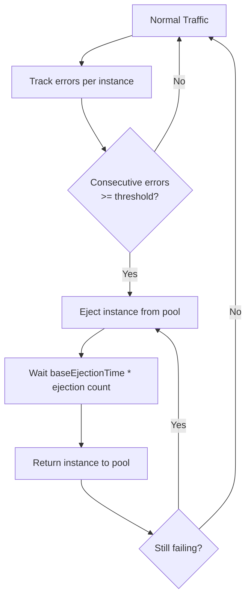

# How to Configure Outlier Detection for Circuit Breaking in Istio

Author: [nawazdhandala](https://github.com/nawazdhandala)

Tags: Istio, Service Mesh, Outlier Detection, Circuit Breaking, Kubernetes

Description: Step-by-step guide to configuring outlier detection in Istio DestinationRule to automatically eject unhealthy service instances from the load balancing pool.

---

Outlier detection is Istio's mechanism for identifying and removing unhealthy service instances from the load balancing pool. When a pod starts returning errors consistently, outlier detection ejects it so traffic goes to healthy pods instead. After a cool-down period, the ejected pod gets added back. If it is still failing, it gets ejected again for a longer time.

This is the "circuit breaker" in the classic sense - it detects failures and stops sending traffic to broken instances.

## How Outlier Detection Works

Envoy tracks the error rate of each upstream instance (pod). When an instance exceeds the configured error threshold, it gets ejected from the pool for a specified duration. The process looks like this:



Each subsequent ejection multiplies the ejection time. First ejection: 30s. Second: 60s. Third: 90s. This progressive backoff gives failing instances more time to recover.

## Basic Outlier Detection Configuration

```yaml
apiVersion: networking.istio.io/v1beta1
kind: DestinationRule
metadata:
  name: payment-service
  namespace: default
spec:
  host: payment-service
  trafficPolicy:
    outlierDetection:
      consecutive5xxErrors: 5
      interval: 10s
      baseEjectionTime: 30s
      maxEjectionPercent: 50
```

This configuration:
- Ejects an instance after 5 consecutive 5xx errors
- Checks for outliers every 10 seconds
- Keeps ejected instances out for at least 30 seconds
- Never ejects more than 50% of instances at once

## Understanding Each Field

### consecutive5xxErrors

```yaml
outlierDetection:
  consecutive5xxErrors: 5
```

This counts consecutive (back-to-back) 5xx errors from a specific instance. A single successful response resets the counter to zero. This is intentionally conservative - an instance needs to fail multiple times in a row before getting ejected.

Lower values (2-3) are more aggressive and eject instances faster. Higher values (10+) tolerate more failures before acting. For most production services, 3-5 is a good range.

### consecutiveGatewayErrors

```yaml
outlierDetection:
  consecutiveGatewayErrors: 3
```

Similar to `consecutive5xxErrors`, but only counts 502, 503, and 504 errors. This is useful when you want to distinguish between gateway-level errors (which often indicate infrastructure problems) and application-level 500 errors (which might be expected for certain inputs).

### interval

```yaml
outlierDetection:
  interval: 10s
```

How often the outlier detection algorithm runs. Every 10 seconds, Envoy checks whether any instances have exceeded their error threshold.

Shorter intervals (5s) detect failures faster but add more processing overhead. Longer intervals (30s) are gentler on resources but slower to react. For most cases, 10-15 seconds is fine.

### baseEjectionTime

```yaml
outlierDetection:
  baseEjectionTime: 30s
```

How long an ejected instance stays out of the pool. The actual ejection time increases with each consecutive ejection: `baseEjectionTime * number_of_ejections`. So with a 30s base:
- First ejection: 30s
- Second ejection: 60s
- Third ejection: 90s
- And so on

### maxEjectionPercent

```yaml
outlierDetection:
  maxEjectionPercent: 50
```

The maximum percentage of instances that can be ejected at the same time. This is a safety valve. If all your pods are having issues, ejecting all of them leaves no backends to handle traffic.

With 4 pods and `maxEjectionPercent: 50`, at most 2 pods can be ejected. The other 2 will continue receiving traffic even if they are failing.

## Production-Ready Configuration

Here is a configuration tuned for production use:

```yaml
apiVersion: networking.istio.io/v1beta1
kind: DestinationRule
metadata:
  name: order-service
  namespace: production
spec:
  host: order-service.production.svc.cluster.local
  trafficPolicy:
    connectionPool:
      tcp:
        maxConnections: 200
      http:
        http1MaxPendingRequests: 100
        http2MaxRequests: 200
    outlierDetection:
      consecutive5xxErrors: 3
      consecutiveGatewayErrors: 2
      interval: 10s
      baseEjectionTime: 30s
      maxEjectionPercent: 40
      minHealthPercent: 30
```

The `minHealthPercent: 30` field is important. It says: if fewer than 30% of instances are healthy, disable outlier detection entirely and send traffic to all instances. This prevents a scenario where a widespread issue causes all instances to get ejected.

## Outlier Detection for Different Service Types

### High-Availability Services

For services where uptime is critical, be aggressive with ejection:

```yaml
apiVersion: networking.istio.io/v1beta1
kind: DestinationRule
metadata:
  name: auth-service
  namespace: default
spec:
  host: auth-service
  trafficPolicy:
    outlierDetection:
      consecutive5xxErrors: 2
      interval: 5s
      baseEjectionTime: 60s
      maxEjectionPercent: 30
```

Eject after just 2 consecutive errors, check frequently, and keep ejected instances out longer. The low `maxEjectionPercent` ensures you always have capacity.

### Batch Processing Services

For services where occasional errors are expected:

```yaml
apiVersion: networking.istio.io/v1beta1
kind: DestinationRule
metadata:
  name: batch-processor
  namespace: default
spec:
  host: batch-processor
  trafficPolicy:
    outlierDetection:
      consecutive5xxErrors: 10
      interval: 30s
      baseEjectionTime: 15s
      maxEjectionPercent: 60
```

Higher error threshold, less frequent checks, shorter ejection time. This tolerates more failures before acting and lets instances back in sooner.

## Verifying Outlier Detection

Check that outlier detection is configured and working:

```bash
# Verify the DestinationRule is applied
kubectl get destinationrule order-service -n production -o yaml

# Check Envoy cluster config for outlier detection
kubectl exec deploy/order-service -n production -c istio-proxy -- \
  curl -s localhost:15000/config_dump?resource=dynamic_active_clusters | \
  python3 -m json.tool | grep -A 15 "outlier_detection"

# Check ejection stats
kubectl exec deploy/order-service -n production -c istio-proxy -- \
  curl -s localhost:15000/stats | grep "ejections"
```

Key metrics to watch:

```bash
# Active ejections (currently ejected instances)
# outlier_detection.ejections_active

# Total ejections over time
# outlier_detection.ejections_total

# Ejections due to consecutive 5xx errors
# outlier_detection.ejections_detected_consecutive_5xx

# Ejections that were enforced (not just detected)
# outlier_detection.ejections_enforced_total
```

## Common Issues

**All instances getting ejected.** This happens when `maxEjectionPercent` is too high or when there is a widespread issue. Set `maxEjectionPercent` to 50% or lower and use `minHealthPercent` to disable ejection when too few instances are healthy.

**Instances never getting ejected.** Check that `consecutive5xxErrors` is not set too high. Also verify that the errors are actually 5xx and not 4xx (which do not count toward the threshold). Use `consecutiveGatewayErrors` if you want to catch 502/503/504 specifically.

**Instances getting ejected too often.** If a pod has intermittent issues, it might get ejected and re-added repeatedly. Increase `baseEjectionTime` so it stays out longer, giving it more time to stabilize.

Outlier detection is the backbone of circuit breaking in Istio. Combined with connection pool limits, it gives you a complete system for protecting your services from cascading failures. Configure it based on your service's error tolerance and availability requirements, and always monitor the ejection metrics to make sure it is working as intended.
