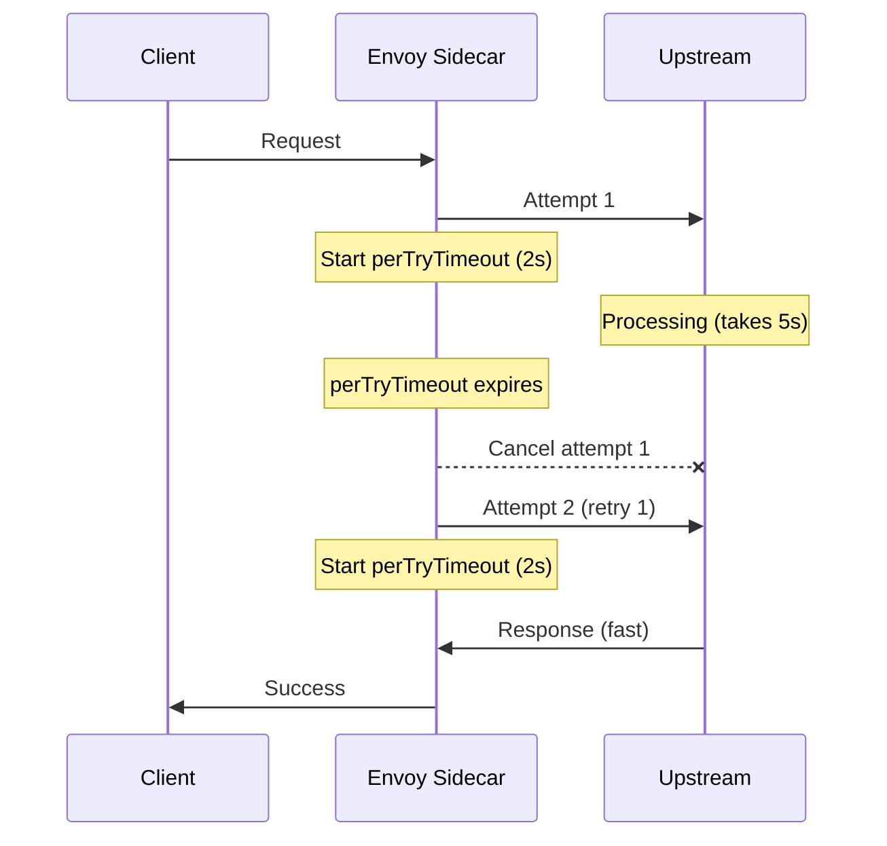

# How to Configure Per-Retry Timeout in Istio

Author: [nawazdhandala](https://github.com/nawazdhandala)

Tags: Istio, Retry Policy, Timeout, VirtualService, Traffic Management

Description: How to configure per-retry timeouts in Istio to control how long each individual retry attempt can take and prevent retries from consuming the entire request budget.

---

When you configure retries in Istio, one of the most important settings is the per-retry timeout. Without it, a single slow retry attempt can consume all the time allocated for the overall request, leaving no room for additional retries. The `perTryTimeout` field gives each individual attempt a hard deadline. If the upstream doesn't respond within that time, the attempt is cancelled and the next retry kicks in.

Getting this value right is the difference between retries that actually help and retries that just waste time. This post covers how to configure per-retry timeouts, how they interact with the overall route timeout, and how to choose appropriate values.

## Basic Per-Retry Timeout Configuration

The `perTryTimeout` field goes inside the retry configuration:

```yaml
apiVersion: networking.istio.io/v1beta1
kind: VirtualService
metadata:
  name: inventory-service
  namespace: production
spec:
  hosts:
    - inventory-service
  http:
    - retries:
        attempts: 3
        perTryTimeout: 2s
        retryOn: 5xx,connect-failure
      route:
        - destination:
            host: inventory-service
```

Each attempt (the original request and each retry) gets at most 2 seconds. If the upstream doesn't respond in 2 seconds, that attempt is terminated and the next one begins.

The timeout is specified as a duration string:
- `500ms` - half a second
- `2s` - two seconds
- `1.5s` - one and a half seconds
- `30s` - thirty seconds

## How Per-Retry Timeout Works

Here's the sequence of events when a request is retried with per-retry timeout:



In this example, the first attempt was slow (would have taken 5 seconds), but the 2-second per-retry timeout cancelled it. The second attempt succeeded quickly. Without the per-retry timeout, the client would have waited the full 5 seconds for the first attempt before anything else happened.

## Per-Retry Timeout vs Overall Timeout

The per-retry timeout and the overall route timeout serve different purposes:

- **perTryTimeout**: Maximum time for a single attempt
- **timeout** (route-level): Maximum total time for the entire request, including all retries

They work together:

```yaml
http:
  - timeout: 8s
    retries:
      attempts: 3
      perTryTimeout: 2s
    route:
      - destination:
          host: inventory-service
```

With this configuration:

- Each attempt gets up to 2 seconds (perTryTimeout)
- The total time for all attempts combined can't exceed 8 seconds (overall timeout)
- In the worst case: 4 attempts * 2s = 8s, which exactly hits the overall timeout

What happens at the boundary:

```text
Attempt 1: starts at 0s, times out at 2s -> retry
Attempt 2: starts at 2s, times out at 4s -> retry
Attempt 3: starts at 4s, times out at 6s -> retry
Attempt 4: starts at 6s, times out at 8s -> overall timeout hit, return error
```

If the overall timeout is shorter than the total possible retry time, some retries get cut short:

```yaml
http:
  - timeout: 5s
    retries:
      attempts: 3
      perTryTimeout: 2s
```

```text
Attempt 1: 0s-2s (uses full perTryTimeout)
Attempt 2: 2s-4s (uses full perTryTimeout)
Attempt 3: 4s-5s (gets only 1s before overall timeout)
Attempt 4: never starts (no time left)
```

The third retry only gets 1 second instead of 2, and the fourth retry never happens. This is why you want: `timeout >= (attempts + 1) * perTryTimeout`.

## Choosing the Right Per-Retry Timeout

### Based on Service Response Time

Look at your service's actual response time distribution:

```bash
# Get p99 response time from Istio metrics
kubectl exec -n istio-system deploy/prometheus -- curl -s 'localhost:9090/api/v1/query?query=histogram_quantile(0.99,sum(rate(istio_request_duration_milliseconds_bucket{destination_service="inventory-service.production.svc.cluster.local"}[5m]))by(le))' | jq '.data.result[0].value[1]'
```

Set `perTryTimeout` to about 2-3x your p99 latency. If p99 is 500ms, set perTryTimeout to 1-1.5s. This catches genuinely stuck requests while allowing enough time for normal slow responses.

### Based on Use Case

Different endpoints need different per-retry timeouts:

```yaml
apiVersion: networking.istio.io/v1beta1
kind: VirtualService
metadata:
  name: data-service
  namespace: production
spec:
  hosts:
    - data-service
  http:
    # Fast lookup - tight per-try timeout
    - match:
        - uri:
            prefix: /api/lookup
      retries:
        attempts: 3
        perTryTimeout: 500ms
        retryOn: 5xx,connect-failure
      timeout: 2s
      route:
        - destination:
            host: data-service

    # Search - needs more time per attempt
    - match:
        - uri:
            prefix: /api/search
      retries:
        attempts: 2
        perTryTimeout: 3s
        retryOn: 5xx,connect-failure
      timeout: 8s
      route:
        - destination:
            host: data-service

    # Aggregation - slow but retryable
    - match:
        - uri:
            prefix: /api/aggregate
      retries:
        attempts: 1
        perTryTimeout: 15s
        retryOn: connect-failure
      timeout: 30s
      route:
        - destination:
            host: data-service
```

## What Happens Without perTryTimeout

If you configure retries without a perTryTimeout:

```yaml
retries:
  attempts: 3
  retryOn: 5xx,connect-failure
```

Each retry attempt uses the overall route timeout as its timeout. If the route timeout is 10 seconds and the first attempt takes 9.5 seconds to fail, you only have 0.5 seconds for your three retry attempts.

This is almost always wrong. Always set perTryTimeout when configuring retries.

```yaml
# Bad: no perTryTimeout
retries:
  attempts: 3
  retryOn: 5xx

# Good: explicit perTryTimeout
retries:
  attempts: 3
  perTryTimeout: 2s
  retryOn: 5xx
```

## Testing Per-Retry Timeout with Fault Injection

Validate that per-retry timeout works correctly by injecting delays:

```yaml
apiVersion: networking.istio.io/v1beta1
kind: VirtualService
metadata:
  name: inventory-service
  namespace: production
spec:
  hosts:
    - inventory-service
  http:
    - fault:
        delay:
          fixedDelay: 5s
          percentage:
            value: 75.0
      retries:
        attempts: 3
        perTryTimeout: 1s
        retryOn: 5xx,connect-failure
      timeout: 6s
      route:
        - destination:
            host: inventory-service
```

75% of attempts get a 5-second delay, but the per-retry timeout is 1 second. So 75% of attempts time out after 1 second, and the proxy immediately tries the next one. With 4 total attempts, the probability of all hitting the delay is 0.75^4 = 31.6%.

Test it:

```bash
for i in $(seq 1 20); do
  result=$(kubectl exec deploy/test-client -n production -- curl -s -o /dev/null -w "%{http_code} %{time_total}s" http://inventory-service:8080/stock)
  echo "Request $i: $result"
done
```

Successful requests should complete in about 1-2 seconds (one or two timeouts at 1 second, then a fast response). Failed requests should take about 4 seconds (four attempts, each timing out at 1 second).

## Per-Retry Timeout for gRPC

The per-retry timeout works the same way for gRPC services. Since gRPC uses deadlines, the per-retry timeout acts as an additional deadline that applies per-attempt:

```yaml
apiVersion: networking.istio.io/v1beta1
kind: VirtualService
metadata:
  name: user-service
  namespace: production
spec:
  hosts:
    - user-service
  http:
    - retries:
        attempts: 2
        perTryTimeout: 1500ms
        retryOn: unavailable,cancelled,deadline-exceeded
      timeout: 5s
      route:
        - destination:
            host: user-service
            port:
              number: 50051
```

If the gRPC client sets its own deadline of 3 seconds and the per-retry timeout is 1.5 seconds, the client deadline takes precedence over the overall request. Each individual attempt still respects the 1.5-second per-retry timeout.

## Observing Per-Retry Timeout Behavior

Check the proxy access logs for timeout indicators:

```bash
kubectl logs deploy/test-client -c istio-proxy -n production | grep "inventory-service"
```

When a per-retry timeout fires, you'll see:

- `UT` (Upstream Timeout) in the response flags if the final attempt also timed out
- The `duration` field in the access log showing the total request time, which should roughly equal `(number of timed-out attempts * perTryTimeout) + final attempt time`

Check retry stats:

```bash
kubectl exec deploy/test-client -c istio-proxy -n production -- curl -s localhost:15000/stats | grep "inventory-service.*retry"
```

The `upstream_rq_retry` stat increases each time a retry happens, whether triggered by an error response or a per-retry timeout.

## Common Mistakes

**perTryTimeout too short**: If it's shorter than the normal response time of the upstream, every attempt times out and retries are useless. The caller always gets a timeout error.

**perTryTimeout same as overall timeout**: The first attempt uses all the time, leaving nothing for retries. Retries exist but never actually execute.

**No perTryTimeout at all**: A single slow attempt can consume the entire request budget. Set it explicitly.

**Not accounting for processing time**: The perTryTimeout clock starts when the proxy sends the request, not when the upstream starts processing. Factor in network latency between the proxy and the upstream.

Per-retry timeout is a small configuration detail that has a big impact on how well retries work. Without it, retries are unreliable. With it set correctly, retries become a dependable safety net against transient failures. Always set it, and set it based on real response time data from your services.
