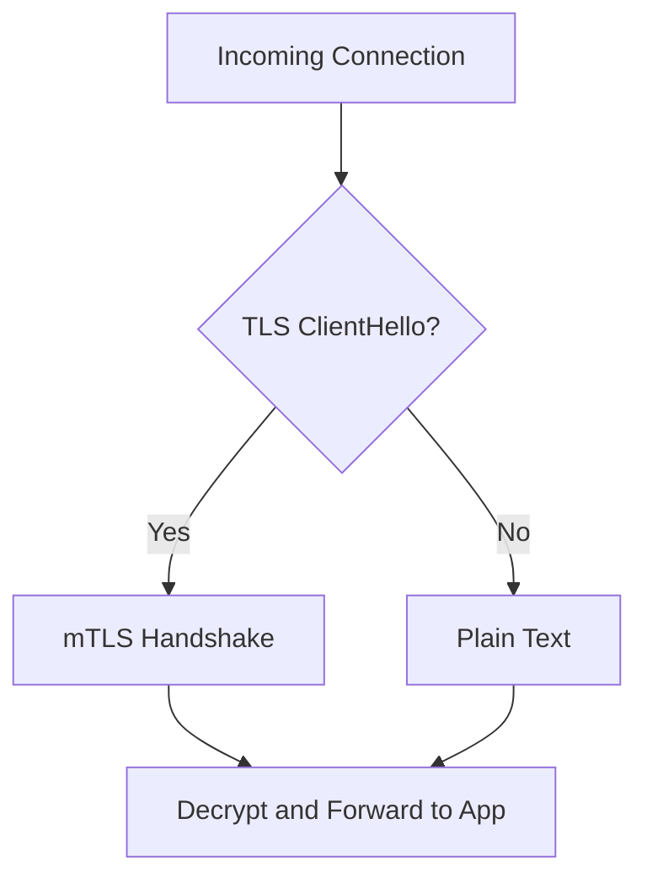

# How to Configure Permissive mTLS Mode in Istio

Author: [nawazdhandala](https://github.com/nawazdhandala)

Tags: Istio, mTLS, Permissive Mode, Security, Kubernetes

Description: Learn how to configure permissive mTLS mode in Istio so services accept both encrypted and plain text connections during migration.

---

Permissive mTLS mode is the sweet spot between no encryption and full strict mTLS. When a service runs in permissive mode, its sidecar proxy accepts both mTLS and plain text connections. If the caller has a sidecar, the connection uses mTLS automatically. If the caller does not have a sidecar, it falls back to plain text.

This mode exists primarily as a migration aid. It lets you roll out Istio sidecars incrementally without breaking communication between injected and non-injected services. But there are good reasons to keep some services in permissive mode even after migration.

## How Permissive Mode Works

When a sidecar receives an incoming connection in permissive mode, it inspects the first bytes of the connection to determine whether the client is initiating a TLS handshake. If it sees a TLS ClientHello message, it proceeds with mTLS. If it sees plain text (like an HTTP request line), it handles it as plain HTTP.

This protocol detection happens transparently. The application behind the sidecar does not know whether the original connection was encrypted or not. It always receives plain text from the sidecar.



## Configuring Permissive Mode

Permissive mode is the default in Istio, so if you have not changed anything, you are already running it. But if you want to explicitly set it (maybe reverting from strict mode), here is how.

### Mesh-Wide Permissive Mode

```yaml
apiVersion: security.istio.io/v1
kind: PeerAuthentication
metadata:
  name: default
  namespace: istio-system
spec:
  mtls:
    mode: PERMISSIVE
```

Apply it:

```bash
kubectl apply -f permissive-mesh.yaml
```

### Namespace-Level Permissive Mode

If most of your mesh is strict but one namespace needs to accept plain text:

```yaml
apiVersion: security.istio.io/v1
kind: PeerAuthentication
metadata:
  name: default
  namespace: legacy-apps
spec:
  mtls:
    mode: PERMISSIVE
```

This overrides a mesh-wide STRICT policy for the legacy-apps namespace.

### Workload-Level Permissive Mode

For a specific service that needs to accept plain text connections:

```yaml
apiVersion: security.istio.io/v1
kind: PeerAuthentication
metadata:
  name: api-gateway-permissive
  namespace: production
spec:
  selector:
    matchLabels:
      app: api-gateway
  mtls:
    mode: PERMISSIVE
```

## When to Use Permissive Mode

### During Sidecar Rollout

The most common use case. When you are adding Istio sidecars to an existing cluster, not all services get injected at the same time. During this period, some calls will be sidecar-to-sidecar (mTLS) and some will be non-sidecar-to-sidecar (plain text). Permissive mode handles both.

### For Services with Mixed Callers

Some services receive traffic from both inside and outside the mesh. For example, a service that is called by other mesh services AND by a legacy system that does not have a sidecar. Permissive mode lets both work.

### For Metrics and Monitoring Endpoints

Prometheus, Datadog agents, and other monitoring tools often scrape metrics endpoints directly without going through a sidecar. If your service exposes a `/metrics` endpoint, you might need permissive mode on that port.

A better approach is to use port-level mTLS settings instead of making the whole service permissive:

```yaml
apiVersion: security.istio.io/v1
kind: PeerAuthentication
metadata:
  name: my-service-mtls
  namespace: production
spec:
  selector:
    matchLabels:
      app: my-service
  mtls:
    mode: STRICT
  portLevelMtls:
    9090:
      mode: PERMISSIVE
```

This keeps the main service ports strict while allowing plain text on the metrics port.

## Auto mTLS and Permissive Mode

Istio has a feature called "auto mTLS" that is enabled by default. With auto mTLS, when a sidecar makes an outbound connection, it checks whether the destination has a sidecar. If it does, the connection uses mTLS. If it does not, the connection uses plain text.

Auto mTLS works in combination with permissive mode to create a smooth experience:

- Server side (PeerAuthentication PERMISSIVE): Accepts both mTLS and plain text
- Client side (auto mTLS): Automatically uses mTLS when possible

This means even without any configuration changes, sidecar-to-sidecar traffic in a default Istio installation is encrypted. Permissive mode does not mean "no encryption" - it means "encryption when possible, plain text when necessary."

## Verifying Permissive Mode

Check what mode a namespace is running:

```bash
kubectl get peerauthentication -n production
```

Check the effective policy for a specific pod:

```bash
istioctl x describe pod <pod-name> -n production
```

Test that both mTLS and plain text connections work:

```bash
# From a pod WITH a sidecar (should use mTLS)
kubectl exec deploy/service-a -c service-a -- curl -s http://service-b:8080/health

# From a pod WITHOUT a sidecar (should use plain text)
kubectl run test --image=curlimages/curl --labels="sidecar.istio.io/inject=false" --restart=Never -it --rm -- \
  curl -s http://service-b.production.svc.cluster.local:8080/health
```

Both should succeed in permissive mode.

## Security Implications

Permissive mode has a real security trade-off. While it encrypts traffic between sidecar-injected services, it does not prevent a compromised pod from stripping its sidecar and connecting with plain text. In strict mode, that connection would be rejected.

For production environments handling sensitive data, you should aim for strict mode. Use permissive mode as a temporary state during migration, not as the permanent configuration.

That said, permissive mode with auto mTLS is still much better than no mTLS at all. Traffic between properly configured services is encrypted, and you get identity-based authentication for those connections. The "gap" is only for connections from services without sidecars.

## Monitoring mTLS vs Plain Text in Permissive Mode

When running in permissive mode, you probably want to know how much traffic is using mTLS versus plain text. This helps you track migration progress and identify services that still need sidecars.

In Prometheus, you can query:

```text
istio_requests_total{connection_security_policy="mutual_tls", reporter="destination"}
```

versus:

```text
istio_requests_total{connection_security_policy="none", reporter="destination"}
```

The `connection_security_policy` label tells you whether each request used mTLS. If you see a decreasing number of `none` connections over time, your migration is progressing.

## Moving from Permissive to Strict

Once you are confident that all callers can use mTLS, transition to strict mode. The safest approach:

1. Monitor the `connection_security_policy` metrics
2. Confirm no `none` connections exist for the target namespace
3. Apply STRICT PeerAuthentication for that namespace
4. Monitor for errors
5. Repeat for each namespace

The transition itself is instant. As soon as the STRICT PeerAuthentication is applied, the sidecar stops accepting plain text. If something breaks, revert to PERMISSIVE immediately.

```bash
# Quick revert if needed
kubectl apply -f - <<EOF
apiVersion: security.istio.io/v1
kind: PeerAuthentication
metadata:
  name: default
  namespace: production
spec:
  mtls:
    mode: PERMISSIVE
EOF
```

Permissive mode is a practical, safe default that gives you encryption where possible while keeping your services accessible during migration. Just make sure you have a plan to move to strict mode eventually.
