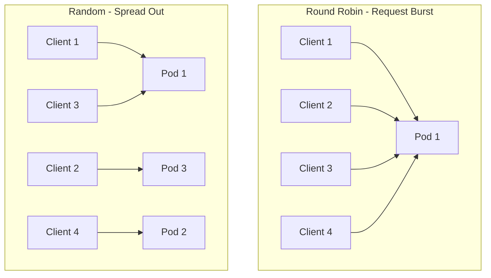

# How to Configure Random Load Balancing in Istio

Author: [nawazdhandala](https://github.com/nawazdhandala)

Tags: Istio, Random Load Balancing, DestinationRule, Kubernetes, Traffic Management

Description: How to set up random load balancing in Istio DestinationRule and when it makes sense over round robin or other algorithms.

---

Random load balancing does exactly what it sounds like - for every incoming request, Envoy picks a random backend pod to send it to. No counters, no state tracking, just a random selection each time. It sounds chaotic, but there are real situations where random is actually better than round robin.

## Why Would You Want Random?

The main advantage of random over round robin is that it avoids the "thundering herd" synchronization problem.

With round robin, each Envoy sidecar maintains its own counter. If you have 50 client pods sending requests at roughly the same rate, their counters can accidentally sync up. Multiple proxies might hit the same backend pod at the same instant, creating bursts of traffic on specific pods while others are idle for that moment.

Random load balancing does not have this problem because there is no counter to synchronize. Over a large number of requests, the distribution converges to roughly equal, but without the periodic spikes.

The second scenario where random helps is when you have a large number of upstream endpoints. Round robin needs to iterate through the entire list, which means every pod eventually gets traffic. Random naturally tends to favor pods it has already connected to (since it might pick the same one twice in a row), which can reduce the number of active connections.

## Setting It Up

The configuration is straightforward:

```yaml
apiVersion: networking.istio.io/v1
kind: DestinationRule
metadata:
  name: my-service-random
spec:
  host: my-service
  trafficPolicy:
    loadBalancer:
      simple: RANDOM
```

Apply it:

```bash
kubectl apply -f random-lb.yaml
```

That is the entire configuration. No extra parameters to tune.

## Testing Random Distribution

Deploy a test service with multiple replicas to observe the distribution:

```yaml
apiVersion: apps/v1
kind: Deployment
metadata:
  name: backend
spec:
  replicas: 5
  selector:
    matchLabels:
      app: backend
  template:
    metadata:
      labels:
        app: backend
    spec:
      containers:
      - name: backend
        image: hashicorp/http-echo
        args:
        - -listen=:8080
        - -text=hello
        ports:
        - containerPort: 8080
---
apiVersion: v1
kind: Service
metadata:
  name: backend
spec:
  selector:
    app: backend
  ports:
  - name: http
    port: 8080
    targetPort: 8080
```

Apply the service, then the DestinationRule:

```bash
kubectl apply -f backend.yaml
kubectl apply -f - <<EOF
apiVersion: networking.istio.io/v1
kind: DestinationRule
metadata:
  name: backend-random
spec:
  host: backend
  trafficPolicy:
    loadBalancer:
      simple: RANDOM
EOF
```

Now send a batch of requests from a test pod:

```bash
kubectl run curl-test --image=curlimages/curl -it --rm -- sh -c '
  for i in $(seq 1 200); do
    curl -s http://backend:8080/ 2>/dev/null
  done | sort | uniq -c | sort -rn
'
```

With random load balancing and 5 pods, you should see each pod getting roughly 40 requests out of 200. But unlike round robin, the distribution will have more variance. One pod might get 45 while another gets 35. Over 1000 requests, it evens out much more.

## Verifying in Envoy

Check that Envoy applied the random policy:

```bash
istioctl proxy-config cluster <pod-name> --fqdn backend.default.svc.cluster.local -o json
```

You should see:

```json
{
  "lbPolicy": "RANDOM"
}
```

## Random vs Round Robin - A Practical Comparison

Here is a scenario that illustrates when random wins. Imagine you have:

- 3 backend pods
- 10 client pods, each sending 1 request per second

With round robin, each client's first request goes to pod 1, second to pod 2, third to pod 3. If all 10 clients start at roughly the same time (common after a deployment), they all hit pod 1 simultaneously, then pod 2, then pod 3. You get periodic bursts.



With random, each client independently picks a random pod. The first batch of 10 requests gets spread across all 3 pods roughly evenly, without the synchronized bursts.

## When NOT to Use Random

Random is not always the best choice:

- **When you need session stickiness**: Random sends each request to a potentially different pod. Use consistent hash instead.
- **When request costs vary significantly**: If some requests take 10x longer than others, random does not account for actual pod load. Use LEAST_REQUEST instead.
- **When you have very few endpoints**: With only 2 pods, random can create noticeable imbalance over short time periods. Round robin gives perfect 50/50 distribution.

## Combining Random with Outlier Detection

Random load balancing should almost always be paired with outlier detection. Since random might keep picking an unhealthy pod, you need outlier detection to remove failing pods from the pool:

```yaml
apiVersion: networking.istio.io/v1
kind: DestinationRule
metadata:
  name: backend-random-healthy
spec:
  host: backend
  trafficPolicy:
    loadBalancer:
      simple: RANDOM
    outlierDetection:
      consecutive5xxErrors: 5
      interval: 10s
      baseEjectionTime: 30s
      maxEjectionPercent: 30
```

Without outlier detection, a crashing pod would still receive its fair share of requests (and they would all fail). With outlier detection, Envoy removes the pod after 5 consecutive errors and does not send traffic to it for at least 30 seconds.

## Random Load Balancing Per Subset

You can apply random load balancing to specific subsets while using a different algorithm for others:

```yaml
apiVersion: networking.istio.io/v1
kind: DestinationRule
metadata:
  name: backend-mixed
spec:
  host: backend
  trafficPolicy:
    loadBalancer:
      simple: ROUND_ROBIN
  subsets:
  - name: v1
    labels:
      version: v1
  - name: v2
    labels:
      version: v2
    trafficPolicy:
      loadBalancer:
        simple: RANDOM
```

Here, v1 uses the default round robin while v2 uses random. This can be useful during canary deployments where the canary subset has a different traffic pattern.

## Performance

Random load balancing has essentially zero overhead. Each decision is O(1) - just generate a random number and pick a pod. There is no state to maintain, no counters to update, and no hash ring to build. It is one of the lightest algorithms available.

## Cleanup

```bash
kubectl delete destinationrule backend-random
kubectl delete deployment backend
kubectl delete service backend
```

Random load balancing is a good default for microservices with many clients. It avoids synchronization issues, has minimal overhead, and provides good enough distribution for most workloads. If you are running into uneven load distribution with round robin and you have many client proxies, give random a try.
