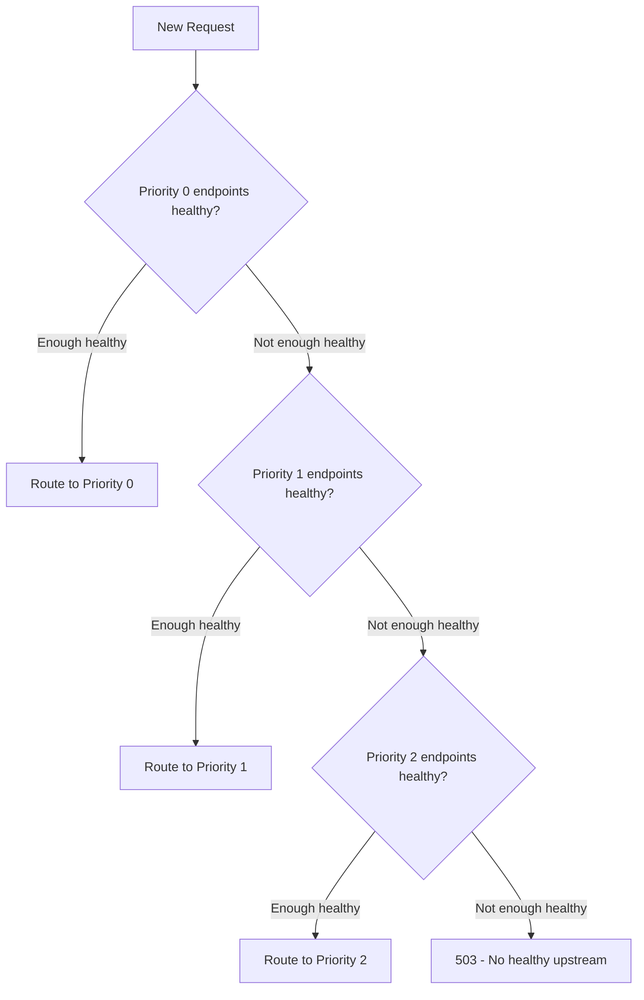

# How to Configure Region and Zone Priority in Istio

Author: [nawazdhandala](https://github.com/nawazdhandala)

Tags: Istio, Locality Priority, Load Balancing, Kubernetes, Multi-Zone

Description: Configure region and zone priority ordering in Istio to control the exact failover chain when local service endpoints are unavailable.

---

When Istio routes traffic using locality-aware load balancing, it assigns a priority to each group of endpoints based on how close they are to the calling pod. Endpoints in the same region, zone, and sub-zone get the highest priority, same-region endpoints get the next zone-level priority, and other regions come later. But what if you want to customize this ordering? Maybe zone B is geographically closer to zone A than zone C is, or maybe one region has better connectivity than another.

Istio lets you control regional failover through `failover`, label-based priority chains through `failoverPriority`, and weighted locality preferences through `distribute` settings in DestinationRules.

## Default Priority Assignment

Without any custom configuration, Istio assigns priorities like this:

| Priority Level | Locality Relationship | Example |
|---------------|----------------------|---------|
| 0 (highest) | Same region, same zone, same sub-zone | us-east-1a/rack-1 to us-east-1a/rack-1 |
| 1 | Same region, same zone, different sub-zone | us-east-1a/rack-1 to us-east-1a/rack-2 |
| 2 | Same region, different zone | us-east-1a to us-east-1b |
| 3+ | Different region | us-east-1a to us-west-2a |

This is usually what you want. But there are cases where you need to override this default behavior.

## Customizing Region Failover Priority

The `failover` section in a DestinationRule lets you specify which region traffic should go to when the current region is unavailable:

```yaml
apiVersion: networking.istio.io/v1
kind: DestinationRule
metadata:
  name: payment-gateway
spec:
  host: payment-gateway
  trafficPolicy:
    outlierDetection:
      consecutive5xxErrors: 3
      interval: 10s
      baseEjectionTime: 30s
      maxEjectionPercent: 100
    loadBalancer:
      localityLbSetting:
        enabled: true
        failover:
          - from: us-east-1
            to: us-east-2
          - from: us-east-2
            to: us-east-1
          - from: eu-west-1
            to: eu-central-1
          - from: eu-central-1
            to: eu-west-1
      simple: ROUND_ROBIN
```

This configuration creates regional affinity groups. US regions failover to each other, and EU regions failover to each other. Traffic from eu-west-1 will not go to us-east-1 unless eu-central-1 is also down.

## Zone Priority Within a Region

By default, zones in the same region are handled by Istio's locality priority model. If you need weighted zone preferences rather than strict failover ordering, use the `distribute` configuration instead of `failover`:

```yaml
apiVersion: networking.istio.io/v1
kind: DestinationRule
metadata:
  name: payment-gateway
spec:
  host: payment-gateway
  trafficPolicy:
    outlierDetection:
      consecutive5xxErrors: 3
      interval: 10s
      baseEjectionTime: 30s
    loadBalancer:
      localityLbSetting:
        enabled: true
        distribute:
          - from: "us-east-1/us-east-1a/*"
            to:
              "us-east-1/us-east-1a/*": 80
              "us-east-1/us-east-1b/*": 15
              "us-east-1/us-east-1c/*": 5
          - from: "us-east-1/us-east-1b/*"
            to:
              "us-east-1/us-east-1b/*": 80
              "us-east-1/us-east-1a/*": 15
              "us-east-1/us-east-1c/*": 5
          - from: "us-east-1/us-east-1c/*"
            to:
              "us-east-1/us-east-1c/*": 80
              "us-east-1/us-east-1b/*": 15
              "us-east-1/us-east-1a/*": 5
      simple: ROUND_ROBIN
```

In this example, traffic from zone A sends 80% to zone A, 15% to zone B, and 5% to zone C. This is a weighted distribution, not a strict priority chain, so zone C still receives some traffic while zone A and zone B are healthy.

## Understanding How Envoy Uses Priorities

When Envoy receives the priority assignments, it follows these rules:

1. Send traffic to the highest-priority (lowest number) healthy endpoints
2. If some endpoints at that priority are ejected by outlier detection, try to keep traffic at that priority level
3. Only overflow to the next priority level when there are not enough healthy endpoints at the current level


```mermaid
graph TD
    A[New Request] --> B{Priority 0 endpoints healthy?}
    B -->|Enough healthy| C[Route to Priority 0]
    B -->|Not enough healthy| D{Priority 1 endpoints healthy?}
    D -->|Enough healthy| E[Route to Priority 1]
    D -->|Not enough healthy| F{Priority 2 endpoints healthy?}
    F -->|Enough healthy| G[Route to Priority 2]
    F -->|Not enough healthy| H[503 - No healthy upstream]
```

The overflow percentage depends on the `overprovisioning_factor`, which defaults to 140 in Envoy. This means Envoy considers a priority level healthy enough if 100/140 (about 71%) of its endpoints are healthy. Below that threshold, traffic starts spilling to the next priority.

## Inspecting Priority Assignments

To see what priorities Envoy has assigned:

```bash
istioctl proxy-config endpoint <pod-name>.default \
  --cluster "outbound|80||payment-gateway.default.svc.cluster.local" -o json
```

Look for the `priority` field in the output. Each endpoint group has a priority number:

```json
[
  {
    "hostStatuses": [
      {
        "address": {
          "socketAddress": {
            "address": "10.0.1.5",
            "portValue": 8080
          }
        },
        "locality": {
          "region": "us-east-1",
          "zone": "us-east-1a"
        },
        "priority": 0
      },
      {
        "address": {
          "socketAddress": {
            "address": "10.0.2.5",
            "portValue": 8080
          }
        },
        "locality": {
          "region": "us-east-1",
          "zone": "us-east-1b"
        },
        "priority": 2
      }
    ]
  }
]
```

## Setting Up a Three-Tier Priority System

Here is a real-world example. You have a service deployed in three regions with specific failover requirements:

- Primary: same zone (fastest)
- Secondary: same region (fast, cheap)
- Tertiary: specific cross-region failover (slower, more expensive)

```yaml
apiVersion: networking.istio.io/v1
kind: DestinationRule
metadata:
  name: order-processing
spec:
  host: order-processing
  trafficPolicy:
    outlierDetection:
      consecutive5xxErrors: 2
      interval: 5s
      baseEjectionTime: 15s
      maxEjectionPercent: 100
    loadBalancer:
      localityLbSetting:
        enabled: true
        failover:
          - from: us-east-1
            to: us-east-2
          - from: us-east-2
            to: us-east-1
          - from: ap-southeast-1
            to: us-west-2
      simple: ROUND_ROBIN
```

This creates the following priority chain for a pod in us-east-1/us-east-1a:

```text
Priority 0: us-east-1/us-east-1a (local zone)
Priority 1: us-east-1/us-east-1a with a different sub-zone, if sub-zones are configured
Priority 2: us-east-1/us-east-1b, us-east-1/us-east-1c (same region)
Priority 3: us-east-2/* (failover region)
```

## Combining with Health Checks

Priority-based routing is only as good as your health detection. Aggressive outlier detection settings help priorities kick in faster:

```yaml
outlierDetection:
  consecutive5xxErrors: 2      # Eject quickly
  interval: 5s                 # Check frequently
  baseEjectionTime: 15s        # Short ejection to allow recovery
  maxEjectionPercent: 100      # Allow full ejection for failover
  consecutiveGatewayErrors: 1  # Eject on gateway errors too
```

The `consecutiveGatewayErrors` field catches 502, 503, and 504 errors specifically, which are common during zone failures.

## Testing Priority Configuration

Simulate endpoint failure and verify priorities work:

```bash
# Drain one service pod's sidecar in the local zone

kubectl exec -n default <order-processing-pod-in-us-east-1a> \
  -c istio-proxy -- curl -sSL -X POST 127.0.0.1:15000/drain_listeners

# Watch traffic shift
kubectl logs -l app=client-app --tail=50 -f
```

VirtualService fault injection is useful for testing client behavior, but an injected abort happens before an upstream endpoint is selected. It does not prove that outlier detection and locality failover are working.

## Monitoring Priority-Based Routing

Inspect the endpoint priority assignments:

```bash
# Check endpoint priorities for the service cluster
istioctl proxy-config endpoint <pod-name> \
  --cluster "outbound|80||order-processing.default.svc.cluster.local" -o json \
  | jq '.[] | .hostStatuses[] | {address, locality, priority, healthStatus}'
```

In Prometheus, standard Istio request metrics do not expose Envoy priority directly, but you can track which destination workloads are receiving traffic:

```text
sum(rate(istio_requests_total{
  destination_service="order-processing.default.svc.cluster.local"
}[5m])) by (destination_workload)
```

## Priority Configuration Tips

- Keep `maxEjectionPercent` at 100 for services that need full failover capability
- Use shorter outlier detection intervals (5-10s) for critical services that need fast failover
- Test your priority chain regularly - do not wait for a real outage to find out it does not work
- Document your priority configuration so the on-call team understands the failover behavior
- Consider the latency impact of each priority level when defining failover chains

Region failover and zone distribution settings give you more control over traffic routing preferences. The default same-zone-first behavior works for many cases, but when you have specific geographic or infrastructure requirements, these settings let you match your routing to your actual network topology.
