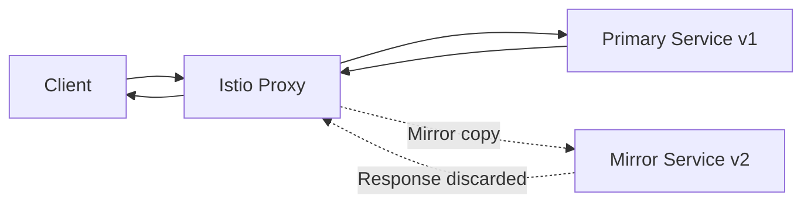

# How to Configure Request Mirroring with Istio VirtualService

Author: [nawazdhandala](https://github.com/nawazdhandala)

Tags: Istio, Request Mirroring, Traffic Mirroring, VirtualService, Testing

Description: Learn how to set up request mirroring (traffic shadowing) in Istio to test new service versions with real production traffic safely.

---

Request mirroring, also called traffic shadowing, sends a copy of live traffic to a second service without affecting the original request. The response from the mirror is discarded - it is fire-and-forget. This is one of the safest ways to test a new service version because real production traffic hits the new version, but users never see the mirrored responses.

## How Request Mirroring Works

When mirroring is enabled, Envoy does the following:

1. Receives the request
2. Sends it to the primary destination (the normal route)
3. Simultaneously sends a copy to the mirror destination
4. Returns the response from the primary destination to the caller
5. Ignores the response from the mirror



The mirrored request is a true copy - same headers, same body, same method. The only difference is that Envoy appends `-shadow` to the Host header so the mirror knows it is receiving shadowed traffic.

## Basic Mirroring Setup

Here is the simplest mirroring configuration:

```yaml
apiVersion: networking.istio.io/v1beta1
kind: VirtualService
metadata:
  name: my-app
  namespace: default
spec:
  hosts:
    - my-app
  http:
    - route:
        - destination:
            host: my-app
            subset: v1
      mirror:
        host: my-app
        subset: v2
      mirrorPercentage:
        value: 100.0
```

Every request to my-app goes to v1 (as normal) and a copy goes to v2. The `mirrorPercentage` is set to 100%, meaning all requests are mirrored.

You will also need the DestinationRule:

```yaml
apiVersion: networking.istio.io/v1beta1
kind: DestinationRule
metadata:
  name: my-app
  namespace: default
spec:
  host: my-app
  subsets:
    - name: v1
      labels:
        version: v1
    - name: v2
      labels:
        version: v2
```

## Partial Mirroring

Mirroring 100% of traffic can be heavy. If your service gets a lot of traffic, mirror just a percentage:

```yaml
apiVersion: networking.istio.io/v1beta1
kind: VirtualService
metadata:
  name: my-app
  namespace: default
spec:
  hosts:
    - my-app
  http:
    - route:
        - destination:
            host: my-app
            subset: v1
      mirror:
        host: my-app
        subset: v2
      mirrorPercentage:
        value: 10.0
```

This mirrors only 10% of requests. It is a good starting point to see how the mirror handles traffic before ramping up.

## Mirroring to a Different Service

The mirror does not have to be a different subset of the same service. You can mirror to a completely different service:

```yaml
apiVersion: networking.istio.io/v1beta1
kind: VirtualService
metadata:
  name: payment-service
  namespace: default
spec:
  hosts:
    - payment-service
  http:
    - route:
        - destination:
            host: payment-service
            port:
              number: 80
      mirror:
        host: payment-audit-service
        port:
          number: 80
      mirrorPercentage:
        value: 100.0
```

This mirrors all payment requests to an audit service. The audit service can log every payment request without being in the critical path.

## Mirroring Specific Routes

You can mirror only specific paths or match conditions:

```yaml
apiVersion: networking.istio.io/v1beta1
kind: VirtualService
metadata:
  name: my-app
  namespace: default
spec:
  hosts:
    - my-app
  http:
    - match:
        - uri:
            prefix: "/api/search"
      route:
        - destination:
            host: search-service
            subset: v1
      mirror:
        host: search-service
        subset: v2
      mirrorPercentage:
        value: 50.0
    - route:
        - destination:
            host: my-app
            port:
              number: 80
```

Only search API requests are mirrored. Other traffic goes through normally without any mirroring.

## Use Cases for Request Mirroring

**Testing a new version with production traffic**

This is the primary use case. Deploy v2, mirror production traffic to it, and check the logs and metrics for errors. If v2 handles traffic well, you can start shifting real traffic to it.

**Load testing**

Mirror traffic to a test environment to see how it handles production-level load patterns without needing to generate synthetic load.

**Data pipeline testing**

Mirror write requests to a new data pipeline to verify it processes data correctly before switching over.

**Security analysis**

Mirror traffic to a security analysis service that inspects requests for anomalies without adding latency to the main path.

## Monitoring the Mirror

Since the mirror response is discarded, you need to monitor it through other means:

```bash
# Check v2 logs for errors
kubectl logs deploy/my-app-v2 -c my-app -f

# Check v2 proxy metrics
kubectl exec deploy/my-app-v2 -c istio-proxy -- curl -s localhost:15090/stats/prometheus | grep istio_requests

# Compare error rates between v1 and v2
# In Prometheus:
# rate(istio_requests_total{destination_version="v2", response_code=~"5.."}[5m])
```

## Important Details About Mirrored Requests

There are several things to keep in mind:

**The Host header is modified.** Envoy adds `-shadow` to the Host header of mirrored requests. So if the original request has `Host: my-app`, the mirror receives `Host: my-app-shadow`. Your mirror service needs to handle this, or you should configure it to ignore the Host header.

**Mirrored requests are fire-and-forget.** If the mirror is slow or returns errors, it has zero impact on the primary route. The client never knows about the mirror.

**Timeouts still apply.** Envoy will not wait forever for the mirror. Mirrored requests have their own timeout based on the proxy configuration.

**Body is included.** POST and PUT bodies are copied to the mirrored request. This means your mirror service might process write operations. If you are mirroring to a service that writes to a database, be careful about side effects.

## Handling Side Effects

This is probably the biggest concern with mirroring. If your service creates records in a database, the mirror will try to create them too. Here are some approaches:

1. **Use a separate database** for the mirror service
2. **Run the mirror in dry-run mode** where it processes the request but does not write
3. **Only mirror read requests** by matching on the GET method:

```yaml
apiVersion: networking.istio.io/v1beta1
kind: VirtualService
metadata:
  name: my-app
  namespace: default
spec:
  hosts:
    - my-app
  http:
    - match:
        - method:
            exact: "GET"
      route:
        - destination:
            host: my-app
            subset: v1
      mirror:
        host: my-app
        subset: v2
      mirrorPercentage:
        value: 100.0
    - route:
        - destination:
            host: my-app
            subset: v1
```

Only GET requests are mirrored. POST, PUT, and DELETE go only to v1.

## Verifying Mirroring

To confirm mirroring is set up correctly:

```bash
# Check the VirtualService
kubectl get vs my-app -o yaml

# Verify Envoy configuration
istioctl proxy-config routes deploy/my-app-v1 -o json

# Watch logs on the mirror
kubectl logs deploy/my-app-v2 -c istio-proxy -f

# Send a test request and watch both services
curl http://my-app.default.svc.cluster.local/api/test
```

## Cleaning Up

When you are done testing, remove the mirroring by updating the VirtualService:

```yaml
apiVersion: networking.istio.io/v1beta1
kind: VirtualService
metadata:
  name: my-app
  namespace: default
spec:
  hosts:
    - my-app
  http:
    - route:
        - destination:
            host: my-app
            subset: v1
```

Request mirroring is one of Istio's most powerful features for safe testing. It lets you validate new versions with real production traffic patterns without any risk to your users. Combined with good monitoring, it gives you high confidence before you start shifting real traffic.
